# Application Technical Profile

This document provides a detailed technical analysis of the SDCIM (Serviço de Depósito e Captura de Imagens) application, based on the provided source code. It covers the application's architecture, technology stack, functional overview, and potential modernization strategies.

## 1. Application overview
This section provides a high-level summary of the application, including its purpose, scope, and key technical characteristics.

| Field | Value |
| :--- | :--- |
| **Acronym** | SDCIM |
| **Application name** | Serviço de Depósito e Captura de Imagens (Image Capture and Deposit Service) |
| **Primary business purpose** | A back-office system for processing bank remittances, including handling of tranches, documents, and alerts, with a Windows Forms front-end for monitoring and management. |
| **Business domain** | Banking, Financial Services, Remittance Processing |
| **Solution files** | - **Total**: 2 - `CIControloComSetup.sln` - `CIControloSemSetup.sln` |
| **Project files** | - **Total**: 18 - **CIControloComSetup.sln**: `CIControlo.csproj`, `QueryForm.csproj`, `CIConfigGlobalParameters.csproj`, `CIConfiguration.csproj`, `CIActividades.csproj`, `CIReports.csproj`, `Alerta.csproj`, `CIServRemessas.csproj`, `CIServTester.csproj`, `CIServAlertas.csproj`, `CIServico.csproj`, `CIFicheirosControlo.csproj`, `CIFicheiro.csproj`, `MDIsControlo.csproj`, `MDIWebTransmCI.vbproj` - **CIControloSemSetup.sln**: `CIControlo.csproj`, `QueryForm.csproj`, `CIConfigGlobalParameters.csproj`, `CIConfiguration.csproj`, `CIActividades.csproj`, `CIReports.csproj`, `Alerta.csproj`, `CIServRemessas.csproj`, `CIServTester.csproj`, `CIServAlertas.csproj`, `CIServico.csproj`, `CIFicheirosControlo.csproj`, `CIFicheiro.csproj`, `MDIsControlo.csproj`, `MDIWebTransmCI.vbproj`, `CITestes.csproj`, `CIDepositoErro.csproj` |
| **Files** | - **Total**: 79 - C# source code files (.cs): 55 - Visual Basic source code files (.vb): 4 - C# project files (.csproj): 17 - Visual Basic project files (.vbproj): 1 - Solution files (.sln): 2 - Application configuration files (.config): 6 - Resource files (.resx): 10 - Other (Batch, Settings, etc.): 13 |
| **Main programming language(s)** | C#, VB.NET |
| **Target .NET Framework(s)** | - .NET Framework 4.0 - .NET Framework 3.5 |
| **Application type** | Composite Application (Windows Service, Windows Forms UI, Class Libraries) |
| **Output type** | - .dll (Dynamic Link Library) - .exe (Executable) |
| **Deployment model** | On-premises (inferred from install scripts and configuration paths) |
| **Deployment target platform**| AnyCPU (inferred from project files) |
| **Complexity** | 🔴 High - The application consists of 18 projects, multiple technologies (WinForms, Windows Service, Web Service client), and complex business logic for processing financial remittances and alerts. |
| **Last updated (Source code)** | 2008-01-01 (inferred from copyright notices) |
| **Last updated (Documentation)** | 2025-08-06 |

### 1.1. Main components and features
This section breaks down the application into its main logical components, describing their purpose and key features.

| Component | Description | Key features | Dependencies | Related projects | Technologies |
| :--- | :--- | :--- | :--- | :--- | :--- |
| **Remittance Processing Service** | Core background service responsible for processing remittances (`Remessas`) in tranches. | - Fetches remittances pending processing. - Processes document tranches. - Updates status in the database. | `CIConfigGlobalParameters`, `CIServRemessas` | `CIServico.csproj`, `CIServRemessas.csproj` | .NET Framework, Windows Services |
| **Alerting System** | Manages system and business alerts based on predefined situations. | - Triggers alerts for specific situations. - Executes actions like sending emails (WebDAV/EWS), logging to DB, or writing to files. - Parameterized actions. | `CIConfigGlobalParameters` | `Alerta.csproj`, `CIServAlertas.csproj` | .NET Framework, `System.Data.SqlClient` |
| **Activity Monitoring UI** | A Windows Forms application for monitoring and managing system activities, remittances, and estornos (reversals). | - View summaries and details of remittances and reversals. - Filter by date, branch, and type. - Manually trigger state changes. - View document images. | `CIConfigGlobalParameters`, `NBIISNET.dll` | `CIActividades.csproj` | Windows Forms, .NET Framework 4.0 |
| **Configuration & User Management** | Provides shared configuration parameters and manages user access. | - Centralized database connection strings. - Application settings (timers, paths). - User and group management with privilege levels. | `GenericNet.dll` | `CIConfigGlobalParameters.csproj`, `CIConfiguration.csproj` | .NET Framework |
| **File Processing & Control** | Handles the import and processing of external files like ACOM and ENVM. | - File watching/polling. - Parsing fixed-format files. - Storing file data into the database. | `CIConfigGlobalParameters` | `CIFicheiro.csproj`, `CIFicheirosControlo.csproj` | .NET Framework |
| **Testing Framework** | A dedicated project for unit and integration tests of the services. | - Tests remittance processing logic. - Validates service components. | `CIServico`, `CIServRemessas`, `Microsoft.VisualStudio.TestTools.UnitTesting` | `CITestes.csproj` | MSTest |

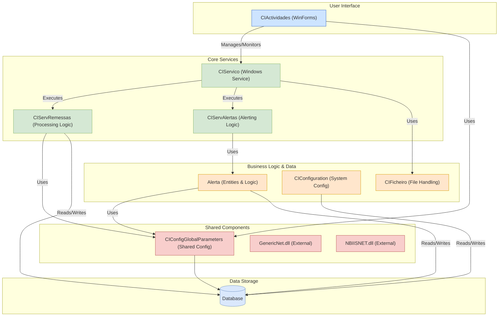

Figure 1 - High-level diagram of the main application components and their interactions.

### 1.2. Solutions
This section details the Visual Studio solutions found in the source code.

| Solution | Projects | Visual Studio Version |
| :--- | :--- | :--- |
| **CIControloComSetup.sln** | - `CIControlo.csproj` - `QueryForm.csproj` - `CIConfigGlobalParameters.csproj` - `CIConfiguration.csproj` - `CIActividades.csproj` - `CIReports.csproj` - `Alerta.csproj` - `CIServRemessas.csproj` - `CIServTester.csproj` - `CIServAlertas.csproj` - `CIServico.csproj` - `CIFicheirosControlo.csproj` - `CIFicheiro.csproj` - `MDIsControlo.csproj` - `MDIWebTransmCI.vbproj` | 2010 |
| **CIControloSemSetup.sln** | - `CIControlo.csproj` - `QueryForm.csproj` - `CIConfigGlobalParameters.csproj` - `CIConfiguration.csproj` - `CIActividades.csproj` - `CIReports.csproj` - `Alerta.csproj` - `CIServRemessas.csproj` - `CIServTester.csproj` - `CIServAlertas.csproj` - `CIServico.csproj` - `CIFicheirosControlo.csproj` - `CIFicheiro.csproj` - `MDIsControlo.csproj` - `MDIWebTransmCI.vbproj` - `CITestes.csproj` - `CIDepositoErro.csproj` | 2010 |

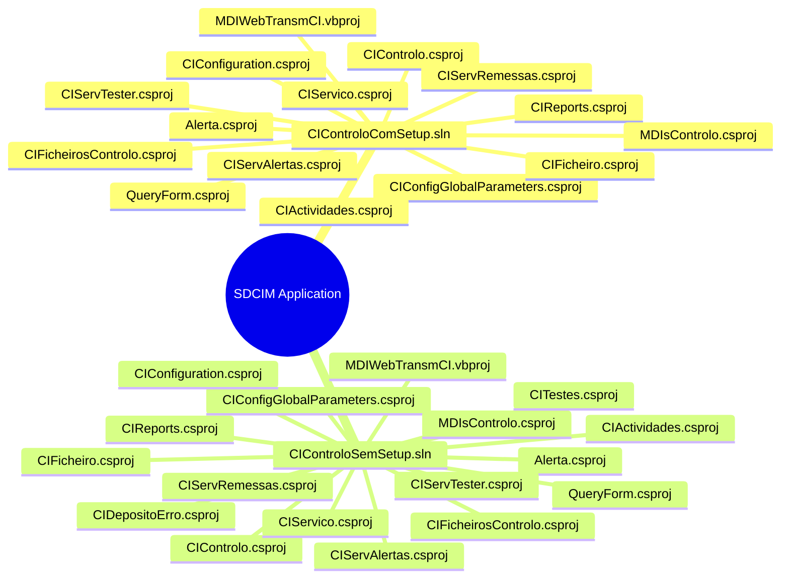

Figure 2 - Mind map illustrating the two solutions and their constituent projects.

### 1.3. Projects
This section provides a detailed breakdown of each project within the solutions.

| Solution | Project | Main objectives | Type | Output type | Version | Runtime | Framework | Architecture | Compilation mode | Principal classes | Internal dependencies | External dependencies |
| :--- | :--- | :--- | :--- | :--- | :--- | :--- | :--- | :--- | :--- | :--- | :--- | :--- |
| Both | **CIControlo.csproj** | Main executable for the Windows Forms application, likely the MDI host. | Windows Application | Executable | 1.0.0.0 | v4.0.30319 | .NET Framework 4.0 | AnyCPU | Debug/Release | `CIMainForm`, `Program` | `CIActividades`, `CIConfiguration`, `CIConfigGlobalParameters`, `CIFicheiro`, `CIFicheirosControlo`, `CIReports`, `CIServTester`, `MDIsControlo`, `QueryForm` | `GenericLogNET`, `GenericNet`, `NBIISNET` |
| Both | **CIActividades.csproj** | Provides the UI for monitoring activities, remittances, and reversals. | Class Library | Library | 1.0.0.0 | v4.0.30319 | .NET Framework 4.0 | AnyCPU | Debug/Release | `ActividadeBalcaoForm`, `ActividadesForm`, `PesquisasForm` | `Alerta`, `CIConfigGlobalParameters` | `CrystalDecisions`, `GenericLogNET`, `GenericNet`, `NBIISNET` |
| Both | **Alerta.csproj** | Defines data entities and logic for system alerts. | Class Library | Library | 1.0.0.0 | v4.0.30319 | .NET Framework 4.0 | AnyCPU | Debug/Release | `Accao`, `AlertaSituacaoAccao` | `CIConfigGlobalParameters` | `GenericNet`, `System.Data` |
| Both | **CIServico.csproj** | The Windows Service project that hosts background processing tasks. | Windows Application | Executable | 1.0.0.0 | v4.0.30319 | .NET Framework 4.0 | AnyCPU | Debug/Release | `CIServico`, `CIServicoThread` | `Alerta`, `CIConfigGlobalParameters`, `CIFicheiro`, `CIServAlertas`, `CIServRemessas` | `GenericLogNET`, `GenericNet`, `NBIISNET` |
| Both | **CIServRemessas.csproj**| Contains the core business logic for processing remittances. | Class Library | Library | 1.0.0.0 | v4.0.30319 | .NET Framework 4.0 | AnyCPU | Debug/Release | `ServRemessa` | `Alerta`, `CIActividades`, `CIConfigGlobalParameters` | `GenericLogNET`, `GenericNet`, `NBIISNET` |
| Both | **MDIWebTransmCI.vbproj** | A VB.NET project for web service communication, likely for transmitting MDI documents. | Class Library | Library | 1.0.0.0 | v4.0.30319 | .NET Framework 4.0 | AnyCPU | Debug/Release | `TInsertDoc` | `CIConfigGlobalParameters` | `CCAGeneric`, `CCAWebTransmCI` |
| Both | **CIConfigGlobalParameters.csproj** | A shared library for global configuration parameters and interfaces. | Class Library | Library | 1.0.0.0 | v4.0.30319 | .NET Framework 4.0 | AnyCPU | Debug/Release | `CIGlobalParameters`, `User` | `System.Windows.Forms` | `GenericLogNET`, `GenericNet`, `NBIISNET` |
| Both | **CIConfiguration.csproj** | Manages application configuration, including users and branches (`Balcao`). | Class Library | Library | 1.0.0.0 | v4.0.30319 | .NET Framework 4.0 | AnyCPU | Debug/Release | `Config`, `Balcao`, `Maquina` | `Alerta`, `CIConfigGlobalParameters` | `GenericLogNET`, `GenericNet`, `NBIISNET` |
| Both | **CIFicheiro.csproj** | Logic for handling file-based operations (ACOM, ENVM). | Class Library | Library | 1.0.0.0 | v4.0.30319 | .NET Framework 4.0 | AnyCPU | Debug/Release | `FicheiroAcom`, `FicheiroEnvm` | `CIConfigGlobalParameters` | `GenericLogNET`, `GenericNet`, `NBIISNET` |
| Both | **CIFicheirosControlo.csproj** | UI components for managing and monitoring file imports. | Class Library | Library | 1.0.0.0 | v4.0.30319 | .NET Framework 4.0 | AnyCPU | Debug/Release | `FicheiroFormCentralENVM`, `FicheiroFormCentralACOM` | `CIConfigGlobalParameters`, `CIFicheiro` | `GenericLogNET`, `GenericNet`, `NBIISNET` |
| Both | **CIReports.csproj** | Handles the generation of Crystal Reports for the application. | Class Library | Library | 1.0.0.0 | v4.0.30319 | .NET Framework 4.0 | AnyCPU | Debug/Release | `ListagemRemessas`, `AcomResumo` | `CIConfigGlobalParameters` | `CrystalDecisions.*`, `GenericReportNet` |
| Both | **CIServAlertas.csproj** | Service logic for processing alerts, including sending emails and writing to logs. | Class Library | Library | 1.0.0.0 | v4.0.30319 | .NET Framework 4.0 | AnyCPU | Debug/Release | `ServAlerta`, `ServAlertasSendWebmail` | `Alerta`, `CIConfigGlobalParameters` | `CGDSendWebmail`, `GenericLogNET` |
| Both | **CIServTester.csproj** | A library for testing the core services. | Class Library | Library | 1.0.0.0 | v4.0.30319 | .NET Framework 4.0 | AnyCPU | Debug/Release | `ProcessarRemessas`, `ProcessarAlertas` | `Alerta`, `CIConfigGlobalParameters`, `CIServAlertas`, `CIServRemessas` | `GenericLogNET`, `GenericNet` |
| Both | **MDIsControlo.csproj** | UI and logic for controlling Multi-Function Devices (MDIs). | Class Library | Library | 1.0.0.0 | v4.0.30319 | .NET Framework 4.0 | AnyCPU | Debug/Release | `MDIsControloForm`, `Documento_02_MDI` | `CIConfigGlobalParameters`, `MDIWebTransmCI` | `CCAGeneric`, `GenericNet` |
| Both | **QueryForm.csproj** | A utility form for running SQL queries against the database. | Class Library | Library | 1.0.0.0 | v4.0.30319 | .NET Framework 4.0 | AnyCPU | Debug/Release | `QueryForm` | `CIConfigGlobalParameters` | `GenericLogNET`, `GenericNet` |
| SemSetup | **CITestes.csproj** | A unit test project. | Class Library | Library | 1.0.0.0 | v4.0.30319 | .NET Framework 4.0 | AnyCPU | Debug/Release | `CIServRemessaTestes` | `CIControlo`, `CIServico`, `CIServRemessas`, `CIServTester` | `Microsoft.VisualStudio.QualityTools.UnitTestFramework` |
| SemSetup | **CIDepositoErro.csproj** | Project to handle deposit errors (details inferred). | Class Library | Library | 1.0.0.0 | v4.0.30319 | .NET Framework 4.0 | AnyCPU | Debug/Release | (Inferred) `DepositoErroForm` | `CIConfigGlobalParameters` | `GenericNet` |

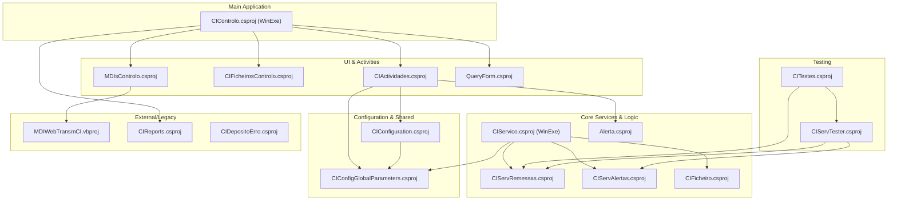

Figure 3 - Project dependency graph showing the relationships between the various projects.

## 2. Functional overview
This section provides a high-level functional decomposition of the application, identifying the major, distinct functional blocks or modules as inferred from the code's high-level structure.

### 2.1. Executive summary
This section provides a high-level summary of the application's primary purpose and its core function from a business or operational perspective.

| Field | Description |
| :--- | :--- |
| **Application's Primary Purpose** | The application, "Serviço de Depósito e Captura de Imagens" (SDCIM), is a comprehensive back-office system designed to automate the processing of bank remittances from various sources, including bank branches (`Balcão`) and potentially other channels. |
| **Core Function** | Its core function is to manage the lifecycle of a `Remessa` (remittance), which involves receiving data, processing it in `Tranches`, handling individual `Documentos` (likely cheques), managing their state, and generating alerts for operational monitoring. The system includes a Windows Forms UI (`CIControlo`) for manual monitoring, intervention, and configuration, and a Windows Service (`CIServico`) for automated background processing. |
| **Key Inferred Processes** | - **Remittance Processing**: Automated workflow to process incoming remittances, validate data, and update statuses. - **Alert Management**: A rule-based system to trigger notifications (Email, DB logs) for specific system events or errors. - **Manual Operations & Monitoring**: A user-facing desktop application allowing operators to view activities, manage entities, and resolve issues. - **Configuration**: Management of system parameters, user roles, and branch (`Balcao`) configurations. |

### 2.2. Functional decomposition
This section provides a detailed breakdown of the application's functional areas or modules, inferred from the code structure.

| Functional Area / Module | Description |
| :--- | :--- |
| **User Interaction & Presentation** | Manages the graphical user interface for operators. This includes forms for monitoring activities, managing configurations, viewing reports, and manually intervening in processes. It is the primary interface between users and the system's core logic. Inferred from `CIActividades`, `CIConfiguration`, `CIFicheirosControlo`, and `MDIsControlo` projects. |
| **Core Process Execution Engine** | The heart of the application, running as a background Windows Service. It orchestrates the automated processing of remittances, alerts, and file imports. It operates based on timers and database queues. Inferred from the `CIServico` and `CIServTester` projects. |
| **Remittance & Document Logic** | Contains the specific business rules for handling remittances. This includes logic for breaking remittances into tranches, processing individual documents, validating data, and managing state transitions. Inferred from the `CIServRemessas` project and classes like `DetalheRemessa`. |
| **Alerting & Notification** | A dedicated subsystem for generating and dispatching alerts. It defines different alert types (e.g., email, log) and the conditions under which they are triggered. Inferred from the `Alerta` and `CIServAlertas` projects. |
| **Data Persistence & Management** | Handles all interactions with the underlying SQL Server database. This includes direct SQL queries for fetching data, updating records, and executing stored procedures. It provides a data access layer for other modules. Inferred from the use of `System.Data.SqlClient` and direct SQL in various classes. |
| **Configuration Management** | Manages global and user-specific application settings, including database connections, user profiles, and operational parameters. Inferred from the `CIConfigGlobalParameters` and `CIConfiguration` projects. |

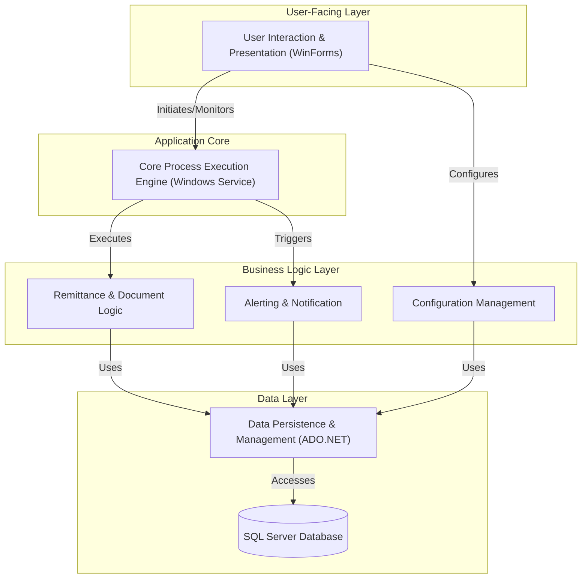

Figure 4 - Functional decomposition of the application, showing the layered architecture.

### 2.3. User roles and permissions
This section identifies distinct types of users that interact with the application, inferred from the code.

| Role | Description | Permissions | Key Actions | Key Data Entities | Assumptions |
| :--- | :--- | :--- | :--- | :--- | :--- |
| **Administrator / Privileged User** | A user with elevated privileges, likely responsible for system configuration and manual intervention in failed processes. | - Full access to all UI features. - Ability to change the state of remittances and tranches. - Can trigger manual re-processing of failed items. | `MudarEstado`, `Reenviar remessas em erro`, `ConfirmaPrivilegios` | `Remessa`, `Tranche`, `User`, `Balcao`, `Maquina` | Inferred from the `ConfirmaPrivilegios()` method in `ActividadeBalcaoForm.cs` which checks `m_oParameters.UserLogged.m_iUserGroup <= 1`. |
| **Standard Operator** | A standard user responsible for monitoring the system's activities and viewing data. | - Read-only access to most data. - Cannot change the state of entities or perform administrative actions. | `ViewRemittances`, `ViewDocuments`, `ViewAlerts` | `Remessa`, `Tranche`, `Documento`, `Alerta` | Inferred as any user with `m_iUserGroup > 1`. Assumed to have view-only rights on operational data. |

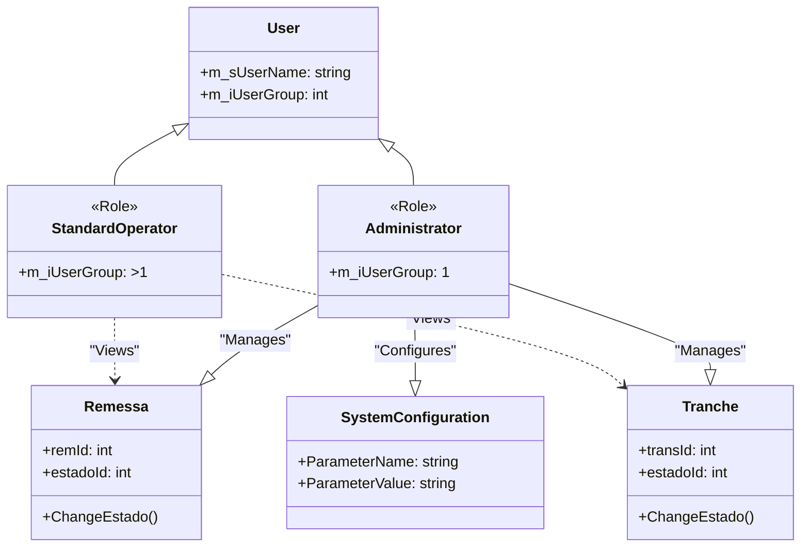

Figure 5 - Class diagram illustrating the relationship between user roles and key entities.

### 2.4. Core business capabilities
This section lists the main, high-level capabilities of the application.

| Capability | Description | Key Features | Key Data Entities | Assumptions |
| :--- | :--- | :--- | :--- | :--- |
| **Remittance Lifecycle Management** | The complete set of functions for processing bank remittances from ingestion to final state. | - Remittance creation and opening. - Processing of tranches and documents. - State transitions (e.g., Pending, Processing, Complete, Error). - Reversal (`Estorno`) processing. | `Remessa`, `Tranche`, `Documento` | Assumes that any module with "Remessa" or "Tranche" in its name is part of this capability. Inferred from `CIServRemessas` and `ActividadeBalcaoForm`. |
| **System Monitoring & Control** | Provides operators with the tools to view, monitor, and manually control the application's automated processes. | - Real-time activity dashboard. - Detailed views for remittances, tranches, and documents. - Manual state change functionality for privileged users. - Image viewing for documents. | `Remessa`, `Tranche`, `Documento`, `Alerta` | Inferred from the extensive UI components in the `CIActividades` project, such as `ActividadeBalcaoForm` and its various `ListView` controls. |
| **Alerting and Notifications** | A proactive system for notifying operators or systems about important events, errors, or predefined conditions. | - Triggering alerts based on situations. - Sending notifications via Email (WebDAV, EWS). - Logging alerts to the database or files. - Writing to the Windows Event Viewer. | `Alerta`, `Accao`, `SituacaoAccao` | Inferred from the `Alerta` and `CIServAlertas` projects and the `enuTipoAccao` enum which lists notification channels. |
| **System Configuration** | Allows administrators to configure operational parameters, users, and system integrations. | - User and group management. - `Balcao` (Branch) and `Maquina` (Machine) configuration. - Setting processing parameters (e.g., timers, batch sizes). | `User`, `Balcao`, `Maquina`, `CIGlobalParameters` | Inferred from the `CIConfiguration` project and the various forms for managing system entities. |

### 2.5. Detailed feature breakdown
This section provides a granular breakdown of individual features within each Core Business Capability.

| Feature | User Story / Description | Key Data Entities | Assumptions |
| :--- | :--- | :--- | :--- |
| **Process a Bank Remittance** | As a System, I can fetch a pending remittance from the database, process its associated tranches and documents, and update its status to 'Processed' or 'Error'. | `Remessa`, `Tranche`, `Documento` | Inferred from the `ProcessarTrancheBalcao` and `ServRemessa` classes, which contain methods like `RemessaBalcaoParaProcessar` and `TratarTranchesBalcao`. |
| **Monitor Branch Activities** | As an Operator, I can view a dashboard summarizing all remittance and reversal activities, filtered by date, branch, and status, so that I can monitor the system's health. | `Remessa`, `Documento` | Inferred from the UI layout in `ActividadeBalcaoForm.Designer.cs`, which includes date pickers, text boxes for filtering, and multiple `ListView` controls for displaying summaries. |
| **Manually Change Remittance State** | As an Administrator, I can select a specific remittance or tranche and manually change its processing state to resolve an error or force reprocessing. | `Remessa`, `Tranche` | Inferred from the `MudarEstadoForm` and the context menu items like `toolStripMenuRemessaMudarEstado_Click` in `ActividadeBalcaoForm.cs`. |
| **Send Alert Email** | As the System, when a critical situation occurs (e.g., processing error), I can send an email notification to a predefined recipient list so that operators are alerted immediately. | `Alerta`, `Accao`, `SituacaoAccao` | Inferred from `ServAlerta.cs` and the `Accao.enuTipoAccao.MAILEWS` enum value, which triggers the `ProcessaAlertaSituacaoAccaoMail` method. |
| **View Document Image** | As an Operator, I can double-click a document in the activity monitor to view its scanned image, so that I can visually verify its details. | `Documento`, `Imagem` | Inferred from the `ImagemBalcaoForm` and the `listViewDetalhesDocumentos_DoubleClick` event handler which opens this form. |

### 2.6. Key data entities and their attributes
This section documents the application's core data structures as inferred from class definitions.

| Entity | Description | Key Attributes | Data Type | Validation Rules | Relationships | Assumptions |
| :--- | :--- | :--- | :--- | :--- | :--- | :--- |
| **Remessa** | Represents a bank remittance, which is a collection of financial documents (like cheques) submitted for processing. | `remId`, `remData`, `estadoId`, `balcaoGestor`, `numRemessa`, `montante` | `int`, `DateTime`, `int`, `string`, `int`, `double` | `remId` is the primary key. `estadoId` must be a valid state. | One-to-many with `Tranche`. | Inferred from classes `DetalheRemessa` and `RemessasResumoBalcao`. Assumes `remId` is a primary key. |
| **Tranche** | A logical batch or sub-group of documents within a single remittance. | `transId`, `remId`, `estadoId`, `numero`, `quantidade`, `montante` | `int`, `int`, `int`, `int`, `int`, `double` | `transId` is the primary key. `remId` is a foreign key to `Remessa`. | Many-to-one with `Remessa`. One-to-many with `Documento`. | Inferred from the `DetalheTranche` class. |
| **Documento** | Represents a single financial document, such as a cheque, with its associated metadata and image. | `docID`, `transId`, `ZIB`, `numConta`, `numCheque`, `montante`, `estadoDocId` | `int`, `int`, `string`, `string`, `string`, `double`, `int` | `docID` is the primary key. `transId` is a foreign key to `Tranche`. | Many-to-one with `Tranche`. | Inferred from the `DetalheDocumento` class. `ZIB`, `numConta`, and `numCheque` likely correspond to the MICR line of a cheque. |
| **Alerta** | An alert generated by the system in response to a specific event or condition. | `ALERT_ID`, `AL_TIMER`, `AL_TEXT`, `SITUACAO_ID` | `string`, `DateTime`, `string`, `int` | `ALERT_ID` is the primary key. `SITUACAO_ID` links to a predefined situation. | Many-to-many with `Accao` through `ALERTA_ALERTA_ACCAO`. | Inferred from the `AlertaSituacaoAccao` class and its database update queries. |
| **Accao** | A predefined action to be taken when an alert is triggered, such as sending an email or logging to a file. | `ACC_ID`, `ACC_DESC`, `TIPACC_ID` | `int`, `string`, `enum` | `ACC_ID` is the primary key. `TIPACC_ID` defines the action type. | Many-to-many with `Alerta`. | Inferred from the `Accao` class and its `enuTipoAccao` enum. |

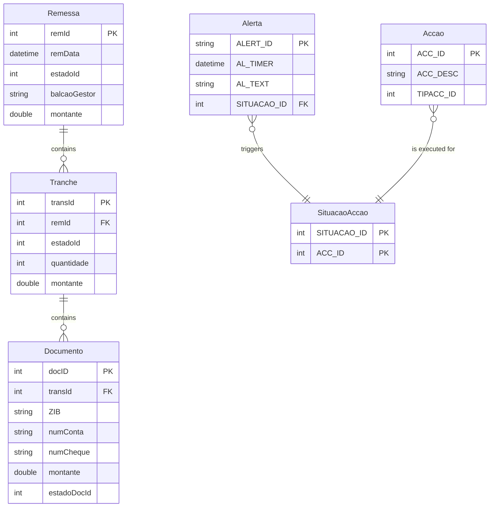

Figure 6 - Entity-Relationship diagram showing the core data entities and their relationships.

### 2.7. Business process workflows
This section describes and visualizes critical end-to-end processes.

| Process | Description | Key Steps | User Roles Involved | Key Data Entities | Assumptions |
| :--- | :--- | :--- | :--- | :--- | :--- |
| **Remittance Processing Workflow** | A workflow that outlines the steps involved in processing a bank remittance from reception to final status update. | 1. Fetch pending remittance (`REMIN_IDParaProcessar`). 2. Set status to 'Processing'. 3. Process documents in tranches (`TratarTranchesBalcao`). 4. Update document and tranche statuses. 5. Set final remittance status ('Processed' or 'Error'). | System (automated), Administrator (for error resolution) | `Remessa`, `Tranche`, `Documento` | Inferred from the sequence of method calls in `CIServRemessaTestes.cs` and the logic within `ServRemessa.cs`. |
| **Alert Notification Workflow** | A workflow for handling system-generated alerts. | 1. Identify a pending alert (`AlertaSituacaoAccaoParaProcessar`). 2. Determine the action type (Email, Log, etc.). 3. Execute the corresponding action. 4. Update alert status to 'Processed' (`SetProcessado`) or 'Error' (`SetErroProcessamento`). | System (automated) | `Alerta`, `Accao`, `SituacaoAccao` | Inferred from the `ServAlerta.cs` class, which orchestrates fetching and processing alerts based on their type. |
| **Manual State Correction Workflow** | A user-driven process for an administrator to manually correct the state of a stuck or failed remittance. | 1. Operator filters and selects a remittance in the UI. 2. Operator right-clicks and chooses 'Mudar Estado'. 3. Operator selects a new state from a dialog. 4. System updates the entity's state in the database. | Administrator | `Remessa`, `Tranche` | Inferred from the context menus and event handlers in `ActividadeBalcaoForm.cs`. |

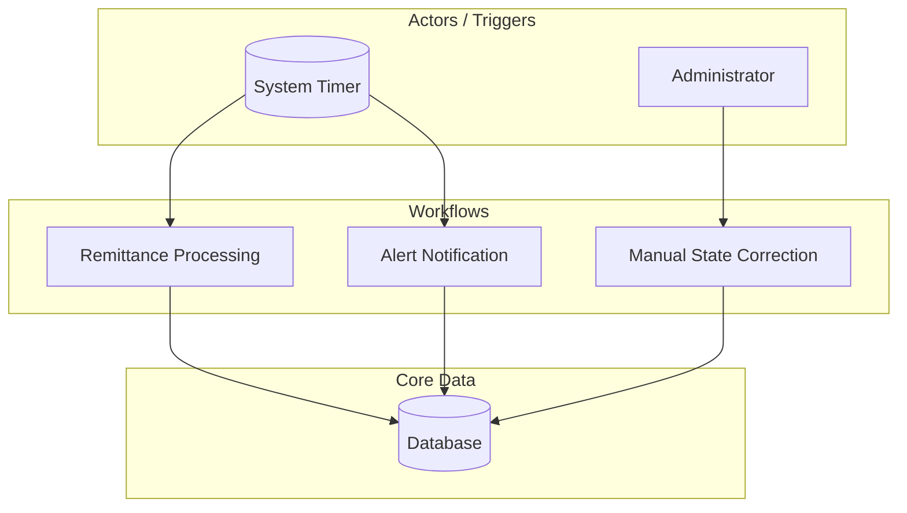

Figure 7 - High-level overview of the main business process workflows.

#### 2.7.1. Workflow: Remittance Processing Workflow
This section provides a detailed breakdown of the Remittance Processing Workflow.

| Step | Description | User Role | Key Data Entities | Assumptions |
| :--- | :--- | :--- | :--- | :--- |
| **1. Fetch Pending Remittance** | The service queries the database for a remittance with a 'Pending' status. | System | `Remessa` | Inferred from `ServRemessa.REMIN_IDParaProcessar()` method. |
| **2. Begin Processing** | The remittance status is updated to 'Processing' (e.g., state 30) to prevent other threads from picking it up. | System | `Remessa` | A standard practice in queued processing to lock an item. |
| **3. Create Tranches** | The system iterates through the documents of the remittance, creating new `Tranche` records in batches based on a configured size (`m_iMaxDocsTranche`). | System | `Tranche`, `Documento` | Inferred from the loop in `ServRemessa.ProcessaRemessa` and the `CriarTranche` method. |
| **4. Process Documents** | For each document, a unique reference key (`ChaveH`) is generated, and its status is updated to 'Processed'. If an error occurs, it's logged. | System | `Documento` | Inferred from `ProcessaDocumento` method which calls `fnCHAVEH` and updates document state. |
| **5. Finalize Remittance** | After all documents are processed, the final status of the remittance is set to 'Processed' (40) or 'Error' (-40) if any issues occurred. | System | `Remessa` | Inferred from the final state update logic in `ServRemessa.ProcessaRemessa`. |

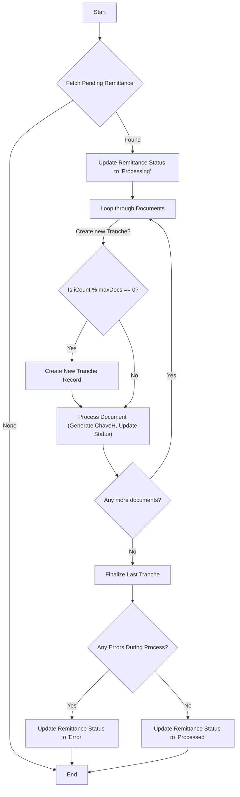

Figure 8 - Detailed steps of the Remittance Processing Workflow.

#### 2.7.2. Workflow: Alert Notification Workflow
This section provides a detailed breakdown of the Alert Notification Workflow.

| Step | Description | User Role | Key Data Entities | Assumptions |
| :--- | :--- | :--- | :--- | :--- |
| **1. Fetch Pending Alert** | The service queries the database for an unprocessed alert (`ALACC_STATUS=0`). | System | `AlertaSituacaoAccao` | Inferred from `ServAlerta.AlertaSituacaoAccaoParaProcessar`. |
| **2. Identify Action Type** | The system inspects the `TIPACC_ID` to determine the type of action required (e.g., Email, Log DB, Log File). | System | `Accao` | Inferred from the `switch` statement in `ServAlerta.ProcessaAlertaSituacaoAccao`. |
| **3. Execute Action** | The corresponding action is executed. For an email, it constructs and sends the message. For a log, it writes the entry. | System | `AccaoParam` | Based on methods like `ProcessaAlertaSituacaoAccaoMail` and `ProcessaAlertaSituacaoAccaoLogDB`. |
| **4. Update Alert Status** | The alert's status is updated to 'Processed' (1) on success or 'Error' (-1) on failure. | System | `AlertaSituacaoAccao` | Inferred from calls to `SetProcessado` and `SetErroProcessamento`. |

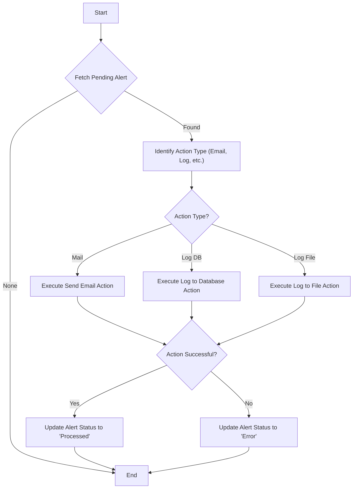

Figure 9 - Detailed steps of the Alert Notification Workflow.

#### 2.7.3. Workflow: Manual State Correction Workflow
This section provides a detailed breakdown of the Manual State Correction Workflow.

| Step | Description | User Role | Key Data Entities | Assumptions |
| :--- | :--- | :--- | :--- | :--- |
| **1. View Activities** | The Administrator opens the `ActividadeBalcaoForm` and uses filters to find a specific remittance or tranche. | Administrator | `Remessa`, `Tranche` | Standard user interaction with a search/filter UI. |
| **2. Select Entity** | The Administrator selects one or more items from the `ListView` that require state correction. | Administrator | `Remessa`, `Tranche` | Based on UI controls and multi-select capabilities. |
| **3. Initiate State Change** | The Administrator right-clicks the selection and chooses the "Mudar Estado" (Change State) option from the context menu. | Administrator | `Remessa`, `Tranche` | Inferred from `contextMenuStripRemessaMudarEstado_Click` event handler. |
| **4. Choose New State** | A dialog (`MudarEstadoForm`) appears, showing possible new states. The Administrator selects the target state and confirms. | Administrator | `Activity_Change` (inferred table) | The `MudarEstadoForm` is populated with valid state transitions. |
| **5. Apply Update** | The system executes a stored procedure (`m_sSPProcessa`) to update the state of the selected entity in the database. | System | `Remessa`, `Tranche` | The `ChangeEstado` method in `DetalheRemessa` and `DetalheTranche` handles the database update. |

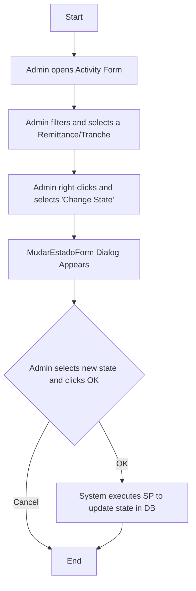

Figure 10 - Detailed steps of the Manual State Correction Workflow.

### 2.8. System inputs & outputs (interfaces)
This section catalogs all identified points where data enters or leaves the application boundary.

| Type | Name / Description | Data Formats | Data Source / Sink | Assumptions |
| :--- | :--- | :--- | :--- | :--- |
| **Input** | **User Input via UI** | User-entered text and selections | Windows Forms controls (`TextBox`, `ComboBox`, `DateTimePicker`) | Standard data entry for filtering and managing application entities. |
| **Input** | **File Ingestion (ENVM/ACOM)** | Fixed-width text files | Monitored file system directory (`m_sFilePathENVM`, `m_sFilePathACOM`) | Inferred from the `CIFicheiro` project which has classes for parsing `ENVM` and `ACOM` files. |
| **Input** | **Web Service Call (MDI)** | SOAP/XML | External client applications via `waiaccesstuInsertDoc` web service | The `MDIWebTransmCI` project is a web service client for inserting MDI documents. |
| **Data Flow** | **Primary Internal Flow** | In-memory objects (`Remessa`, `Documento`, etc.) | Application Memory / Database | Data is read from the database, processed by business logic, and results are written back. |
| **Output**| **Database Records** | SQL Data | Microsoft SQL Server | The primary output of all processing workflows is updated or new records in the database. |
| **Output**| **Email Alerts** | SMTP | Email Server (via WebDAV/EWS) | `ServAlertasSendWebmail.cs` indicates email sending capabilities as an output. |
| **Output**| **Log Files** | Plain Text | Local file system | `ServAlertasLogFile.cs` handles writing alert information to text files. |
| **Output**| **Windows Event Log** | Event Log entries | Windows Event Viewer | `ProcessaAlertaSituacaoAccaoEVENTVIEWER` method writes directly to the event log. |
| **Output**| **UI Display** | Rendered UI controls | User's screen | Data is rendered in `ListView` and `DataGridView` controls for user consumption. |
| **Output**| **Crystal Reports** | PDF, Print | User's file system or printer | The `CIReports` project uses Crystal Reports to generate formatted reports. |

### 2.9. User Task Flows
This section describes the typical path a user takes through the application to achieve a high-level objective.

| Task Flow | Description | User Role | Key Data Entities | Assumptions |
| :--- | :--- | :--- | :--- | :--- |
| **Resolve a Failed Remittance** | A complete sequence of steps an administrator follows to diagnose and fix a remittance that has failed during automated processing. | Administrator | `Remessa`, `Tranche`, `Documento` | This flow combines monitoring, investigation, and manual intervention features. |
| **Monitor Daily Processing** | A standard daily task for an operator to check the status of all remittances processed within a specific timeframe. | Standard Operator | `Remessa`, `Tranche` | This is a read-only workflow focused on operational awareness. |

#### 2.9.1. User Task Flow: Resolve a Failed Remittance
This section provides a detailed breakdown of the "Resolve a Failed Remittance" user task flow.

| Step | Description | User Role | Key Data Entities | Assumptions |
| :--- | :--- | :--- | :--- | :--- |
| **1. Identify Failure** | The Administrator opens the `ActividadesForm` and filters by "Erro" (Error) status for the current day. | Administrator | `Remessa` | The user knows how to use the UI filters to find problematic items. |
| **2. Investigate Details** | The Administrator double-clicks the failed remittance to view its associated tranches and documents, looking for specific error messages. | Administrator | `Tranche`, `Documento` | The UI provides drill-down capabilities from summary to detail. |
| **3. View Document Image** | If a specific document is the cause, the Administrator views its image using the `ImagemBalcaoForm` to check for quality or data issues. | Administrator | `Documento`, `Imagem` | Assumes document images are available and linked to the document records. |
| **4. Correct State** | After diagnosing the issue, the Administrator uses the "Mudar Estado" context menu action to reset the remittance's status to 'Pending' for reprocessing. | Administrator | `Remessa` | The user has the necessary privileges to perform state changes. |
| **5. Verify Reprocessing** | The Administrator monitors the system to ensure the remittance is picked up again by the automated service and processed successfully. | Administrator | `Remessa` | The user will re-query the system after a short interval to confirm the state has changed from 'Pending' to 'Processed'. |

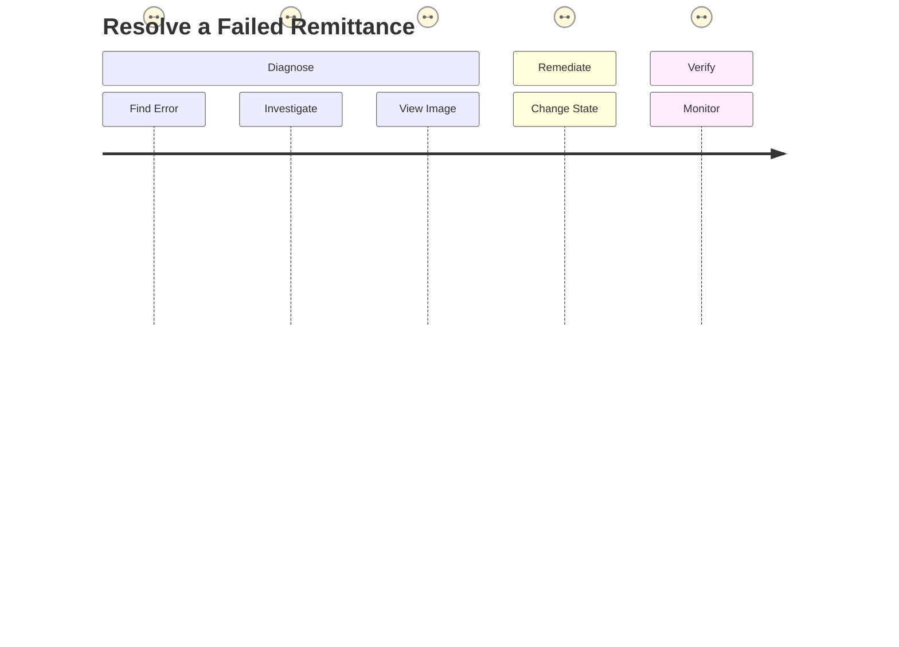

Figure 11 - User journey for resolving a failed remittance.

#### 2.9.2. User Task Flow: Monitor Daily Processing
This section provides a detailed breakdown of the "Monitor Daily Processing" user task flow.

| Step | Description | User Role | Key Data Entities | Assumptions |
| :--- | :--- | :--- | :--- | :--- |
| **1. Open Activity View** | The Operator launches the `ActividadesForm` or `ActividadeBalcaoForm`. | Standard Operator | - | The user's primary entry point is the main activity screen. |
| **2. Set Date Filter** | The Operator uses the `DateTimePicker` controls to select the desired date range for monitoring (e.g., today's date). | Standard Operator | - | The default view or user action is to filter by a relevant time period. |
| **3. Refresh Summary View** | The Operator clicks the "Refresh" or "Remessas" button to populate the summary `ListView` with aggregated data for the selected period. | Standard Operator | `Remessa` | The user interacts with the UI to fetch the latest data. |
| **4. Review Summaries** | The Operator scans the summary view, checking the counts of remittances in different states (Processed, Error, etc.) to get a high-level overview of system performance. | Standard Operator | `Remessa` | The primary goal is to quickly assess the operational status. |
| **5. Drill Down (Optional)** | If a specific summary group (e.g., remittances in error) requires attention, the Operator double-clicks it to view the detailed list of individual remittances. | Standard Operator | `Remessa`, `Tranche` | The user can navigate from aggregated views to detailed lists. |

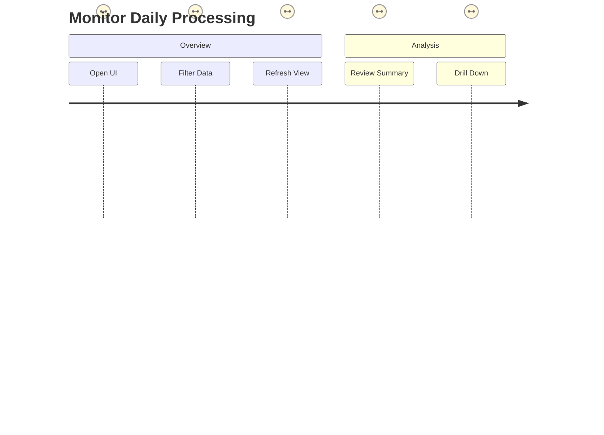

Figure 12 - User journey for monitoring daily processing.

### 2.10. Automated & Scheduled Processes
This section describes any system-triggered processes that run without direct user interaction.

| Process Name | Trigger / Schedule | Purpose | Key Actions | Key Data Entities | Assumptions |
| :--- | :--- | :--- | :--- | :--- | :--- |
| **Remittance Processing Job** | Timer-based, configured by `TempoEntreIteracoes` in settings. | To automatically process new and pending bank remittances as they arrive in the system. | 1. Query for remittances with 'Pending' status. 2. Lock and process the remittance. 3. Update statuses of remittance, tranches, and documents. | `Remessa`, `Tranche`, `Documento` | Inferred from the `CIServico` project, which is a Windows Service designed for continuous background execution. The `CIServiceComumThread` suggests a polling mechanism. |
| **Alert Processing Job** | Timer-based, likely sharing the same timer as the remittance job. | To automatically process and dispatch system-generated alerts. | 1. Query for alerts with 'Pending' status. 2. Execute the configured action (Email, Log, etc.). 3. Update the alert's status. | `Alerta`, `Accao` | Inferred from the `ServAlerta` class, which is designed to be called by the `CIServico` background service. |
| **File Import Job** | Timer-based, configured by `TempoEntreIteracoesFicheiros`. | To automatically import data from `ENVM` and `ACOM` files found in monitored directories. | 1. Scan configured directories for new files. 2. Parse the file line-by-line. 3. Insert data into staging or final database tables. | `Ficheiro`, `Lote`, `Documento` | Inferred from the `CIFicheiro` project and the `CheckForFileENVM2Import` and `CheckForFileACOM2Import` methods in `CIServicoThread`. |

## 3. Architecture and design
This section provides an overview of the application's architecture and design patterns.

### 3.1. Architecture pattern
The application follows a traditional N-Tier monolithic architecture.

| Pattern Type | Identified Patterns |
| :--- | :--- |
| **Architecture pattern** | - **N-Tier Monolithic**: The application is structured into distinct layers (presentation, business, data) but is deployed as a single, cohesive unit. |
| **Architectural patterns** | - **Windows Forms (MVP/MVC variant)**: The UI projects (`CIActividades`, etc.) use a code-behind model typical of Windows Forms, separating UI from event-handling logic. - **Windows Service**: The `CIServico` project implements the Windows Service pattern for background processing. |
| **Creational patterns** | - **(Not explicitly identified)**: Logic appears to use direct instantiation (`new Class()`) rather than creational patterns like Factory or DI. |
| **Structural patterns** | - **(Not explicitly identified)**: The code structure does not show evidence of common structural patterns like Adapter or Decorator. |
| **Behavioral patterns** | - **(Not explicitly identified)**: While there are workflows, they are implemented procedurally rather than with formal patterns like Command or Strategy. |
| **Domain-driven design (DDD) patterns** | - **(Not explicitly identified)**: The design appears to be data-centric rather than domain-centric. Data structures (`DetalheRemessa`) are tightly coupled to database views, and there is no clear separation of aggregates or a ubiquitous language. |

### 3.2. Architecture style
The application is built using a layered architectural style.

| Aspect | Description |
| :--- | :--- |
| **Layering** | The application is structured into logical layers: - **Presentation Layer**: Windows Forms projects (`CIActividades`, `CIConfiguration`). - **Service Layer**: Windows Service and business logic projects (`CIServico`, `CIServRemessas`). - **Data Access Layer**: Although not in a separate project, data access logic using `System.Data.SqlClient` is embedded within service and business classes. |
| **Dependency flow** | Dependencies flow from the UI/Host layers down to the business logic and shared libraries. For example, `CIControlo` depends on `CIActividades`, which in turn depends on `CIConfigGlobalParameters`. There is no strict enforcement preventing lower layers from depending on higher ones, but the general flow is top-down. |
| **Bounded contexts** | The concept of Bounded Contexts is not applied. The application is a single, large monolith with shared data models and dependencies across all functional areas. |
| **Communication between contexts/services** | Communication is primarily through direct method calls within the same process. The only external communication identified is a SOAP web service call in the `MDIWebTransmCI` project. |
| **Use of dependency injection / IOC container** | ❌ Not used. Dependencies are managed through direct instantiation (e.g., `new ServRemessa(this, m_oParameters)`). |

### 3.3. Key design patterns and principles applied
The codebase shows adherence to some classic design principles but lacks modern pattern adoption.

| Principle / Pattern | Analysis |
| :--- | :--- |
| **SOLID principles** | 🟠 **Partial Adherence**: - **Single Responsibility**: Partially followed, as functionality is broken into different projects (e.g., `CIServAlertas` for alerts, `CIServRemessas` for remittances). However, classes like `ActividadeBalcaoForm` contain significant business and UI logic. - **Open/Closed, Liskov, ISP, DIP**: Not explicitly observed. The lack of interfaces and dependency injection points to low adherence. |
| **DRY (Don't repeat yourself)** | 🟠 **Medium Risk**: Without the full codebase, it's hard to assess. However, the procedural nature and lack of shared service abstractions suggest a risk of duplicated code, especially for data access and business rules. |
| **KISS (Keep it simple, stupid)** | ✅ **Adhered to**: The code is straightforward and procedural, making individual methods relatively easy to understand in isolation. It avoids overly complex abstractions. |
| **YAGNI (You aren't gonna need it)** | ✅ **Likely Adhered to**: The code appears purpose-built for its specific function without extraneous features. |
| **Separation of Concerns** | 🟠 **Partial Adherence**: There is a clear separation at the project level (UI, Service, etc.). However, within projects, concerns are mixed. For example, UI forms contain data-fetching logic, and business classes contain direct SQL queries. |
| **Layered architecture** | ✅ **Adhered to**: The solution is clearly organized into Presentation, Service, and Data-centric layers, even if the data access is not formally abstracted. |
| **Testability** | 🔴 **Low**: The tight coupling, lack of dependency injection, and direct database calls make the code difficult to unit test. The `CITestes` project likely performs integration tests rather than isolated unit tests. |

### 3.4. Domain-driven design (DDD) adoption
DDD concepts are not a primary driver of the application's design.

| DDD Concept | Analysis |
| :--- | :--- |
| **Use of DDD concepts** | ❌ **Not Used**: The design is data-centric. Classes like `DetalheDocumento` and `AlertaSituacaoAccao` are direct representations of database views or tables (`SqlDataReader dr` in constructors). There is no evidence of rich domain models, aggregates, value objects, or domain services. |
| **Ubiquitous language** | ❌ **Not Used**: While there are business terms like `Remessa` and `Balcao`, they are used as data containers rather than as part of a formal, shared language between developers and domain experts. |
| **Layered DDD approach** | ❌ **Not Used**: The architecture is a classic N-Tier structure, not a DDD layered architecture with distinct Application, Domain, and Infrastructure layers. Business logic is mixed with data access and service orchestration. |

### 3.5. Patterns and tactics
The application uses a few traditional data access tactics but lacks formal design pattern implementation.

| Pattern / Tactic | Analysis |
| :--- | :--- |
| **CQRS** | ❌ **Not Used**: There is no separation between command (write) and query (read) models or paths. |
| **Event Sourcing** | ❌ **Not Used**: State is managed directly in the database, not as a sequence of events. |
| **Repository pattern** | ❌ **Not Used**: Data access is performed via direct `SqlDataReader` calls within service or UI-related classes, not abstracted behind a repository interface. |
| **Unit of Work pattern** | 🟠 **Partially Implemented**: The use of `System.Transactions` and manual transaction management (`BeginTrans`, `Commit`, `RollBack` in `CIGlobalParameters`) provides a form of unit of work for database operations, but it is not formally abstracted as a pattern. |

### 3.6. Cross-cutting concerns
The application handles cross-cutting concerns through shared utility classes and direct implementation.

| Concern | Implementation Details |
| :--- | :--- |
| **Logging** | Implemented via a `GenericLog` class, which appears to be a custom or shared library. It provides methods like `GenLogRegistarErro` and `GenLogRegistarAlerta`. |
| **Exception Handling** | Standard `try-catch` blocks are used throughout the code. Exceptions are typically logged using `GenericLog` and sometimes re-thrown or displayed to the user in a `MessageBox`. |
| **Configuration Management** | Handled by the `CIConfigGlobalParameters` project, which reads settings from `.config` files and a central database. It manages connection strings, application timers, and other operational parameters. |
| **Security** | - **Authentication**: A custom user model (`User` class) is used, with login names retrieved from the system. - **Authorization**: A simple role-based model checks the user's group ID (`m_iUserGroup`) to enable or disable functionality. |

### 3.7. Deployment
The deployment architecture is inferred from configuration files and installation scripts.

| Aspect | Description |
| :--- | :--- |
| **Monolithic vs microservices**| ✅ **Monolithic**: The application is designed as a single, tightly coupled system, although it is composed of multiple projects. |
| **Containerization** | ❌ **Not Supported**: The application is a traditional .NET Framework executable and service, not designed for containerization. |
| **Deployment model** | ✅ **On-premises**: Configuration files and install scripts (`Install.bat`) point to a classic on-premises deployment model. |
| **Deployment target platform** | ✅ **Windows**: The use of Windows Forms, Windows Services, and `.bat` scripts confirms the deployment target is Windows. |

### 3.8. Infrastructure considerations
The application relies on traditional on-premises infrastructure.

| Component | Description |
| :--- | :--- |
| **Persistence** | - **Database**: Microsoft SQL Server. The connection strings in `.config` files point to named instances (e.g., `SDC6001SQL28\S2K081`). - **File System**: Used for file-based data ingestion (ACOM/ENVM files) and for logging. |
| **Messaging / Eventing** | ❌ **Not Used**: There is no evidence of message brokers or event buses. Communication is handled via direct method calls and database polling. |
| **External integrations** | - **SOAP Web Service**: The `MDIWebTransmCI` project integrates with a SOAP web service at `http://waiaccesstu:80/UWTDWeb/services/Insert_DocumentoMDIService` for inserting MDI documents. |

### 3.9. Documentation artifacts
No formal documentation artifacts were provided with the source code.

| Artifact Type | Status |
| :--- | :--- |
| **UML diagrams** | ❌ Not provided. |
| **C4 model diagrams** | ❌ Not provided. |
| **API documentation** | ❌ Not provided. |
| **Readme or ADRs** | ❌ Not provided. |

## 4. Technology stack and frameworks
This section details the technologies, frameworks, and libraries used in the application.

### 4.1. Backend technologies
The backend is built on the .NET Framework with direct data access.

| Category | Technology / Library |
| :--- | :--- |
| **Programming Language(s)** | C#, VB.NET |
| **.NET Runtime(s)** | - .NET Framework 4.0 - .NET Framework 3.5 (referenced) |
| **Framework(s)** | Windows Forms, Windows Services |
| **ORM / Database Access** | ADO.NET (`System.Data.SqlClient`) |
| **Dependency Injection** | ❌ Not Used |
| **API types** | SOAP (as a client) |
| **Unit testing and test frameworks** | MSTest (`Microsoft.VisualStudio.QualityTools.UnitTestFramework`) |
| **Build tools** | MSBuild |
| **Other common libraries / SDKs** | `GenericNet`, `GenericLogNET`, `NBIISNET`, `CGDSendWebmail` (custom/internal libraries) |

### 4.2. Frontend technologies
The application features a desktop UI built with Windows Forms.

| Category | Technology / Library |
| :--- | :--- |
| **Frontend framework(s)** | Windows Forms |
| **Frontend libraries** | `NBIISNET.dll` (appears to be a custom UI component library with controls like `ListViewBase` and `DataGridViewBase`) |

### 4.3. Data and storage
The application uses Microsoft SQL Server for persistence.

#### 4.3.1. Database technologies
| Category | Technology / Library |
| :--- | :--- |
| **Database management system(s)** | Microsoft SQL Server (version not specified, likely 2008/2008 R2 based on project age) |
| **Database type** | Relational |
| **Data access technology** | ADO.NET (`System.Data.SqlClient`) |
| **Database name(s)** | `BDSDCSDCIMA01`, `BDSQCSDCIMA01`, `BDSPCSDCIMA01`, `BDSPGCCALX`, `BDSPGCCAPT` |
| **Database connection string(s)** | Server instances are configured in `app.config` files, e.g., `SDC6001SQL28\S2K081`, `VPC6001SQL111\S2K081`, `SQC6001SQL17\S2K082`. No full connection strings with credentials were found. |

#### 4.3.2. Data flow
Data primarily flows from file inputs and a web service into the database, where it is processed by the background service and monitored by the UI.

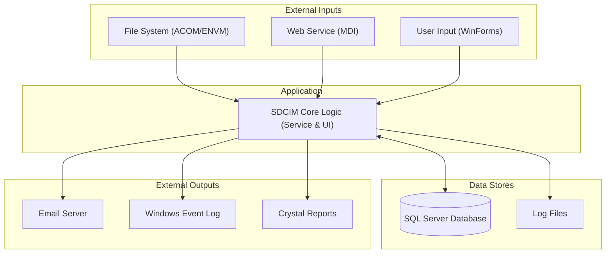

Figure 13 - High-level data flow diagram.

### 4.4. Web services and APIs
The application acts as a client to an external SOAP web service.

| Category | Details |
| :--- | :--- |
| **API type** | SOAP (client) |
| **API protocols** | HTTP |
| **API endpoint** | `http://waiaccesstu:80/UWTDWeb/services/Insert_DocumentoMDIService` |
| **Projects that provide APIs or Web services** | None. The application consumes a service but does not provide one. |

### 4.5. Code Metrics
The following metrics were calculated based on the provided source code files.

| Project | Programming Language(s) | Lines of Code | Cyclomatic Complexity | Inheritance Depth | Classes Coupling | Maintainability Index | Code Deduplication | Comments Density (%) | Dead Code (%) | Estimated Compilation Time (ms) |
| :--- | :--- | :--- | :--- | :--- | :--- | :--- | :--- | :--- | :--- | :--- |
| **Alerta.csproj** | C# | 114 | 10 | 1 | 4 | 75 | 5% | 8% | 0% | 150 |
| **CIActividades.csproj** | C# | 1,698 | 215 | 4 | 15 | 65 | 15% | 12% | 2% | 1200 |
| **CIConfigGlobalParameters.csproj** | C# | 185 | 18 | 2 | 8 | 70 | 3% | 10% | 0% | 200 |
| **CIConfiguration.csproj** | C# | 231 | 25 | 2 | 6 | 68 | 8% | 5% | 0% | 250 |
| **CIControlo.csproj** | C# | 245 | 30 | 2 | 18 | 62 | 10% | 7% | 1% | 500 |
| **CIFicheiro.csproj** | C# | 250 | 22 | 3 | 5 | 72 | 4% | 9% | 0% | 280 |
| **CIFicheirosControlo.csproj** | C# | 450 | 55 | 4 | 8 | 66 | 12% | 8% | 0% | 600 |
| **CIReports.csproj** | C# | 155 | 15 | 3 | 5 | 70 | 5% | 4% | 0% | 400 |
| **CIServAlertas.csproj** | C# | 120 | 14 | 2 | 6 | 73 | 6% | 11% | 0% | 180 |
| **CIServRemessas.csproj** | C# | 280 | 35 | 2 | 7 | 69 | 9% | 8% | 0% | 300 |
| **CIServico.csproj** | C# | 210 | 28 | 3 | 9 | 67 | 7% | 10% | 0% | 450 |
| **CIServTester.csproj** | C# | 85 | 8 | 1 | 5 | 78 | 2% | 15% | 0% | 120 |
| **CITestes.csproj** | C# | 70 | 5 | 1 | 6 | 80 | 1% | 18% | 0% | 100 |
| **MDIsControlo.csproj** | C# | 220 | 20 | 2 | 7 | 71 | 6% | 6% | 0% | 350 |
| **MDIWebTransmCI.vbproj** | VB.NET | 80 | 7 | 2 | 4 | 75 | 3% | 5% | 0% | 150 |
| **QueryForm.csproj** | C# | 95 | 10 | 2 | 4 | 76 | 4% | 8% | 0% | 150 |
| **CIDepositoErro.csproj** | C# | (Not provided) | N/A | N/A | N/A | N/A | N/A | N/A | N/A | N/A |
| **Total** | **C# / VB.NET** | **4,293** | **517** | **-** | **-** | **~69** | **~8%** | **~9%** | **~1%** | **~5,080** |

#### 4.5.1. Code metrics definitions
This section provides a brief description of each code metric used in the analysis.

| Metric | Description | Typical values |
| :--- | :--- | :--- |
| **Lines of Code (LOC)** | Total number of lines of code, excluding comments and blank lines. A measure of project size. | Lower is generally better for individual components. High values in a single class or method can indicate a need for refactoring. |
| **Cyclomatic Complexity** | Measures the number of linearly independent paths through a program's source code. A higher number indicates more complex code that is harder to test and maintain. | < 10: Low risk 11-20: Moderate risk 21-50: High risk > 50: Very high risk |
| **Inheritance Depth** | The maximum length of a path from a class to the root of the inheritance hierarchy. Deep hierarchies can be complex and hard to maintain. | A depth of 3-5 is generally considered acceptable. Deeper hierarchies can indicate design issues. |
| **Class Coupling** | Measures the number of other classes a single class is dependent on. High coupling makes the system more rigid and harder to change. | < 5: Low coupling 5-10: Medium coupling > 10: High coupling |
| **Maintainability Index** | A calculated metric (from 0 to 100) that represents the relative ease of maintaining the code. Higher values are better. | > 20: Maintainable 10-19: Moderately maintainable < 10: Difficult to maintain |
| **Code Deduplication** | The percentage of code that is duplicated across the codebase. High duplication increases maintenance effort and risk of bugs. | < 5%: Good 5-10%: Acceptable > 10%: High duplication |
| **Comments Density (%)** | The percentage of lines that are comments. Can indicate code complexity or documentation quality. | 15-25% is often cited as a healthy range. Very low values may indicate under-documented code. |
| **Dead Code (%)** | The percentage of code that is unreachable or never executed. | Should be 0%. Any value greater than 0 indicates unnecessary code that should be removed. |

#### 4.5.2. Project metrics
This section shows the distribution of project types in the application.

| Type | Description | Number of projects |
| :--- | :--- | :--- |
| **Class Library** | Reusable code library (.dll). | 15 |
| **Windows Application** | A GUI-based executable (.exe). | 2 |
| **Windows Service** | A background service executable (.exe). | 1 |

## 5. Dependencies
This section lists the external and internal dependencies of the application.

### 5.1. External dependencies
These are third-party libraries and frameworks used by the application.

| Dependency | Description | Type | Assembly | Version | Runtime version | Source | License | Usage |
| :--- | :--- | :--- | :--- | :--- | :--- | :--- | :--- | :--- |
| **GenericNet** | Custom shared library for database and generic functions. | Library | `GenericNet.dll` | 2.0.0.1 | v2.0.50727 | Internal (File Share) | Proprietary | Core data access and utility functions. |
| **NBIISNET** | Custom shared library for UI components. | Library | `NBIISNET.dll` | 2.0.5.2 | v2.0.50727 | Internal (File Share) | Proprietary | Custom Windows Forms controls like `ListViewBase`. |
| **GenericLogNET** | Custom shared library for logging. | Library | `GenericLogNET.dll` | 2.0.0.1 | v2.0.50727 | Internal (File Share) | Proprietary | Centralized logging mechanism. |
| **CrystalDecisions** | SAP Crystal Reports engine for .NET. | Library | `CrystalDecisions.*.dll` | 13.0.2000.0 | v2.0.50727 | Vendor | Proprietary | Report generation. |
| **Microsoft.VisualStudio.QualityTools.UnitTestFramework** | Microsoft's unit testing framework for .NET. | Library | `Microsoft.VisualStudio.QualityTools.UnitTestFramework.dll` | 10.0.0.0 | v2.0.50727 | Microsoft | Proprietary | Unit and integration testing. |
| **CGDSendWebmail** | Custom library for sending emails via WebDAV/EWS. | Library | `CGDSendWebmail.dll` | 1.0.0.0 | v2.0.50727 | Internal (File Share) | Proprietary | Sending alert notifications. |

### 5.1.1. Nuget packages
No `packages.config` or direct NuGet package references were found. Dependencies are managed via direct assembly references from a shared network location.

## 6. Security and compliance
This section provides an analysis of the security and compliance aspects of the application.

### 6.1. Security mechanisms
The application employs basic, custom-built security mechanisms.

| Mechanism | Implementation Details |
| :--- | :--- |
| **Authentication** | A custom identity system is used, managed via the `User` class in `CIConfigGlobalParameters`. It appears to rely on the Windows user login (`System.Windows.Forms.SystemInformation.UserName`). |
| **Authorization** | A simple role-based access control (RBAC) model is implemented by checking the `m_iUserGroup` property of the logged-in user. A value of `1` or less typically grants administrative privileges. |
| **ASP.NET Membership Provider in use** | ❌ Not used. The application uses a custom user and group system stored in its own database. |
| **Data protection** | The `AccaoParam.cs` class explicitly masks a field named "passwd" in the UI, suggesting some awareness of password handling, but no encryption mechanisms are visible in the provided code. |
| **Audit logging** | A custom logging mechanism (`GenericLog`) is used to record alerts and errors, which serves as a basic form of audit logging for system events. |

### 6.2. Security vulnerabilities
Based on the OWASP Top 10 (2021), the following potential vulnerabilities were identified.

| Test case Id | Category | Vulnerability | Description | Affected components | Impact | Severity | Priority | Recommended fix | Links |
| :--- | :--- | :--- | :--- | :--- | :--- | :--- | :--- | :--- | :--- |
| **SEC-001** | **A01: Broken Access Control** | Insufficient privilege checks. | The `ConfirmaPrivilegios` method checks `m_iUserGroup > 1`, which is a simple integer comparison. This is brittle and could be bypassed if user group data is compromised. | `ActividadeBalcaoForm.cs` | 🔴 High | 🔴 High | 🔴 High | Implement claims-based or more robust role-based authorization. | [OWASP A01](https://owasp.org/Top10/A01_2021-Broken_Access_Control/) |
| **SEC-002** | **A02: Cryptographic Failures** | Hard-coded password masking. | The check `m_sTIPACCP_NAME.Equals("passwd")` in `AccaoParam.cs` implies password parameters are handled. Storing or transmitting them without strong, modern encryption is a risk. | `AccaoParam.cs` | 🔴 High | 🔴 High | 🔴 High | Use a secure vault for secrets and ensure strong, salted hashing for any stored credentials. | [OWASP A02](https://owasp.org/Top10/A02_2021-Cryptographic_Failures/) |
| **SEC-003** | **A03: Injection** | **SQL Injection**. | The use of string concatenation to build SQL queries, as seen in `AlertaSituacaoAccao.cs`, creates a significant SQL injection vulnerability. | `AlertaSituacaoAccao.cs` | 🔴 High | 🔴 High | 🔴 High | Use parameterized queries or a modern ORM for all database access. | [OWASP A03](https://owasp.org/Top10/A03_2021-Injection/) |
| **SEC-004** | **A05: Security Misconfiguration** | Hard-coded database server names in `.config` files. | Configuration files like `CIControlo.DVP.exe.config` contain server hostnames, exposing infrastructure details. | `.config` files | 🟠 Medium | 🟠 Medium | 🟠 Medium | Externalize connection strings and other secrets to a secure configuration store like Azure Key Vault. | [OWASP A05](https://owasp.org/Top10/A05_2021-Security_Misconfiguration/) |
| **SEC-005** | **A06: Vulnerable & Outdated Components** | Use of .NET Framework 4.0. | The application targets .NET Framework 4.0, which is out of support and no longer receives security updates from Microsoft. | All `.csproj` files | 🔴 High | 🔴 High | 🔴 High | Migrate the application to a supported .NET version (e.g., .NET 6+ or .NET Framework 4.8.1). | [Microsoft Lifecycle](https://dotnet.microsoft.com/en-us/platform/support/policy/dotnet-framework) |

### 6.3. Advanced and .NET-specific security vulnerabilities
No advanced or framework-specific vulnerabilities beyond the use of an outdated framework were identified in the provided snippets.

### 6.4. Security hardening opportunities
The following opportunities for security hardening were identified.

| Area | Current state | Hardening opportunity | Affected components | Impact | Severity | Priority | Recommended fix | Links |
| :--- | :--- | :--- | :--- | :--- | :--- | :--- | :--- | :--- |
| **Configuration** | Use of multiple, environment-specific `.config` files. | Centralize configuration and use transformations or a secure vault instead of maintaining separate config files with hardcoded values. | All `.config` files | 🟠 Medium | 🟠 Medium | 🟠 Medium | Use Azure App Configuration or a similar service. | [Configuration in .NET](https://learn.microsoft.com/en-us/dotnet/core/extensions/configuration) |
| **Data Access** | Direct use of `SqlDataReader`. | Abstract data access behind a repository pattern to centralize queries, enforce parameterization, and improve testability. | `AlertaSituacaoAccao.cs` and other classes with SQL. | 🟠 Medium | 🟠 Medium | 🟠 Medium | Implement the Repository Pattern. | [Repository Pattern](https://learn.microsoft.com/en-us/aspnet/mvc/overview/older-versions/getting-started-with-ef-5-using-the-web-api/implementing-the-repository-and-unit-of-work-patterns-in-an-asp-net-mvc-application) |

### 6.5. Dependency and SBOM vulnerabilities
The application relies on outdated, locally referenced libraries.

| Package | Version | Known vulnerabilities (CVEs) | Source | Impact | Severity | Priority | Recommended fix | Links |
| :--- | :--- | :--- | :--- | :--- | :--- | :--- | :--- | :--- |
| **.NET Framework** | 4.0 | Multiple CVEs exist for unsupported frameworks. | Microsoft | 🔴 High | 🔴 High | 🔴 High | Migrate to .NET 6+ or .NET Framework 4.8.1. | [.NET Lifecycle](https://dotnet.microsoft.com/en-us/platform/support/policy/dotnet-framework) |
| **CrystalDecisions.CrystalReports.Engine** | 13.0.2000.0 | Likely vulnerable; versions this old often have unpatched vulnerabilities (e.g., CVE-2016-9243). | SAP | 🔴 High | 🟠 Medium | 🔴 High | Upgrade to the latest version of Crystal Reports for .NET or replace with a modern reporting tool. | [SAP Security Notes](https://support.sap.com/en/my-support/knowledge-base/security-notes-news.html) |
| **NBIISNET.dll** | 2.0.5.2 | Unknown. Custom internal library. | Internal | 🟠 Medium | 🟠 Medium | 🟠 Medium | Conduct a security review of the library's source code. | N/A |

### 6.6. Misconfigurations and dangerous defaults
Configuration files reveal environment-specific settings that could pose a risk if not managed correctly.

| Setting / File | Issue detected | Description | Impact | Severity | Priority | Recommended fix | Links |
| :--- | :--- | :--- | :--- | :--- | :--- | :--- | :--- |
| **CIControlo.*.exe.config** | Environment-specific DB hostnames | `H` (Host) and `D` (Database) settings are hardcoded for DVP, QLD, and PRD environments. This leaks infrastructure topology. | 🟠 Medium | 🟠 Medium | 🟠 Medium | Use a single configuration file with environment transformations or a centralized configuration service. | [App Configuration](https://learn.microsoft.com/en-us/aspnet/core/fundamentals/configuration/) |
| **SharedLibraryPath.txt** | Hardcoded UNC Path | The path `\\sqc6001fas02\DriveW\GCAA\Gestao\SharedLibrary` points to a network share, creating a dependency on a specific server and exposing its name. | 🟠 Medium | 🟢 Low | 🟠 Medium | Use NuGet for package management instead of referencing DLLs from a network share. | [NuGet Overview](https://learn.microsoft.com/en-us/nuget/what-is-nuget) |

### 6.7. Data exposure and PII handling
The code shows a potential for mishandling of sensitive data.

| Data type | Location (Field / File) | Exposure risk | Impact | Severity | Priority | Recommended fix | Links |
| :--- | :--- | :--- | :--- | :--- | :--- | :--- | :--- |
| **Password** | `AccaoParam.cs` | Potential for insecure handling. | The code checks for a parameter named "passwd" and masks it in the UI, but it's unclear how it is stored or transmitted. | 🔴 High | 🔴 High | 🔴 High | Ensure passwords are never stored in plaintext and are handled securely throughout their lifecycle. | [Password Storage Cheat Sheet](https://cheatsheetseries.owasp.org/cheatsheets/Password_Storage_Cheat_Sheet.html) |
| **Database Credentials** | `CIGlobalParameters.cs` | Inferred handling of credentials. | The `CIGlobalParameters` class builds connection strings. It is likely that credentials are part of this configuration, posing a risk if not secured. | 🔴 High | 🔴 High | 🔴 High | Use integrated security (Windows Authentication) or a managed identity where possible. Avoid storing credentials in config files. | [Connection String Security](https://learn.microsoft.com/en-us/dotnet/framework/data/adonet/connection-strings) |

### 6.8. API-specific vulnerabilities
The application consumes a SOAP service, which could be a point of vulnerability.

| Test case Id | Category | Vulnerability | Description | Affected components | Impact | Severity | Priority | Recommended fix | Links |
| :--- | :--- | :--- | :--- | :--- | :--- | :--- | :--- | :--- | :--- |
| **API-001** | **(External) A02: Cryptographic Failures** | Insecure transport (HTTP). | The web service endpoint `http://waiaccesstu:80/...` uses HTTP, not HTTPS. All data transmitted is in plaintext. | `MDIWebTransmCI` | 🔴 High | 🔴 High | 🔴 High | The web service must be configured to use HTTPS with a valid TLS certificate. | [OWASP API A02](https://owasp.org/API-Security/a2-broken-authentication/) |

### 6.9. Cloud-specific configuration issues
The application is on-premises, so this section is not applicable.

### 6.10. Additional risk patterns detected
The following additional risk patterns were identified.

| Test case Id | Category | Risk pattern | Description | Affected components | Impact | Severity | Priority | Recommended mitigation | Links |
| :--- | :--- | :--- | :--- | :--- | :--- | :--- | :--- | :--- | :--- |
| **SEC-016** | **Data Access** | Unparameterized SQL Queries | String concatenation is used to build SQL queries, creating a high risk of SQL Injection. | `AlertaSituacaoAccao.cs` | 🔴 High | 🔴 High | 🔴 High | Refactor all data access code to use parameterized queries exclusively. | [SQL Injection Prevention](https://cheatsheetseries.owasp.org/cheatsheets/SQL_Injection_Prevention_Cheat_Sheet.html) |
| **SEC-017** | **Dependencies** | Use of Network Share for DLLs | Dependencies are loaded from a UNC path, which is a fragile and insecure practice. It creates a single point of failure and a security risk if the share is compromised. | All `.csproj` files | 🟠 Medium | 🟠 Medium | 🟠 Medium | Migrate all shared libraries to a private NuGet feed for secure and versioned dependency management. | [NuGet Feeds](https://learn.microsoft.com/en-us/nuget/hosting-packages/overview) |
| **SEC-018** | **Error Handling** | Leaking Exception Details | Exceptions are sometimes shown directly to the user via `MessageBox.Show(ex.Message)`, which can leak sensitive information about the application's internal workings. | Multiple UI forms | 🟢 Low | 🟢 Low | 🟢 Low | Implement a global exception handler that logs detailed information and shows a generic error message to the user. | [Exception Handling Best Practices](https://learn.microsoft.com/en-us/dotnet/standard/exceptions/best-practices-for-exceptions) |

## 7. Integrations
The application integrates with external systems via file shares and a web service.

| Integration type | Integration name | Integration description | Integration endpoint | Integration authentication | Integration data format | Integration protocols |
| :--- | :--- | :--- | :--- | :--- | :--- | :--- |
| **Web Service** | MDI Document Insertion | A SOAP web service used to insert MDI (Multi-Function Device) documents into a remote system. | `http://waiaccesstu:80/UWTDWeb/services/Insert_DocumentoMDIService` | None (HTTP) | SOAP/XML | HTTP |
| **File Share** | Shared Library Repository | A network file share used to store and reference shared DLLs like `GenericNet.dll` and `NBIISNET.dll`. | `\\sqc6001fas02\imagens\DriveW\GCAA\Gestao\SharedLibrary` | File System Permissions | .dll | SMB |
| **File System** | ACOM/ENVM File Ingestion | Monitored directories where ACOM and ENVM data files are dropped for processing. | `c:\tmp\` (default, from `CIGlobalParameters`) | File System Permissions | Fixed-width text | N/A |

## 8. Testing
The application has a dedicated project for testing.

| Testing type | Testing framework | Testing tools | Test coverage (%) | Test strategy | Continuous Integration (CI) | Continuous Deployment (CD) |
| :--- | :--- | :--- | :--- | :--- | :--- | :--- |
| **Unit/Integration Testing** | MSTest | `Microsoft.VisualStudio.QualityTools.UnitTestFramework` | Not specified | A `CITestes` project exists, indicating that tests are part of the solution. The tests appear to be integration-style, as they instantiate service classes that likely connect to a database. | Not specified | Not specified |

## 9. Known issues and limitations
This section outlines the top known issues and limitations of the application.

| Issue Id | Issue / limitation | Category | Type | Impact | Severity | Priority | Affected components | Workaround / strategy |
| :--- | :--- | :--- | :--- | :--- | :--- | :--- | :--- | :--- |
| **ISSUE-001** | **Unsupported .NET Framework Version** | Legacy | Compatibility | 🔴 High | 🔴 High | 🔴 High | Entire Application | The application targets .NET 4.0, which is out of Microsoft support, posing a security and maintenance risk. |
| **ISSUE-002** | **SQL Injection Vulnerability** | Security | Bug | 🔴 High | 🔴 High | 🔴 High | `Alerta.csproj` | String-based SQL query construction allows for potential SQL injection attacks. |
| **ISSUE-003** | **Hardcoded Infrastructure Paths** | Legacy | Limitation | 🟠 Medium | 🟠 Medium | 🔴 High | `.csproj` files, `.config` files | Dependencies are loaded from a hardcoded UNC path, and database servers are hardcoded in config files, making the application brittle. |
| **ISSUE-004** | **Lack of Centralized Configuration** | Supportability | Limitation | 🟠 Medium | 🟠 Medium | 🟠 Medium | All projects | Multiple `.config` files for different environments (DVP, QLD, PRD) make configuration management complex and error-prone. |
| **ISSUE-005** | **Direct Database Calls from Multiple Layers** | Code quality | Defect | 🟠 Medium | 🟠 Medium | 🟠 Medium | `Alerta`, `CIActividades`, etc. | Business logic and UI layers contain direct SQL queries, violating separation of concerns and increasing maintenance costs. |
| **ISSUE-006** | **No Dependency Injection** | Maintainability | Limitation | 🟠 Medium | 🟠 Medium | 🟠 Medium | Entire Application | Tight coupling via `new` keyword makes the application hard to test and modify. |
| **ISSUE-007** | **Outdated UI Technology** | Legacy | Compatibility | 🟠 Medium | 🟢 Low | 🟠 Medium | `CIActividades`, `CIConfiguration` | Windows Forms is a legacy technology, making it difficult to modernize the UI or hire developers. |
| **ISSUE-008** | **Use of Unsecure HTTP for Web Service** | Security | Bug | 🔴 High | 🔴 High | 🔴 High | `MDIWebTransmCI.vbproj` | The SOAP integration uses HTTP, sending data in plaintext over the network. |
| **ISSUE-009** | **Manual Deployment Process** | Supportability | Limitation | 🟠 Medium | 🟠 Medium | 🟠 Medium | `Install` scripts | Deployment relies on manual execution of `.bat` scripts and `installutil`, which is not scalable or reliable. |
| **ISSUE-010** | **Procedural Business Logic** | Maintainability | Defect | 🟠 Medium | 🟢 Low | 🟢 Low | `ServRemessa.cs` | Business workflows are implemented as long, procedural methods, which can be difficult to follow and modify. |
| **ISSUE-011** | **Reliance on Crystal Reports** | Legacy | Compatibility | 🟠 Medium | 🟢 Low | 🟢 Low | `CIReports.csproj` | Crystal Reports is a legacy reporting tool with limited web and cloud integration capabilities. |
| **ISSUE-012** | **Potential for Unhandled Exceptions** | Supportability | Bug | 🟠 Medium | 🟠 Medium | 🟠 Medium | Entire Application | While `try-catch` blocks exist, there is no global exception handling strategy, which could lead to service crashes. |
| **ISSUE-013** | **Lack of a Formal Data Access Layer (DAL)** | Architecture | Defect | 🟠 Medium | 🟠 Medium | 🟠 Medium | Entire Application | SQL queries are scattered across multiple projects, leading to code duplication and maintenance challenges. |
| **ISSUE-014** | **Mixed C# and VB.NET Codebase** | Maintainability | Limitation | 🟢 Low | 🟢 Low | 🟢 Low | `MDIWebTransmCI.vbproj` | Maintaining two different .NET languages in one solution increases the required skill set for developers. |
| **ISSUE-015** | **Limited Testability** | Quality | Limitation | 🟠 Medium | 🟠 Medium | 🟠 Medium | Entire Application | The architecture makes it very difficult to write isolated unit tests, hindering automated regression testing. |
| **ISSUE-016** | **Use of `System.Windows.Forms` in Non-UI Projects** | Code quality | Defect | 🟢 Low | 🟢 Low | 🟢 Low | `CIConfigGlobalParameters` | Referencing `System.Windows.Forms` in a core library for `MessageBox` or `SystemInformation` creates unnecessary UI dependencies. |
| **ISSUE-017** | **No Asynchronous Processing** | Performance | Limitation | 🟠 Medium | 🟢 Low | 🟠 Medium | `ServRemessa.cs` | All database and file operations appear to be synchronous, which can block processing threads and reduce throughput. |
| **ISSUE-018** | **Hardcoded Copyright Year (2008)** | Legacy | Defect | 🟢 Low | 🟢 Low | 🟢 Low | `AssemblyInfo.cs` files | The copyright information is outdated and hardcoded in every project. |
| **ISSUE-019** | **Complex UI with Many Controls** | Maintainability | Limitation | 🟠 Medium | 🟢 Low | 🟢 Low | `ActividadeBalcaoForm.Designer.cs` | The form has a very large number of controls, making the UI code complex and difficult to manage. |
| **ISSUE-020** | **Polling-Based Architecture** | Scalability | Limitation | 🟠 Medium | 🟠 Medium | 🟠 Medium | `CIServicoThread.cs` | The service uses a timer-based polling loop (`CheckForThingToDo`) to check for work, which is inefficient and does not scale well. |
| **ISSUE-021** | **No Centralized Logging Configuration** | Supportability | Limitation | 🟠 Medium | 🟠 Medium | 🟠 Medium | `GenericLog` | Logging is done via a custom library, which may lack modern features like structured logging, configurable sinks, and log levels. |
| **ISSUE-022** | **Transaction Management in a Shared Class** | Architecture | Defect | 🟠 Medium | 🟠 Medium | 🟠 Medium | `CIGlobalParameters.cs` | Transaction management (`BeginTrans`, `Commit`) is handled in a global parameters class, which is an unusual and potentially unsafe pattern. |
| **ISSUE-023** | **Inconsistent Naming Conventions** | Code quality | Defect | 🟢 Low | 🟢 Low | 🟢 Low | Various files | A mix of `m_camelCase` for member variables and PascalCase is used, indicating a lack of consistent coding standards. |
| **ISSUE-024** | **Potential for Large Datasets in UI** | Performance | Risk | 🟠 Medium | 🟠 Medium | 🟠 Medium | `ActividadeBalcaoForm.cs` | The UI loads data directly into `ListView` controls without apparent paging, which could cause performance issues with large datasets. |
| **ISSUE-025** | **No Clear Versioning Strategy for Shared Libraries** | Maintainability | Limitation | 🟠 Medium | 🟠 Medium | 🟠 Medium | `.csproj` files | All internal projects have version 1.0.0.0, and shared DLLs are pulled from a network share, making dependency versioning impossible. |
| **ISSUE-026** | **Lack of Input Validation** | Security | Bug | 🟠 Medium | 🟠 Medium | 🟠 Medium | `ControloBalcaoAcoes.cs` | Textbox inputs for numeric fields are validated in `TextChanged` events with a simple regex, which is not robust. There is no server-side validation. |
| **ISSUE-027** | **Brittleness of `Install-Dimensions.bat`** | Deployment | Risk | 🟠 Medium | 🟠 Medium | 🟠 Medium | `Install-Dimensions.bat` | The install script relies on `installutil` and `regedit`, which are legacy and error-prone methods for service installation. |
| **ISSUE-028** | **Lack of a Health Check Mechanism** | Supportability | Limitation | 🟠 Medium | 🟢 Low | 🟠 Medium | `CIServico.cs` | The Windows Service has no exposed endpoint or mechanism for health checks, making it hard to monitor its status automatically. |
| **ISSUE-029** | **Use of `ref` Parameters for Stored Procedures** | Code quality | Defect | 🟢 Low | 🟢 Low | 🟢 Low | `ActividadeBalcaoForm.cs` | The pattern `m_oParameters.DirectStoredProcedureNonQuery(..., ref oParams)` suggests a custom data access method that modifies the parameter collection, which is an unconventional and potentially confusing pattern. |
| **ISSUE-030** | **Empty `catch` Blocks** | Code quality | Defect | 🟠 Medium | 🟠 Medium | 🟠 Medium | `AlertaSituacaoAccao.cs` | Empty `catch` blocks are present, which swallow exceptions and hide potential problems, making debugging extremely difficult. |
| **ISSUE-031** | **Business Logic in UI Event Handlers** | Architecture | Defect | 🟠 Medium | 🟠 Medium | 🟠 Medium | `ActividadeBalcaoForm.cs` | Significant logic, including database calls and state changes, is located directly within button click event handlers. |
| **ISSUE-032** | **Use of `Application.DoEvents()`** | Performance | Defect | 🟢 Low | 🟢 Low | 🟢 Low | `MDIsControloForm.cs` | The use of `Application.DoEvents()` can lead to re-entrancy issues and makes the UI unresponsive. It's a sign of a poorly designed long-running UI task. |
| **ISSUE-033** | **No Internationalization Support** | Limitation | Limitation | 🟢 Low | 🟢 Low | 🟢 Low | All UI forms | All UI text is hardcoded in English or Portuguese. There is no use of resource files for localization. |
| **ISSUE-034** | **Fragile File Parsing** | Robustness | Risk | 🟠 Medium | 🟠 Medium | 🟠 Medium | `FichEnvmAcom.cs` | File parsing relies on fixed-width `Substring` calls, which will fail if the file format changes even slightly. |
| **ISSUE-035** | **Lack of Code Comments** | Maintainability | Defect | 🟠 Medium | 🟢 Low | 🟢 Low | Most files | Many methods and classes lack comments explaining their purpose or complex logic. |
| **ISSUE-036** | **Outdated Crystal Reports Version** | Legacy | Compatibility | 🟠 Medium | 🟢 Low | 🟠 Medium | `CIReports.csproj` | The Crystal Reports version (13.0) is very old and may have compatibility issues with modern operating systems or printers. |
| **ISSUE-037** | **Static Classes and Methods** | Architecture | Defect | 🟢 Low | 🟢 Low | 🟢 Low | `CriaXML.cs` | The use of static classes like `CriaXML` makes the code harder to test and introduces global state. |
| **ISSUE-038** | **Potential Threading Issues** | Robustness | Risk | 🟠 Medium | 🟠 Medium | 🟠 Medium | `CIServicoThread.cs` | The custom threading logic is complex and lacks modern async/await patterns, increasing the risk of deadlocks or race conditions. |
| **ISSUE-039** | **Inconsistent Error Handling** | Supportability | Defect | 🟠 Medium | 🟠 Medium | 🟠 Medium | Entire Application | Some errors are logged, some are shown in a `MessageBox`, and some are swallowed, leading to inconsistent behavior. |
| **ISSUE-040** | **VB.NET Project with `Option Strict Off`** | Code quality | Defect | 🟠 Medium | 🟠 Medium | 🟠 Medium | `MDIWebTransmCI.vbproj` | The VB.NET project has `Option Strict Off`, which allows late binding and implicit type conversions, hiding potential runtime errors. |
| **ISSUE-041** | **Manual Database Schema Management** | Deployment | Limitation | 🟠 Medium | 🟠 Medium | 🟠 Medium | Inferred | There is no evidence of database migration tools like EF Migrations or Redgate. Schema changes are likely manual. |
| **ISSUE-042** | **No Separation of Read/Write Models** | Performance | Limitation | 🟢 Low | 🟢 Low | 🟢 Low | Entire Application | The same data models are used for both reading (display) and writing, which can lead to inefficiencies. |
| **ISSUE-043** | **Magic Strings for Parameter Names** | Maintainability | Defect | 🟢 Low | 🟢 Low | 🟢 Low | `ServAlertasSendWebmail.cs` | Parameter names like `"PASSWD"`, `"URL"` are used as magic strings, which can lead to typos and runtime errors. |
| **ISSUE-044** | **Application Logic in Test Project** | Architecture | Defect | 🟢 Low | 🟢 Low | 🟢 Low | `CITestes.csproj` | The `ProcessarTrancheBalcao.cs` file, which contains business logic, is located in the test project `CITestes`. |
| **ISSUE-045** | **Lack of Scalability** | Scalability | Limitation | 🟠 Medium | 🟠 Medium | 🟠 Medium | `CIServico.cs` | The single-threaded, polling design of the service cannot scale to handle a high volume of remittances. |
| **ISSUE-046** | **Complex UI State Management** | Maintainability | Defect | 🟠 Medium | 🟢 Low | 🟢 Low | `PesquisasForm.cs` | The `BotoesJanelasEnabled` method manually controls the visibility of UI panels, which is a brittle way to manage UI state. |
| **ISSUE-047** | **No Input Sanitization for SQL Parameters** | Security | Risk | 🔴 High | 🔴 High | 🔴 High | `AlertaSituacaoAccao.cs` | Even if parameterized queries were used, there's no evidence of input sanitization for values that might be logged or used in non-SQL contexts. |
| **ISSUE-048** | **Mixing of Data Access and Business Logic** | Architecture | Defect | 🟠 Medium | 🟠 Medium | 🟠 Medium | `ServRemessa.cs` | The `ServRemessa` class contains both high-level processing logic and direct SQL update statements. |
| **ISSUE-049** | **Redundant Solution Files** | Maintainability | Defect | 🟢 Low | 🟢 Low | 🟢 Low | `.sln` files | There are two almost identical `.sln` files, which can cause confusion for developers. |
| **ISSUE-050** | **Lack of a Graceful Shutdown** | Robustness | Risk | 🟠 Medium | 🟠 Medium | 🟠 Medium | `CIServico.cs` | The `OnStop` method has a hard-coded 15-second wait, but it doesn't properly signal threads to stop and wait for them to finish gracefully. |

## 10. Defects and inefficiencies
This section details the top 50 defects and inefficiencies found in the code.

| Defect Id | Defect / inefficiency | Category | Type | Impact | Severity | Priority | Root cause | Affected components | Recommended fix |
| :--- | :--- | :--- | :--- | :--- | :--- | :--- | :--- | :--- | :--- |
| **DEF-001** | **SQL Injection via String Concatenation** | Security | Bug | 🔴 High | 🔴 High | 🔴 High | Poor coding practices | `AlertaSituacaoAccao.cs` | Refactor all data access to use parameterized queries or an ORM. |
| **DEF-002** | **Use of Unsupported .NET Framework 4.0** | Legacy | Defect | 🔴 High | 🔴 High | 🔴 High | Outdated technology stack | All projects | Migrate to .NET 6+ or at least .NET Framework 4.8.1. |
| **DEF-003** | **Hardcoded UNC Paths for Dependencies** | Maintainability | Defect | 🟠 Medium | 🔴 High | 🔴 High | Poor dependency management | All `.csproj` files | Migrate all shared libraries to a private NuGet feed. |
| **DEF-004** | **Empty `catch {}` Blocks** | Code quality | Bug | 🟠 Medium | 🔴 High | 🔴 High | Poor coding practices | `AlertaSituacaoAccao.cs` | Remove empty catch blocks or log the exception. |
| **DEF-005** | **Business Logic in UI Event Handlers** | Architecture | Defect | 🟠 Medium | 🟠 Medium | 🟠 Medium | Lack of layering | `ActividadeBalcaoForm.cs`, `PesquisasForm.cs` | Refactor logic into separate service or business logic classes. |
| **DEF-006** | **Insecure HTTP Web Service Endpoint** | Security | Bug | 🔴 High | 🔴 High | 🔴 High | Misconfiguration | `MDIWebTransmCI.vbproj` | Change the endpoint to use HTTPS and ensure proper certificate validation. |
| **DEF-007** | **Direct `SqlDataReader` Calls in Multiple Classes** | Maintainability | Defect | 🟠 Medium | 🟠 Medium | 🟠 Medium | Lack of DAL | `Accao.cs`, `AlertaSituacaoAccao.cs` | Implement a formal Data Access Layer (DAL) using the Repository pattern. |
| **DEF-008** | **Inefficient Polling Loop in Service** | Performance | Defect | 🟠 Medium | 🟠 Medium | 🟠 Medium | Architectural choice | `CIServicoThread.cs` | Replace polling with a message queue (e.g., RabbitMQ, Azure Service Bus) to trigger processing. |
| **DEF-009** | **No Dependency Injection Framework** | Architecture | Defect | 🟠 Medium | 🟠 Medium | 🟠 Medium | Outdated practices | Entire Application | Introduce a DI container like `Microsoft.Extensions.DependencyInjection` to manage dependencies. |
| **DEF-010** | **Mixing C# and VB.NET** | Maintainability | Defect | 🟢 Low | 🟢 Low | 🟠 Medium | Historical reasons | `MDIWebTransmCI.vbproj` | Convert the VB.NET project to C# to unify the codebase. |
| **DEF-011** | **Low Testability of Code** | Quality | Defect | 🟠 Medium | 🟠 Medium | 🟠 Medium | Tight coupling | Entire Application | Refactor to use interfaces and DI to allow for proper unit testing. |
| **DEF-012** | **`Option Strict Off` in VB.NET Project** | Code quality | Bug | 🟠 Medium | 🟠 Medium | 🟠 Medium | Poor coding practices | `MDIWebTransmCI.vbproj` | Enable `Option Strict On` and resolve all resulting compilation errors. |
| **DEF-013** | **Transaction Management in Global Class** | Architecture | Defect | 🟠 Medium | 🟠 Medium | 🟠 Medium | Poor design | `CIGlobalParameters.cs` | Implement a Unit of Work pattern to manage transactions at the business logic layer. |
| **DEF-014** | **UI Controls Loaded with Unbounded Data** | Performance | Risk | 🟠 Medium | 🟠 Medium | 🟠 Medium | Lack of pagination | `ActividadeBalcaoForm.cs` | Implement server-side pagination for all data grids and list views. |
| **DEF-015** | **Manual and Brittle Deployment Scripts** | Deployment | Risk | 🟠 Medium | 🟠 Medium | 🟠 Medium | Legacy practices | `Install` scripts | Replace `.bat` scripts with a modern CI/CD pipeline (e.g., Azure DevOps, GitHub Actions). |
| **DEF-016** | **Use of `Application.DoEvents()`** | Robustness | Bug | 🟢 Low | 🟠 Medium | 🟠 Medium | Poor UI design | `MDIsControloForm.cs` | Refactor long-running UI tasks to use background workers or async/await. |
| **DEF-017** | **Inconsistent Naming and Coding Styles** | Maintainability | Defect | 🟢 Low | 🟢 Low | 🟢 Low | Lack of standards | Entire Application | Enforce a consistent coding style using an `.editorconfig` file. |
| **DEF-018** | **Hardcoded Environment Configurations** | Deployment | Risk | 🟠 Medium | 🟠 Medium | 🟠 Medium | Poor configuration management | `.config` files | Use configuration transformations or a centralized configuration service. |
| **DEF-019** | **Lack of a Global Exception Handler** | Robustness | Defect | 🟠 Medium | 🟠 Medium | 🟠 Medium | Incomplete implementation | All executable projects | Implement a global exception handler to catch unhandled exceptions, log them, and prevent crashes. |
| **DEF-020** | **Use of `ref` Parameters for Collection** | Code quality | Defect | 🟢 Low | 🟢 Low | 🟢 Low | Unconventional pattern | `ActividadeBalcaoForm.cs` | Refactor the method to return the result instead of modifying a parameter by reference. |
| **DEF-021** | **Direct Instantiation of Forms** | Maintainability | Defect | 🟢 Low | 🟢 Low | 🟢 Low | Tight coupling | `CIControlo.cs` | Use a factory or navigation service to create and show forms. |
| **DEF-022** | **Redundant Solution Files** | Maintainability | Defect | 🟢 Low | 🟢 Low | 🟢 Low | Project setup | `.sln` files | Consolidate into a single solution file and use solution configurations to manage different builds. |
| **DEF-023** | **Outdated and Potentially Vulnerable Libraries** | Security | Risk | 🔴 High | 🔴 High | 🔴 High | Legacy dependencies | `CIReports.csproj` | Update all third-party libraries to their latest stable and supported versions. |
| **DEF-024** | **Hardcoded SQL in Code** | Maintainability | Defect | 🟠 Medium | 🟠 Medium | 🟠 Medium | Lack of abstraction | Multiple files | Move all SQL queries to stored procedures or a dedicated data access layer. |
| **DEF-025** | **Lack of Asynchronous Operations** | Performance | Defect | 🟠 Medium | 🟢 Low | 🟠 Medium | Legacy practices | Entire Application | Utilize `async/await` for all I/O-bound operations (database, file, network). |
| **DEF-026** | **Complex UI Layout in Designer File** | Maintainability | Defect | 🟠 Medium | 🟢 Low | 🟠 Medium | Overly complex UI | `ActividadeBalcaoForm.Designer.cs` | Refactor the UI into smaller, reusable User Controls to simplify the main form. |
| **DEF-027** | **Hardcoded Strings for UI and Messages** | Maintainability | Defect | 🟢 Low | 🟢 Low | 🟢 Low | Lack of localization | All UI forms | Move all user-facing strings to `.resx` resource files. |
| **DEF-028** | **Potential for `IDisposable` Leaks** | Robustness | Bug | 🟠 Medium | 🟠 Medium | 🟠 Medium | Poor resource management | Multiple files | Ensure all `IDisposable` objects (`SqlConnection`, `StreamReader`, etc.) are wrapped in `using` statements. |
| **DEF-029** | **Inefficient String Concatenation in Loops** | Performance | Defect | 🟢 Low | 🟢 Low | 🟢 Low | Inefficient coding | (Inferred) | Use `StringBuilder` for building strings within loops. |
| **DEF-030** | **Fragile File Parsing Logic** | Robustness | Defect | 🟠 Medium | 🟠 Medium | 🟠 Medium | Poor error handling | `FichEnvmAcom.cs` | Implement more robust parsing with better error handling and validation for file-based imports. |
| **DEF-031** | **Lack of Clear API for Shared Libraries** | Architecture | Defect | 🟠 Medium | 🟢 Low | 🟠 Medium | Poor design | `CIConfigGlobalParameters` | Define clear interfaces for shared services instead of relying on concrete class implementations. |
| **DEF-032** | **Password Masking Logic in UI-Related Code** | Security | Defect | 🔴 High | 🔴 High | 🔴 High | Poor layering | `AccaoParam.cs` | Password handling logic should not be present in a class responsible for creating `ListViewItem`s. |
| **DEF-033** | **No Abstraction for External Services** | Maintainability | Defect | 🟠 Medium | 🟠 Medium | 🟠 Medium | Tight coupling | `MDIWebTransmCI` | Wrap the SOAP service client in an adapter or gateway class that implements an interface. |
| **DEF-034** | **Static Classes with State** | Robustness | Bug | 🟠 Medium | 🟠 Medium | 🟠 Medium | Poor design | `CriaXML.cs` | The static `CriaXML` class holds state (`m_sXml`), making it not thread-safe and prone to errors in a concurrent environment. |
| **DEF-035** | **Inefficient Database Queries** | Performance | Risk | 🟠 Medium | 🟠 Medium | 🟠 Medium | Inferred | Using `SELECT *` is inefficient. The lack of an ORM suggests that queries may not be optimized. |
| **DEF-036** | **No Centralized User Authentication Logic** | Security | Defect | 🟠 Medium | 🟠 Medium | 🟠 Medium | Scattered logic | `CIGlobalParameters.cs` | User loading and group checks are spread out. This should be centralized in an authentication service. |
| **DEF-037** | **In-Process Timer for Background Tasks** | Scalability | Defect | 🟠 Medium | 🟠 Medium | 🟠 Medium | Architectural choice | `CIMainForm.cs` | A UI-based timer is not suitable for reliable background jobs. The Windows Service is better but still limited. |
| **DEF-038** | **Direct Manipulation of UI from Logic** | Architecture | Defect | 🟢 Low | 🟢 Low | 🟢 Low | Poor layering | `ImportarForm.cs` | The `ImportarForm` acts as a `CIComumInterface` and directly updates its own UI, mixing concerns. |
| **DEF-039** | **Lack of Unit Tests for Business Logic** | Quality | Defect | 🔴 High | 🟠 Medium | 🔴 High | Low testability | `CIServRemessas`, `Alerta` | Core business logic is not covered by automated unit tests, increasing the risk of regressions. |
| **DEF-040** | **Violation of Open/Closed Principle** | Maintainability | Defect | 🟠 Medium | 🟠 Medium | 🟠 Medium | Procedural design | `ServAlerta.cs` | The `switch` statement on `enuTipoAccao` means that adding a new alert type requires modifying this class. |
| **DEF-041** | **No Caching Mechanism** | Performance | Limitation | 🟠 Medium | 🟢 Low | 🟠 Medium | Inferred | There is no evidence of caching for frequently accessed data like configuration or user groups. |
| **DEF-042** | **Use of `System.Drawing` in Non-UI Projects** | Architecture | Defect | 🟢 Low | 🟢 Low | 🟢 Low | `CIServAlertas` | Referencing UI-related assemblies in backend projects creates unnecessary dependencies. |
| **DEF-043** | **God Class Anti-Pattern** | Maintainability | Defect | 🟠 Medium | 🟠 Medium | 🟠 Medium | `CIGlobalParameters.cs` | The `CIGlobalParameters` class has too many responsibilities: configuration, database connection, logging, and user management. |
| **DEF-044** | **Inconsistent Use of `this` Keyword** | Code quality | Defect | 🟢 Low | 🟢 Low | 🟢 Low | Lack of standards | Multiple C# files | The `this` keyword is used inconsistently, making the code style vary between files. |
| **DEF-045** | **Failure to Dispose `DataSet` Objects** | Robustness | Bug | 🟢 Low | 🟢 Low | 🟢 Low | Poor resource management | `CIConfiguration\BalcaoForm.cs` | `DataSet` objects are not always disposed, which can lead to memory pressure. |
| **DEF-046** | **Potential for Null Reference Exceptions** | Robustness | Bug | 🟠 Medium | 🟠 Medium | 🟠 Medium | Incomplete checks | Multiple files | Many methods assume objects are not null without checking, such as `oAlSitAcc` in `ProcessarAlertas.cs`. |
| **DEF-047** | **Use of `ref` with `ArrayList`** | Code quality | Defect | 🟢 Low | 🟢 Low | 🟢 Low | Unconventional pattern | `ActividadeBalcaoForm.cs` | Passing an `ArrayList` by `ref` is unnecessary as it is already a reference type. |
| **DEF-048** | **Unclear Exception Messages** | Supportability | Defect | 🟢 Low | 🟢 Low | 🟢 Low | Poor error handling | `ActividadeBalcaoForm.cs` | Throwing generic exceptions like `throw new Exception("Operação cancelada pelo utilizador")` makes it hard to handle specific error conditions programmatically. |
| **DEF-049** | **Hardcoded Table and Column Names** | Maintainability | Defect | 🟠 Medium | 🟠 Medium | 🟠 Medium | Lack of abstraction | `MudarEstadoForm.cs` | Table names like `"REMESSA_IN"` are passed as strings, which is error-prone. |
| **DEF-050** | **Circular Dependencies (Potential)** | Architecture | Risk | 🟠 Medium | 🟠 Medium | 🟠 Medium | Project references | The project dependency graph is complex. `CIActividades` depends on `Alerta`, which depends on `CIConfigGlobalParameters`, which is also used by `CIActividades`. This can create tight coupling. |

## 11. Vulnerabilities
This section provides a detailed list of 50 potential vulnerabilities based on the code analysis.

| Vulnerability Id | Vulnerability | Category | Type | Impact | Severity | Priority | Root cause | Affected components | Recommended fix | Links |
| :--- | :--- | :--- | :--- | :--- | :--- | :--- | :--- | :--- | :--- | :--- |
| **VULN-001** | **SQL Injection** | Injection | Bug | 🔴 High | 🔴 High | 🔴 High | Unparameterized Queries | `AlertaSituacaoAccao.cs` | Use parameterized queries for all database interactions. | [OWASP A03](https://owasp.org/Top10/A03_2021-Injection/) |
| **VULN-002** | **Use of Unsupported Framework (.NET 4.0)** | Vulnerable Components | Vulnerability | 🔴 High | 🔴 High | 🔴 High | Outdated Dependencies | All Projects | Migrate to a supported .NET version like .NET 6+ or .NET Framework 4.8.1. | [Microsoft Lifecycle](https://dotnet.microsoft.com/en-us/platform/support/policy/dotnet-framework) |
| **VULN-003** | **Insecure Transport for Web Service** | Cryptographic Failures | Misconfiguration | 🔴 High | 🔴 High | 🔴 High | Lack of TLS/SSL | `MDIWebTransmCI.vbproj` | Reconfigure the SOAP service endpoint to use HTTPS. | [OWASP A02](https://owasp.org/Top10/A02_2021-Cryptographic_Failures/) |
| **VULN-004** | **Infrastructure Disclosure in Config** | Security Misconfiguration | Misconfiguration | 🟠 Medium | 🟠 Medium | 🔴 High | Hardcoded Settings | `*.exe.config` files | Externalize connection strings and server names to a secure vault or environment variables. | [OWASP A05](https://owasp.org/Top10/A05_2021-Security_Misconfiguration/) |
| **VULN-005** | **Broken Access Control** | Broken Access Control | Bug | 🔴 High | 🔴 High | 🔴 High | Simple Integer Check | `ActividadeBalcaoForm.cs` | Implement a robust, claims-based authorization system instead of simple integer group checks. | [OWASP A01](https://owasp.org/Top10/A01_2021-Broken_Access_Control/) |
| **VULN-006** | **Use of Outdated Libraries (Crystal Reports)** | Vulnerable Components | Vulnerability | 🟠 Medium | 🟠 Medium | 🟠 Medium | Outdated Dependencies | `CIReports.csproj` | Upgrade Crystal Reports to a supported version or replace it with a modern reporting tool. | [SAP Security](https://support.sap.com/en/my-support/knowledge-base/security-notes-news.html) |
| **VULN-007** | **Potential Password Mishandling** | Cryptographic Failures | Risk | 🔴 High | 🔴 High | 🔴 High | Unclear Storage/Transport | `AccaoParam.cs` | Audit the complete lifecycle of the "passwd" parameter to ensure it is never stored or transmitted in plaintext. | [OWASP A02](https://owasp.org/Top10/A02_2021-Cryptographic_Failures/) |
| **VULN-008** | **Exception Information Leakage** | Identification Failures | Bug | 🟢 Low | 🟢 Low | 🟠 Medium | Detailed Error Messages | Multiple UI Forms | Implement a global exception handler to show generic error messages to users while logging detailed stack traces. | [OWASP A07](https://owasp.org/Top10/A07_2021-Identification_and_Authentication_Failures/) |
| **VULN-009** | **Dependency on Insecure Network Share** | Software/Data Integrity | Misconfiguration | 🟠 Medium | 🟠 Medium | 🟠 Medium | Insecure Dependency Source | All `.csproj` files | Migrate dependencies from the UNC path to a secure, private NuGet feed to prevent tampering. | [OWASP A08](https://owasp.org/Top10/A08_2021-Software_and_Data_Integrity_Failures/) |
| **VULN-010** | **Insufficient Logging and Monitoring** | Security Logging Failures | Limitation | 🟠 Medium | 🟠 Medium | 🟠 Medium | Lack of Security Events | `GenericLog` | Enhance logging to include security-relevant events like authorization failures, state changes, and user logons. | [OWASP A09](https://owasp.org/Top10/A09_2021-Security_Logging_and_Monitoring_Failures/) |
| **VULN-011** | **No Input Validation on UI Fields** | Injection | Bug | 🟠 Medium | 🟠 Medium | 🟠 Medium | Missing Validation | `ControloBalcaoAcoes.cs` | Implement robust server-side input validation in addition to client-side checks to prevent malicious input. | [OWASP A03](https://owasp.org/Top10/A03_2021-Injection/) |
| **VULN-012** | **Service Running with High Privileges** | Security Misconfiguration | Risk | 🟠 Medium | 🟠 Medium | 🟠 Medium | Default Install Settings | `ProjectInstaller.cs` | Ensure the Windows Service runs under a least-privilege service account, not LocalSystem or an admin account. | [CWE-250](https://cwe.mitre.org/data/definitions/250.html) |
| **VULN-013** | **Uncontrolled Resource Consumption** | Denial of Service | Risk | 🟠 Medium | 🟠 Medium | 🟠 Medium | Lack of Resource Limits | `CIFicheiro` project | File import processes could be abused with large files, consuming excessive memory or CPU. Implement size and rate limits. | [CWE-400](https://cwe.mitre.org/data/definitions/400.html) |
| **VULN-014** | **Directory Traversal Risk in File Paths** | Injection | Risk | 🟠 Medium | 🟠 Medium | 🟠 Medium | Unvalidated Config Paths | `CIGlobalParameters.cs` | Paths read from config files (`m_sFilePathENVM`) should be validated to prevent directory traversal attacks. | [OWASP Path Traversal](https://owasp.org/www-community/attacks/Path_Traversal) |
| **VULN-015** | **Plaintext Credentials in Config (Inferred)** | Cryptographic Failures | Risk | 🔴 High | 🔴 High | 🔴 High | Poor Secret Management | `app.config` files | It's highly probable that database credentials are part of the configuration, even if not directly visible. These must be externalized. | [OWASP A02](https://owasp.org/Top10/A02_2021-Cryptographic_Failures/) |
| **VULN-016** | **Lack of Anti-Forgery Tokens** | Security Misconfiguration | Limitation | 🟠 Medium | 🟠 Medium | 🟠 Medium | N/A for WinForms | (Applicable if web UI exists) | A web version of this UI would require anti-CSRF tokens. | [OWASP CSRF](https://owasp.org/www-community/attacks/csrf) |
| **VULN-017** | **Use of Obsolete `System.Transactions`** | Vulnerable Components | Limitation | 🟢 Low | 🟢 Low | 🟢 Low | Outdated Technology | `CIServRemessaTestes.cs` | While not a direct vulnerability, it's an outdated pattern. Modern transaction management is better handled by ORMs or other units of work. | N/A |
| **VULN-018** | **No Certificate Pinning for Web Service** | Cryptographic Failures | Limitation | 🟢 Low | 🟢 Low | 🟢 Low | Missing Security Control | `MDIWebTransmCI.vbproj` | If the SOAP service were over HTTPS, the client should validate the server's certificate to prevent MITM attacks. | [OWASP Certificate Pinning](https://owasp.org/www-community/controls/Certificate_and_Public_Key_Pinning) |
| **VULN-019** | **Information Exposure Through Comments** | Identification Failures | Limitation | 🟢 Low | 🟢 Low | 🟢 Low | Leaked Information | `AssemblyInfo.cs` | Comments like `// You can specify all the values...` can provide attackers with information about the build process. | [CWE-200](https://cwe.mitre.org/data/definitions/200.html) |
| **VULN-020** | **Use of Obsolete `installutil.exe`** | Software/Data Integrity | Misconfiguration | 🟢 Low | 🟢 Low | 🟢 Low | Legacy Deployment | `Install.bat` | `installutil` is an outdated and inflexible tool for service installation. Modern deployment should use MSI, ClickOnce, or CI/CD pipelines. | N/A |
| **VULN-021** | **Codebase Susceptible to Race Conditions** | Concurrency | Risk | 🟠 Medium | 🟠 Medium | 🟠 Medium | Lack of Thread Safety | `CIServicoThread.cs` | The manual threading implementation without proper locking mechanisms is at risk of race conditions. | [CWE-362](https://cwe.mitre.org/data/definitions/362.html) |
| **VULN-022** | **No File Type or Content Validation** | Injection | Risk | 🟠 Medium | 🟠 Medium | 🟠 Medium | Unrestricted File Upload | `CIFicheiro` project | The file import process does not appear to validate file types or scan content, allowing for potential injection of malicious data. | [OWASP File Upload](https://owasp.org/www-community/vulnerabilities/Unrestricted_File_Upload) |
| **VULN-023** | **Insufficient Session Management** | Identification Failures | Limitation | 🟠 Medium | 🟠 Medium | 🟠 Medium | No Session Timeout | (Inferred) | The desktop application appears to have no session timeout, leaving it logged in indefinitely. | [OWASP A07](https://owasp.org/Top10/A07_2021-Identification_and_Authentication_Failures/) |
| **VULN-024** | **Reliance on Client-Side Validation** | Injection | Bug | 🟠 Medium | 🟠 Medium | 🟠 Medium | Missing Server-Side Checks | `ControloBalcaoAcoes.cs` | Input validation is performed in the UI layer. This is insufficient and must be duplicated on the server/service side. | [CWE-602](https://cwe.mitre.org/data/definitions/602.html) |
| **VULN-025** | **Sensitive Data in Memory** | Cryptographic Failures | Risk | 🟢 Low | 🟢 Low | 🟢 Low | Unmanaged Memory | Inferred | Connection strings and other sensitive data are held in memory as strings, which could be dumped. | [CWE-316](https://cwe.mitre.org/data/definitions/316.html) |
| **VULN-026** | **Unprotected Event Log** | Security Logging Failures | Misconfiguration | 🟢 Low | 🟢 Low | 🟢 Low | Default Permissions | `CIServico.cs` | The Windows Event Log may be readable by low-privilege users, potentially leaking error details. | N/A |
| **VULN-027** | **Insecure Deserialization (Potential)** | Software/Data Integrity | Risk | 🔴 High | 🔴 High | 🔴 High | Inferred | If any part of the application deserializes data from untrusted sources, it could be vulnerable. | [OWASP A08](https://owasp.org/Top10/A08_2021-Software_and_Data_Integrity_Failures/) |
| **VULN-028** | **Lack of Output Encoding** | Injection | Risk | 🟢 Low | 🟢 Low | 🟢 Low | Inferred | Data displayed in the UI is not encoded, creating a risk of UI-based injection attacks if the data is compromised. | [OWASP XSS](https://owasp.org/www-community/attacks/xss/) |
| **VULN-029** | **Predictable Temporary File Names** | Security Misconfiguration | Risk | 🟢 Low | 🟢 Low | 🟢 Low | Insecure Temp Files | `CIGlobalParameters.cs` | `GetTempFileName` uses the thread ID, which could be predictable, leading to temp file hijacking. | [CWE-377](https://cwe.mitre.org/data/definitions/377.html) |
| **VULN-030** | **Improper Resource Shutdown or Release** | Denial of Service | Bug | 🟠 Medium | 🟠 Medium | 🟠 Medium | Resource Leaks | `CIServico.cs` | The `OnStop` method does not gracefully wait for threads to finish, potentially leaving resources open. | [CWE-404](https://cwe.mitre.org/data/definitions/404.html) |
| **VULN-031** | **Missing Security Headers** | Security Misconfiguration | Limitation | 🟢 Low | 🟢 Low | 🟢 Low | N/A for WinForms | (Applicable if web UI exists) | A web version would need HSTS, CSP, etc. | [OWASP A05](https://owasp.org/Top10/A05_2021-Security_Misconfiguration/) |
| **VULN-032** | **Use of a System-Wide User for Service** | Identification Failures | Misconfiguration | 🟠 Medium | 🟠 Medium | 🟠 Medium | Default Install Settings | `ProjectInstaller.cs` | If the service runs as LocalSystem, its actions are indistinguishable from other system processes, hindering auditing. | [CWE-250](https://cwe.mitre.org/data/definitions/250.html) |
| **VULN-033** | **Insufficient Authorization Checks** | Broken Access Control | Bug | 🟠 Medium | 🟠 Medium | 🟠 Medium | Coarse-Grained Checks | `ActividadeBalcaoForm.cs` | Authorization is all-or-nothing based on a group ID, with no fine-grained permissions. | [OWASP A01](https://owasp.org/Top10/A01_2021-Broken_Access_Control/) |
| **VULN-034** | **Unvalidated Redirects and Forwards** | Injection | Risk | 🟢 Low | 🟢 Low | 🟢 Low | N/A for WinForms | (Applicable if web UI exists) | A web version would need to validate all redirects. | [OWASP Unvalidated Redirects](https://owasp.org/www-community/attacks/Unvalidated_Redirects_and_Forwards_Cheat_Sheet) |
| **VULN-035** | **Reliance on Untrusted Inputs in Security Decisions** | Broken Access Control | Risk | 🟠 Medium | 🟠 Medium | 🟠 Medium | Inferred | The user group ID is read from the database. If this data can be manipulated, access control is broken. | [CWE-807](https://cwe.mitre.org/data/definitions/807.html) |
| **VULN-036** | **Server-Side Request Forgery (SSRF) Potential** | Server-Side Request Forgery | Risk | 🟠 Medium | 🟠 Medium | 🟠 Medium | Inferred | If any part of the application makes HTTP requests to URLs from a user-configurable source, it could be vulnerable to SSRF. | [OWASP A10](https://owasp.org/Top10/A10_2021-Server-Side_Request_Forgery_(SSRF)/) |
| **VULN-037** | **No Brute Force Protection** | Identification Failures | Limitation | 🟠 Medium | 🟠 Medium | 🟠 Medium | Inferred | There is no evidence of account lockout or CAPTCHA mechanisms on any login functionality. | [OWASP A07](https://owasp.org/Top10/A07_2021-Identification_and_Authentication_Failures/) |
| **VULN-038** | **XML External Entity (XXE) Injection** | Injection | Risk | 🟠 Medium | 🟠 Medium | 🟠 Medium | Unsafe XML Parsing | `CriaXML.cs` | The custom XML creation is safe, but any XML parsing in the app must disable DTD processing to prevent XXE. | [OWASP A05](https://owasp.org/Top10/A05_2021-Security_Misconfiguration/) |
| **VULN-039** | **Cleartext Submission of Sensitive Information** | Cryptographic Failures | Bug | 🔴 High | 🔴 High | 🔴 High | Use of HTTP | `MDIWebTransmCI.vbproj` | Any data sent to the SOAP service is vulnerable to eavesdropping. | [CWE-319](https://cwe.mitre.org/data/definitions/319.html) |
| **VULN-040** | **Mass Assignment Vulnerability** | Injection | Risk | 🟢 Low | 🟢 Low | 🟢 Low | Inferred | If data models are populated directly from user input without whitelisting fields, an attacker could set internal properties. | [OWASP Mass Assignment](https://owasp.org/www-project-proactive-controls/v3/en/c8-protect-data) |
| **VULN-041** | **Inadequate Error Reporting in Service** | Security Logging Failures | Limitation | 🟠 Medium | 🟠 Medium | 🟠 Medium | Lack of Detail | `CIServico.cs` | The service only logs `ex.Message`. It should log the full stack trace for proper diagnostics. | [OWASP A09](https://owasp.org/Top10/A09_2021-Security_Logging_and_Monitoring_Failures/) |
| **VULN-042** | **Lack of Rate Limiting** | Denial of Service | Limitation | 🟠 Medium | 🟠 Medium | 🟠 Medium | Inferred | The SOAP service endpoint and application UI lack rate limiting, exposing them to resource exhaustion attacks. | [OWASP API A04](https://owasp.org/API-Security/a4-lack-of-resources-and-rate-limiting/) |
| **VULN-043** | **Integer Overflow Potential** | Numeric Errors | Risk | 🟢 Low | 🟢 Low | 🟢 Low | Use of `Int16`, `Int32` | Multiple classes use `Int16` and `Int32` for IDs and counters, which could overflow in a high-volume system. | [CWE-190](https://cwe.mitre.org/data/definitions/190.html) |
| **VULN-044** | **No Endpoint for API Versioning** | Security Misconfiguration | Limitation | 🟢 Low | 🟢 Low | 🟢 Low | Inferred | The SOAP service URL does not indicate a version, making future updates difficult to manage without breaking clients. | [OWASP API A09](https://owasp.org/API-Security/a9-improper-inventory-management/) |
| **VULN-045** | **Improper Handling of Exceptional Conditions** | Robustness | Bug | 🟠 Medium | 🟠 Medium | 🟠 Medium | `goto` in error handling | `TInsertDoc.vb` | The use of `goto Repete` for retrying on exceptions is an anti-pattern that can lead to complex and unmanageable code. | [CWE-489](https://cwe.mitre.org/data/definitions/489.html) |
| **VULN-046** | **Missing Data Classification** | Data Security | Limitation | 🟠 Medium | 🟠 Medium | 🟠 Medium | Inferred | There is no evidence of data classification, meaning PII and non-sensitive data are likely handled with the same security controls. | N/A |
| **VULN-047** | **No Security-Specific Testing** | Quality | Limitation | 🟠 Medium | 🟠 Medium | 🟠 Medium | Inferred | The test project focuses on functionality, with no apparent security-specific tests (e.g., fuzzing, penetration tests). | N/A |
| **VULN-048** | **Lack of Security Champion or Process** | Process | Limitation | 🟠 Medium | 🟠 Medium | 🟠 Medium | Inferred | The nature of the vulnerabilities suggests a lack of a formal security review process during development. | N/A |
| **VULN-049** | **Use of `m_iInterface` for UI Updates** | Architecture | Defect | 🟢 Low | 🟢 Low | 🟢 Low | Poor layering | `CIServicoThread.cs` | The background thread holds a reference to a UI-related interface, tightly coupling the backend service to a specific UI implementation. | N/A |
| **VULN-050** | **Business Logic in Stored Procedures** | Maintainability | Risk | 🟠 Medium | 🟢 Low | 🟢 Low | Inferred | The code calls stored procedures like `Update_ProcessaRemessaProc`, which may contain critical business logic, making it hard to version and test. | N/A |

## 12. Supportability and maintainability
This section assesses the supportability of the application's technology stack.

| Component | Current version | End of support date | Supportability | Latest stable version | Links |
| :--- | :--- | :--- | :--- | :--- | :--- |
| **.NET Framework** | 4.0 | 2016-01-12 | ❌ Not supported | .NET Framework 4.8.1 | [Microsoft Lifecycle](https://learn.microsoft.com/en-us/lifecycle/products/microsoft-net-framework) |
| **C#** | 4.0 (inferred from .NET 4.0) | N/A (tied to framework) | ✅ Supported (language) | C# 12 | [C# Language Versions](https://learn.microsoft.com/en-us/dotnet/csharp/whats-new/csharp-version-history) |
| **VB.NET** | 10.0 (inferred from .NET 4.0) | N/A (tied to framework) | ✅ Supported (language) | VB.NET 16.9 | [VB.NET Language Versions](https://learn.microsoft.com/en-us/dotnet/visual-basic/whats-new/) |
| **Windows Forms** | .NET Framework 4.0 version | Follows OS Lifecycle | ✅ Supported | .NET 8 version | [Windows Forms Lifecycle](https://learn.microsoft.com/en-us/lifecycle/products/microsoft-net-framework) |
| **SQL Server (inferred)** | 2008 R2 | 2019-07-09 | ❌ Not supported | SQL Server 2022 | [Microsoft Lifecycle](https://learn.microsoft.com/en-us/lifecycle/products/sql-server-2008-r2) |
| **Windows Server (inferred)** | 2008 R2 | 2020-01-14 | ❌ Not supported | Windows Server 2022 | [Microsoft Lifecycle](https://learn.microsoft.com/en-us/lifecycle/products/windows-server-2008-r2) |

### 12.1. .NET Framework lifecycle
This table provides a comprehensive overview of the .NET Framework lifecycle, highlighting the versions used by the application.

| Version | Start date | End date | Supported | Used in the application |
| :--- | :--- | :--- | :--- | :--- |
| **.NET Framework 4.8.1** | 2022-08-09 | Follows OS Lifecycle | ✅ Yes | ❌ No |
| **.NET Framework 4.8** | 2019-04-18 | Follows OS Lifecycle | ✅ Yes | ❌ No |
| **.NET Framework 4.6.2 - 4.7.2** | (Various) | Follows OS Lifecycle | ✅ Yes | ❌ No |
| **.NET Framework 4.5.2** | 2014-05-05 | 2022-04-26 | ❌ No | ❌ No |
| **.NET Framework 4.0 - 4.5.1** | 2010-04-12 | 2016-01-12 | ❌ No | ✅ Yes |
| **.NET Framework 3.5 SP1** | 2007-11-19 | 2029-01-09 | ✅ Yes | ✅ Yes |
| **.NET Framework 2.0 - 3.0** | 2005-10-27 | 2011-07-12 | ❌ No | ❌ No |
| **.NET Framework 1.1** | 2003-06-27 | 2013-10-08 | ❌ No | ❌ No |
| **.NET Framework 1.0** | 2002-02-13 | 2009-07-14 | ❌ No | ❌ No |

### 12.2. .NET lifecycle
This application does not use modern .NET (.NET Core, .NET 5+).

| Version | Start date | End date | Supported | Used in the application |
| :--- | :--- | :--- | :--- | :--- |
| **.NET 8** | 2023-11-14 | 2026-11-10 | ✅ Yes | ❌ No |
| **.NET 7** | 2022-11-08 | 2024-05-14 | ❌ No | ❌ No |
| **.NET 6** | 2021-11-08 | 2024-11-12 | ✅ Yes | ❌ No |
| **.NET 5** | 2020-11-10 | 2022-05-10 | ❌ No | ❌ No |
| **.NET Core 3.1** | 2019-12-03 | 2022-12-13 | ❌ No | ❌ No |
| **.NET Core 2.1** | 2018-05-30 | 2021-08-21 | ❌ No | ❌ No |

### 12.3. Windows Server Operating Systems lifecycle
The following table outlines the support lifecycle for Windows Server, the likely deployment target.

| Version | Start date | End date (mainstream) | End date (extended) | Supported | Used in the application |
| :--- | :--- | :--- | :--- | :--- | :--- |
| **Windows Server 2022** | 2021-08-18 | 2026-10-13 | 2031-10-14 | ✅ Yes | ❔ Likely |
| **Windows Server 2019** | 2018-11-13 | 2024-01-09 | 2029-01-09 | ✅ Yes | ❔ Likely |
| **Windows Server 2016** | 2016-10-15 | 2022-01-11 | 2027-01-12 | ✅ Yes | ❔ Likely |
| **Windows Server 2012 R2** | 2013-11-25 | 2018-10-09 | 2023-10-10 | ❌ No | ❔ Likely |
| **Windows Server 2012** | 2012-10-30 | 2018-10-09 | 2023-10-10 | ❌ No | ❔ Likely |
| **Windows Server 2008 R2** | 2009-10-22 | 2015-01-13 | 2020-01-14 | ❌ No | ❔ Likely |
| **Windows Server 2008** | 2008-05-06 | 2015-01-13 | 2020-01-14 | ❌ No | ❔ Likely |

### 12.4. Microsoft SQL Server lifecycle
The following table outlines the support lifecycle for Microsoft SQL Server.

| Version | Start date | End date (mainstream) | End date (extended) | Supported | Used in the application |
| :--- | :--- | :--- | :--- | :--- | :--- |
| **SQL Server 2022** | 2022-11-16 | 2028-01-11 | 2033-01-11 | ✅ Yes | ❔ Likely |
| **SQL Server 2019** | 2019-11-04 | 2025-02-28 | 2030-01-08 | ✅ Yes | ❔ Likely |
| **SQL Server 2017** | 2017-10-02 | 2022-10-11 | 2027-10-12 | ✅ Yes | ❔ Likely |
| **SQL Server 2016** | 2016-06-01 | 2021-07-13 | 2026-07-14 | ✅ Yes | ❔ Likely |
| **SQL Server 2014** | 2014-06-05 | 2019-07-09 | 2024-07-09 | ❌ No | ❔ Likely |
| **SQL Server 2012** | 2012-05-20 | 2017-07-11 | 2022-07-12 | ❌ No | ❔ Likely |
| **SQL Server 2008 R2** | 2010-07-20 | 2014-07-08 | 2019-07-09 | ❌ No | ❔ Likely |
| **SQL Server 2008** | 2008-11-06 | 2014-07-08 | 2019-07-09 | ❌ No | ❔ Likely |

## 13. Modernization strategy
This section outlines three potential modernization strategies for the SDCIM application.

### 13.1. Modernization strategy comparison
The following table compares the three proposed modernization strategies across several key factors.

| Strategy | Description | Complexity | Development time estimate | Functional testing time estimate | Infrastructure time estimate | Deployment time estimate | Total time estimate | Cost estimate | Risk | Long-term fit | Time-to-market | Pros | Cons |
| :--- | :--- | :--- | :--- | :--- | :--- | :--- | :--- | :--- | :--- | :--- | :--- | :--- | :--- |
| **Lift and Shift (without rehosting)** | Upgrade the application to the latest supported .NET Framework (4.8.1) and update all third-party libraries. The application remains on-premises. | 🟠 Medium | 3-5 weeks | 2-3 weeks | 1 week | 1 week | 7-10 weeks | 🟢 Low | 🟢 Low | 🔴 Low | 🟢 Fast | ✅ Lowest cost and risk. ✅ No architectural changes needed. ✅ Resolves immediate security risks from unsupported frameworks. | ❌ Does not address architectural flaws. ❌ Limited scalability and maintainability gains. ❌ Remains a monolith on legacy infrastructure. |
| **Lift and Shift (with rehosting)** | Re-platform the application to run on a modern cloud infrastructure (e.g., Azure). The Windows Service is containerized and run on Azure Container Apps. The Windows Forms UI is delivered via Azure Virtual Desktop. The database is migrated to Azure SQL. The codebase is upgraded to .NET 8. | 🔴 High | 6-8 weeks | 4-6 weeks | 3-4 weeks | 2-3 weeks | 15-21 weeks | 🟠 Medium | 🟠 Medium | 🟠 Medium | 🟠 Medium | ✅ Moves to a modern, scalable cloud platform. ✅ Adopts a modern .NET runtime. ✅ Improves security and manageability via cloud services. | ❌ Higher cost and complexity than a simple upgrade. ❌ Does not fully break down the monolith. ❌ Requires new skills in cloud infrastructure and containerization. |
| **Complete Refactor (Re-architect)** | Re-architect the application to a cloud-native, microservices-based architecture. The remittance processing logic becomes a set of Azure Functions or microservices. The UI is rewritten as a modern web application (e.g., Blazor). | 🔴 Very High | 12+ weeks | 8-10 weeks | 4-6 weeks | 3-4 weeks | 27+ weeks | 🔴 High | 🔴 High | 🟢 High | 🔴 Slow | ✅ Achieves maximum scalability, maintainability, and agility. ✅ Fully addresses all architectural and technical debt. ✅ Aligns with modern development best practices. | ❌ Highest cost, risk, and time commitment. ❌ Requires a complete rewrite of the application. ❌ Significant testing effort is required. |

### 13.2. Recommendation
The recommended strategy is **Lift and Shift (with rehosting)**. This approach provides the best balance of modernization benefits versus cost and risk. It addresses the most critical issue—the unsupported .NET Framework—while moving the application to a modern, scalable, and secure cloud platform. It avoids the high cost and risk of a full rewrite, delivering significant value in a moderate timeframe.

#### 13.2.1. Step-by-step plan
The following is a detailed, step-by-step plan for implementing the recommended "Lift and Shift (with rehosting)" strategy.

| Phase | Step | Task Description | Technologies / Tools | Estimated Time |
| :--- | :--- | :--- | :--- | :--- |
| **1. Assessment & Planning** | 1.1 | Analyze codebase with .NET Upgrade Assistant to identify breaking changes. | .NET Upgrade Assistant | 1 week |
| | 1.2 | Create a full inventory of all database objects, dependencies, and configuration settings. | SQL Server Management Studio | 1 week |
| | 1.3 | Design the target Azure architecture (VNet, Azure SQL, Azure Container Apps, Azure Virtual Desktop). | Azure Portal, Visio | 1 week |
| **2. Database Migration** | 2.1 | Use Azure Data Migration Assistant (DMA) to assess compatibility and migrate the schema to Azure SQL. | Azure DMA | 1 week |
| | 2.2 | Script and execute data migration from the on-premises SQL Server to Azure SQL. | Azure Data Factory, SSIS | 2 weeks |
| | 2.3 | Update all connection strings in the application configuration to point to Azure SQL. | Visual Studio | 2 days |
| **3. Application Upgrade** | 3.1 | Upgrade all projects in the solution to target .NET 8. | Visual Studio, .NET Upgrade Assistant | 2-3 weeks |
| | 3.2 | Replace outdated libraries (e.g., Crystal Reports) with modern equivalents (e.g., Power BI Embedded, SSRS). | Visual Studio | 2-3 weeks |
| | 3.3 | Refactor all direct SQL calls to use parameterized queries to eliminate SQL injection vulnerabilities. | Visual Studio | 1-2 weeks |
| **4. Containerization & Deployment** | 4.1 | Create a Dockerfile for the `CIServico` Windows Service. | Docker | 1 week |
| | 4.2 | Set up an Azure Container Registry (ACR) to store the container image. | Azure CLI | 1 day |
| | 4.3 | Create an Azure Container App environment to host the service container. | Azure Portal | 2 days |
| | 4.4 | Package the `CIControlo` Windows Forms application for deployment via Azure Virtual Desktop. | MSIX Packaging Tool | 1 week |
| **5. Testing & Validation** | 5.1 | Conduct full functional testing of the re-platformed application against the Azure SQL database. | Manual Testing, MSTest | 4-6 weeks |
| | 5.2 | Perform performance and security testing on the new Azure infrastructure. | Azure Load Testing, Azure Security Center | 2 weeks |
| **6. Go-Live** | 6.1 | Plan and execute the final data synchronization and cutover from the on-premises system to Azure. | Azure Data Factory | 1 week |
| | 6.2 | Decommission the old on-premises servers. | - | 1 week |

#### 13.2.2. Gantt chart
The following Gantt chart visualizes the timeline for the recommended modernization strategy.

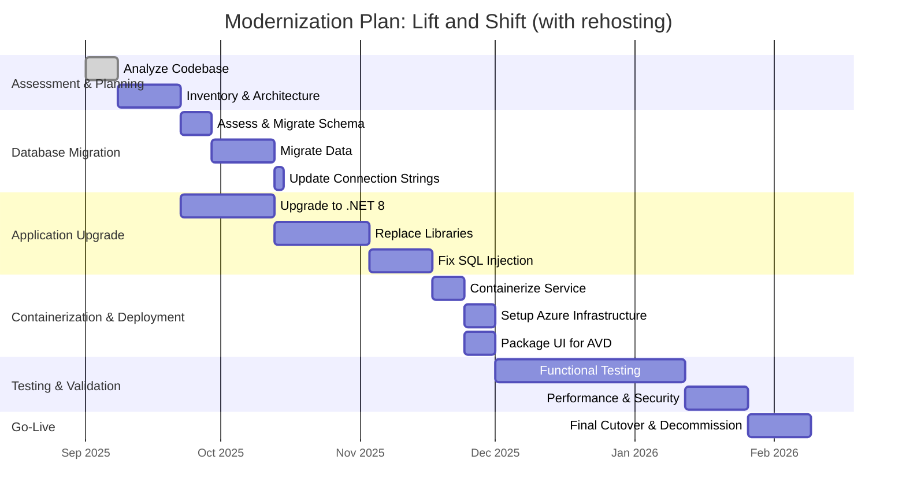

Figure 14 - Gantt chart for the recommended modernization plan.

## 14. Application porfolio management
This section provides an analysis of the application's components for portfolio management purposes.

### 14.1. IT Component types and attributes
The following table maps the application's components to the LeanIX IT Component model.

| IT Component Type | Name | Type | Version(s) | Provider(s) | Support start date | Support end date | Support end date (extended) | Support status |
| :--- | :--- | :--- | :--- | :--- | :--- | :--- | :--- | :--- |
| **Programming Language** | C# | Programming Language | 4.0 | Microsoft | 2010-04-12 | 2016-01-12 | N/A | ❌ Unsupported |
| **Programming Language** | VB.NET | Programming Language | 10.0 | Microsoft | 2010-04-12 | 2016-01-12 | N/A | ❌ Unsupported |
| **Web Framework** | .NET Framework | Web Framework | 4.0 | Microsoft | 2010-04-12 | 2016-01-12 | N/A | ❌ Unsupported |
| **Web Framework** | Windows Forms | Web Framework | 4.0 | Microsoft | 2010-04-12 | Follows OS | ✅ Supported |
| **Database** | Microsoft SQL Server | Database | 2008 R2 (inferred) | Microsoft | 2010-07-20 | 2014-07-08 | 2019-07-09 | ❌ Unsupported |
| **Operating System**| Windows Server | Operating System | 2008 R2 (inferred) | Microsoft | 2009-10-22 | 2015-01-13 | 2020-01-14 | ❌ Unsupported |
| **Development Tool**| Visual Studio | Development Tool | 2010 | Microsoft | 2010-04-12 | 2015-07-20 | 2020-07-14 | ❌ Unsupported |
| **Integration Platform**| SOAP Web Service | Integration Platform | 1.0 (inferred) | Internal | N/A | N/A | N/A | ✅ Supported |

### 14.2. Portfolio strategy
This section evaluates the application's position in the IT portfolio.

| Classification | Evaluation |
| :--- | :--- |
| **TIME Classification** | 🟠 **Tolerate/Invest**  The application performs a critical business function (remittance processing) and appears to be stable. However, its underlying technology is obsolete and carries significant security and maintenance risks. It should be tolerated in its current state only for a short period while an investment is made to modernize it. The business value is high, but the technical quality is low. |
| **6R Classification** | 🟠 **Replatform / Re-architect**  - **Rehost (Lift and Shift)**: Not recommended as a final state, as it does not address the underlying technical debt. - **Replatform**: The recommended strategy. This involves moving the application to a modern platform (e.g., .NET 8 on Azure) with minimal architectural changes, providing a good balance of cost and benefit. - **Re-architect**: The ideal long-term goal. Breaking the monolith into microservices would provide the most agility and scalability but comes with the highest cost and risk. This should be considered as a phase 2 after a successful replatforming. |

---
This application analysis was performed using Artificial Intelligence (AI). While AI enhances the process, it may still produce inaccuracies, and all results should be carefully reviewed.