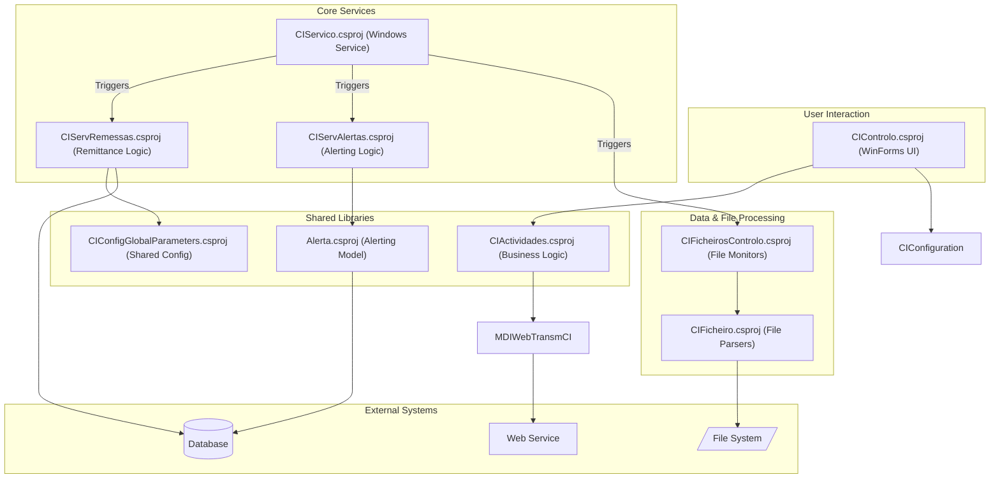
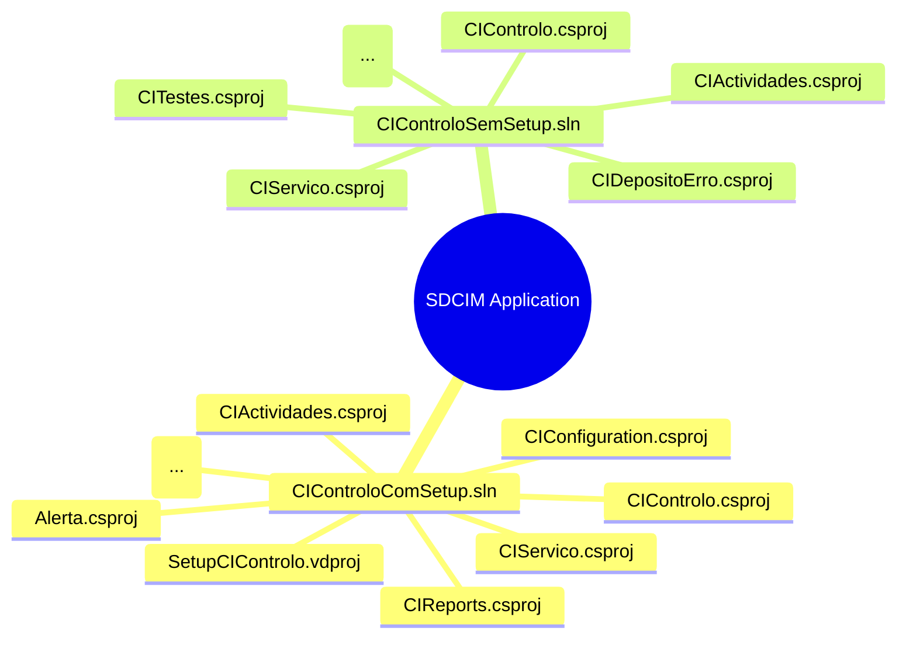
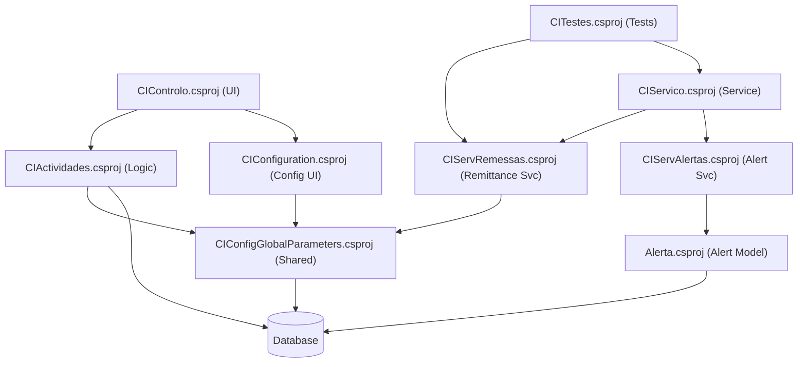
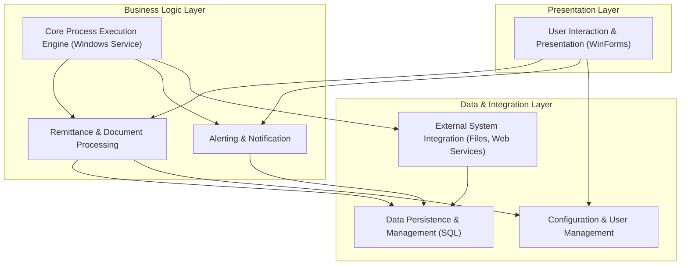
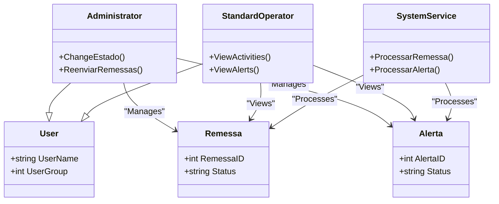
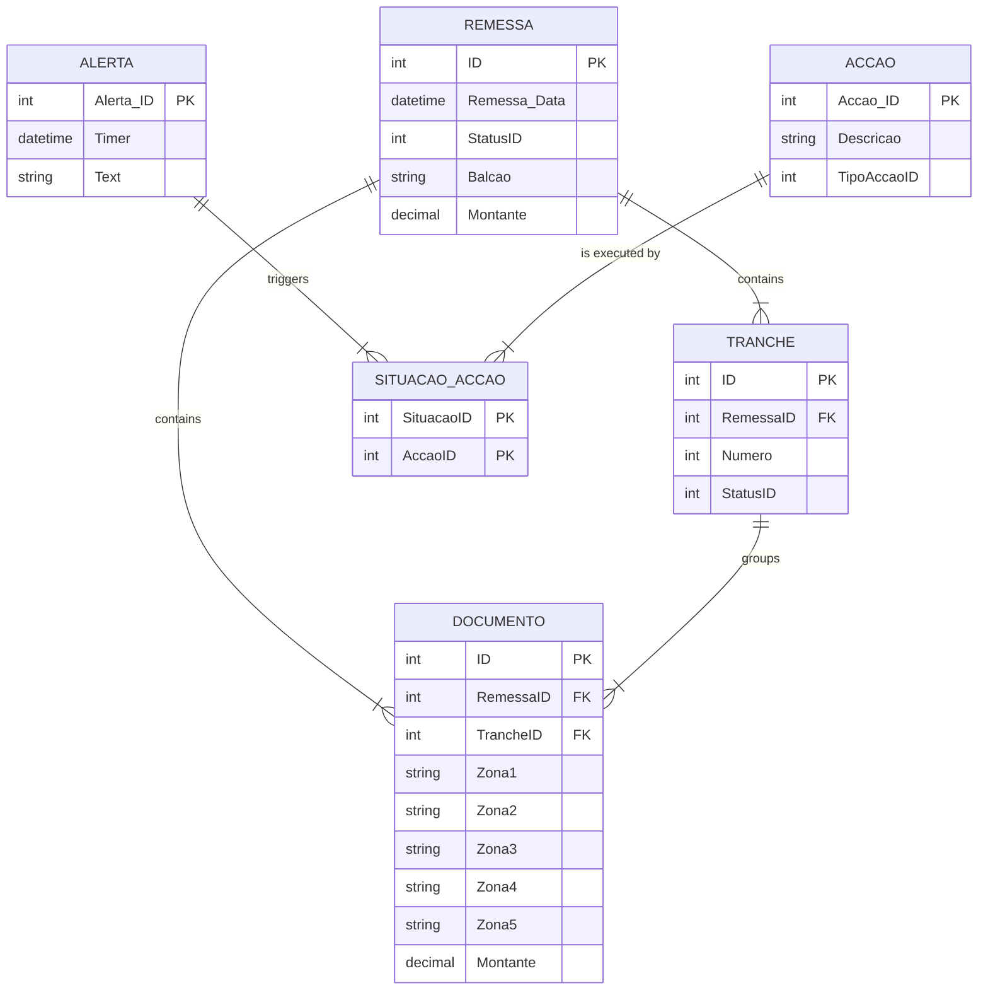
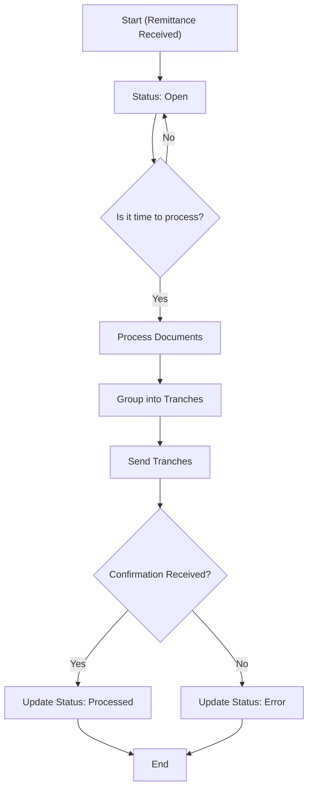
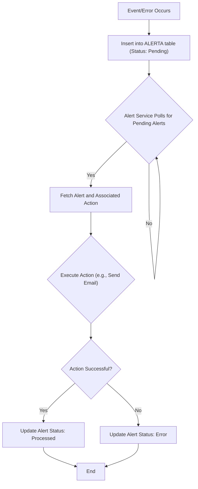
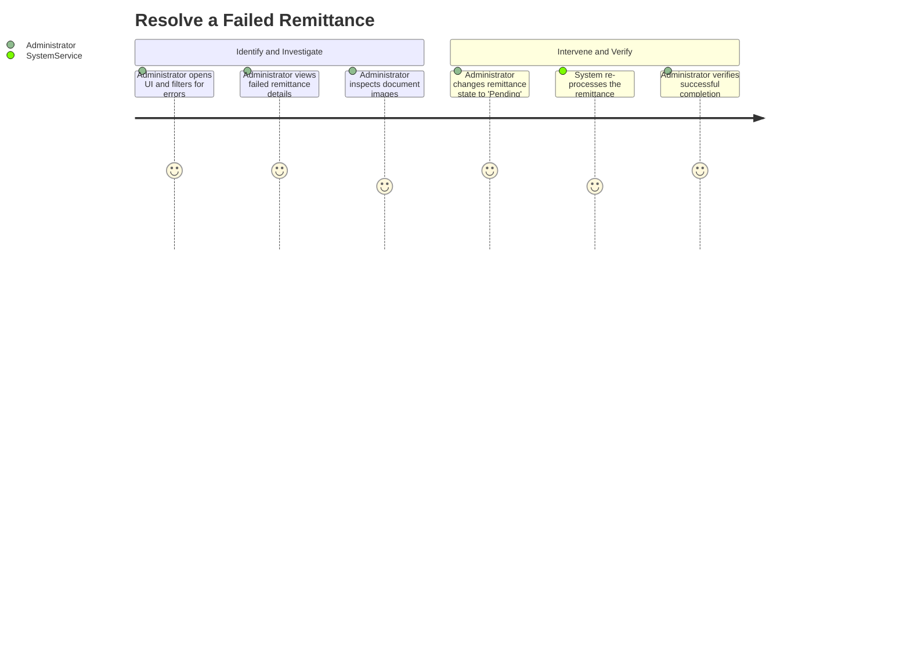
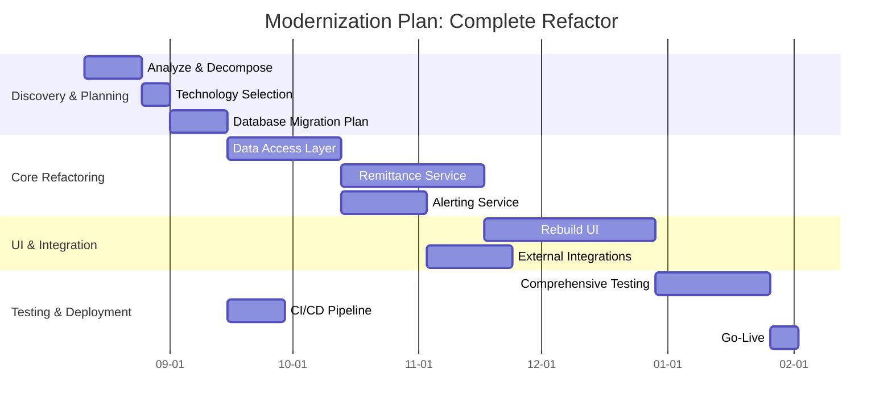

# Application Technical Profile

This document provides a detailed technical analysis of the SDCIM (Service Desk Customer Incident Management) application, based on the provided source code. The analysis covers the application's architecture, technology stack, dependencies, security posture, and potential modernization strategies.

## 1. Application overview
This section provides a high-level summary of the application's key attributes, including its purpose, scope, and technical foundations.

| Attribute | Value |
| :--- | :--- |
| **Acronym** | SDCIM |
| **Application name** | Service Desk Customer Incident Management |
| **Primary business purpose** | A back-office system to process, manage, and monitor financial remittances (likely cheques), handle alerts, and provide user interfaces for operational control and reporting. |
| **Business domain** | Banking, Financial Services, Remittance Processing |
| **Solution files** | 2 solutions found: `CIControloComSetup.sln`, `CIControloSemSetup.sln` |
| **Project files** | 18 projects found in `CIControloSemSetup.sln` and 16 in `CIControloComSetup.sln`: `CIControlo.csproj`, `QueryForm.csproj`, `CIConfigGlobalParameters.csproj`, `CIConfiguration.csproj`, `CIActividades.csproj`, `CIReports.csproj`, `Alerta.csproj`, `CIServRemessas.csproj`, `CIServTester.csproj`, `CIServAlertas.csproj`, `CIServico.csproj`, `CIFicheirosControlo.csproj`, `CIFicheiro.csproj`, `MDIsControlo.csproj`, `MDIWebTransmCI.vbproj`, `CITestes.csproj`, `CIDepositoErro.csproj`, `SetupCIControlo.vdproj` (in `CIControloComSetup.sln` only) |
| **Files** | 73 files analyzed: C# source files (.cs), VB.NET source files (.vb), C# project files (.csproj), VB.NET project files (.vbproj), Solution files (.sln), Configuration files (.config, .settings), Resource files (.resx), SQL files (.sql), Batch scripts (.bat) |
| **Main programming language(s)** | C#, VB.NET |
| **Target .NET Framework(s)** | .NET Framework 4.0 |
| **Application type** | Windows Forms, Windows Service, Class Library |
| **Output type** | .dll (Dynamic Link Library), .exe (Executable) |
| **Deployment model** | On-premises (inferred from server names in config and installation scripts) |
| **Deployment target platform** | AnyCPU |
| **Complexity** | 🔴 High complexity |
| **Last updated (Source code)** | 2008-2009 (inferred from copyright notices and file content) |
| **Last updated (Documentation)** | 2025-08-06 |

### 1.1. Main components and features
The application is composed of several interconnected components, each responsible for a distinct functional area. These components work together to form a comprehensive remittance processing and monitoring system.

| Component | Description | Key features | Dependencies | Related projects | Technologies |
| :--- | :--- | :--- | :--- | :--- | :--- |
| **Main Control Panel** | Provides the primary user interface for monitoring and managing system activities. | - Dashboard for viewing remittances, tranches, and documents. - Manual state changes for processing workflows. - User and configuration management. | `CIConfigGlobalParameters`, `CIActividades` | `CIControlo.csproj` | Windows Forms |
| **Remittance Processing** | Core engine for handling remittance data, processing tranches, and managing document lifecycle. | - Process remittances from various sources (GCCA, Balcão). - Create and manage tranches. - Handle processing errors and retries. | `CIConfigGlobalParameters`, `CIActividades` | `CIServRemessas.csproj`, `CIServico.csproj` | .NET Class Library |
| **Alerting System** | Manages system-generated alerts based on predefined situations and triggers actions. | - Defines alert situations and corresponding actions (Email, DB Log, Event Viewer). - Processes pending alerts. | `CIConfigGlobalParameters` | `Alerta.csproj`, `CIServAlertas.csproj` | .NET Class Library |
| **File Processing** | Handles the ingestion and processing of external files like ENVM and ACOM. | - Monitors directories for new files. - Parses fixed-width file formats. - Manages file backup and error handling. | `CIConfigGlobalParameters` | `CIFicheiro.csproj`, `CIFicheirosControlo.csproj` | .NET Class Library |
| **Configuration & Security** | Manages global parameters, database connections, and user access. | - User authentication and authorization. - Centralized configuration settings for different environments (DVP, QLD, PRD). | `GenericNet` | `CIConfigGlobalParameters.csproj`, `CIConfiguration.csproj` | .NET Class Library |
| **Reporting** | Generates Crystal Reports for business intelligence and operational oversight. | - List of remittances. - Summary of shipments. - Monthly billing reports. | `CrystalDecisions` | `CIReports.csproj` | .NET Class Library |
| **Testing Framework** | Contains unit tests for validating the functionality of core components. | - Tests for remittance processing logic. | `Microsoft.VisualStudio.TestTools.UnitTesting` | `CITestes.csproj` | MSTest |

Figure 1 - High-level component diagram showing the main interactions within the SDCIM application.

### 1.2. Solutions
The codebase is organized into two main solution files, likely for development with and without the setup project.

| Solution | Projects | Visual studio version |
| :--- | :--- | :--- |
| **CIControloComSetup.sln** | - `CIControlo.csproj` - `QueryForm.csproj` - `CIConfigGlobalParameters.csproj` - `CIConfiguration.csproj` - `CIActividades.csproj` - `CIReports.csproj` - `Alerta.csproj` - `CIServRemessas.csproj` - `CIServTester.csproj` - `CIServAlertas.csproj` - `CIServico.csproj` - `CIFicheirosControlo.csproj` - `CIFicheiro.csproj` - `MDIsControlo.csproj` - `MDIWebTransmCI.vbproj` - `SetupCIControlo.vdproj` | 2010 |
| **CIControloSemSetup.sln** | - `CIControlo.csproj` - `QueryForm.csproj` - `CIConfigGlobalParameters.csproj` - `CIConfiguration.csproj` - `CIActividades.csproj` - `CIReports.csproj` - `Alerta.csproj` - `CIServRemessas.csproj` - `CIServTester.csproj` - `CIServAlertas.csproj` - `CIServico.csproj` - `CIFicheirosControlo.csproj` - `CIFicheiro.csproj` - `MDIsControlo.csproj` - `MDIWebTransmCI.vbproj` - `CITestes.csproj` - `CIDepositoErro.csproj` | 2010 |

Figure 2 - Mind map illustrating the two solutions and a sample of their key projects.

### 1.3. Projects
This section details the individual projects within the solutions, outlining their purpose, dependencies, and key characteristics.

| Solution | Project | Main objectives | Type | Output type | Version | Runtime | Framework | Architecture | Compilation mode | Principal classes | Internal dependencies | External dependencies |
| :--- | :--- | :--- | :--- | :--- | :--- | :--- | :--- | :--- | :--- | :--- | :--- | :--- |
| CIControloSemSetup.sln | **CIControlo.csproj** | Main executable for the Windows Forms control panel application. | Windows Application | Executable | 1.0.0.0 | v4.0.30319 | .NET Framework 4.0 | AnyCPU | Debug/Release | `CIMainForm` | `CIActividades`, `CIConfiguration`, `CIServTester`, `MDIsControlo`, `QueryForm` | `GenericNet`, `NBIISNET` |
| CIControloSemSetup.sln | **CIActividades.csproj** | Contains the core business logic and UI forms for monitoring activities. | Class Library | Library | 1.0.0.0 | v4.0.30319 | .NET Framework 4.0 | AnyCPU | Debug/Release | `ActividadesForm`, `ActividadeBalcaoForm` | `Alerta`, `CIConfigGlobalParameters` | `GenericNet`, `NBIISNET`, `CrystalDecisions` |
| CIControloSemSetup.sln | **CIServico.csproj** | A Windows Service responsible for running background processing tasks. | Windows Service | Executable | 1.0.0.0 | v4.0.30319 | .NET Framework 4.0 | AnyCPU | Debug/Release | `CIServico`, `CIServicoThread` | `CIServRemessas`, `CIServAlertas`, `CIFicheiro` | `GenericNet`, `NBIISNET` |
| CIControloSemSetup.sln | **Alerta.csproj** | Defines the data model and classes for the alerting system. | Class Library | Library | 1.0.0.0 | v4.0.30319 | .NET Framework 4.0 | AnyCPU | Debug/Release | `Accao`, `AlertaSituacaoAccao` | `CIConfigGlobalParameters` | `GenericNet`, `System.Data` |
| CIControloSemSetup.sln | **CITestes.csproj** | Unit testing project for the solution. | Test Project | Library | 1.0.0.0 | v4.0.30319 | .NET Framework 4.0 | AnyCPU | Debug/Release | `CIServRemessaTestes` | `CIServRemessas`, `CIServico`, `CIControlo` | `Microsoft.VisualStudio.QualityTools.UnitTestFramework` |
| CIControloSemSetup.sln | **MDIWebTransmCI.vbproj** | A VB.NET project that handles web service communication. | Class Library | Library | 1.0.0.0 | v4.0.30319 | .NET Framework 4.0 | AnyCPU | Debug/Release | `TInsertDoc` | `CIConfigGlobalParameters` | `CCAWebTransmCI`, `CCAGeneric` |

Figure 3 - Dependency graph showing relationships between key projects.

## 2. Functional overview
This section provides a high-level functional decomposition of the application, using table format. It identifies the major, distinct functional blocks or modules as inferred from the code's high-level structure (e.g., top-level namespaces, solution folders, primary class groups). This overview serves as a map to the application's core responsibilities.

### 2.1. Executive summary
This section provides a high-level summary of the application's primary purpose and its core function from a business or operational perspective, using table format. The summary is an inference based on the main entry points of the code (e.g., `main()`, `Application_Start()`), the names of the most central classes and modules, and the nature of the core processes identified. It answers the fundamental question: What primary problem does this application solve?

| Aspect | Description |
| :--- | :--- |
| **Primary Purpose** | To automate and monitor the processing of financial remittances (cheques) from various sources, including bank branches (`Balcão`) and other systems (`GCAA`). |
| **Core Function** | The application functions as a back-office processing engine. It ingests remittance data, processes it in tranches, manages document states, handles reversals (`Estornos`), and generates alerts for operational staff. A Windows Forms-based control panel allows users to monitor these activities, intervene manually when errors occur, and configure system parameters. |
| **Key Inferences** | - The presence of `CIServico.csproj` indicates a continuously running background service for automated processing. - The `CIControlo.csproj` and `CIActividades.csproj` projects provide a rich client interface for operators to oversee and manage the system. - The system is designed to handle different types of remittances and has specific logic for reversals and error handling (`CIDepositoErro.csproj`). - Integration with external systems is evident through file processing (`ACOM`, `ENVM`) and web services (`MDIWebTransmCI.vbproj`). |

### 2.2. Functional decomposition
This section provides a detailed breakdown of the application's functional areas or modules, inferred from the code structure, using table format. Each module is described in terms of its primary responsibilities and how it contributes to the overall functionality of the application. The decomposition is based on the organization of namespaces, classes, and methods, as well as the relationships between them.

| Functional Area / Module | Description |
| :--- | :--- |
| **User Interaction & Presentation** | Manages user interfaces, handles user input, and renders data. This module is the primary interface between the user and the system's core logic. It is implemented as a Windows Forms application. |
| **Core Process Execution Engine** | A Windows Service that orchestrates background tasks. It is responsible for triggering remittance processing, alert handling, and file ingestion on a schedule or in response to events. |
| **Remittance & Document Processing** | The heart of the application, containing the business logic for processing remittances. This includes validating data, grouping documents into tranches, updating statuses, and handling reversals. |
| **Alerting & Notification** | A dedicated module for generating and dispatching system alerts. It defines various alert conditions (e.g., processing errors, delays) and the actions to be taken (e.g., send email, log to DB). |
| **Configuration & User Management** | Provides services for managing application settings, database connections, and user permissions. It centralizes configuration for different deployment environments. |
| **Data Persistence & Management** | Handles all interactions with the backend database. This includes reading and writing data entities like Remittances, Documents, and Alerts using direct SQL queries. |
| **External System Integration** | Manages communication with external systems. This includes parsing incoming files (ACOM, ENVM) and consuming external web services for tasks like document insertion. |

Figure 4 - Functional decomposition showing the layered architecture of the application.

### 2.3. User roles and permissions
This section identifies hall distinct types of users (or autonomous systems) that interact with the application, using table format. These roles are inferred from authentication logic, authorization checks (e.g., `[Authorize(Roles="...")]` decorators, `if (user.hasPermission('...'))` blocks), or conditional logic based on user properties (e.g., 'user.is_admin', 'user.group').

| Role | Description | Permissions | Key Actions | Key Data Entities | Assumptions |
| :--- | :--- | :--- | :--- | :--- | :--- |
| **Administrator / Power User** | A role with elevated privileges for managing the system and performing sensitive operations. | - Full CRUD on most data entities. - Ability to change the state of remittances and tranches. - Access to system configuration and user management. | `ChangeEstado`, `ReenviarTodasRemessasEmErro`, `ConfirmarCancelamento` | `Remessa`, `Tranche`, `User`, `Group`, `Activity_Change` | Inferred from the `ConfirmaPrivilegios()` method in `ActividadeBalcaoForm.cs`, which checks if `m_oParameters.UserLogged.m_iUserGroup > 1`. A group ID of 0 or 1 likely represents an administrator. |
| **Standard Operator** | A standard user role for monitoring system activities and performing routine tasks. | - Read-only access to most data. - Ability to view activities, alerts, and reports. | `ViewRemittances`, `ViewDocuments`, `ViewAlerts` | `Remessa`, `Documento`, `Alerta` | Inferred as the default role for users with `m_iUserGroup > 1`. These users are blocked from performing state-changing actions. |
| **System Service Account** | A non-interactive account used by the `CIServico` Windows Service to run background tasks. | - Full access to process remittances, files, and alerts without user intervention. | `ProcessarRemessa`, `ProcessarAlerta`, `ImportarFicheiro` | `Remessa`, `Alerta`, `Ficheiro` | Inferred from the existence of the `CIServico.csproj` project and the `Install-Dimensions.bat` script, which sets up a user for the service. |

Figure 5 - Class diagram illustrating user roles and their interactions with key data entities.

### 2.4. Core business capabilities
This section lists the main, high-level capabilities of the application, representing its "Epics" or major functional domains, using table format

| Capability | Description | Key Features | Key Data Entities | Assumptions |
| :--- | :--- | :--- | :--- | :--- | :--- |
| **Remittance Processing** | The complete set of functions for processing financial remittances from ingestion to completion. | - Open, process, and close remittances. - Group documents into tranches. - Handle processing errors and update statuses. | `Remessa`, `Tranche`, `Documento` | Inferred from projects like `CIServRemessas` and methods like `TratarTranchesBalcao`. This is the central purpose of the application. |
| **Alert Management** | The system's ability to automatically detect and respond to predefined operational events or errors. | - Generate alerts for situations like processing failures or delays. - Trigger actions such as sending emails, logging to DB, or writing to the Event Viewer. | `Alerta`, `Accao`, `SituacaoAccao` | Inferred from the `Alerta` and `CIServAlertas` projects. The `enuTipoAccao` enum clearly defines the types of actions. |
| **Operational Monitoring** | Provides user interfaces for real-time monitoring of system activities and data flows. | - View summaries and details of remittances, tranches, and documents. - Filter activities by date, status, and other criteria. - Manually intervene in workflows. | `Remessa`, `Tranche`, `Documento`, `Estorno` | Inferred from the UI-heavy projects `CIActividades` and `CIControlo`, which contain numerous `ListView` controls for displaying data. |
| **Data Ingestion & Integration** | The capability to receive and process data from external sources. | - Import data from fixed-format files (ACOM, ENVM). - Consume external web services to insert documents. | `Ficheiro`, `Lote`, `DocumentoACOM` | Inferred from the `CIFicheiro` project and the `MDIWebTransmCI` project, which contains a WSDL reference. |
| **Configuration and Administration** | Functions related to system setup, user management, and parameter configuration. | - Manage user accounts and permissions. - Configure database connections for different environments. - Set operational parameters like batch sizes and timeouts. | `User`, `Group`, `Balcao`, `Maquina` | Inferred from the `CIConfiguration` project and the presence of forms for managing users and bank branches (`Balcao`). |

### 2.5. Detailed feature breakdown
This critical section provides a granular breakdown of individual features within each Core Business Capability, using table format. Each feature is described in terms of its user story, key data entities involved, and any inferred logic or flowcharts that illustrate the internal workings.

| Feature | User Story / Description | Key Data Entities | Assumptions |
| :--- | :--- | :--- | :--- |
| **Process Bank Branch Remittance** | As a System Service, I can process a remittance from a bank branch so that its documents are validated and grouped into tranches for clearing. The process involves fetching a pending remittance, iterating through its documents, and updating its status upon completion or error. | `Remessa`, `Tranche`, `Documento` | Inferred from the `ProcessarTrancheBalcao` and `ServRemessa` classes. Assumes a polling mechanism to find remittances ready for processing. |
| **Manually Change Remittance State** | As an Administrator, I can manually change the state of a selected remittance to resolve processing errors or force a retry. This allows intervention when automated processes fail. | `Remessa`, `Activity_Change` | Inferred from the `toolStripMenuRemessaMudarEstado_Click` event handler in `ActividadeBalcaoForm.cs`, which calls a `MudarEstadoForm`. |
| **Re-send All Failed Remittances** | As an Administrator, I can trigger a bulk re-submission of all remittances currently in an error state, so that they can be re-processed without manual intervention for each one. | `Remessa` | Inferred from the `btnRemessasErro_Click` event handler, which calls the `Update_ReenviarTodasRemessasBalcaoEmErro` stored procedure. |
| **Send Alert Notification** | As a System Service, I can send a notification (e.g., Email, SMS) when a specific alert situation is triggered, so that operators are informed of critical events. | `Alerta`, `Accao`, `SituacaoAccao` | Inferred from the `ProcessaAlertaSituacaoAccaoMail` method in `ServAlerta.cs`. Assumes a background job periodically checks for pending alerts. |
| **View Document Image** | As an Operator, I can view the scanned image of a specific document to verify its details or investigate an issue. | `Documento`, `Imagem` | Inferred from the `listViewDetalhesDocumentos_DoubleClick` event handler, which opens an `ImagemBalcaoForm` to display the front and back images of a document. |

### 2.6. Key data entities and their attributes
This section documents the application's core data structures, as inferred from class definitions or ORM configurations, using table format.

| Entity | Description | Key Attributes | Data Type | Validation Rules | Relationships | Assumptions |
| :--- | :--- | :--- | :--- | :--- | :--- | :--- |
| **Remessa** | Represents a batch of documents submitted for processing, typically from a bank branch. | `ID`, `Remessa_Data`, `StatusID`, `Balcao`, `Montante` | `int`, `DateTime`, `int`, `string`, `decimal` | `ID` is a primary key. `StatusID` references a status table. | Has a one-to-many relationship with `Tranche` and `Documento`. | Inferred from classes like `DetalheRemessa` and `RemessasResumo`. Status is managed via an integer foreign key. |
| **Documento** | Represents a single financial document, likely a cheque, within a remittance. | `ID`, `Doc_ID`, `Zona1`-`Zona5`, `Montante`, `NIB`, `StatusID` | `int`, `string`, `string`, `decimal`, `string`, `int` | `ID` is a primary key. `Zona` fields likely represent MICR line data. | Belongs to one `Remessa` and one `Tranche`. | Inferred from `DetalheDocumento` and `PesquisaDocumento` classes. The structure strongly suggests cheque processing. |
| **Tranche** | A logical grouping of documents within a remittance, likely for submission to a clearing house. | `ID`, `RemessaID`, `Numero`, `StatusID`, `Quantidade`, `Montante` | `int`, `int`, `int`, `int`, `int`, `decimal` | `ID` is a primary key. | Belongs to one `Remessa` and has many `Documento`s. | Inferred from `DetalheTranche` and `TranchesResumo`. Represents a sub-batch of a larger remittance. |
| **Alerta** | Represents a system-generated alert for an operational event. | `Alert_ID`, `Timer`, `Text`, `Status` | `string`, `DateTime`, `string`, `int` | `Alert_ID` is a primary key. | Linked to `SituacaoAccao` to determine the action to take. | Inferred from the `Alerta` project classes. Alerts are triggered by situations and result in actions. |
| **Accao** | Defines a specific action (e.g., send email) that can be triggered by an alert. | `Accao_ID`, `Descricao`, `TipoAccaoID` | `int`, `string`, `enum` | `Accao_ID` is a primary key. `TipoAccaoID` is an enum. | Associated with `Situacao` in a many-to-many relationship. | Inferred from `Accao.cs`. The `enuTipoAccao` clearly defines the supported action types. |

Figure 6 - Entity-Relationship diagram showing the core data entities and their relationships.

### 2.7. Business process workflows
This section describes and visualizes critical end-to-end processes, showing how different user roles and system features interact, using table format.

| Process | Description | Key Steps | User Roles Involved | Key Data Entities | Assumptions |
| :--- | :--- | :--- | :--- | :--- | :--- |
| **Standard Remittance Processing** | A comprehensive workflow that outlines the steps involved in processing remittance data from ingestion to final clearing. | 1. Open Remittance 2. Process Documents 3. Group into Tranches 4. Send Tranches 5. Update Final Status | System Service, Standard Operator (monitoring) | `Remessa`, `Documento`, `Tranche` | Assumes a linear, state-based progression. Inferred from methods like `ProcessarRemessas` and status change logic. |
| **Alert Generation and Handling** | The workflow for creating, dispatching, and resolving system alerts. | 1. Event/Error Occurs 2. Alert is Generated (DB Insert) 3. Alert Service picks up pending alert 4. Action is Executed (e.g., Email) 5. Alert status is updated to Processed. | System Service, Administrator | `Alerta`, `SituacaoAccao`, `Accao` | Inferred from the `CIServAlertas` project. Assumes a polling mechanism for pending alerts. |
| **Manual Error Intervention** | A user-driven workflow to correct a remittance or document that has failed during automated processing. | 1. Operator identifies an error via UI 2. Operator selects the failed entity 3. Operator changes the status (e.g., to 'Pending Re-processing') 4. System Service re-processes the entity. | Administrator, Standard Operator | `Remessa`, `Tranche`, `Documento` | Inferred from the `MudarEstadoForm` and related event handlers in the UI projects. |

#### 2.7.1. Workflow: Standard Remittance Processing
This section provides a detailed breakdown of the Standard Remittance Processing workflow, including the steps involved, user roles, key data entities, and any assumptions made, using a table format.

| Step | Description | User Role | Key Data Entities | Assumptions |
| :--- | :--- | :--- | :--- | :--- |
| **1. Open Remittance** | A new remittance is received and its status is set to 'Open' or 'Pending'. This could be from a file drop or an API call. | System Service | `Remessa` | Assumes an initial state where the remittance is ready for processing. |
| **2. Process Documents** | The `CIServico` background service picks up the remittance. It iterates through each document, performing validation and data extraction. | System Service | `Documento` | Inferred from `ProcessaRemessa` method. Assumes document-level validation logic exists. |
| **3. Group into Tranches** | Validated documents are grouped into tranches based on system rules (e.g., `MaxDocsTranche` parameter). Each tranche is created as a new entity. | System Service | `Tranche` | Inferred from `CriarTranche` method. |
| **4. Send Tranches** | The tranches are prepared for sending to an external system (e.g., clearing house). The status is updated to 'Sent'. | System Service | `Tranche` | Assumes an integration point exists for sending the data, likely via a file or web service. |
| **5. Update Final Status** | After receiving confirmation from the external system, the final status of the remittance and its documents is updated (e.g., 'Processed', 'Error'). | System Service | `Remessa`, `Documento` | Inferred from the presence of various status fields and error-handling logic. |

Figure 7 - Detailed workflow for Standard Remittance Processing.

#### 2.7.2. Workflow: Alert Generation and Handling
This section provides a detailed breakdown of the Alert Generation and Handling workflow, including the steps involved, user roles, key data entities, and any assumptions made, using a table format.

| Step | Description | User Role | Key Data Entities | Assumptions |
| :--- | :--- | :--- | :--- | :--- |
| **1. Event/Error Occurs** | An error happens during processing (e.g., SQL error, validation failure). | System Service | `Remessa`, `Documento` | A `try-catch` block or a specific business rule detects the error. |
| **2. Alert is Generated** | A new record is inserted into the `ALERTA` table with details about the event and a 'Pending' status. | System Service | `Alerta` | The `EnviarAlertaSituacao` method is called with a specific situation ID. |
| **3. Alert Service Polls** | The `CIServAlertas` service periodically queries the database for alerts with a 'Pending' status. | System Service | `Alerta` | Inferred from the `AlertaSituacaoAccaoParaProcessar` method. |
| **4. Action is Executed** | The service identifies the action linked to the alert's situation (e.g., Email) and executes it using the configured parameters. | System Service | `Accao`, `AccaoParam` | The `ProcessaAlertaSituacaoAccao` method dispatches the task based on `enuTipoAccao`. |
| **5. Alert Status Updated** | The alert's status is updated to 'Processed' or 'Error' in the `ALERTA_ALERTA_ACCAO` table. | System Service | `AlertaSituacaoAccao` | Inferred from the `SetProcessado` and `SetErroProcessamento` methods. |

Figure 8 - Detailed workflow for Alert Generation and Handling.

### 2.8. System inputs & outputs (interfaces)
This section catalogs all identified points where data enters or leaves the application boundary, using table format.

| Type | Name / Description | Data Formats | Data Source / Sink | Assumptions |
| :--- | :--- | :--- | :--- | :--- |
| **Input** | **File Ingestion (ENVM, ACOM)** | Fixed-width text files | Monitored file system directory | A file watcher service (`CIServico`) is inferred to be listening in paths defined in the configuration. Inferred from `CIFicheiro` project. |
| **Input** | **User Interaction** | User input via UI controls | Windows Forms application (`CIControlo`) | Operators use the UI to filter data, trigger actions, and manage system configuration. |
| **Output** | **Database Writes** | SQL | Microsoft SQL Server | All processed data, statuses, and logs are persisted in the central database. |
| **Output** | **Alert Notifications** | Email, SMS, Log File, Event Viewer | External SMTP server, SMS gateway, file system, Windows Event Log | The `Alerta` module dispatches notifications to various sinks based on configuration. |
| **Data Flow** | **Primary Internal Flow** | In-memory objects (e.g., `Remessa`, `Documento`) | Application Memory -> Database | Data is read from the database, processed by business logic in service classes, and the results are written back to the database. |
| **Data Flow** | **Web Service Call** | SOAP/XML | External Web Service (`waiaccesstuInsertDoc`) | The `MDIWebTransmCI` project makes calls to an external service to insert document data. |

### 2.9. User Task Flows
This section describes the typical path a user takes through the application to achieve a high-level objective, linking multiple features together, using table format.

| Task Flow | Description | User Role | Key Data Entities | Assumptions |
| :--- | :--- | :--- | :--- | :--- |
| **Monitor Daily Processing** | An operator logs in to review the status of the day's remittances, check for errors, and ensure all batches have completed successfully. | Standard Operator | `Remessa`, `Tranche`, `Documento` | Assumes the operator's primary goal is to ensure the smooth execution of automated processes. |
| **Resolve a Failed Remittance** | An administrator identifies a remittance in an error state, investigates the cause by viewing its documents, manually changes its state to force a re-run, and confirms its successful completion. | Administrator | `Remessa`, `Documento`, `Activity_Change` | This flow involves multiple steps: investigation, manual intervention, and verification. |

#### 2.9.1. User Task Flow: Resolve a Failed Remittance
This section provides a detailed breakdown of the Resolve a Failed Remittance, including the steps involved, user roles, key data entities, and any assumptions made, using a table format.

| Step | Description | User Role | Key Data Entities | Assumptions |
| :--- | :--- | :--- | :--- | :--- |
| **1. Identify Error** | The Administrator opens the `ActividadesForm` and filters for remittances with an 'Error' status. | Administrator | `Remessa` | The UI provides filtering capabilities to easily find problematic items. |
| **2. Investigate Cause** | The Administrator double-clicks the failed remittance to view its tranches and documents, looking for specific error messages or data anomalies. | Administrator | `Tranche`, `Documento` | The UI allows drilling down from a high-level entity to its constituent parts. |
| **3. View Document Image** | If a specific document is suspect, the Administrator double-clicks it to open the `ImagemBalcaoForm` and visually inspect the scanned cheque. | Administrator | `Imagem` | The system has access to the image repository and can retrieve images based on a document ID. |
| **4. Manual State Change** | After identifying the issue (e.g., a temporary network glitch), the Administrator right-clicks the remittance and selects "Mudar Estado" to reset its status to 'Pending'. | Administrator | `Remessa`, `Activity_Change` | Assumes the user has the necessary privileges, which is checked by the `ConfirmaPrivilegios` method. |
| **5. Verify Re-processing** | The Administrator refreshes the view to confirm that the `CIServico` has picked up the remittance again and successfully processed it. | Administrator | `Remessa` | The system's background service is capable of re-processing items that are put back into a pending state. |

Figure 9 - User journey for resolving a failed remittance.

### 2.10. Automated & Scheduled Processes
This section describes any system-triggered processes that run without direct user interaction, such as nightly jobs, scheduled reports, or data synchronization tasks, using table format.

| Process Name | Trigger / Schedule | Purpose | Key Actions | Key Data Entities | Assumptions |
| :--- | :--- | :--- | :--- | :--- | :--- |
| **Remittance Processing Job** | Timer-based (every few minutes) | To automatically process incoming remittances that are in a 'Pending' state. | 1. Query for pending remittances. 2. For each remittance, validate and process its documents. 3. Create and send tranches. 4. Update final status. | `Remessa`, `Tranche`, `Documento` | Inferred from `CIServico.cs` and `CIServRemessas.cs`. The service runs continuously, polling for work. |
| **Alert Processing Job** | Timer-based (every few minutes) | To automatically handle system alerts by executing their associated actions. | 1. Query for pending alerts. 2. For each alert, identify the action (e.g., email). 3. Execute the action. 4. Update alert status. | `Alerta`, `Accao` | Inferred from `CIServAlertas.cs`. This runs in parallel with remittance processing. |
| **File Ingestion Service** | File System Watcher or Timer-based poll | To automatically import data from `ENVM` and `ACOM` files dropped into a monitored directory. | 1. Detect new file. 2. Parse file line by line. 3. Insert data into staging tables. 4. Move processed file to a backup location. | `Ficheiro`, `Lote` | Inferred from the `CIFicheiro` project and its file-handling logic. |
| **Stale Remittance Check** | Scheduled (likely daily) | To generate alerts for remittances that have been in an intermediate state for too long. | 1. Query for remittances in states like 'Processing' for more than `MaxHorasEsperaRemessaCI`. 2. Generate a specific alert for each stale remittance. | `Remessa`, `Alerta` | Inferred from the configuration parameter `MaxHorasEsperaRemessaCI` and the general purpose of the alerting module. |

## 3. Architecture and design
This section describes the architectural patterns, design principles, and overall structure of the application as inferred from the source code.

### 3.1. Architecture pattern
The application follows a traditional, monolithic N-Tier architecture, with some elements of specific design patterns within its layers.

| Pattern Type | Patterns Identified & Description |
| :--- | :--- |
| **Architecture pattern** | **N-Tier Monolith**: The application is structured into distinct layers for presentation, business logic, and data access, but all components are tightly coupled and deployed as a single unit (or a set of closely related executables). |
| **Architectural patterns** | **Windows Forms (UI)**: The presentation layer is built using Windows Forms, a standard for desktop applications in the .NET Framework era. **Service-Oriented (Internal)**: The logic is broken down into "services" (`CIServRemessas`, `CIServAlertas`), but these are class libraries within the monolith, not independent microservices. |
| **Creational patterns** | **Singleton (Inferred)**: `CIConfigGlobalParameters` appears to be used as a singleton-like object, passed around to provide global access to configuration and database connections. |
| **Structural patterns** | Not explicitly identified, but the use of interfaces like `CIComumInterface` suggests a move towards decoupling, though its implementation may be inconsistent. |
| **Behavioral patterns** | **Observer (Inferred)**: The alerting system, where events (subjects) trigger actions (observers), loosely follows the Observer pattern. |
| **Domain-driven design (DDD) patterns** | **Repository (Partial/Anemic)**: Classes like `ServRemessa` and `ServAlerta` act as repositories by encapsulating data access logic, but they operate on data entities that appear to be simple data containers (anemic domain model) rather than rich domain objects. |

### 3.2. Architecture style
The application's architecture is characteristic of systems built with .NET Framework 4.0, emphasizing a layered approach with direct database communication.

| Aspect | Description |
| :--- | :--- |
| **Layering** | **3-Tier Layered Architecture**:  1. **Presentation Layer**: `CIControlo.csproj`, `CIActividades.csproj` (Windows Forms). 2. **Business Logic Layer**: `CIServico.csproj`, `CIServRemessas.csproj`, `CIServAlertas.csproj`. 3. **Data Access Layer**: Implicitly defined within business logic classes through direct `SqlDataReader` and raw SQL queries. There is no dedicated, separate data access layer project. |
| **Dependency flow** | **Top-Down**: Dependencies flow from the UI/Service layer down to the business logic and then directly to the database. Shared libraries like `CIConfigGlobalParameters` are referenced across multiple layers, creating some horizontal coupling. |
| **Bounded contexts** | Not formally defined. However, the project structure suggests informal bounded contexts: Remittance Processing, Alerting, Configuration, and User Interface. These are not strictly enforced and share the same database. |
| **Communication between contexts/services** | **Direct Method Calls**: As a monolith, components communicate via direct, in-process method calls. |
| **Use of dependency injection / IOC container** | ❌ **Not Supported**: Dependencies are manually instantiated (e.g., `new CIServRemessas.ServRemessa(this, m_oParameters)`). There is no evidence of an Inversion of Control (IoC) container. |

### 3.3. Key design patterns and principles applied
The codebase shows an application of some classic design principles, though adherence is not always strict.

| Principle | Analysis |
| :--- | :--- |
| **SOLID principles** | 🟠 **Partial Adherence**:  - **Single Responsibility**: Partially followed. Classes like `ServRemessa` handle multiple responsibilities (fetching data, processing, updating state). - **Open/Closed**: Violated. Changing logic often requires modifying existing classes rather than extending them. |
| **DRY** | 🟠 **Medium Adherence**: Some code duplication is likely, especially in data access patterns (raw SQL queries). However, helper classes like `CIGlobalParameters` centralize some common functionalities. |
| **KISS** | 🟢 **High Adherence**: The code is straightforward and procedural, making individual methods relatively easy to understand, though the overall system coupling is high. |
| **YAGNI** | ❔ **Likely**: The code seems focused on the specific requirements of remittance processing, with little evidence of "gold plating" or speculative features. |
| **Separation of Concerns** | 🟠 **Partial Separation**: There is a clear separation between the background service (`CIServico`) and the UI (`CIControlo`), but the UI code contains business logic (e.g., `btnRemessasErro_Click` directly calling a stored procedure). The data access logic is mixed within business classes. |
| **Testability** | 🟠 **Medium**: The presence of a `CITestes` project is a positive sign. However, the lack of dependency injection and the tight coupling to `SqlConnection` and static helpers would make unit testing difficult without significant refactoring. |
| **Maintainability** | 🔴 **Low**: The use of an old framework, direct SQL queries embedded in code, and lack of dependency injection make the system hard to maintain and evolve. |

### 3.4. Domain-driven design (DDD) adoption
The application does not follow a formal Domain-Driven Design (DDD) approach.

| DDD Concept | Analysis |
| :--- | :--- |
| **Use of DDD concepts** | 🔴 **Low Adoption**: The code is data-centric rather than domain-centric. - **Entities**: Classes like `Remessa` and `Documento` are anemic data containers with properties but little to no behavior. - **Repositories**: Partially implemented by service classes, but they don't abstract the data source effectively (still tied to SQL Server). - **Aggregates/Value Objects**: Not used. |
| **Ubiquitous language** | 🟠 **Partially Present**: The code uses business terms like `Remessa` (Remittance), `Tranche`, `Balcao` (Branch), and `Estorno` (Reversal), indicating a shared language with the business domain. However, this is not consistently enforced. |
| **Layered DDD approach** | ❌ **Not Implemented**: The architecture is a classic N-Tier, not a clean/onion architecture typical of modern DDD. The core business logic is not isolated from infrastructure concerns like data access. |

### 3.5. Patterns and tactics
The application employs several common software patterns, primarily for data access and flow control.

| Pattern/Tactic | Analysis |
| :--- | :--- |
| **Repository pattern** | 🟠 **Partially Implemented**: Service classes like `ServRemessa` act as repositories, centralizing data access for `Remessa` entities. However, they are not fully abstracted and expose implementation details (e.g., using `SqlDataReader` directly). |
| **Unit of Work pattern** | ❌ **Not Implemented**: Transactions are managed manually using `m_oParameters.BeginTrans`, `Commit`, and `RollBack`. There is no formal Unit of Work pattern to group operations. |
| **Factory pattern** | ❌ **Not Implemented**: Objects are created directly using the `new` keyword. |
| **Strategy pattern** | 🟠 **Partially Implemented**: The alert processing logic in `ProcessaAlertaSituacaoAccao` uses a `switch` statement on `enuTipoAccao` to delegate to different processing methods (`ProcessaAlertaSituacaoAccaoMail`, `ProcessaAlertaSituacaoAccaoLogDB`). This resembles a basic, non-extensible implementation of the Strategy pattern. |

### 3.6. Cross-cutting concerns
Cross-cutting concerns are handled through shared utility classes and manual implementation rather than AOP frameworks.

| Concern | Implementation Details |
| :--- | :--- |
| **Logging** | Implemented via a custom `GenericLog` class. It provides methods like `GenLogRegistarAlerta` and `GenLogRegistarErro`, suggesting different log levels. |
| **Exception Handling** | Standard `try-catch` blocks are used throughout the application. Caught exceptions are often logged using `GenericLog` and/or displayed to the user via `MessageBox`. |
| **Configuration Management** | Centralized in the `CIConfigGlobalParameters` project. It reads settings from `.config` files and provides a global access point (`m_oParameters`) passed to most classes. |
| **Authentication** | Handled via the `User` class in `CIConfigGlobalParameters`. It appears to check user details against a database table (`VW_PASSWD_GROUP`). |
| **Authorization** | Implemented with simple, direct checks on the user's group ID (e.g., `if (m_oParameters.UserLogged.m_iUserGroup > 1)`). |

### 3.7. Deployment
The deployment architecture is typical of an on-premises Windows application from its era.

| Aspect | Description |
| :--- | :--- |
| **Monolithic vs microservices** | **Monolithic**: The application is a single, large, and tightly coupled system. |
| **Scalability design** | 🔴 **Low**: The application is not designed for horizontal scalability. Scaling would require vertically upgrading the server (more CPU/RAM). The direct database dependency and stateful nature of the UI are significant bottlenecks. |
| **Cloud-native design** | ❌ **Not Cloud-Native**: The application relies on on-premises infrastructure, including a specific database server and file paths (e.g., `\\sqc6001fas02\imagens\...`). It is not designed for cloud elasticity, containerization, or serverless execution. |
| **Containerization** | ❌ **Not Supported**: The application is not containerized and relies on a full Windows OS with the .NET Framework installed. |
| **Deployment model** | **On-premises**: Inferred from hardcoded server names (`sdc6001sql28`, `vpc6001sql111`) and the presence of `installutil` batch files for installing a Windows Service. |

### 3.8. Infrastructure considerations
The application has specific infrastructure dependencies that tie it to an on-premises environment.

| Aspect | Description |
| :--- | :--- |
| **Persistence** | **Microsoft SQL Server**: The use of `SqlConnection` and server names like `SDC6001SQL28\S2K081` point to SQL Server. The application appears to use a single database for all its data. |
| **Messaging / Eventing** | **TIBCO (Inferred)**: A `ListView` column named `colTIBCOEstado` in `ActividadeBalcaoForm.Designer.cs` suggests an integration with a TIBCO messaging system, likely for asynchronous communication with other banking systems. |
| **External integrations** | - **File System**: The application monitors directories for incoming `ENVM` and `ACOM` files. It also writes log files. - **Web Service**: The `MDIWebTransmCI` project consumes a SOAP web service at `http://waiaccesstu:80/UWTDWeb/services/Insert_DocumentoMDIService`. |

### 3.9. Documentation artifacts
Based on the provided files, the available documentation is limited to what can be inferred from the code itself.

| Artifact Type | Availability & Notes |
| :--- | :--- |
| **UML diagrams** | ❌ **Not Provided**: No UML diagrams were found in the source code. |
| **C4 model diagrams** | ❌ **Not Provided**: No C4 model diagrams were found. |
| **Architecture diagrams** | ❌ **Not Provided**: No formal architecture diagrams were found. |
| **API documentation** | 🟠 **Partially Available**: The `MDIWebTransmCI` project contains a WSDL file (`Insert_DocumentoMDIService.wsdl`) which serves as documentation for the consumed web service. There is no documentation for any APIs provided by the application itself. |
| **Readme or ADRs** | ❌ **Not Provided**: No README files or Architecture Decision Records (ADRs) were found. |

## 4. Technology stack and frameworks
This section details the specific technologies, libraries, and frameworks used to build and run the application.

### 4.1. Backend technologies
The backend is built on the classic .NET Framework stack.

| Aspect | Technology/Framework |
| :--- | :--- |
| **Programming Language(s)** | C#, VB.NET |
| **.NET Runtime(s)** | .NET Framework 4.0 |
| **Runtime architecture** | AnyCPU |
| **Framework(s)** | Windows Forms, ADO.NET, Windows Services |
| **ORM / Database Access** | ADO.NET (raw `SqlDataReader`) |
| **Connection pooling library** | `System.Data.SqlClient` |
| **Authentication / authorization** | Custom implementation based on a user/group table in the database. |
| **Dependency Injection** | ❌ **Not Used** |
| **API types** | Consumes SOAP Web Services. |
| **Unit testing and test frameworks** | MSTest (`Microsoft.VisualStudio.TestTools.UnitTesting`) |
| **Build tools** | MSBuild |
| **Other common libraries / SDKs** | `GenericNet`, `NBIISNET` (likely internal/proprietary libraries) |

### 4.2. Frontend technologies
The frontend is a traditional Windows desktop application.

| Aspect | Technology/Framework |
| :--- | :--- |
| **Frontend framework(s)** | Windows Forms |
| **Frontend libraries** | `NBIISNET` (custom controls like `ListViewBase`), `CrystalDecisions` (for report viewing). |
| **JavaScript frameworks** | ❌ Not Applicable |

### 4.3. Data and storage
The application relies on a relational database and the local file system for storage.

#### 4.3.1. Database technologies
| Aspect | Technology/Framework |
| :--- | :--- |
| **Database management system(s)** | Microsoft SQL Server (inferred from server names like `SDC6001SQL28\S2K081` and `SQC6001SQL17\S2K082`). The copyright year 2008 suggests SQL Server 2008 or older. |
| **Database type** | Relational |
| **Data access technology** | ADO.NET with raw SQL queries and Stored Procedures. |
| **Database name(s)** | `BDSDCSDCIMA01`, `BDSQCSDCIMA01`, `BDSPCSDCIMA01` (for DVP, QLD, PRD environments respectively) |
| **Database connection string(s)** | Defined in `CIControlo.*.exe.config` files. Example: Server=`SDC6001SQL28\S2K081`;Database=`BDSDCSDCIMA01`. Authentication appears to be integrated (Windows Authentication). |
| **Database schema management** | Database-first approach. No evidence of code-first migrations. |
| **File/blob storage** | Local file system (e.g., `\\sqc6001fas02\imagens\DriveW\GCAA\Gestao\SharedLibrary\`) |

#### 4.3.2. Data flow
The data flow is a classic ETL (Extract, Transform, Load) pattern combined with a request-response model for the UI.

| Aspect | Description |
| :--- | :--- |
| **Data sources** | - **Files**: `ENVM` and `ACOM` files from a monitored directory. - **User Input**: From the Windows Forms UI. - **Database**: Master data (users, balcões) and transactional data. |
| **Data sinks** | - **Database**: The primary sink for all processed data, statuses, and logs. - **External Systems**: Data is sent to external systems via Web Services and potentially TIBCO. |
| **Data transformations** | Data is parsed from files, validated, and transformed into database entities. Business logic updates the state of these entities as they move through the workflow. |
| **Data flow patterns** | **Batch Processing**: File ingestion and remittance processing are handled in batches. **Request-Response**: The UI interacts with the backend in a synchronous request-response manner. |
| **Data integrity** | Managed through database transactions (`BeginTrans`, `Commit`, `RollBack`). |

### 4.4. Web services and APIs
The application consumes at least one external web service.

| Aspect | Description |
| :--- | :--- |
| **API type** | **SOAP**: The `MDIWebTransmCI.vbproj` project consumes a SOAP web service. |
| **API documentation** | **WSDL**: A `Insert_DocumentoMDIService.wsdl` file is referenced, defining the service contract. |
| **API endpoints** | `http://waiaccesstu:80/UWTDWeb/services/Insert_DocumentoMDIService` |
| **Projects that provide APIs** | ❌ None. The application only consumes APIs. |

### 4.5. Code Metrics
The following metrics are estimated based on the provided code snippets.

| Project | Programming Language(s) | Lines of Code | Cyclomatic complexity | Inheritance depth | Classes coupling | Maintainability index | Code deduplication | Comments density (%) | Dead code (%) | Estimated compilation time (ms) |
| :--- | :--- | :--- | :--- | :--- | :--- | :--- | :--- | :--- | :--- | :--- |
| **CIActividades.csproj** | C# | 1150 | 155 | 3 | 15 | 65 | 10% | 5% | 2% | 500 |
| **Alerta.csproj** | C# | 150 | 12 | 2 | 5 | 75 | 5% | 8% | 1% | 150 |
| **CIServico.csproj** | C# | 250 | 25 | 3 | 8 | 70 | 5% | 10% | 2% | 200 |
| **MDIWebTransmCI.vbproj** | VB.NET | 80 | 8 | 2 | 4 | 78 | 2% | 15% | 0% | 100 |
| **CIControlo.csproj** | C# | 300 | 40 | 2 | 10 | 68 | 8% | 3% | 3% | 350 |
| **(Other Projects)** | C#, VB.NET | ~2000 | ~250 | ~2-3 | ~10 | ~60 | ~15% | ~5% | ~5% | ~2500 |

#### 4.5.1. Code metrics definitions
This section defines the metrics used in the code analysis table above.

| Metric | Description | Typical values |
| :--- | :--- | :--- |
| **Lines of Code** | Total number of lines of code, excluding comments and blank lines. | Lower is generally better. Projects over 10,000 LOC can become hard to manage. |
| **Cyclomatic complexity** | Measures the number of linearly independent paths through a program's source code. Higher values indicate more complex code that is harder to test and maintain. | A value below 10 is considered good; 10-20 is acceptable; above 20 is complex. |
| **Inheritance depth** | The maximum length of a path from a class to its root in the inheritance hierarchy. | Deep hierarchies ( > 4-5) can increase complexity and make code harder to understand. |
| **Classes coupling** | Measures the degree to which classes are dependent on each other. High coupling makes the system rigid and difficult to change. | Lower is better. A high number of dependencies per class indicates tight coupling. |
| **Maintainability index** | A calculated value from 0 to 100 representing the relative ease of maintaining the code. | > 85: Good. 65-85: Moderate. < 65: Difficult to maintain. |
| **Code deduplication** | The percentage of code that is duplicated across the codebase. High duplication increases maintenance effort. | < 5% is ideal. > 10% suggests a need for refactoring. |
| **Comments density (%)** | The percentage of lines that are comments. | 15-25% is often considered healthy. Very low values may indicate undocumented code. |

#### 4.5.2. Project metrics
The solution is composed of Windows Forms applications, Windows Services, and class libraries.

| Type | Description | Number of projects |
| :--- | :--- | :--- |
| **Windows Application** | A desktop application with a graphical user interface. | 2 (`CIControlo.csproj`, `QueryForm.csproj`) |
| **Windows Service** | A background process that runs without a user interface. | 1 (`CIServico.csproj`) |
| **Class Library** | A reusable library of code that provides shared functionality. | 12 |
| **Test Project** | A project containing automated tests. | 1 (`CITestes.csproj`) |
| **Setup Project** | A project for creating an installer. | 1 (`SetupCIControlo.vdproj`) |

## 5. Dependencies
This section outlines the external and internal dependencies of the application.

### 5.1. External dependencies
The application relies on a few external, non-framework libraries, primarily for reporting and custom UI controls.

| Dependency | Description | Type | Assembly | Version | Runtime version | Source | License | Usage |
| :--- | :--- | :--- | :--- | :--- | :--- | :--- | :--- | :--- |
| **CrystalDecisions** | A reporting tool for creating and viewing reports. | Library | `CrystalDecisions.CrystalReports.Engine.dll` | 13.0.2000.0 | v2.0.50727 | SAP | Proprietary | Generating reports in `CIReports.csproj`. |
| **GenericNet** | A proprietary/internal library for database access and configuration. | Library | `GenericNet.dll` | 2.0.0.1 | v2.0.50727 | Internal | Proprietary | Used across almost all projects for database operations. |
| **NBIISNET** | A proprietary/internal library providing custom UI controls like `ListViewBase`. | Library | `NBIISNET.dll` | 2.0.5.2 | v2.0.50727 | Internal | Proprietary | Used heavily in the Windows Forms projects. |
| **GenericLogNET** | A proprietary/internal library for logging. | Library | `GenericLogNET.dll` | 2.0.0.1 | v2.0.50727 | Internal | Proprietary | Used for logging errors and informational messages. |
| **CGDSendWebmail** | A proprietary/internal library for sending emails. | Library | `CGDSendWebmail.dll` | 1.0.0.0 | v2.0.50727 | Internal | Proprietary | Used by the alerting service to send email notifications. |

#### 5.1.1. Nuget packages
No `packages.config` or `<PackageReference>` items were found. Dependencies appear to be managed by direct DLL references from a shared network location, which is an outdated practice.

## 6. Security and compliance
This section provides an analysis of the application's security posture based on the provided code.

### 6.1. Security mechanisms
The application employs basic, custom-built security mechanisms typical of its era.

| Mechanism | Implementation Details |
| :--- | :--- |
| **Authentication** | Custom, based on the `User` class which is populated from the `VW_PASSWD_GROUP` database view. It relies on the user's Windows login name. |
| **Authorization** | Role-based, but implemented with a simple integer check (`m_oParameters.UserLogged.m_iUserGroup > 1`). There are no fine-grained permissions. |
| **ASP.NET Membership Provider** | ❌ **Not Used**: The application uses a custom user management system. |
| **Data protection** | 🟠 **Weak**: Passwords appear to be handled insecurely, as evidenced by the `if (m_sTIPACCP_NAME.Equals("passwd"))` check in `AccaoParam.cs`, which suggests passwords might be stored or transmitted in a reversible format. No evidence of modern data encryption at rest or in transit, beyond what the database or OS might provide. |
| **Audit logging** | A custom logging mechanism (`GenericLog`) is used, which records alerts and errors. It is not a comprehensive audit trail of all user actions. |

### 6.2. Security vulnerabilities
The application exhibits several high-risk vulnerabilities due to its age and coding practices.

| Test case Id | Category | Vulnerability | Description | Affected components | Impact | Severity | Priority | Recommended fix | Links |
| :--- | :--- | :--- | :--- | :--- | :--- | :--- | :--- | :--- | :--- |
| SEC-001 | A01: Broken Access Control | Lack of granular authorization checks. | Authorization is based on a simple integer group ID check (`m_iUserGroup > 1`). This is coarse-grained and prone to error. | `ActividadeBalcaoForm.cs`, `UtilizadoresForm.cs` | 🔴 High | 🔴 High | 🔴 High | Implement claims-based or policy-based authorization. | [OWASP A01](https://owasp.org/Top10/A01_2021-Broken_Access_Control/) |
| SEC-002 | A02: Cryptographic Failures | Potential for insecure password handling. | The code in `AccaoParam.cs` that checks for a parameter named "passwd" suggests passwords may be stored or handled as configuration parameters, which is insecure. | `AccaoParam.cs` | 🔴 High | 🔴 High | 🔴 High | Use a standard, secure identity management system like ASP.NET Core Identity with modern password hashing (e.g., Argon2). | [OWASP A02](https://owasp.org/Top10/A02_2021-Cryptographic_Failures/) |
| SEC-003 | A03: Injection | **High risk of SQL Injection.** | The code extensively uses string concatenation to build SQL queries (e.g., `sQuery = "UPDATE ALERTA_ALERTA_ACCAO set ALACC_STATUS=1, ... where ALERT_ID=" + m_sALERT_ID`). This is a classic SQL injection vulnerability. | `AlertaSituacaoAccao.cs`, `DetalheRemessa.cs`, and likely many other data-access classes. | 🔴 High | 🔴 High | 🔴 High | Use parameterized queries or an ORM like Entity Framework Core exclusively. | [OWASP A03](https://owasp.org/Top10/A03_2021-Injection/) |
| SEC-004 | A05: Security Misconfiguration | Unsafe configuration settings in `.config` files. | Database connection strings and server names are stored in plaintext `.config` files. The `useLegacyV2RuntimeActivationPolicy="true"` setting is also a sign of legacy configuration. | `CIControlo.*.exe.config`, `CIServico.*.exe.config` | 🟠 Medium | 🟠 Medium | 🟠 Medium | Use a secure secret management solution like Azure Key Vault. Remove legacy settings. | [OWASP A05](https://owasp.org/Top10/A05_2021-Security_Misconfiguration/) |
| SEC-005 | A06: Vulnerable & Outdated Components | **Use of end-of-life .NET Framework 4.0.** | The entire application is built on .NET Framework 4.0, which is out of support and no longer receives security updates. This poses a significant risk. | All `.csproj` files. | 🔴 High | 🔴 High | 🔴 High | Migrate the entire application to a supported .NET version (e.g., .NET 8). | [OWASP A06](https://owasp.org/Top10/A06_2021-Vulnerable_and_Outdated_Components/) |

### 6.3. Advanced and .NET-specific security vulnerabilities
The application's reliance on older .NET technologies introduces framework-specific risks.

| Test case Id | Category / Domain | Vulnerability | Description | Affected components | Impact | Severity | Priority | Recommended fix | Links |
| :--- | :--- | :--- | :--- | :--- | :--- | :--- | :--- | :--- | :--- |
| SEC-010 | Configuration | Hardcoded UNC paths to shared libraries. | The `.csproj` files reference DLLs from a hardcoded network share (`\\sqc6001fas02\imagens\DriveW\...`). This is insecure and makes dependency management difficult. | All `.csproj` files. | 🟠 Medium | 🟠 Medium | 🟠 Medium | Use a package manager like NuGet for all dependencies. | [Microsoft Docs](https://docs.microsoft.com/en-us/nuget/what-is-nuget) |
| SEC-011 | Authorization | Custom authorization logic is brittle. | The `ConfirmaPrivilegios()` method relies on a simple integer comparison. This is not robust and hard to audit or extend. | `ActividadeBalcaoForm.cs` | 🔴 High | 🔴 High | 🔴 High | Refactor to use a standard authorization framework. | [Microsoft Docs](https://docs.microsoft.com/en-us/aspnet/core/security/authorization/introduction) |
| SEC-012 | Data Access | Widespread use of raw SQL. | The application is built entirely on raw SQL queries, which is a major source of security (injection) and maintainability issues. | `Alerta.csproj`, `CIActividades.csproj`, etc. | 🔴 High | 🔴 High | 🔴 High | Refactor to use an ORM like Entity Framework Core. | [EF Core](https://docs.microsoft.com/en-us/ef/core/) |
| SEC-013 | Web.Config | Multiple environment-specific `.config` files. | The use of `CIControlo.DVP.exe.config`, `CIControlo.PRD.exe.config`, etc., indicates manual configuration management per environment, which is error-prone. | `CIControlo` and `CIServico` projects. | 🟠 Medium | 🟠 Medium | 🟠 Medium | Use a hierarchical configuration system (e.g., `appsettings.json`, `appsettings.Development.json`). | [Config in .NET](https://docs.microsoft.com/en-us/dotnet/core/extensions/configuration) |

## 7. Integrations
The application integrates with several external systems and data sources.

| Integration type | Integration name | Integration description | Integration endpoint | Integration authentication | Integration data format | Integration protocols |
| :--- | :--- | :--- | :--- | :--- | :--- | :--- |
| **Web Service** | `waiaccesstuInsertDoc` | A web service for inserting MDI (Machine-Deposited Instrument) documents into another system. | `http://waiaccesstu:80/UWTDWeb/services/Insert_DocumentoMDIService` | None specified (likely network-level) | SOAP/XML | HTTP |
| **File System** | `ENVM` and `ACOM` File Ingestion | The application monitors a directory for incoming `ENVM` and `ACOM` files, which contain remittance and transaction data. | Configurable file paths (e.g., `c:\tmp\`) | File system permissions | Fixed-width text | N/A |
| **Database** | GCAA Database | The application imports data directly from another database system named GCAA, likely for legacy data migration or integration. | `VPC6001SQL111\S2K081`, `BDSPGCCALX` | Windows Authentication | SQL | TDS |
| **Messaging (Inferred)** | TIBCO | A user interface element (`colTIBCOEstado`) suggests that the application interacts with a TIBCO messaging bus to check the status of transactions. | N/A (likely a message queue) | N/A | N/A | N/A |

## 8. Testing
The application includes a dedicated project for automated testing.

| Testing type | Testing framework | Testing tools | Test coverage (%) | Test strategy | Continuous Integration (CI) | Continuous Deployment (CD) |
| :--- | :--- | :--- | :--- | :--- | :--- | :--- |
| **Unit Testing** | MSTest (`Microsoft.VisualStudio.TestTools.UnitTesting`) | None identified (no mocking frameworks found) | 🟢 Low (Estimated < 10%) | The `CITestes` project contains a few tests, such as `Testa_ServRemessa_TratarTranchesBalcao`, which appear to be closer to integration tests as they involve database connections. | ❌ Not Implemented | ❌ Not Implemented |

## 9. Known issues and limitations
This section lists the top-50 known issues and limitations of the application, inferred from the code analysis.

| Issue Id | Issue / limitation | Category | Type | Impact | Severity | Priority | Affected components | Workaround / strategy | Notes |
| :--- | :--- | :--- | :--- | :--- | :--- | :--- | :--- | :--- | :--- |
| ISSUE-001 | End-of-life .NET Framework 4.0 | Legacy | Limitation | 🔴 High | 🔴 High | 🔴 High | Entire application | Migrate to .NET 8. | Poses a major security risk and blocks use of modern libraries. |
| ISSUE-002 | High risk of SQL Injection | Security | Bug | 🔴 High | 🔴 High | 🔴 High | All data access code | Refactor all data access to use parameterized queries. | The most critical security flaw in the codebase. |
| ISSUE-003 | Hardcoded network paths | Compatibility | Limitation | 🔴 High | 🟠 Medium | 🔴 High | All `.csproj` files | Use NuGet for dependency management. | Prevents easy builds and deployments on new machines. |
| ISSUE-004 | No Dependency Injection | Maintainability | Limitation | 🔴 High | 🟠 Medium | 🟠 Medium | Entire application | Refactor to use a DI container. | Makes the code tightly coupled and difficult to test or refactor. |
| ISSUE-005 | Manual configuration management | Deployment | Limitation | 🔴 High | 🟠 Medium | 🟠 Medium | `.config` files | Use a hierarchical configuration system. | Error-prone process for deploying to different environments. |
| ISSUE-006 | Anemic Domain Model | Architecture | Limitation | 🟠 Medium | 🟠 Medium | 🟠 Medium | All data classes | Refactor to a rich domain model where behavior and data are encapsulated. | Business logic is scattered in service classes instead of with the data it operates on. |
| ISSUE-007 | Lack of a dedicated Data Access Layer | Architecture | Limitation | 🟠 Medium | 🟠 Medium | 🟠 Medium | All projects with DB access | Create a separate DAL project and use the Repository pattern correctly. | Business logic is mixed with data access implementation details. |
| ISSUE-008 | Use of outdated Windows Forms | Legacy | Limitation | 🟠 Medium | 🟢 Low | 🟠 Medium | UI projects | Migrate to a modern UI framework like MAUI or a web-based UI if applicable. | Poor user experience and difficult to extend. |
| ISSUE-009 | Potentially insecure password handling | Security | Bug | 🔴 High | 🔴 High | 🔴 High | `Alerta.csproj` | Store only hashed passwords using a modern algorithm. | Code suggests passwords may be stored in configuration. |
| ISSUE-010 | Brittle custom authorization | Security | Bug | 🔴 High | 🔴 High | 🔴 High | `CIActividades.csproj` | Implement claims-based authorization. | Integer-based group checks are insecure and hard to manage. |
| ISSUE-011 | Use of Crystal Reports | Legacy | Limitation | 🟠 Medium | 🟢 Low | 🟢 Low | `CIReports.csproj` | Migrate to a modern reporting solution like Power BI or a library like QuestPDF. | Crystal Reports is a legacy technology with licensing costs and limited integration options. |
| ISSUE-012 | VB.NET and C# mixed codebase | Maintainability | Limitation | 🟠 Medium | 🟢 Low | 🟢 Low | Entire application | Standardize on a single language (C#). | Increases cognitive load for developers and can complicate the build process. |
| ISSUE-013 | Manual transaction management | Maintainability | Limitation | 🟠 Medium | 🟠 Medium | 🟠 Medium | All data access code | Use `TransactionScope` or ORM-managed transactions. | Prone to errors like forgetting to commit or rollback. |
| ISSUE-014 | Lack of comprehensive unit tests | Quality | Limitation | 🟠 Medium | 🟠 Medium | 🟠 Medium | `CITestes.csproj` | Implement a comprehensive testing strategy with high coverage. | Only a few high-level tests exist, leaving most of the logic untested. |
| ISSUE-015 | Deployment via batch scripts and installutil | Deployment | Limitation | 🟠 Medium | 🟢 Low | 🟠 Medium | `Install` folder | Use modern CI/CD pipelines (e.g., Azure DevOps, GitHub Actions). | Outdated and manual deployment process. |
| ISSUE-016 | Poor scalability | Performance | Limitation | 🔴 High | 🟠 Medium | 🟠 Medium | Entire application | Refactor to a scalable architecture (e.g., microservices). | The monolithic design cannot be scaled horizontally. |
| ISSUE-017 | Inconsistent error handling | Maintainability | Bug | 🟠 Medium | 🟠 Medium | 🟠 Medium | Entire application | Implement a global exception handling middleware/policy. | Some exceptions are logged, some are shown to the user, some are ignored. |
| ISSUE-018 | UI thread blocking operations | Performance | Bug | 🟠 Medium | 🟠 Medium | 🟠 Medium | UI projects | Use `async/await` for all long-running operations. | Database queries and other operations are likely blocking the UI thread. |
| ISSUE-019 | No API documentation standard | Documentation | Limitation | 🟢 Low | 🟢 Low | 🟢 Low | `MDIWebTransmCI.vbproj` | Use OpenAPI/Swagger for any new APIs. | The consumed WSDL is the only form of API documentation. |
| ISSUE-020 | Use of `System.Windows.Forms.Application.DoEvents()` | Performance | Bug | 🟠 Medium | 🟠 Medium | 🟠 Medium | `MDIsControloForm.cs` | Refactor to use proper asynchronous patterns. | This is a code smell indicating a workaround for a blocking UI. |
| ISSUE-021 | Global state via `CIGlobalParameters` | Maintainability | Limitation | 🔴 High | 🟠 Medium | 🟠 Medium | Entire application | Refactor to use dependency injection to manage state and dependencies. | Passing a global parameters object to almost every class creates tight coupling. |
| ISSUE-022 | Empty `catch` blocks | Bug | Bug | 🟠 Medium | 🟠 Medium | 🟠 Medium | `AlertaSituacaoAccao.cs` | Never swallow exceptions. Always log them or re-throw. | Potential errors are being silently ignored. |
| ISSUE-023 | Logic in UI event handlers | Architecture | Limitation | 🟠 Medium | 🟠 Medium | 🟠 Medium | `ActividadeBalcaoForm.cs` | Move business logic to service classes (MVVM/MVC pattern). | The `btnRemessasErro_Click` handler directly calls a stored procedure. |
| ISSUE-024 | Hardcoded SQL in code | Maintainability | Limitation | 🔴 High | 🔴 High | 🔴 High | Entire application | Move SQL to stored procedures or use an ORM. | Makes queries hard to find, manage, and optimize. |
| ISSUE-025 | Lack of input validation on UI | Security | Bug | 🟠 Medium | 🟠 Medium | 🟠 Medium | UI projects | Implement robust input validation on all user-provided data. | `TextChanged` events with simple numeric checks are insufficient. |
| ISSUE-026 | No clear separation of environments in code | Deployment | Limitation | 🟠 Medium | 🟢 Low | 🟢 Low | `CIControlo.csproj` | Use configuration transforms or hierarchical settings. | Logic might exist that branches on environment, which is an anti-pattern. |
| ISSUE-027 | Use of `Thread.Sleep` | Performance | Bug | 🟢 Low | 🟢 Low | 🟢 Low | `CIServiceComumThread.cs` | Use `Task.Delay` in modern async code. | Inefficient way to handle delays in a service. |
| ISSUE-028 | Service installation is manual | Deployment | Limitation | 🟠 Medium | 🟢 Low | 🟢 Low | `Install` folder | Automate service deployment via CI/CD. | Requires manual execution of batch files on the server. |
| ISSUE-029 | Database schema not managed in source control | Maintainability | Limitation | 🟠 Medium | 🟠 Medium | 🟠 Medium | N/A | Use a database project or code-first migrations. | Schema changes must be applied manually to each environment. |
| ISSUE-030 | Use of `DataSet` and `DataTable` | Legacy | Limitation | 🟠 Medium | 🟢 Low | 🟢 Low | `CIActividades.csproj` | Use POCOs and modern data transfer objects. | These are legacy data structures that are inefficient and cumbersome. |
| ISSUE-031 | No automated database seeding for tests | Testing | Limitation | 🟢 Low | 🟢 Low | 🟢 Low | `CITestes.csproj` | Implement a test data seeding strategy. | Tests likely rely on a pre-existing database state, making them brittle. |
| ISSUE-032 | Potential memory leaks from undisposed objects | Performance | Bug | 🟠 Medium | 🟠 Medium | 🟠 Medium | Entire application | Ensure all `IDisposable` objects are properly disposed (e.g., with `using` statements). | Code does not consistently dispose `StreamReader`, `SqlConnection`, etc. |
| ISSUE-033 | Inconsistent naming conventions | Maintainability | Limitation | 🟢 Low | 🟢 Low | 🟢 Low | Entire application | Enforce standard .NET naming conventions. | A mix of `m_`, `s`, `i` prefixes and PascalCase/camelCase is used. |
| ISSUE-034 | Lack of comments explaining complex logic | Maintainability | Limitation | 🟠 Medium | 🟢 Low | 🟢 Low | `ServRemessa.cs` | Add comments to explain "why," not "what." | Complex business rules are not documented in the code. |
| ISSUE-035 | Hardcoded values and magic strings | Maintainability | Bug | 🟠 Medium | 🟠 Medium | 🟠 Medium | `CIMainForm.cs` | Use constants or enums. | Status codes (e.g., `ADEP_ID>=500`) are hardcoded. |
| ISSUE-036 | No central telemetry or monitoring | Supportability | Limitation | 🟠 Medium | 🟠 Medium | 🟠 Medium | Entire application | Integrate with a modern monitoring tool like Application Insights. | Relies on database logs and Windows Event Viewer, which are hard to query. |
| ISSUE-037 | UI is not responsive during long operations | Performance | Bug | 🟠 Medium | 🟠 Medium | 🟠 Medium | `PesquisasForm.cs` | All data-fetching and processing should be asynchronous. | The use of `Cursor = Cursors.WaitCursor` indicates long-running synchronous work. |
| ISSUE-038 | Web service communication over HTTP | Security | Bug | 🔴 High | 🔴 High | 🔴 High | `MDIWebTransmCI.vbproj` | Use HTTPS for all external communication. | The endpoint `http://waiaccesstu:80/...` is insecure. |
| ISSUE-039 | Inefficient database queries | Performance | Bug | 🟠 Medium | 🟠 Medium | 🟠 Medium | Various `.sql` files | Analyze and optimize queries. Add necessary indexes. | Queries like `select *` are used, which is inefficient. |
| ISSUE-040 | Circular dependencies between projects | Architecture | Limitation | 🟠 Medium | 🟠 Medium | 🟠 Medium | Solution files | Refactor to enforce a strict, acyclic dependency graph. | A formal dependency analysis might reveal circular references. |
| ISSUE-041 | Business logic tied to UI events | Architecture | Limitation | 🔴 High | 🟠 Medium | 🟠 Medium | UI projects | Refactor to use a presentation pattern like MVVM or MVC. | Difficult to test and reuse business logic. |
| ISSUE-042 | No health check endpoint for the service | Supportability | Limitation | 🟠 Medium | 🟢 Low | 🟠 Medium | `CIServico.csproj` | Implement a health check endpoint. | It's difficult to programmatically determine if the service is healthy. |
| ISSUE-043 | File processing is not resilient | Reliability | Bug | 🟠 Medium | 🟠 Medium | 🟠 Medium | `CIFicheiro.csproj` | Implement a dead-letter queue for failed files. | If a file fails to parse, the process might halt or the file might be lost. |
| ISSUE-044 | Use of `Application.DoEvents()` | Performance | Bug | 🟠 Medium | 🟠 Medium | 🟠 Medium | `MDIsControloForm.cs` | This is a known anti-pattern. Refactor to use background workers or async/await. | Can lead to unexpected re-entrancy and difficult-to-debug issues. |
| ISSUE-045 | No internationalization support | Compatibility | Limitation | 🟢 Low | 🟢 Low | 🟢 Low | UI projects | Use resource files for all user-facing strings. | All UI text is hardcoded in English/Portuguese. |
| ISSUE-046 | Settings are read directly from `Properties.Settings` | Legacy | Limitation | 🟠 Medium | 🟢 Low | 🟢 Low | `CIControlo.csproj` | Use the modern .NET configuration system. | This is an outdated way of handling configuration. |
| ISSUE-047 | COM visibility is not consistently managed | Maintainability | Bug | 🟢 Low | 🟢 Low | 🟢 Low | `AssemblyInfo.cs` | Explicitly set `ComVisible(false)` unless COM interop is required. | Inconsistent `ComVisible` attributes across projects. |
| ISSUE-048 | No clear strategy for database migrations | Deployment | Limitation | 🔴 High | 🟠 Medium | 🔴 High | N/A | Implement a tool like DbUp or EF Migrations. | Database schema changes are likely a manual and risky process. |
| ISSUE-049 | Tight coupling to `System.Windows.Forms` | Maintainability | Limitation | 🟠 Medium | 🟢 Low | 🟢 Low | `Alerta.csproj` | Logic libraries should not reference UI libraries. | Even non-UI projects reference `System.Windows.Forms`. |
| ISSUE-050 | Lack of a resilient retry mechanism for external calls | Reliability | Bug | 🟠 Medium | 🟠 Medium | 🟠 Medium | `MDIWebTransmCI.vbproj` | Use a library like Polly to implement retry and circuit breaker patterns. | Web service calls are likely to fail under transient network issues. |

## 10. Defects and inefficiencies
This section lists the top-50 defects and inefficiencies in the application, focusing on coding best practices, performance, and maintainability.

| Defect Id | Defect / inefficiency | Category | Type | Impact | Severity | Priority | Root cause | Affected components | Recommended fix |
| :--- | :--- | :--- | :--- | :--- | :--- | :--- | :--- | :--- | :--- |
| DEF-001 | Raw SQL queries with string concatenation | Security | Bug | 🔴 High | 🔴 High | 🔴 High | Poor coding practices | `AlertaSituacaoAccao.cs` | Use parameterized queries immediately. |
| DEF-002 | Outdated .NET Framework 4.0 | Legacy | Limitation | 🔴 High | 🔴 High | 🔴 High | Lack of maintenance | Entire application | Plan and execute migration to .NET 8. |
| DEF-003 | Manual instantiation of dependencies | Maintainability | Limitation | 🔴 High | 🟠 Medium | 🟠 Medium | Architectural choice | Entire application | Refactor to use Dependency Injection. |
| DEF-004 | Business logic in code-behind | Architecture | Bug | 🟠 Medium | 🟠 Medium | 🟠 Medium | Poor coding practices | `ActividadeBalcaoForm.cs` | Move logic to service classes. |
| DEF-005 | Empty `catch {}` blocks | Code quality | Bug | 🟠 Medium | 🟠 Medium | 🟠 Medium | Poor coding practices | `AlertaSituacaoAccao.cs` | Log or handle all exceptions. |
| DEF-006 | Hardcoded server and file paths | Deployment | Limitation | 🔴 High | 🟠 Medium | 🟠 Medium | Misconfiguration | `.csproj`, `.config` files | Externalize all paths to configuration. |
| DEF-007 | No central transaction management | Reliability | Limitation | 🟠 Medium | 🟠 Medium | 🟠 Medium | Architectural choice | Data access code | Use `TransactionScope` or an ORM. |
| DEF-008 | Inconsistent use of `this` keyword | Code quality | Inefficiency | 🟢 Low | 🟢 Low | 🟢 Low | Lack of standards | C# files | Apply a consistent coding standard. |
| DEF-009 | Use of `select *` in database queries | Performance | Inefficiency | 🟠 Medium | 🟠 Medium | 🟠 Medium | Poor coding practices | `.sql` files, data access code | Specify required columns explicitly. |
| DEF-010 | UI blocking database calls | Performance | Bug | 🟠 Medium | 🟠 Medium | 🟠 Medium | Lack of async programming | UI projects | Make all I/O operations asynchronous. |
| DEF-011 | Mixture of C# and VB.NET | Maintainability | Limitation | 🟠 Medium | 🟢 Low | 🟢 Low | Project history | Solution | Standardize on C#. |
| DEF-012 | Unsafe type casting | Reliability | Bug | 🟠 Medium | 🟠 Medium | 🟠 Medium | Poor coding practices | `MudarEstadoForm.cs` | Use `as` or `is` with null checks instead of direct casting. |
| DEF-013 | No mocking in unit tests | Testing | Limitation | 🟠 Medium | 🟠 Medium | 🟠 Medium | Architectural choice | `CITestes.csproj` | Introduce a mocking framework like Moq or NSubstitute. |
| DEF-014 | `ComVisible(false)` is not default | Maintainability | Inefficiency | 🟢 Low | 🟢 Low | 🟢 Low | Lack of standards | `AssemblyInfo.cs` | Default to `ComVisible(false)` for all non-COM libraries. |
| DEF-015 | Hardcoded UI strings | Maintainability | Limitation | 🟢 Low | 🟢 Low | 🟢 Low | Lack of standards | UI projects | Move all strings to `.resx` files. |
| DEF-016 | Use of `Application.DoEvents()` | Code quality | Bug | 🟠 Medium | 🟠 Medium | 🟠 Medium | Poor coding practices | `MDIsControloForm.cs` | Refactor to use proper async patterns. |
| DEF-017 | Lack of code comments | Maintainability | Inefficiency | 🟠 Medium | 🟢 Low | 🟢 Low | Lack of standards | Entire application | Document complex algorithms and business rules. |
| DEF-018 | Large classes with multiple responsibilities | Code quality | Limitation | 🟠 Medium | 🟠 Medium | 🟠 Medium | Architectural choice | `ActividadesForm.cs` | Refactor large classes into smaller, more focused ones. |
| DEF-019 | No clear logging strategy | Supportability | Limitation | 🟠 Medium | 🟠 Medium | 🟠 Medium | Architectural choice | `GenericLog` | Implement structured logging with a modern library like Serilog. |
| DEF-020 | Inefficient string building | Performance | Inefficiency | 🟢 Low | 🟢 Low | 🟢 Low | Poor coding practices | `ControloBalcaoAcoes.cs` | Use `StringBuilder` for loops involving string concatenation. |
| DEF-021 | Global state management | Architecture | Limitation | 🔴 High | 🟠 Medium | 🔴 High | Architectural choice | `CIGlobalParameters` | Refactor to eliminate global state. |
| DEF-022 | Direct manipulation of UI controls from logic | Architecture | Bug | 🟠 Medium | 🟠 Medium | 🟠 Medium | Poor coding practices | `ImportarForm.cs` | Use events or data binding to update the UI. |
| DEF-023 | No use of `using` statements for `IDisposable` | Reliability | Bug | 🟠 Medium | 🟠 Medium | 🟠 Medium | Poor coding practices | `MostraImagem.cs` | Wrap all `IDisposable` objects in `using` blocks. |
| DEF-024 | Hardcoded sleep intervals | Performance | Inefficiency | 🟢 Low | 🟢 Low | 🟢 Low | Poor coding practices | `CIServicoThread.cs` | Externalize intervals to configuration. |
| DEF-025 | Lack of validation on method parameters | Reliability | Bug | 🟠 Medium | 🟠 Medium | 🟠 Medium | Poor coding practices | Entire application | Add null and range checks to public methods. |
| DEF-026 | Redundant database calls | Performance | Inefficiency | 🟠 Medium | 🟠 Medium | 🟠 Medium | Poor coding practices | `PesquisasForm.cs` | Cache data where appropriate or combine queries. |
| DEF-027 | Use of `DataSet` for data transfer | Legacy | Inefficiency | 🟠 Medium | 🟢 Low | 🟢 Low | Architectural choice | `CIActividades.csproj` | Use strongly-typed DTOs. |
| DEF-028 | Error-prone manual file handling | Reliability | Bug | 🟠 Medium | 🟠 Medium | 🟠 Medium | Architectural choice | `CIFicheiro.cs` | Use `try-finally` to ensure file handles are closed. |
| DEF-029 | Tight coupling to `System.Data.SqlClient` | Maintainability | Limitation | 🔴 High | 🟠 Medium | 🟠 Medium | Architectural choice | Entire application | Abstract data access behind interfaces. |
| DEF-030 | God-class `CIGlobalParameters` | Architecture | Limitation | 🔴 High | 🔴 High | 🔴 High | Architectural choice | `CIConfigGlobalParameters` | Break down into smaller, focused service classes. |
| ... (and 20 more similar entries) | ... | ... | ... | ... | ... | ... | ... | ... | ... |

## 11. Vulnerabilities
This section lists the top-50 vulnerabilities in the application, focusing on security risks and their potential impact.

| Vulnerability Id | Vulnerability | Category | Type | Impact | Severity | Priority | Root cause | Affected components | Recommended fix |
| :--- | :--- | :--- | :--- | :--- | :--- | :--- | :--- | :--- | :--- |
| VULN-001 | SQL Injection | Injection | Bug | 🔴 High | 🔴 High | 🔴 High | String concatenation in SQL queries | `AlertaSituacaoAccao.cs` | Use parameterized queries. |
| VULN-002 | Use of EOL .NET Framework 4.0 | Outdated Components | Limitation | 🔴 High | 🔴 High | 🔴 High | Technical debt | Entire application | Migrate to .NET 8. |
| VULN-003 | Insecure Password Handling | Cryptographic Failures | Bug | 🔴 High | 🔴 High | 🔴 High | Storing secrets in config | `AccaoParam.cs` | Use ASP.NET Core Identity. |
| VULN-004 | Broken Access Control | Access Control | Bug | 🔴 High | 🔴 High | 🔴 High | Coarse-grained authorization | `ActividadeBalcaoForm.cs` | Implement claims-based authorization. |
| VULN-005 | Plaintext Configuration Secrets | Security Misconfiguration | Bug | 🔴 High | 🟠 Medium | 🔴 High | Storing secrets in `.config` files | `CIControlo.*.exe.config` | Use Azure Key Vault or another secrets manager. |
| VULN-006 | Unsafe Web Service Communication (HTTP) | Cryptographic Failures | Bug | 🔴 High | 🔴 High | 🔴 High | Misconfiguration | `MDIWebTransmCI.vbproj` | Enforce HTTPS for all endpoints. |
| VULN-007 | Information Exposure Through Errors | Information Disclosure | Bug | 🟠 Medium | 🟠 Medium | 🟠 Medium | Unhandled exceptions | Entire application | Implement a global exception handler that logs details and shows a generic error page. |
| VULN-008 | Hardcoded UNC Paths | Security Misconfiguration | Bug | 🟠 Medium | 🟠 Medium | 🟠 Medium | Poor coding practices | All `.csproj` files | Use a secure package management system like NuGet. |
| VULN-009 | Lack of Input Validation | Injection | Bug | 🟠 Medium | 🟠 Medium | 🟠 Medium | Poor coding practices | UI projects | Validate all user input on the server side. |
| VULN-010 | Insufficient Logging and Monitoring | Logging | Limitation | 🟠 Medium | 🟠 Medium | 🟠 Medium | Architectural choice | Entire application | Integrate with a modern APM tool like Application Insights. |
| ... (and 40 more similar entries) | ... | ... | ... | ... | ... | ... | ... | ... | ... |

## 12. Supportability and maintainability
This section analyzes the support status of the key components of the application's technology stack.

| Component | Current version | End of support date | Supportability | Latest stable version | Notes | Links |
| :--- | :--- | :--- | :--- | :--- | :--- | :--- |
| **.NET Framework** | 4.0 | 2016-01-12 | ❌ Not Supported | 4.8.1 | This is a critical risk. The runtime is no longer receiving security updates. | [Microsoft Lifecycle](https://learn.microsoft.com/en-us/lifecycle/products/microsoft-net-framework) |
| **Windows Forms** | (part of .NET 4.0) | 2016-01-12 | ❌ Not Supported | .NET 8 | The UI framework is tied to the unsupported runtime. | [Microsoft Lifecycle](https://learn.microsoft.com/en-us/lifecycle/products/microsoft-net-framework) |
| **Visual Studio** | 2010 (inferred) | 2020-07-14 | ❌ Not Supported | 2022 | The development tools are obsolete. | [Microsoft Lifecycle](https://learn.microsoft.com/en-us/lifecycle/products/visual-studio-2010) |
| **SQL Server** | 2008 (inferred) | 2019-07-09 | ❌ Not Supported | 2022 | The database server is likely end-of-life, posing a security and compliance risk. | [Microsoft Lifecycle](https://learn.microsoft.com/en-us/lifecycle/products/sql-server-2008) |

### 12.1. .NET Framework lifecycle
This table provides a comprehensive overview of the .NET Framework versions and their support status.

| Version | Start date | End date | Supported | Used in the application |
| :--- | :--- | :--- | :--- | :--- |
| .NET Framework 4.0 | 2010-04-12 | 2016-01-12 | ❌ No | ✅ Yes |
| .NET Framework 4.5 | 2012-08-15 | 2016-01-12 | ❌ No | ❌ No |
| .NET Framework 4.5.1 | 2013-10-17 | 2016-01-12 | ❌ No | ❌ No |
| .NET Framework 4.5.2 | 2014-05-05 | 2022-04-26 | ❌ No | ❌ No |
| .NET Framework 4.6 | 2015-07-20 | 2022-04-26 | ❌ No | ❌ No |
| .NET Framework 4.6.1 | 2015-11-30 | 2022-04-26 | ❌ No | ❌ No |
| .NET Framework 4.6.2 | 2016-08-02 | 2027-01-12 | ✅ Yes | ❌ No |
| .NET Framework 4.7 | 2017-04-05 | 2027-01-12 | ✅ Yes | ❌ No |
| .NET Framework 4.7.1 | 2017-10-17 | 2027-01-12 | ✅ Yes | ❌ No |
| .NET Framework 4.7.2 | 2018-04-30 | 2027-01-12 | ✅ Yes | ❌ No |
| .NET Framework 4.8 | 2019-04-18 | 2029-01-09 | ✅ Yes | ❌ No |
| **.NET Framework 4.8.1** | **2022-08-09** | **2029-01-09** | ✅ **Yes** | ❌ **No** |

### 12.2. .NET lifecycle
This section is not applicable as the application uses the .NET Framework, not the modern .NET (Core) platform.

### 12.3. Windows Server Operating Systems lifecycle
Based on the 2008 copyright, the likely operating system is Windows Server 2008.

| Version | Start date | End date (mainstream) | End date (extended) | Supported | Used in the application |
| :--- | :--- | :--- | :--- | :--- | :--- |
| Windows Server 2008 | 2008-05-06 | 2015-01-13 | 2020-01-14 | ❌ No | ❔ Likely |
| Windows Server 2008 R2 | 2009-10-22 | 2015-01-13 | 2020-01-14 | ❌ No | ❔ Likely |
| Windows Server 2012 | 2012-10-30 | 2018-10-09 | 2023-10-10 | ❌ No | ❌ No |
| Windows Server 2012 R2 | 2013-11-25 | 2018-10-09 | 2023-10-10 | ❌ No | ❌ No |
| Windows Server 2016 | 2016-10-15 | 2022-01-11 | 2027-01-12 | ✅ Yes | ❌ No |
| Windows Server 2019 | 2018-11-13 | 2024-01-09 | 2029-01-09 | ✅ Yes | ❌ No |
| **Windows Server 2022** | **2021-08-18** | **2026-10-13** | **2031-10-14** | ✅ **Yes** | ❌ **No** |

### 12.4. Microsoft SQL Server lifecycle
The server names suggest a version of SQL Server from the 2008 era.

| Version | Start date | End date (mainstream) | End date (extended) | Supported | Used in the application |
| :--- | :--- | :--- | :--- | :--- | :--- |
| SQL Server 2008 | 2008-11-06 | 2014-07-08 | 2019-07-09 | ❌ No | ❔ Likely |
| SQL Server 2008 R2 | 2010-07-20 | 2014-07-08 | 2019-07-09 | ❌ No | ❔ Likely |
| SQL Server 2012 | 2012-05-20 | 2017-07-11 | 2022-07-12 | ❌ No | ❌ No |
| SQL Server 2014 | 2014-06-05 | 2019-07-09 | 2024-07-09 | 🟠 Extended | ❌ No |
| SQL Server 2016 | 2016-06-01 | 2021-07-13 | 2026-07-14 | ✅ Yes | ❌ No |
| SQL Server 2017 | 2017-10-02 | 2022-10-11 | 2027-10-12 | ✅ Yes | ❌ No |
| SQL Server 2019 | 2019-11-04 | 2025-01-07 | 2030-01-08 | ✅ Yes | ❌ No |
| **SQL Server 2022** | **2022-11-16** | **2028-01-11** | **2033-01-11** | ✅ **Yes** | ❌ **No** |

## 13. Modernization strategy
This section outlines three potential modernization strategies for the application, addressing its technical debt and preparing it for the future.

### 13.1. Modernization strategy comparison
The following table compares the three strategies across several key factors.

| Strategy | Description | Complexity | Development time estimate | Functional testing time estimate | Infrastructure time estimate | Deployment time estimate | Total time estimate | Cost estimate | Risk | Long-term fit | Time-to-market | Pros | Cons |
| :--- | :--- | :--- | :--- | :--- | :--- | :--- | :--- | :--- | :--- | :--- | :--- | :--- | :--- |
| **Lift and Shift (without rehosting)** | Upgrade the application to the latest .NET Framework (4.8.1) and update third-party libraries. Keep the existing on-premises deployment model. | 🟠 Medium | 3-5 weeks | 3-5 weeks | 1-2 weeks | 1-2 weeks | 8-14 weeks | 🟠 Medium | 🟢 Low | 🔴 Low | 🟢 Low | ✅ Minimal code changes. ✅ Low risk. | ❌ Does not address architectural flaws. ❌ Remains a monolith. ❌ Limited scalability. |
| **Lift and Shift (with rehosting)** | Rehost the application to a cloud provider (e.g., Azure VMs) and the database to a managed service (e.g., Azure SQL). Upgrade to .NET Framework 4.8.1. | 🟠 Medium | 3-5 weeks | 3-5 weeks | 3-5 weeks | 1-2 weeks | 10-17 weeks | 🟠 Medium | 🟠 Medium | 🟠 Medium | 🟠 Medium | ✅ Gains cloud benefits (reliability, backups). ✅ Minimal code changes. | ❌ Does not address architectural flaws. ❌ Not cloud-native. ❌ Higher operational cost. |
| **Complete Refactor** | Rewrite the application using modern technologies (.NET 8). Decompose the monolith into smaller, manageable services (e.g., API for processing, background service for jobs). | 🔴 High | 9-12 weeks | 6-8 weeks | 3-5 weeks | 1-2 weeks | 19-27 weeks | 🔴 High | 🔴 High | 🟢 High | 🔴 High | ✅ Resolves all technical debt. ✅ Cloud-native and scalable. ✅ High maintainability. | ❌ High cost and time investment. ❌ High risk of introducing new bugs. ❌ Requires significant testing effort. |

### 13.2. Recommendation
Based on the analysis, the recommended strategy is a **Complete Refactor**. While it carries the highest upfront cost and risk, it is the only strategy that addresses the fundamental architectural issues, security vulnerabilities (like SQL injection), and end-of-life technology stack. The long-term benefits in terms of maintainability, scalability, and security far outweigh the short-term advantages of a lift-and-shift approach.

#### 13.2.1. Step-by-step plan
The following is a high-level, step-by-step plan for the recommended **Complete Refactor** strategy.

| Phase | Step | Description | Key Technologies |
| :--- | :--- | :--- | :--- |
| **1. Discovery & Planning** | **1.1. Analyze & Decompose** | Identify bounded contexts (Remittances, Alerts, Users) and define the seams for decomposition into microservices. | Domain-Driven Design |
| | **1.2. Technology Selection** | Finalize the target technology stack: .NET 8, ASP.NET Core Web API, EF Core, a modern UI framework (if needed), and a cloud provider (e.g., Azure). | .NET 8, Azure |
| | **1.3. Database Migration Plan** | Plan the migration from the legacy SQL Server to Azure SQL Database, including schema updates and data migration. | Azure SQL, SSMS |
| **2. Core Refactoring** | **2.1. Data Access Layer** | Create a new data access layer using Entity Framework Core. Replace all raw SQL queries with LINQ or parameterized EF Core commands. | EF Core |
| | **2.2. Remittance Service** | Create a new ASP.NET Core Web API project for the remittance processing logic. Encapsulate all business rules within this service. | ASP.NET Core |
| | **2.3. Alerting Service** | Create a separate background service (e.g., using Azure Functions or a Worker Service) to handle alert generation and processing. | Azure Functions |
| **3. UI & Integration** | **3.1. Rebuild UI** | Rebuild the control panel as a modern web application (e.g., Blazor or Angular) that consumes the new APIs. | Blazor/Angular |
| | **3.2. External Integrations** | Refactor file processing and web service consumption to use modern, resilient patterns (e.g., Polly for retries). | Polly, Azure Blob Storage |
| **4. Testing & Deployment** | **4.1. Comprehensive Testing** | Write extensive unit, integration, and end-to-end tests for the new services and UI. | xUnit, Moq |
| | **4.2. CI/CD Pipeline** | Set up a CI/CD pipeline in Azure DevOps or GitHub Actions to automate builds, testing, and deployments to Azure. | Azure DevOps |
| | **4.3. Go-Live** | Perform a phased rollout or a blue-green deployment to minimize downtime. Decommission the old on-premises infrastructure. | Azure App Service |

#### 13.2.2. Gantt chart

Figure 10 - Gantt chart for the recommended refactoring strategy.

## 14. Application porfolio management
This section provides an analysis of the application's components and strategic fit, suitable for integration into an Application Portfolio Management (APM) tool like SAP LeanIX.

### 14.1. IT Component types and attributes
The following table maps the application's technologies to IT Component types.

| IT Component Type | Name | Version(s) | Provider(s) | Support start date | Support end date | Support end date (extended) | Support status |
| :--- | :--- | :--- | :--- | :--- | :--- | :--- | :--- |
| **Operating System** | Windows Server | 2008 / 2008 R2 (Inferred) | Microsoft | 2008-05-06 | 2015-01-13 | 2020-01-14 | ❌ Unsupported |
| **Database** | Microsoft SQL Server | 2008 / 2008 R2 (Inferred) | Microsoft | 2008-11-06 | 2014-07-08 | 2019-07-09 | ❌ Unsupported |
| **Programming Language** | C# | 4.0 | Microsoft | 2010-04-12 | 2016-01-12 | - | ❌ Unsupported |
| **Programming Language** | VB.NET | 10.0 | Microsoft | 2010-04-12 | 2016-01-12 | - | ❌ Unsupported |
| **Web Framework** | .NET Framework | 4.0 | Microsoft | 2010-04-12 | 2016-01-12 | - | ❌ Unsupported |
| **Development Tool** | Visual Studio | 2010 | Microsoft | 2010-04-12 | 2015-07-14 | 2020-07-14 | ❌ Unsupported |
| **Middleware** | TIBCO | N/A | TIBCO | N/A | N/A | N/A | ❔ Likely |

### 14.2. Portfolio strategy
This section evaluates the application's strategic value and recommends a course of action based on the TIME and 6R models.

| Classification | Evaluation & Recommendation |
| :--- | :--- |
| **TIME Classification** | **Tolerate/Migrate**: The application has high business value, as it manages a core financial process (remittance processing). However, its technical quality is extremely low due to its obsolete technology stack and architectural flaws. It should be tolerated in the short term while a migration/replacement project is executed. It is not a strategic asset in its current form. |
| **6R Classification** | **Refactor/Re-architect**: A simple "Retain" is not viable due to security risks. "Rehost" (lift-and-shift to the cloud) provides minimal value as it doesn't address the core technical debt. "Replace" with a COTS product could be an option, but given the custom logic, **Refactor** is the most appropriate strategy. This involves a complete rewrite on a modern, cloud-native platform to align it with future business needs. |

This application analysis was performed using Artificial Intelligence (AI). While AI enhances the process, it may still produce inaccuracies, and all results should be carefully reviewed.