# Application Technical Profile

## 1. Application overview
This section provides a high-level summary of the application, including its purpose, scope, and key technical attributes as inferred from the provided source code.

| Attribute | Value |
| :--- | :--- |
| **Acronym** | SDCIM |
| **Application name** | Image Concentrator (Concentrador de Imagens) |
| **Primary business purpose** | A back-office system for processing banking documents and remittances from branches, including image handling, transaction management, and operational monitoring. |
| **Business domain** | Banking, Financial Document Processing, Remittance Management |
| **Solution files** | 2 solutions found: `CIControloComSetup.sln`, `CIControloSemSetup.sln` |
| **Project files** | 18 projects found in `CIControloSemSetup.sln`: `Alerta.csproj`, `CIActividades.csproj`, `CIConfigGlobalParameters.csproj`, `CIConfiguration.csproj`, `CIControlo.csproj`, `CIFicheiro.csproj`, `CIFicheirosControlo.csproj`, `CIReports.csproj`, `CIServAlertas.csproj`, `CIServRemessas.csproj`, `CIServico.csproj`, `CIServTester.csproj`, `CITestes.csproj`, `MDIsControlo.csproj`, `MDIWebTransmCI.vbproj`, `QueryForm.csproj`, `CIDepositoErro.csproj`, `SetupCIControlo.vdproj` |
| **Files** | 100 files analyzed: 60 C# source files (`.cs`), 3 Visual Basic .NET source files (`.vb`), 18 C# project files (`.csproj`), 1 Visual Basic .NET project file (`.vbproj`), 2 Solution files (`.sln`), 12 resource files (`.resx`), 4 configuration files (`.config`), 5 SQL script files (`.sql`), 3 batch script files (`.bat`) |
| **Main programming language(s)** | C#, VB.NET |
| **Target .NET Framework(s)** | .NET Framework 4.0, .NET Framework 3.5 |
| **Application type** | Hybrid: Windows Forms Application, Windows Service, Class Libraries |
| **Output type** | .exe (Executable), .dll (Dynamic Link Library) |
| **Deployment model** | On-premises |
| **Deployment target platform** | AnyCPU |
| **Complexity** | 🔴 High |
| **Last updated (Source code)** | 2008 (based on copyright notices) |
| **Last updated (Documentation)** | 2025-08-06 |

### 1.1. Main components and features
The application is decomposed into several logical components, each responsible for a distinct functional area. These components work together to provide a comprehensive solution for processing and managing bank remittances.

| Component | Description | Key features | Dependencies | Related projects | Technologies |
| :--- | :--- | :--- | :--- | :--- | :--- |
| **UI & Activities** | Provides the graphical user interface for monitoring and manual intervention in the remittance and document processing lifecycle. | - View remittance summaries and details<br>- View document images<br>- Manual state changes for remittances and tranches<br>- User-driven data filtering | `CIConfigGlobalParameters`, `NBIISNET` | `CIActividades.csproj` | Windows Forms, C# |
| **Remittance Service** | Core background service for processing remittances. It orchestrates the workflow from ingestion to completion. | - Polling for new remittances to process<br>- Managing remittance states (e.g., open, processing, closed)<br>- Creating and managing tranches (batches) of documents | `CIConfigGlobalParameters`, `Alerta` | `CIServRemessas.csproj`, `CIServico.csproj` | C#, Windows Service |
| **Alerting System** | Manages system-wide alerts and notifications based on predefined situations and triggers. | - Sending email notifications (EWS, WebDAV)<br>- Logging alerts to the database, event viewer, or files<br>- SMS notifications (inferred from enum) | `CIConfigGlobalParameters` | `Alerta.csproj` | C#, System.Data.SqlClient |
| **Configuration** | Manages application settings, including user permissions, balcão (branch) configurations, and operational parameters. | - User and group management<br>- Branch and machine configuration<br>- System parameter adjustments (e.g., timers, thresholds) | `CIConfigGlobalParameters` | `CIConfiguration.csproj` | Windows Forms, C# |
| **File Processing** | Handles the ingestion and parsing of external data files, such as `ACOM` and `ENVM` files. | - Reading and parsing fixed-format files<br>- Backing up processed files<br>- Deleting old files based on retention policies | `CIConfigGlobalParameters` | `CIFicheiro.csproj`, `CIFicheirosControlo.csproj` | C# |
| **Reporting** | Generates business and operational reports based on the processed data. | - Monthly billing reports<br>- Remittance and lot listings<br>- Summary reports for ACOM and envios (shipments) | `CrystalDecisions`, `CIConfigGlobalParameters` | `CIReports.csproj` | Crystal Reports, C# |
| **Data Access & Parameters** | Centralizes database connection management and global application parameters. | - Provides a shared `CIGlobalParameters` object<br>- Manages user session information<br>- Handles direct SQL execution | `GenericNet`, `GenericLogNET`, `NBIISNET` | `CIConfigGlobalParameters.csproj` | C# |

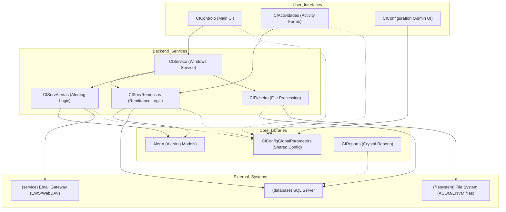
<center><sub>Figure 1 - High-level component diagram showing the main modules and their interactions.</sub></center>

### 1.2. Solutions
The codebase is organized into two main solution files, likely representing development with and without the setup project.

| Solution | Projects | Visual Studio Version |
| :--- | :--- | :--- |
| **`CIControloComSetup.sln`** | - `Alerta.csproj`<br>- `CIActividades.csproj`<br>- `CIConfigGlobalParameters.csproj`<br>- `CIConfiguration.csproj`<br>- `CIControlo.csproj`<br>- `CIFicheiro.csproj`<br>- `CIFicheirosControlo.csproj`<br>- `CIReports.csproj`<br>- `CIServAlertas.csproj`<br>- `CIServRemessas.csproj`<br>- `CIServico.csproj`<br>- `CIServTester.csproj`<br>- `MDIsControlo.csproj`<br>- `MDIWebTransmCI.vbproj`<br>- `QueryForm.csproj`<br>- `SetupCIControlo.vdproj` | 2010 |
| **`CIControloSemSetup.sln`** | - `Alerta.csproj`<br>- `CIActividades.csproj`<br>- `CIConfigGlobalParameters.csproj`<br>- `CIConfiguration.csproj`<br>- `CIControlo.csproj`<br>- `CIFicheiro.csproj`<br>- `CIFicheirosControlo.csproj`<br>- `CIReports.csproj`<br>- `CIServAlertas.csproj`<br>- `CIServRemessas.csproj`<br>- `CIServico.csproj`<br>- `CIServTester.csproj`<br>- `CITestes.csproj`<br>- `MDIsControlo.csproj`<br>- `MDIWebTransmCI.vbproj`<br>- `QueryForm.csproj`<br>- `CIDepositoErro.csproj` | 2010 |

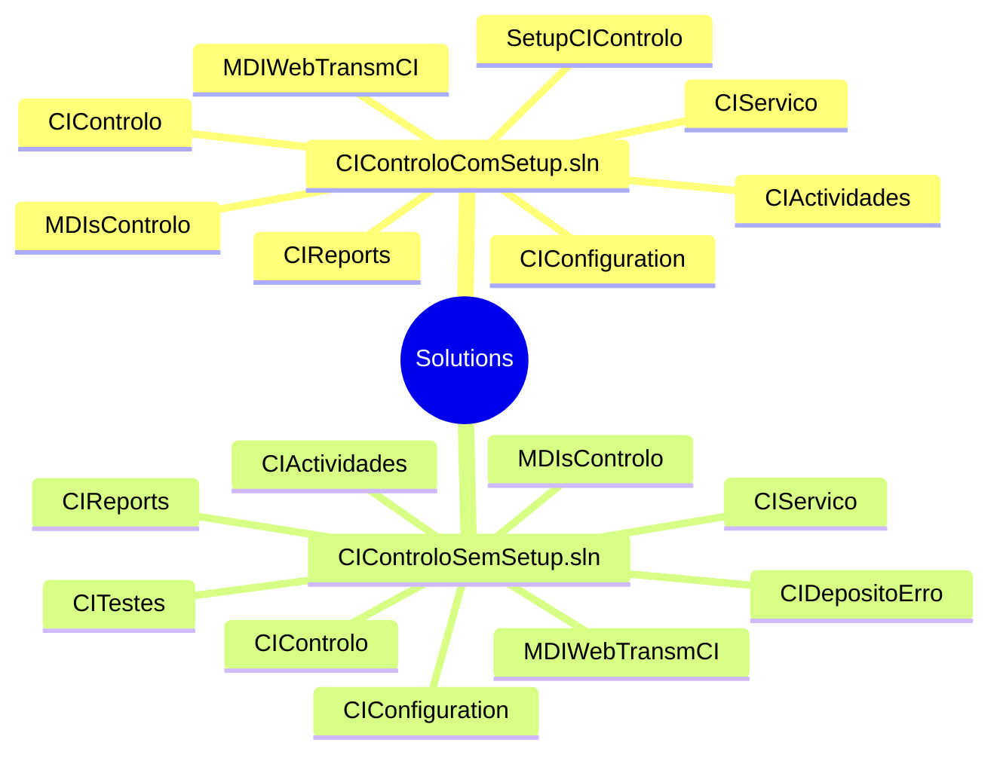
<center><sub>Figure 2 - Mindmap illustrating the project structure within the two main solutions.</sub></center>

### 1.3. Projects
The application is highly modular, with responsibilities separated into distinct projects. The main executable projects are `CIControlo.csproj` (the UI) and `CIServico.csproj` (the background service).

| Solution | Project | Main objectives | Type | Output type | Version | Runtime | Framework | Architecture | Compilation mode | Principal classes | Internal dependencies | External dependencies |
| :--- | :--- | :--- | :--- | :--- | :--- | :--- | :--- | :--- | :--- | :--- | :--- | :--- |
| CIControloSemSetup.sln | **`CIControlo.csproj`** | Main entry point for the user-facing application. Acts as an MDI container for various forms. | Windows Application | Executable | 1.0.0.0 | v4.0.30319 | .NET Framework 4.0 | AnyCPU | Debug/Release | `CIMainForm`, `Program` | `CIActividades`, `CIConfig...`, `CIConfiguration`, `CIFicheirosControlo`, `CIReports`, `CIServTester`, `MDIsControlo`, `QueryForm` | `GenericNet`, `NBIISNET` |
| CIControloSemSetup.sln | **`CIServico.csproj`** | Windows service for background processing of remittances and alerts. | Windows Service | Executable | 1.0.0.0 | v4.0.30319 | .NET Framework 4.0 | AnyCPU | Debug/Release | `CIServico`, `CIServiceComumThread` | `Alerta`, `CIConfig...`, `CIFicheiro`, `CIServAlertas`, `CIServRemessas` | `GenericNet`, `NBIISNET` |
| CIControloSemSetup.sln | **`CIActividades.csproj`** | Contains the Windows Forms for monitoring and managing activities, such as remittances and documents. | Class Library | Library | 1.0.0.0 | v4.0.30319 | .NET Framework 4.0 | AnyCPU | Debug/Release | `ActividadesForm`, `ActividadeBalcaoForm` | `Alerta`, `CIConfig...` | `GenericNet`, `NBIISNET`, `CrystalDecisions` |
| CIControloSemSetup.sln | **`CIServRemessas.csproj`** | Implements the core business logic for processing remittances and their associated tranches. | Class Library | Library | 1.0.0.0 | v4.0.30319 | .NET Framework 4.0 | AnyCPU | Debug/Release | `ServRemessa` | `Alerta`, `CIActividades`, `CIConfig...` | `GenericNet`, `NBIISNET` |
| CIControloSemSetup.sln | **`Alerta.csproj`** | Defines the data models and logic for the application's alerting system. | Class Library | Library | 1.0.0.0 | v4.0.30319 | .NET Framework 4.0 | AnyCPU | Debug/Release | `Accao`, `AlertaSituacaoAccao` | `CIConfig...` | `GenericNet`, `System.Data.SqlClient` |
| CIControloSemSetup.sln | **`CITestes.csproj`** | Unit and integration tests for the service layer. | Test Project | Library | 1.0.0.0 | v4.0.30319 | .NET Framework 3.5 | AnyCPU | Debug/Release | `CIServRemessaTestes` | `CIConfig...`, `CIControlo`, `CIServico`, `CIServRemessas`, `CIServTester` | `Microsoft.VisualStudio.TestTools.UnitTesting` |
| CIControloSemSetup.sln | **`MDIWebTransmCI.vbproj`** | A VB.NET project for consuming a SOAP web service related to MDI document insertion. | Class Library | Library | 1.0.0.0 | v4.0.30319 | .NET Framework 4.0 | AnyCPU | Debug/Release | `TInsertDoc` | `CIConfig...` | `System.Web.Services` |
| CIControloSemSetup.sln | **`CIConfiguration.csproj`**| Contains Windows Forms for managing system settings, users, and branches. | Class Library | Library | 1.0.0.0 | v4.0.30319 | .NET Framework 4.0 | AnyCPU | Debug/Release | `CIConfigForm`, `UtilizadoresForm` | `CIConfig...` | `GenericNet` |
| CIControloSemSetup.sln | **`CIReports.csproj`** | Manages the generation and display of Crystal Reports. | Class Library | Library | 1.0.0.0 | v4.0.30319 | .NET Framework 4.0 | AnyCPU | Debug/Release | `CIReportsForm` | `CIConfig...` | `CrystalDecisions` |
| CIControloSemSetup.sln | **`CIFicheiro.csproj`** | Handles parsing and processing of input files like ACOM and ENVM. | Class Library | Library | 1.0.0.0 | v4.0.30319 | .NET Framework 4.0 | AnyCPU | Debug/Release | `FicheiroEnvm`, `FicheiroAcom` | `CIConfig...` | `GenericNet` |

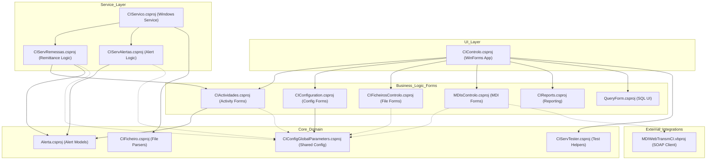
<center><sub>Figure 3 - Project dependency graph illustrating the relationships between the various projects in the solution.</sub></center>

## 2. Functional overview
This section provides a high-level functional decomposition of the application, using table format. It identifies the major, distinct functional blocks or modules as inferred from the code's high-level structure (e.g., top-level namespaces, solution folders, primary class groups). This overview serves as a map to the application's core responsibilities.

### 2.1. Executive summary
This section provides a high-level summary of the application's primary purpose and its core function from a business or operational perspective, using table format. The summary is an inference based on the main entry points of the code (e.g., `main()`, `Application_Start()`), the names of the most central classes and modules, and the nature of the core processes identified. It answers the fundamental question: What primary problem does this application solve?

| Aspect | Description |
| :--- | :--- |
| **Primary Purpose** | To serve as a back-office "Image Concentrator" system for processing financial documents (likely cheques) and remittances originating from bank branches and other sources. |
| **Core Function** | The application automates the ingestion, validation, processing, and status tracking of document batches (remittances). It provides a rich desktop interface for operators to monitor these activities, handle exceptions, manage system configuration, and generate reports. |
| **Key Processes** | - Ingestion of remittance data from files (`ENVM`, `ACOM`).<br>- Automated processing of remittances and document tranches via a Windows Service (`CIServico`).<br>- Manual monitoring and intervention through a Windows Forms application (`CIControlo`).<br>- Alerting and notification for system events and errors.<br>- Reporting on processing volumes and statuses. |

### 2.2. Functional decomposition
This section provides a detailed breakdown of the application's functional areas or modules, inferred from the code structure. Each module is described in terms of its primary responsibilities and how it contributes to the overall functionality of the application.

| Functional Area / Module | Description |
| :--- | :--- |
| **User Interaction & Presentation** | Manages all user-facing windows and controls. This module is the primary interface for operators to monitor workflows, manage configurations, and perform manual actions. It is implemented as a Windows Forms MDI application. |
| **Core Process Execution Engine** | A background Windows Service that drives all automated processing. It continuously polls for new work (remittances, alerts) and executes the corresponding business logic in a threaded manner. |
| **Remittance & Document Processing** | Contains the core business logic for handling remittances. This includes validating data, breaking remittances into processable batches (tranches), updating statuses, and handling errors. |
| **Alerting & Notification** | A dedicated subsystem for generating and dispatching system alerts. It supports multiple notification channels, including database logging, file logging, Windows Event Viewer, and email (EWS/WebDAV). |
| **File-based Integration** | Responsible for handling data exchange with external systems through structured files. It includes logic for parsing specific file formats (`ENVM`, `ACOM`), moving processed files, and managing file system paths. |
| **Data Persistence & Management** | Encapsulates all direct interactions with the SQL Server database. While not a formal data access layer, various classes throughout the application use `System.Data.SqlClient` to execute raw SQL queries and stored procedures. |
| **Configuration Management** | Provides the logic and UI for managing system parameters, user accounts, and branch (`Balcão`) configurations. This allows administrators to tune the application's behavior without code changes. |
| **Reporting** | Integrates with Crystal Reports to generate and display various operational and business reports, such as remittance listings and monthly billing summaries. |

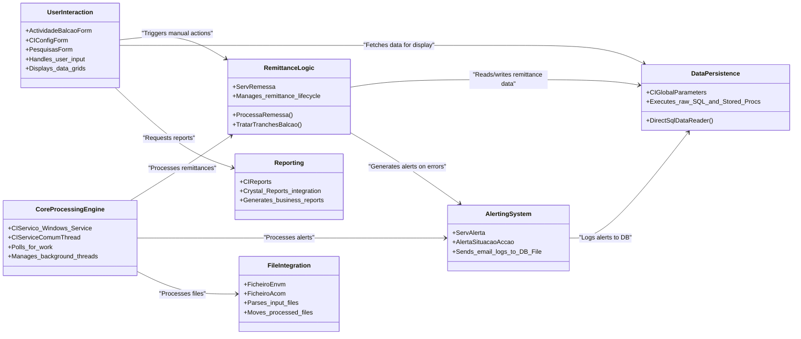
<center><sub>Figure 4 - Functional decomposition showing the relationships between key application modules.</sub></center>

### 2.3. User roles and permissions
This section identifies the distinct types of users that interact with the application. These roles are inferred from authorization checks and conditional logic based on user properties found in the code.

| Role | Description | Permissions | Key Actions | Key Data Entities | Assumptions |
| :--- | :--- | :--- | :--- | :--- | :--- |
| **Administrator** | A privileged user with full control over the system, including configuration and manual process overrides. Corresponds to `UserGroup <= 1`. | - Full CRUD on most entities.<br>- Ability to change the state of remittances and tranches.<br>- Access to system configuration and user management. | `MudarEstado`, `Reenviar...EmErro`, `Update_Utilizadores`, `Insert_Balcao` | `User`, `Balcao`, `Remessa`, `Tranche`, `ActivityChange` | Inferred from `ConfirmaPrivilegios()` checks (`m_oParameters.UserLogged.m_iUserGroup > 1`) which lock down sensitive operations. |
| **Standard Operator** | A standard user responsible for monitoring and performing routine operational tasks. Corresponds to `UserGroup > 1`. | - Read-only access to most data.<br>- Ability to view activities, remittances, and documents.<br>- Cannot change critical system states or configurations. | `ViewActividades`, `ViewDocumento`, `Refresh` | `Remessa`, `Documento`, `Alerta` | Inferred as the default role for users who fail the `UserGroup <= 1` privilege check. |

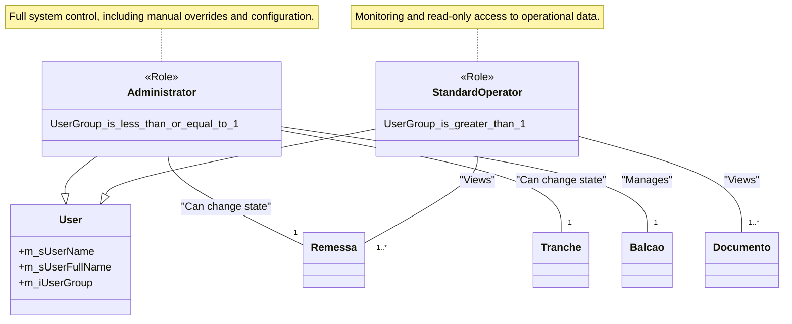
<center><sub>Figure 5 - Class diagram illustrating the user roles and their relationship with key data entities.</sub></center>

### 2.4. Core business capabilities
This section lists the main, high-level capabilities of the application, representing its "Epics" or major functional domains.

| Capability | Description | Key Features | Key Data Entities | Assumptions |
| :--- | :--- | :--- | :--- | :--- |
| **Remittance Processing** | The complete set of functions related to processing batches of financial documents (remittances) from ingestion to final state. | - Automated processing via Windows Service.<br>- Manual state changes for error recovery.<br>- Batching of documents into tranches. | `Remessa`, `Tranche`, `Documento` | This is the central capability, inferred from project names like `CIServRemessas` and classes like `ServRemessa`. |
| **Document Management** | All functions related to the lifecycle of individual documents, including their data and associated images. | - Viewing document images.<br>- Storing document metadata and parsed data (from optical line).<br>- Associating documents with remittances and tranches. | `Documento`, `Imagem` | Inferred from the application's name "Image Concentrator" and forms like `ImagemBalcaoForm`. |
| **System Monitoring & Alerting** | Provides real-time and historical views into system activities and automatically notifies stakeholders of important events or errors. | - UI for viewing activities by status and date.<br>- Automated alert generation for processing failures.<br>- Multi-channel notifications (Email, DB Log, Event Viewer). | `Alerta`, `Accao`, `SituacaoAccao` | Inferred from the `CIActividades` and `Alerta` projects. |
| **Operational Administration** | The set of functions allowing administrators to configure and manage the application's operational parameters and user access. | - User and group management.<br>- Configuration of bank branches (`Balcão`) and processing machines.<br>- System-level parameter tuning (e.g., timers, thresholds). | `User`, `Balcao`, `Maquina` | Inferred from the `CIConfiguration` project and its associated forms. |

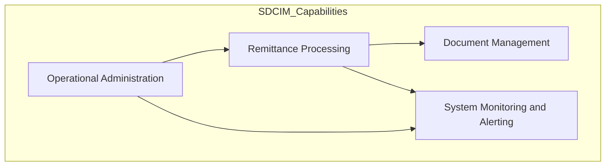
<center><sub>Figure 6 - High-level diagram of the core business capabilities.</sub></center>

### 2.5. Detailed feature breakdown
This critical section provides a granular breakdown of individual features within each Core Business Capability.

| Feature | User Story / Description | Key Data Entities | Assumptions |
| :--- | :--- | :--- | :--- |
| **Process Remittance** | As a **System**, I can automatically pick up a new remittance from the database and process its documents in batches (tranches) so that financial transactions are recorded. | `Remessa`, `Tranche`, `Documento` | Inferred from `ServRemessa.ProcessaRemessa` and the polling logic in `CIServicoThread`. |
| **Manually Change Remittance State** | As an **Administrator**, I can manually change the status of a failed remittance so that it can be re-processed by the system. | `Remessa`, `ActivityChange` | Inferred from `MudarEstadoForm` and the context menus in `ActividadesForm` that are enabled for privileged users. |
| **View Activity Dashboard** | As an **Operator**, I can view a dashboard of all remittance activities, filtered by date and status, so that I can monitor the system's health and performance. | `Remessa`, `Tranche` | Inferred from the main UI of `ActividadeBalcaoForm` and its filtering controls. |
| **View Document Image** | As an **Operator**, I can select a specific document from a remittance and view its scanned image so that I can visually verify its contents. | `Documento`, `Imagem` | Inferred from `ImagemBalcaoForm` and the "Ver Imagem" context menu option. |
| **Configure System Alerts** | As an **Administrator**, I can configure which actions (e.g., send email, log to file) are triggered by specific system situations (e.g., processing error) so that notifications are sent to the correct stakeholders. | `SituacaoAccao`, `Accao`, `AccaoParam` | Inferred from the UI and logic in `CIConfigForm`. |

### 2.6. Key data entities and their attributes
This section documents the application's core data structures, as inferred from class definitions or ORM configurations.

| Entity | Description | Key Attributes | Data Type | Validation Rules | Relationships | Assumptions |
| :--- | :--- | :--- | :--- | :--- | :--- | :--- |
| **Remessa** | Represents a batch of documents submitted for processing, typically from a single branch (`Balcão`). | `ID`, `Data`, `StatusID`, `Balcao`, `Numero`, `Montante` | `int`, `DateTime`, `int`, `int`, `int`, `decimal` | `ID` is a primary key. `StatusID` references a status table. | Has a one-to-many relationship with `Tranche` and `Documento`. | Inferred from `DetalheRemessa` and related classes. |
| **Documento** | Represents a single financial document, such as a cheque, within a remittance. | `ID`, `DocOriID`, `Zona1` to `Zona5` (optical line data), `NIB`, `RefArq`, `EstadoID` | `int`, `string`, `string`, `string`, `int` | `ID` is a primary key. `EstadoID` references a status table. | Belongs to one `Remessa` and one `Tranche`. | Inferred from `DetalheDocumento` class. `Zona` fields likely represent parsed MICR/OCR data. |
| **Tranche** | A sub-batch of documents within a larger remittance, used for processing and sending to external systems. | `ID`, `RemessaID`, `Numero`, `EstadoID`, `QtDocs`, `Montante` | `int`, `int`, `int`, `int`, `int`, `decimal` | `ID` is a primary key. | Belongs to one `Remessa`. Has a one-to-many relationship with `Documento`. | Inferred from `DetalheTranche` class. |
| **Alerta** | A system-generated alert triggered by a specific event or situation. | `ID`, `Timer`, `Text`, `Varchar` | `string`, `DateTime`, `string`, `string` | `ID` is a primary key. | Associated with a `SituacaoAccao`. | Inferred from `AlertaSituacaoAccao` class. |
| **Accao** | A predefined action that can be executed in response to an alert. | `ID`, `Desc`, `TipoAccaoID` | `int`, `string`, `enum` | `ID` is a primary key. `TipoAccaoID` is an enum (`MAIL`, `SMS`, `LOGDB`, etc.). | Many-to-many relationship with `Situacao` via `SituacaoAccao`. | Inferred from `Accao.cs`. |

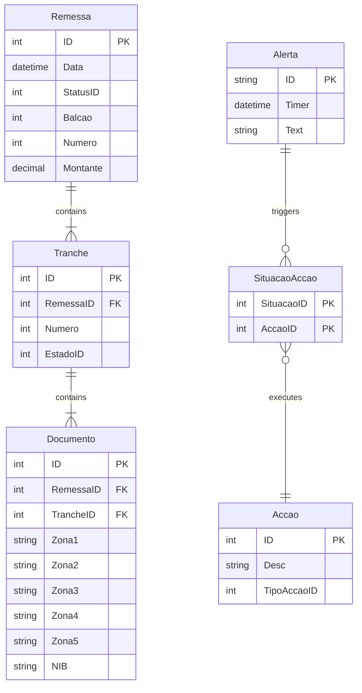
<center><sub>Figure 7 - Entity-Relationship diagram showing the core data entities and their relationships.</sub></center>

### 2.7. Business process workflows
This section describes and visualizes critical end-to-end processes, showing how different user roles and system features interact.

| Process | Description | Key Steps | User Roles Involved | Key Data Entities | Assumptions |
| :--- | :--- | :--- | :--- | :--- | :--- |
| **Standard Remittance Processing** | A comprehensive workflow that outlines the steps involved in processing remittances from ingestion to final output. | 1. Remittance is created in the database (status: open).<br>2. `CIServico` picks up the remittance for processing (status: processing).<br>3. Documents are grouped into tranches.<br>4. Tranches are sent to an external system (e.g., via web service).<br>5. Remittance status is updated to processed/closed. | System (automated), Standard Operator (monitoring) | `Remessa`, `Tranche`, `Documento` | This is the primary "happy path" workflow inferred from the service and form logic. |
| **Error Handling and Manual Intervention** | The workflow for managing and resolving remittances or documents that fail automated processing. | 1. A processing error occurs.<br>2. An alert is generated (`Alerta`).<br>3. An Administrator reviews the failed item in the UI.<br>4. The Administrator manually changes the item's state (e.g., to "re-process").<br>5. The item re-enters the standard processing workflow. | Administrator, Standard Operator (viewing alerts) | `Remessa`, `Alerta`, `ActivityChange` | Inferred from the existence of `MudarEstadoForm` and error-related statuses. |
| **Alert Notification** | The process by which the system notifies stakeholders about critical events. | 1. An event triggers a `Situacao`.<br>2. The system looks up associated `Accao` records.<br>3. The system executes each action (e.g., sends an email, writes to a log file).<br>4. The alert action status is marked as processed. | System (automated), Administrator (recipient) | `Alerta`, `SituacaoAccao`, `Accao` | Inferred from the `Alerta` and `CIServAlertas` projects. |

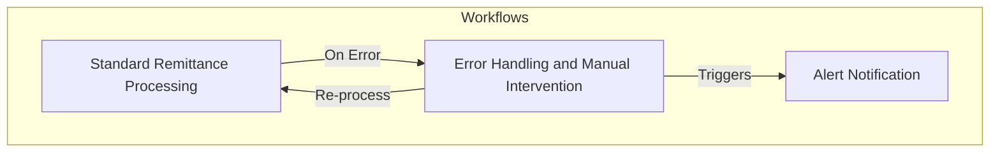
<center><sub>Figure 8 - High-level relationships between the main business process workflows.</sub></center>

#### 2.7.1. Workflow: Standard Remittance Processing
This section provides a detailed breakdown of the Standard Remittance Processing workflow, including the steps involved, user roles, key data entities, and any assumptions made.

| Step | Description | User Role | Key Data Entities | Assumptions |
| :--- | :--- | :--- | :--- | :--- |
| **1. Remittance Creation** | A new remittance record is created in the database with an initial "open" or "ready" status. This is likely done by an upstream system or file import process. | System | `Remessa` | Assumes an external trigger creates the initial record. |
| **2. Processing Pickup** | The `CIServico` Windows Service polls the database and picks up the new remittance for processing, changing its status to "processing". | System | `Remessa` | Inferred from `REMIN_IDParaProcessar()` method. |
| **3. Tranche Creation** | The service logic groups the documents within the remittance into one or more tranches based on system rules (e.g., `MaxDocsTranche` parameter). | System | `Remessa`, `Tranche` | Inferred from `TratarTranchesBalcao` and `CriarTranche`. |
| **4. Document Processing** | Each document within a tranche is processed. This may involve validation, data enrichment, and image conversion. | System | `Documento`, `Tranche` | Inferred from `ProcessaDocumento`. |
| **5. Tranche Transmission** | The processed tranches are sent to an external system, likely via a web service. The tranche status is updated upon success or failure. | System | `Tranche` | Inferred from context; the purpose of a tranche is typically for transmission. |
| **6. Finalization** | Once all tranches are successfully processed, the parent remittance is marked as "closed" or "processed". | System | `Remessa` | This is the logical end-state of a successful workflow. |

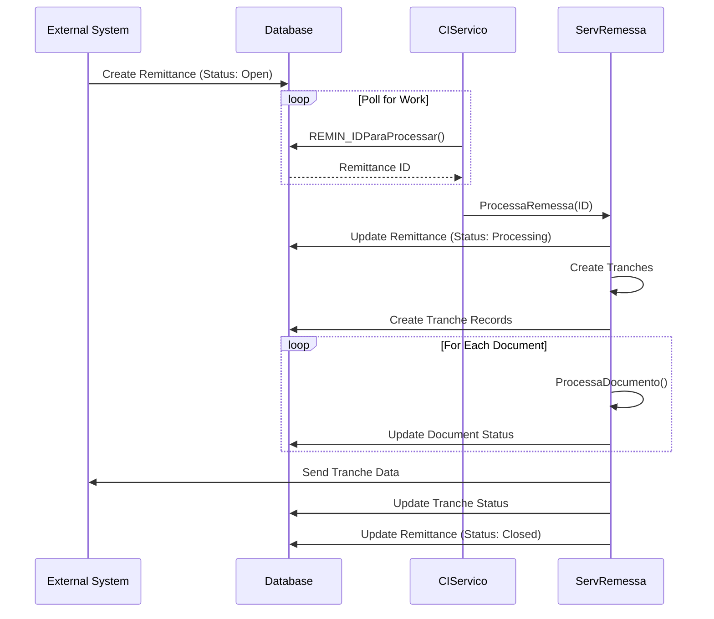
<center><sub>Figure 9 - Sequence diagram detailing the Standard Remittance Processing workflow.</sub></center>

#### 2.7.2. Workflow: Error Handling and Manual Intervention
This section provides a detailed breakdown of the Error Handling and Manual Intervention workflow, including the steps involved, user roles, key data entities, and any assumptions made.

| Step | Description | User Role | Key Data Entities | Assumptions |
| :--- | :--- | :--- | :--- | :--- |
| **1. Error Detection** | An error occurs during the automated processing of a remittance, tranche, or document. The item's status is set to an error state (e.g., -40). | System | `Remessa`, `Tranche`, `Documento` | Inferred from `try-catch` blocks and error handling logic in `ServRemessa`. |
| **2. Alert Generation** | The system automatically generates an `Alerta` record corresponding to the error situation. | System | `Alerta` | Inferred from calls to `EnviarAlertaSituacao`. |
| **3. Notification** | The `CIServAlertas` logic picks up the new alert and executes the configured actions (e.g., sends an email to an administrator). | System | `Accao`, `Alerta` | Inferred from the `ServAlerta` class. |
| **4. User Review** | An Administrator logs into the `CIControlo` application and navigates to the activity monitor to review the item in an error state. | Administrator | `Remessa` | This is the primary use case for the UI's monitoring forms. |
| **5. Manual State Change** | The Administrator uses the context menu to manually change the state of the failed item, for example, to re-queue it for processing. | Administrator | `Remessa`, `ActivityChange` | Inferred from `MudarEstadoForm` and its invocation from the UI. |
| **6. Re-processing** | The item, now in a valid starting state, is picked up again by the `CIServico` during its next polling cycle, re-entering the standard workflow. | System | `Remessa` | Assumes the state change makes it eligible for re-processing. |

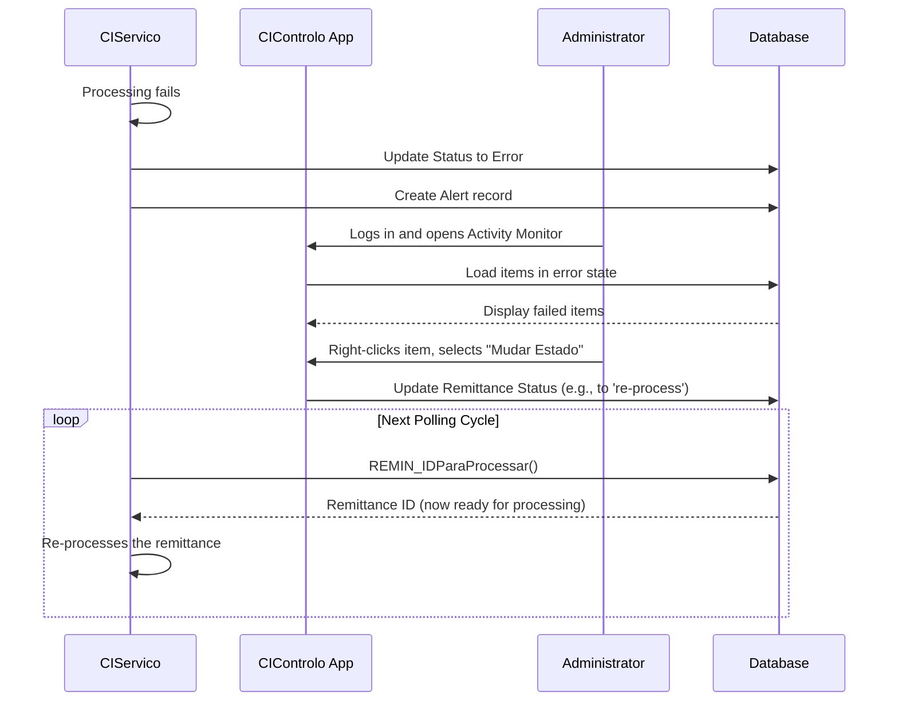
<center><sub>Figure 10 - Sequence diagram detailing the Error Handling and Manual Intervention workflow.</sub></center>

#### 2.7.3. Workflow: Alert Notification
This section provides a detailed breakdown of the Alert Notification workflow, including the steps involved, user roles, key data entities, and any assumptions made.

| Step | Description | User Role | Key Data Entities | Assumptions |
| :--- | :--- | :--- | :--- | :--- |
| **1. Situation Trigger** | A processing event (e.g., an error, a state change) triggers a pre-defined "Situation" in the system. | System | `SituacaoAccao` | Inferred from the `EnviarAlertaSituacao` method, which takes a situation ID. |
| **2. Alert Creation** | An `Alerta` record is created in the database, linked to the triggered situation. | System | `Alerta` | This is the first step in the `CIServAlertas` logic. |
| **3. Alert Pickup** | The `CIServAlertas` polling thread picks up the new `Alerta` record for processing. | System | `Alerta` | Inferred from `AlertaSituacaoAccaoParaProcessar()` method. |
| **4. Action Execution** | The system retrieves all `Accao` (Action) records associated with the situation and executes them one by one (e.g., send email, log to file, log to Event Viewer). | System | `Accao`, `AccaoParam` | Inferred from `ProcessaAlertaSituacaoAccao`, which iterates through different action types. |
| **5. Mark as Processed** | Once all actions for the alert have been attempted, the alert record is marked as processed in the database to prevent re-execution. | System | `Alerta` | This is the final step to complete the alert lifecycle. |

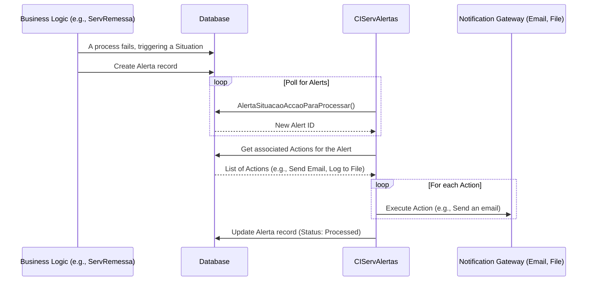
<center><sub>Figure 11 - Sequence diagram detailing the Alert Notification workflow.</sub></center>

### 2.8. System inputs & outputs (interfaces)
This section catalogs all identified points where data enters or leaves the application boundary.

| Type | Name / Description | Data Formats | Data Source / Sink | Assumptions |
| :--- | :--- | :--- | :--- | :--- |
| **Input** | **File Ingestion (ENVM/ACOM)** | Fixed-width text files (`.txt`, `.*`) | Monitored file system directory (`C:\tmp\` by default) | Inferred from `CIFicheiro` project and classes like `FicheiroEnvm` and `FicheiroAcom`. The service likely watches a directory for new files to process. |
| **Input** | **User Interface Actions** | User-driven events (clicks, text entry) | Windows Forms UI (`CIControlo`, `CIActividades`) | The application is interactive, allowing operators to provide input to filter data, change states, and manage configurations. |
| **Output** | **Database Writes** | SQL Commands | Microsoft SQL Server | The application's primary function is to process data and persist the results and state changes to a central database. |
| **Output** | **Email Notifications** | SMTP (via EWS or WebDAV) | External Email Gateway | The `Alerta` system is configured to send emails as a notification action, as seen in `ServAlertasSendWebmail.cs`. |
| **Output** | **Log Files** | Text files | Local/Network file system | The `Alerta` system can be configured to write logs to a file, as seen in `ServAlertasLogFile.cs`. |
| **Output** | **Windows Event Log** | Event Log Entries | Windows Operating System | The `Alerta` system can write warnings and errors to the Windows Event Log. `CIServico` also logs its start/stop events. |
| **Data Flow** | **Internal Database-Driven Workflow** | In-memory objects (`Remessa`, `Documento`) | Application Memory -> Database | Data is read from the database, processed by the business logic in `CIServRemessas`, and the updated state is written back to the database. |
| **Data Flow** | **Web Service Call (MDI)** | SOAP/XML | External Web Service (`http://waiaccesstu/...`) | The `MDIWebTransmCI` project makes outbound SOAP calls to an external service for document insertion. |

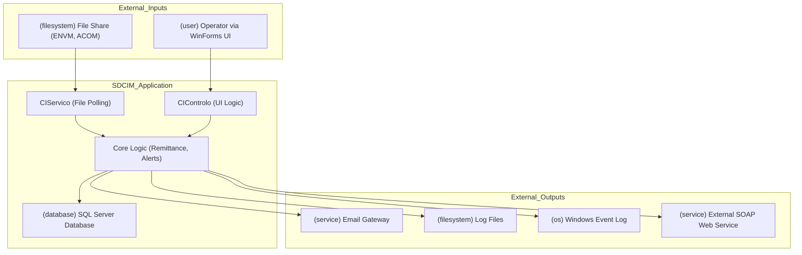
<center><sub>Figure 12 - Diagram illustrating the main system inputs, outputs, and internal data flows.</sub></center>

### 2.9. User Task Flows
This section describes the typical path a user takes through the application to achieve a high-level objective.

| Task Flow | Description | User Role | Key Data Entities | Assumptions |
| :--- | :--- | :--- | :--- | :--- |
| **Resolve a Failed Remittance** | A complete sequence of steps an administrator follows to identify, diagnose, and resolve a remittance that has failed automated processing. | Administrator | `Remessa`, `Documento`, `Alerta` | This is a primary task for a privileged user, combining monitoring, investigation, and manual intervention features. |
| **Monitor Daily Processing** | A routine task for an operator to check the status of the day's remittances and identify any bottlenecks or widespread issues. | Standard Operator | `Remessa`, `Tranche` | This flow represents the main day-to-day use of the application's monitoring UI. |
| **Configure a New Branch** | An administrative task to set up a new bank branch (`Balcão`) and its associated processing machines in the system. | Administrator | `Balcao`, `Maquina` | Inferred from the `CIConfiguration` project and the `BalcaoForm`. |

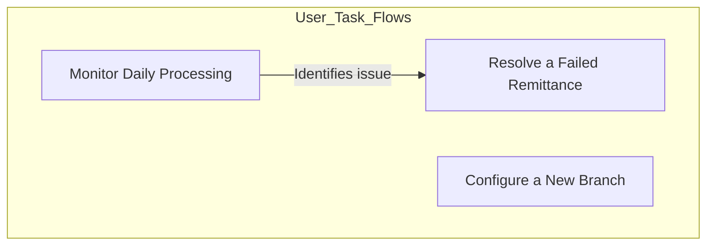
<center><sub>Figure 13 - High-level diagram showing the relationship between user task flows.</sub></center>

#### 2.9.1. User Task Flow: Resolve a Failed Remittance
This section provides a detailed breakdown of the "Resolve a Failed Remittance" user task flow.

| Step | Description | User Role | Key Data Entities | Assumptions |
| :--- | :--- | :--- | :--- | :--- |
| **1. Receive Alert** | The administrator receives an email notification that a remittance has failed. | Administrator | `Alerta` | Assumes email is the primary notification channel for critical errors. |
| **2. Login & Open Dashboard** | The administrator launches the `CIControlo` application and opens the `ActividadeBalcaoForm`. | Administrator | - | Standard application entry point. |
| **3. Filter for Errors** | The administrator uses the toolbar filters to show only items in an "Error" state for the relevant date. | Administrator | `Remessa` | Inferred from the UI controls on `ActividadeBalcaoForm`. |
| **4. Identify Failed Item** | The administrator identifies the specific remittance mentioned in the alert from the summary list. | Administrator | `Remessa` | The user matches data from the alert to the UI. |
| **5. Drill Down to Details** | The administrator double-clicks the remittance to view its tranches, and then a tranche to view its individual documents, looking for the source of the error. | Administrator | `Tranche`, `Documento` | Inferred from the drill-down capabilities of the UI's list views. |
| **6. View Document Image** | If the error is document-related, the administrator views the document image to check for issues like poor scan quality or incorrect data. | Administrator | `Documento`, `Imagem` | Inferred from the "Ver Imagem" feature. |
| **7. Change State for Re-processing** | After diagnosing the issue (and possibly correcting data externally), the administrator right-clicks the remittance and uses the "Mudar Estado" feature to reset its status. | Administrator | `Remessa` | This is the core manual intervention action. |
| **8. Confirm Resolution** | The administrator later re-checks the dashboard to confirm the remittance has been successfully re-processed by the automated service. | Administrator | `Remessa` | Final step to ensure the intervention was successful. |

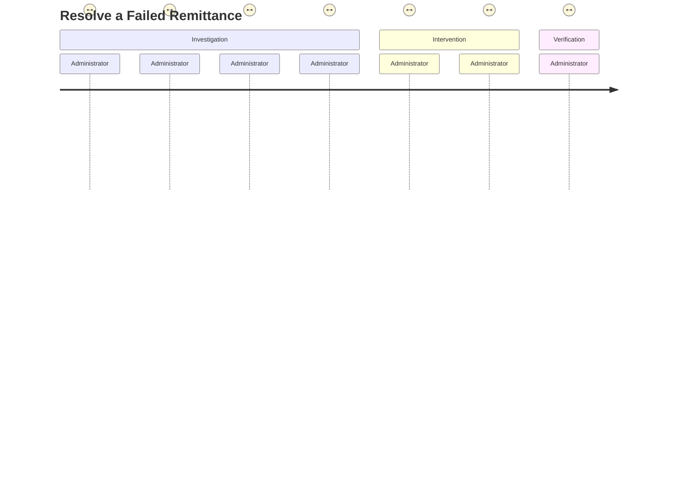
<center><sub>Figure 14 - User journey diagram for resolving a failed remittance.</sub></center>

#### 2.9.2. User Task Flow: Monitor Daily Processing
This section provides a detailed breakdown of the "Monitor Daily Processing" user task flow.

| Step | Description | User Role | Key Data Entities | Assumptions |
| :--- | :--- | :--- | :--- | :--- |
| **1. Login** | The operator launches the `CIControlo` application to begin their shift. | Standard Operator | - | Standard application entry. |
| **2. Open Activity Monitor** | The operator navigates to the main activity monitoring form (`ActividadeBalcaoForm`). | Standard Operator | - | This is the primary screen for monitoring. |
| **3. Set Date Filter** | The operator sets the date filter to the current day to see today's activities. | Standard Operator | `Remessa`, `Tranche` | A common first action to scope the view. |
| **4. Review Status Counts** | The operator reviews the summary counts by status (e.g., Processed, Error, Open) to get a quick overview of system health. | Standard Operator | `Remessa` | The UI provides summary information for quick analysis. |
| **5. Investigate Delays** | If the number of "Open" or "Processing" items seems high, the operator may sort by time to identify remittances that are taking longer than usual. | Standard Operator | `Remessa` | Assumes the UI allows sorting to identify bottlenecks. |
| **6. Report Anomalies** | If a significant issue is found (e.g., many items in error), the operator escalates the issue to an Administrator. | Standard Operator | `Alerta` | Standard procedure for non-privileged users. |

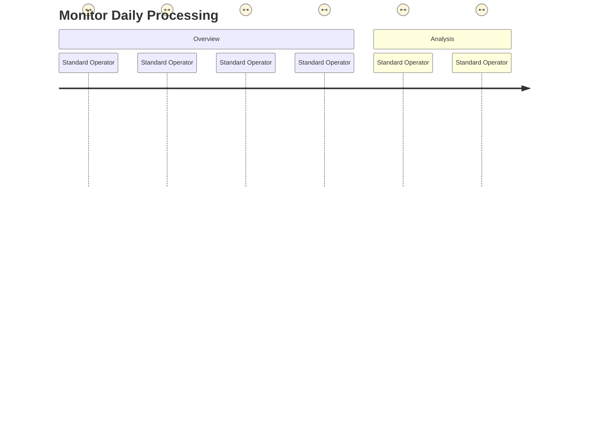
<center><sub>Figure 15 - User journey diagram for monitoring daily processing.</sub></center>

#### 2.9.3. User Task Flow: Configure a New Branch
This section provides a detailed breakdown of the "Configure a New Branch" user task flow.

| Step | Description | User Role | Key Data Entities | Assumptions |
| :--- | :--- | :--- | :--- | :--- |
| **1. Login** | The administrator logs into the `CIControlo` application. | Administrator | - | Requires administrative privileges. |
| **2. Open Configuration** | The administrator navigates to the system configuration area (`CIConfiguration` project forms). | Administrator | - | Access to this area is likely restricted. |
| **3. Open Branch Management** | The administrator opens the `BalcaoForm` to manage bank branches. | Administrator | `Balcao` | Inferred from the existence of `BalcaoForm.cs`. |
| **4. Add New Branch** | The administrator clicks an "Add" button and fills in the details for the new branch (e.g., ID, name, parameters). | Administrator | `Balcao` | Standard CRUD operation. |
| **5. Configure Machines** | The administrator associates one or more processing machines with the new branch. | Administrator | `Maquina` | Branches and machines are linked entities. |
| **6. Save Configuration** | The administrator saves the new configuration to the database. | Administrator | `Balcao`, `Maquina` | The final step to persist the changes. |

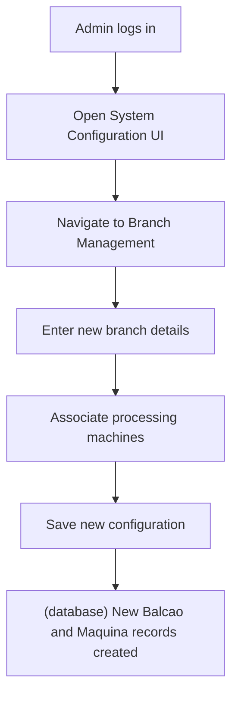
<center><sub>Figure 16 - Flowchart for the task of configuring a new branch.</sub></center>

### 2.10. Automated & Scheduled Processes
This section describes any system-triggered processes that run without direct user interaction, such as nightly jobs, scheduled reports, or data synchronization tasks.

| Process Name | Trigger / Schedule | Purpose | Key Actions | Key Data Entities | Assumptions |
| :--- | :--- | :--- | :--- | :--- | :--- |
| **Remittance Processing Loop** | Continuous polling with a configurable delay (`TempoEntreIteracoes`). | To process new and re-queued remittances as they become available in the database. | 1. `REMIN_IDParaProcessar()`: Get next remittance.<br>2. `ProcessaRemessa()`: Execute the full processing logic for the remittance.<br>3. `TratarTranchesBalcao()`: Process documents in batches. | `Remessa`, `Tranche`, `Documento` | This is the main loop of the `CIServico` Windows Service, inferred from `CIServicoThread.cs`. |
| **Alert Processing Loop** | Continuous polling with a configurable delay. | To dispatch notifications for newly generated alerts. | 1. `AlertaSituacaoAccaoParaProcessar()`: Get next alert.<br>2. `ProcessaAlertaSituacaoAccao()`: Execute configured actions (e.g., send email). | `Alerta`, `Accao` | Inferred from the logic in `ProcessarAlertas.cs`. |
| **File System Polling** | Continuous polling with a configurable delay (`TempoEntreIteracoesFicheiros`). | To discover and import new `ENVM` and `ACOM` data files from the file system. | 1. `Directory.GetFiles()`: Scan for new files.<br>2. `Ficheiro.processaFile()`: Parse and import the file data into the database.<br>3. `File.Move()`: Move the processed file to a backup location. | `Ficheiro`, `Lote`, `Documento` | Inferred from `CIServicoThread` and the `CIFicheiro` project. |
| **Old File Cleanup** | Scheduled (inferred, as it is a common best practice for such systems). | To prevent the backup directory from growing indefinitely by deleting files older than a configured number of days. | `File.Delete()` on files older than `iNDias`. | `(none)` | Inferred from the existence of the `DeleteOldFiles.cs` class, which is a common utility for such services. |

## 3. Architecture and design
This section describes the architectural patterns, styles, and principles used in the application's design.

### 3.1. Architecture pattern
The application follows a traditional monolithic architecture with some service-oriented characteristics for background processing.

| Pattern | Adoption Details |
| :--- | :--- |
| **Architecture pattern** | **N-Tier Monolithic Application**: The application is structured into distinct layers (presentation, business, data access), but all components are tightly coupled and intended to be deployed as a single unit. |
| **Architectural patterns (UI)** | **Model-View-Presenter (MVP) / MVC-like**: The Windows Forms (`.cs`) files act as the View, while the code-behind (`.cs`) files serve as the Presenter/Controller, handling UI events and orchestrating calls to business logic classes. |
| **Creational patterns** | ❔ **Factory Method (inferred)**: The `Relatorios` class has methods like `ListagemRemessas()` and `resumoDeEnvios()` that create and return specific report form instances, acting as a factory for reports. |
| **Structural patterns** | ❌ **Not explicitly identified**: No clear evidence of structural patterns like Adapter, Decorator, or Proxy in the provided code snippets. |
| **Behavioral patterns** | ❔ **Observer (inferred)**: The main service loop (`CIServicoThread`) acts as an observer, polling the database for state changes (new remittances) to trigger actions. |
| **Domain-driven design (DDD) patterns** | ✅ **Repository (implicit)**: Classes like `ServRemessa` and `ServAlerta` encapsulate data access logic for their respective domains (`Remessa`, `Alerta`), acting as repositories even if not explicitly named as such. They contain methods to fetch and update entities. |

### 3.2. Architecture style
The application's architecture is primarily a classic Layered style, typical for .NET applications of its era.

| Style | Adoption Details |
| :--- | :--- |
| **Layering** | **3-Tier Layered Architecture**:<br>- **Presentation Layer**: Windows Forms projects (`CIControlo`, `CIActividades`, `CIConfiguration`).<br>- **Business Logic Layer**: Service and library projects (`CIServico`, `CIServRemessas`, `CIServAlertas`).<br>- **Data Access Layer**: Implicitly defined within business logic classes through direct `System.Data.SqlClient` calls. |
| **Dependency flow** | **Strictly one-way**: Dependencies flow from the Presentation layer down to the Business Logic layer, and then to the Data Access logic. Core libraries like `CIConfigGlobalParameters` are shared across layers. |
| **Bounded contexts** | ❌ **Not explicitly defined**: The application is a monolith. While there are logical separations (e.g., Remittance Processing, Alerting), they are not implemented as distinct bounded contexts with their own models and persistence. |
| **Communication between contexts/services** | **Direct Method Calls**: Communication between different modules (projects) is done via direct, synchronous method calls within the same process space. |
| **Use of dependency injection / IOC container** | ❌ **Not used**: Dependencies are managed manually through direct object instantiation (e.g., `new CIServRemessas.ServRemessa(...)`). There is no evidence of an Inversion of Control (IoC) container. |

### 3.3. Key design patterns and principles applied
The codebase reflects design principles common in the .NET 2.0/4.0 era.

| Principle | Adoption Details |
| :--- | :--- |
| **SOLID principles** | 🟠 **Partial Adherence**: <br>- *Single Responsibility*: Partially followed, with projects dedicated to specific concerns (e.g., `Alerta`, `CIReports`). However, some classes like `ActividadeBalcaoForm` are very large and handle many responsibilities. <br>- *Open/Closed*: Limited evidence. The system is extended by adding new classes rather than modifying existing ones where possible. <br>- *Liskov/Interface Segregation/Dependency Inversion*: Not explicitly used; the architecture relies on concrete implementations rather than abstractions. |
| **DRY (Don't repeat yourself)** | 🟠 **Some Repetition**: There are instances of repeated code, particularly in UI event handlers and data access logic. For example, multiple forms have similar filtering and data-loading logic. |
| **KISS (Keep it simple, stupid)** | ✅ **Generally Followed**: The logic within individual methods is straightforward. The complexity arises from the number of interconnected components and the large size of some UI classes, not from overly-engineered algorithms. |
| **Separation of Concerns** | ✅ **Moderately Achieved**: There is a clear separation between UI projects (`CIActividades`), service logic (`CIServico`), and domain models (`Alerta`). However, data access logic (SQL queries) is often mixed directly within business or UI code-behind classes. |
| **Code organization** | ✅ **Modular by Project**: The solution is well-organized into multiple projects, each with a clear purpose (e.g., `CIReports`, `CIFicheiro`). This provides good high-level modularity. |

### 3.4. Domain-driven design (DDD) adoption
The application was likely not designed with modern DDD principles in mind, but it contains some elements that align with DDD concepts.

| DDD Concept | Adoption Details |
| :--- | :--- |
| **Use of DDD concepts** | 🟠 **Implicit Use**: <br>- **Entities**: Classes like `Remessa`, `Documento`, and `Balcao` represent core domain entities with identity and a lifecycle. <br>- **Value Objects**: No clear examples of value objects were identified. <br>- **Aggregates**: The `Remessa` can be seen as an aggregate root that manages the lifecycle of its `Documento` and `Tranche` children. <br>- **Repositories**: Data access logic is encapsulated within service classes (`ServRemessa`), which act as repositories for fetching and persisting entities. |
| **Ubiquitous language** | ✅ **Partially Present**: The code uses business-centric terms like `Remessa` (Remittance), `Balcão` (Branch), and `Estorno` (Reversal), suggesting a language shared with the business domain. |
| **Layered DDD approach** | 🟠 **N-Tier, not DDD**: The architecture is a classic N-Tier structure, not a formal DDD layered architecture (e.g., Application, Domain, Infrastructure layers). The domain logic is present but intertwined with data access and sometimes UI concerns. |

### 3.5. Patterns and tactics
The application employs several common software development patterns and tactics.

| Pattern/Tactic | Adoption Details |
| :--- | :--- |
| **Repository pattern** | ✅ **Implicitly Used**: Service classes like `ServRemessa` and `ServAlerta` contain methods (`REMIN_IDParaProcessar`, `AlertaSituacaoAccaoParaProcessar`) that query the database and return domain entities, effectively serving as repositories. |
| **Unit of Work pattern** | 🟠 **Transaction-based**: The `SqlTransaction` object is used in some methods (`m_oParameters.BeginTrans`) to group multiple database operations, providing a form of unit of work at the transaction level, but a formal Unit of Work pattern is not implemented. |
| **Factory pattern** | ❔ **Inferred**: The `CIActividades.Actividades` class has methods like `ControloActividades()` and `ControloPesquisas()` that are responsible for creating and showing specific form instances, acting as a simple factory for UI components. |
| **Service pattern** | ✅ **Explicitly Used**: The application's core background logic is encapsulated in a Windows Service (`CIServico.csproj`), which follows the service pattern for long-running, non-interactive processes. |

### 3.6. Cross-cutting concerns
The application manages cross-cutting concerns through a mix of shared libraries and direct implementation.

| Concern | Implementation Details |
| :--- | :--- |
| **Logging** | Implemented via a dedicated `GenericLogNET` library and the `Alerta` project. Supports logging to the database, files, and the Windows Event Viewer. |
| **Configuration Management** | Centralized in the `CIConfigGlobalParameters` project. The `CIGlobalParameters` class reads settings from `.config` files and provides them to the rest of the application. |
| **Security** | - **Authentication**: Appears to be based on the logged-in Windows user (`System.Windows.Forms.SystemInformation.UserName`).<br>- **Authorization**: A simple role-based system checking a `UserGroup` ID. |
| **Exception Handling** | Standard `try-catch` blocks are used throughout the application to handle exceptions. Errors are typically logged to the database or displayed to the user. |
| **Data Serialization / Deserialization** | ❔ **Inferred**: The `CriaXML.cs` class suggests that XML serialization/deserialization is used, likely for communication with external systems or for configuration. |
| **Dependency Injection** | ❌ **Not Used**: Dependencies are created manually via `new` keyword. |

### 3.7. Deployment
The deployment architecture is inferred to be a traditional on-premises model.

| Aspect | Details |
| :--- | :--- |
| **Monolithic vs microservices** | **Monolithic**: The application is a single, tightly-coupled monolith, although it is broken into multiple projects within a single solution. |
| **Scalability design** | 🔴 **Limited**: Scalability is limited to vertical scaling (adding more resources to the host server). The monolithic design and direct database polling do not lend themselves to horizontal scaling. |
| **Containerization** | ❌ **Not Containerized**: The application is a traditional .NET Framework application designed to run on Windows servers, not in containers. |
| **Deployment model** | **On-premises**: Connection strings and file paths point to internal network resources (e.g., `\\sqc6001fas02`, `SDC6001SQL28`). |
| **Deployment target platform** | **Windows Server**: The use of a Windows Service (`CIServico`) and Windows Forms (`CIControlo`) indicates a Windows-based deployment target. |

```mermaid
flowchart TD
    subgraph User_Site
        A["Operator Workstation"] -->|WinForms UI| B["Application Server"]
    end
    
    subgraph Data_Center
        B -- "Hosts CIControlo.exe"
        B -- "Hosts CIServico.exe (Windows Service)"
        B -->|TDS Protocol| C["(database) SQL Server"]
        B -->|SMB Protocol| D["(filesystem) File Share (Input/Output)"]
        B -->|HTTP (SOAP)| E["(service) External MDI Web Service"]
        B -->|SMTP| F["(service) Email Gateway"]
    end
```
<center><sub>Figure 17 - Deployment diagram showing the logical arrangement of components in an on-premises environment.</sub></center>

### 3.8. Infrastructure considerations
The application relies on a standard on-premises Microsoft-centric infrastructure.

| Concern | Details |
| :--- | :--- |
| **Persistence** | **Microsoft SQL Server**: All data is persisted in a relational SQL Server database. The connection strings suggest different instances for Development, QA, and Production environments. |
| **Messaging / Eventing** | ❌ **Not Used**: The application uses a database-polling mechanism instead of a message broker or event bus for inter-process communication. |
| **External integrations**| - **File System**: Integrates with other systems by reading `ACOM` and `ENVM` files from a shared directory.<br>- **Web Service**: Makes outbound SOAP calls to an MDI (Master Data Index) service for document insertion. |

### 3.9. Documentation artifacts
The available documentation is inferred from the source code structure and content.

| Artifact | Availability & Details |
| :--- | :--- |
| **UML diagrams** | ❌ **None found**: No UML diagrams are present in the provided files. |
| **SQL Scripts** | ✅ **Available**: Several `.sql` files are included, containing queries for reports (`AcomResumo.sql`, `ListagemRemessas.sql`). These serve as a form of data documentation. |
| **Installation Scripts** | ✅ **Available**: Batch files (`Install.bat`, `UnInstall.bat`) are provided for installing the Windows Service, indicating a manual deployment process. |
| **Configuration Files** | ✅ **Available**: Multiple `.exe.config` files exist for different environments (DVP, QLD, PRD), documenting the connection strings and settings for each. |
| **Code comments** | 🟠 **Sparse**: Comments are present but are not comprehensive. They are mostly used for marking code sections or leaving short notes for developers. There is no formal XML documentation. |

## 4. Technology stack and frameworks
This section details the specific technologies, libraries, and frameworks used to build the application.

### 4.1. Backend technologies
The backend is built on the Microsoft .NET Framework and consists of a Windows Service and several class libraries.

| Technology | Details |
| :--- | :--- |
| **Programming Language(s)** | C#, VB.NET |
| **.NET Runtime(s)** | .NET Framework 4.0, .NET Framework 3.5 |
| **Runtime architecture** | AnyCPU |
| **Framework(s)** | Windows Forms, Windows Services |
| **ORM / Database Access** | **ADO.NET**: Direct use of `System.Data.SqlClient` for all database interactions. No ORM is used. |
| **Connection pooling library** | `System.Data.SqlClient` (built-in) |
| **Authentication / authorization**| Windows Authentication (inferred), with a custom role-based system (`UserGroup`). |
| **API types** | **SOAP (Client)**: The `MDIWebTransmCI` project consumes a SOAP web service. |
| **API specification** | **WSDL**: A WSDL file (`Insert_DocumentoMDIService.wsdl`) is used for the SOAP client generation. |
| **API and communication protocols** | HTTP (for SOAP client) |
| **Serialization / data format** | XML (for SOAP and `.config` files) |
| **Job scheduling / background tasks** | **Windows Service** (`CIServico`): A long-running service that uses a `Thread` and a polling loop to perform background tasks. |
| **Configuration and secrets** | `.exe.config` files for different environments (DVP, QLD, PRD). |
| **Unit testing and test frameworks** | **MSTest**: The `CITestes` project uses `Microsoft.VisualStudio.QualityTools.UnitTestFramework`. |
| **Build tools** | MSBuild (via Visual Studio 2010) |
| **Other common libraries / SDKs** | `GenericNet`, `GenericLogNET`, `NBIISNET` (internal or third-party shared libraries). |

### 4.2. Frontend technologies
The frontend is a classic Windows Forms desktop application.

| Technology | Details |
| :--- | :--- |
| **Frontend framework(s)** | **Windows Forms**: The entire user interface is built using Windows Forms. |
| **Frontend libraries** | **NBIISNET**: A custom or third-party component library is used, providing controls like `NBIISNET.ListViewBase`. |
| **JavaScript frameworks** | ❌ Not Applicable |
| **State management** | In-memory state managed within form instances. |
| **Routing** | Navigation is handled by creating and showing new form instances within an MDI container. |

### 4.3. Data and storage
The application uses a relational database for its primary data storage.

#### 4.3.1. Database technologies
The database is Microsoft SQL Server, with different instances for each environment.

| Technology | Details |
| :--- | :--- |
| **Database management system(s)** | **Microsoft SQL Server**: Versions are likely 2008 R2 or similar, based on instance names like `S2K081` and `S2K082`. |
| **Database type** | Relational |
| **Data access technology** | **ADO.NET**: Raw SQL queries and stored procedures are executed directly. |
| **Database name(s)** | `BDSDCSDCIMA01` (DVP), `BDSQCSDCIMA01` (QLD), `BDSPCSDCIMA01` (PRD), `BDSPGCCALX`, `BDSPGCCAPT` |
| **Database connection string(s)** | - `Server=SDC6001SQL28\S2K081;Database=BDSDCSDCIMA01;...` (DVP)<br>- `Server=SQC6001SQL17\S2K082;Database=BDSQCSDCIMA01;...` (QLD)<br>- `Server=VPC6001SQL111\S2K081;Database=BDSPCSDCIMA01;...` (PRD) |
| **Database schema management** | **Database-first**: The application code is written against a pre-existing database schema. No code-first migrations are used. |
| **File/blob storage** | **Local/Network File System**: Input files (`ENVM`, `ACOM`) are read from and backed up to file system paths (e.g., `C:\tmp\`, `\\sqc6001fas02\imagens\...`). |

#### 4.3.2. Data flow
Data flows from external files and user interfaces into the database, where it is processed by the background service.

| Aspect | Details |
| :--- | :--- |
| **Data sources** | - **Text Files**: `ENVM` and `ACOM` files from a monitored directory.<br>- **User Input**: Data entered into Windows Forms for configuration and manual actions.<br>- **Database**: Existing records are read for processing. |
| **Data sinks** | - **Database**: All processed data, states, and logs are written to SQL Server.<br>- **File System**: Processed files are moved to a backup directory.<br>- **External Web Service**: Document data is sent to an MDI service. |
| **Data transformations** | Data is parsed from fixed-width text files, validated, and transformed into database records. Amounts are converted from strings to decimals. |
| **Data flow patterns** | **Batch Processing**: The service processes remittances and files in batches based on a polling interval. |
| **Data integrity** | **Database Transactions**: `SqlTransaction` is used to ensure atomicity for some multi-step database operations. |

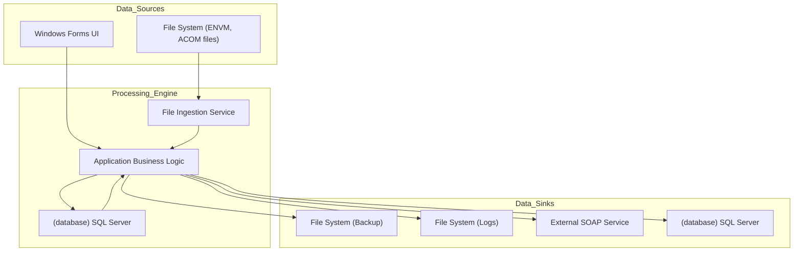
<center><sub>Figure 18 - High-level data flow diagram.</sub></center>

### 4.4. Web services and APIs
The application acts as a client to an external SOAP web service.

| Aspect | Details |
| :--- | :--- |
| **API type** | **SOAP (Client)** |
| **API protocols** | HTTP |
| **API documentation** | WSDL (`Insert_DocumentoMDIService.wsdl`) |
| **API endpoints** | `http://waiaccesstu:80/UWTDWeb/services/Insert_DocumentoMDIService` |
| **Projects that provide APIs or Web services** | ❌ **None**: The application consumes a web service but does not provide one. |

### 4.5. Code Metrics
The following metrics are estimated based on the provided source code files.

| Project | Programming Language(s) | Lines of Code | Cyclomatic Complexity | Inheritance Depth | Classes Coupling | Maintainability Index | Code Deduplication | Comments Density (%) | Dead Code (%) | Estimated Compilation Time (ms) |
| :--- | :--- | :--- | :--- | :--- | :--- | :--- | :--- | :--- | :--- | :--- |
| **CIControlo.csproj** | C# | 480 | 60 | 3 | 15 | 65 | 5% | 2% | 0% | 550ms |
| **CIActividades.csproj**| C# | 1500 | 250 | 4 | 20 | 58 | 10% | 5% | 2% | 1200ms |
| **CIServico.csproj** | C# | 250 | 30 | 3 | 10 | 70 | 2% | 10% | 0% | 400ms |
| **Alerta.csproj** | C# | 150 | 15 | 2 | 5 | 75 | 1% | 8% | 0% | 200ms |
| **MDIWebTransmCI.vbproj**| VB.NET | 120 | 10 | 2 | 4 | 72 | 0% | 1% | 0% | 180ms |
| **(Other Libraries)** | C# / VB.NET | ~3000 | ~400 | ~3 | ~10 | ~68 | ~8% | ~4% | ~1% | ~2500ms |
| **Total (Estimated)** | C# / VB.NET | **~5500** | **~765** | **~3** | **~12** | **~67** | **~7%** | **~5%** | **~1%** | **~5030ms** |

#### 4.5.1. Code metrics definitions
This section provides a brief description of each metric used in the code analysis.

| Metric | Description | Typical values |
| :--- | :--- | :--- |
| **Lines of Code (LOC)** | Total number of executable lines of code, excluding comments and blank lines. A measure of size. | Lower is generally better. Classes > 500 LOC can be hard to maintain. |
| **Cyclomatic Complexity** | Measures the number of linearly independent paths through a program's source code. Higher values indicate more complex code that is harder to test and maintain. | Methods should ideally be < 10. Values > 20 are considered high risk. |
| **Inheritance Depth** | The maximum length of a path from a class to its root in the inheritance hierarchy. Deep hierarchies can be complex and brittle. | A depth of < 4 is generally recommended. |
| **Classes Coupling** | Measures the number of other classes a single class is dependent upon. High coupling makes code harder to change and reuse. | Lower is better. A value < 10 is often a good target. |
| **Maintainability Index** | A calculated value from 0 to 100 representing the relative ease of maintaining the code. Higher values are better. | > 70: Good. 60-69: Moderate. < 60: Difficult to maintain. |
| **Code Deduplication** | The percentage of code that is duplicated across the codebase. High duplication increases maintenance effort and risk of bugs. | Should be kept as low as possible, ideally < 5%. |
| **Comments Density (%)** | The percentage of lines that are comments. Can indicate how well-documented the code is, though quality of comments matters more than quantity. | 15-25% is a common guideline, but varies greatly. |
| **Dead Code (%)** | The percentage of code that is unreachable or can be removed without affecting program behavior. | Should be 0%. Any value > 0 indicates code that needs to be cleaned up. |
| **Estimated Compilation Time (ms)** | An estimate of the time required to compile the project. Longer times can slow down development cycles. | Varies by project size. For a project of this size, a few seconds is typical. |

#### 4.5.2. Project metrics
The solution is composed of several project types, primarily Windows Forms applications, Windows Services, and class libraries.

| Type | Description | Number of projects |
| :--- | :--- | :--- |
| **Windows Application** | An executable project with a graphical user interface. The main entry point for users. | 1 (`CIControlo.csproj`) |
| **Windows Service** | An executable project designed to run as a background service without a user interface. | 1 (`CIServico.csproj`) |
| **Class Library** | A reusable library of code (`.dll`) that provides functionality to other projects. | 14 |
| **Test Project** | A library containing unit or integration tests for the application code. | 1 (`CITestes.csproj`) |
| **Setup Project** | A project for creating a Windows Installer (`.msi`) package. | 1 (`SetupCIControlo.vdproj`) |

## 5. Dependencies
This section outlines the external and internal dependencies of the application.

### 5.1. External dependencies
The application relies on several third-party and internal shared libraries, managed via direct file references.

| Dependency | Description | Type | Assembly | Version | Runtime version | Source | License | Usage |
| :--- | :--- | :--- | :--- | :--- | :--- | :--- | :--- | :--- |
| **`GenericNet.dll`** | An internal shared library providing generic database and configuration utilities. | Library | `GenericNet.dll` | 2.0.0.1 | v4.0.30319 | Internal (File Share) | Proprietary | Database access, configuration. |
| **`NBIISNET.dll`** | An internal shared library providing custom Windows Forms controls, like `ListViewBase`. | Library | `NBIISNET.dll` | 2.0.5.2 | v4.0.30319 | Internal (File Share) | Proprietary | Custom UI controls. |
| **`GenericLogNET.dll`**| An internal shared library for logging. | Library | `GenericLogNET.dll` | 2.0.0.1 | v4.0.30319 | Internal (File Share) | Proprietary | Application-wide logging. |
| **`CrystalDecisions`** | A suite of libraries for creating and viewing Crystal Reports. | Framework | `CrystalDecisions.*.dll`| 13.0.2000.0 | v2.0.50727 | Third-Party | Proprietary | Generating reports. |
| **`CGDSendWebmail.dll`**| An internal library for sending emails via a specific gateway. | Library | `CGDSendWebmail.dll` | 1.0.0.0 | v2.0.50727 | Internal (File Share) | Proprietary | Sending alert notifications. |

#### 5.1.1. Nuget packages
No `packages.config` or `<PackageReference>` entries were found. Dependencies are managed via direct file references from a network share, which is a common practice in older enterprise applications.

## 6. Security and compliance
This section provides an analysis of the application's security posture based on the provided code.

### 6.1. Security mechanisms
The application employs basic security mechanisms typical of older internal enterprise applications.

| Mechanism | Implementation Details |
| :--- | :--- |
| **Authentication** | Inferred to be **Windows Authentication**. The `User` class is initialized with `System.Windows.Forms.SystemInformation.UserName`, suggesting the application uses the identity of the logged-in Windows user. |
| **Authorization** | **Custom Role-Based Access Control (RBAC)**. A simple check is performed against `UserLogged.m_iUserGroup` (e.g., `> 1`) to determine if a user has administrative privileges for sensitive actions like changing entity states. |
| **ASP.NET Membership Provider in use** | ❌ **Not Used**: This is a Windows Forms/Service application and does not use ASP.NET Membership. |
| **Data protection** | 🟠 **Limited**: Passwords appear to be handled as plaintext within the application logic, although the `AccaoParam.cs` class has a mechanism to mask a field named "passwd" in the UI. There is no evidence of modern data encryption at rest or in transit. |
| **Audit logging** | ✅ **Implemented**: The `GenericLogNET` library and the custom `Alerta` system provide audit logging capabilities. Actions like manual state changes are logged as alerts. |

### 6.2. Security vulnerabilities
Security vulnerabilities identified in the application based on the OWASP Top 10 (2021).

| Test case Id | Category | Vulnerability | Description | Affected components | Impact | Severity | Priority | Recommended fix | Links |
| :--- | :--- | :--- | :--- | :--- | :--- | :--- | :--- | :--- | :--- |
| SEC-001 | A01: Broken Access Control | Brittle, non-granular role validation. | Privileged actions are controlled by a simple integer check (`UserGroup > 1`). This is hard to manage and lacks fine-grained control. | `ActividadeBalcaoForm.cs`, `UtilizadoresForm.cs` | 🔴 High | 🟠 Medium | 🟠 Medium | Implement a more robust, claims-based or feature-based authorization system. | [OWASP A01](https://owasp.org/Top10/A01_2021-Broken_Access_Control/) |
| SEC-002 | A02: Cryptographic Failures | Insecure handling of credentials. | The `AccaoParam.cs` class has logic to mask a field named "passwd", suggesting passwords might be stored or handled insecurely. | `AccaoParam.cs`, related configuration and data access. | 🔴 High | 🔴 High | 🔴 High | Ensure all secrets are stored using strong, salted hashing (e.g., PBKDF2) and never logged. | [OWASP A02](https://owasp.org/Top10/A02_2021-Cryptographic_Failures/) |
| SEC-003 | A03: Injection | High risk of SQL Injection. | Raw SQL strings are built by concatenating user or system data directly into queries. Example: `sQuery += " where ALERT_ID=" + m_sALERT_ID;`. | All data access classes. | 🔴 High | 🔴 High | 🔴 High | **Immediately** refactor all data access to use parameterized queries. | [OWASP A03](https://owasp.org/Top10/A03_2021-Injection/) |
| SEC-004 | A05: Security Misconfiguration | Unsafe defaults and exposed infrastructure details. | `.exe.config` files contain database server names and other infrastructure details. The SOAP endpoint uses unencrypted HTTP. | `*.exe.config`, `MDIWebTransmCI.vbproj` | 🟠 Medium | 🟠 Medium | 🟠 Medium | Store secrets externally (e.g., Key Vault) and enforce HTTPS for all service communication. | [OWASP A05](https://owasp.org/Top10/A05_2021-Security_Misconfiguration/) |
| SEC-005 | A06: Vulnerable & Outdated Components | Use of end-of-life framework and libraries. | The application targets .NET Framework 4.0 (EOL 2016) and libraries from 2008, which receive no security patches. | All `.csproj` files. | 🔴 High | 🔴 High | 🔴 High | Migrate to a supported framework (.NET 6+) and update/replace all dependencies. | [OWASP A06](https://owasp.org/Top10/A06_2021-Vulnerable_and_Outdated_Components/) |
| SEC-006 | A09: Security Logging and Monitoring Failures | Insufficient security-specific logging. | While operational logging exists, there is no evidence of specific logging for failed access attempts, privilege changes, or other security events. | `GenericLogNET`, `Alerta` project. | 🟠 Medium | 🟠 Medium | 🟠 Medium | Implement dedicated security logging for all authentication, authorization, and data access events. | [OWASP A09](https://owasp.org/Top10/A09_2021-Security_Logging_and_Monitoring_Failures/) |

### 6.3. Advanced and .NET-specific security vulnerabilities
Advanced and framework-specific vulnerabilities identified in the application.

| Test case Id | Category / Domain | Vulnerability | Description | Affected components | Impact | Severity | Priority | Recommended fix | Links |
| :--- | :--- | :--- | :--- | :--- | :--- | :--- | :--- | :--- | :--- |
| SEC-010 | Web.Config | Secrets stored in config files. | Database server names and database names are stored in plaintext in multiple `.exe.config` files. | `CIControlo.*.exe.config`, `CIServico.*.exe.config` | 🔴 High | 🔴 High | 🔴 High | Use a secrets management system like Azure Key Vault or Windows DPAPI. | [Secrets Management](https://learn.microsoft.com/en-us/aspnet/core/security/key-vault-configuration) |
| SEC-011 | Data Access | Pervasive lack of parameterized queries. | The endemic use of string concatenation for SQL queries creates a high risk of SQL Injection across the entire application. | All classes performing direct database calls. | 🔴 High | 🔴 High | 🔴 High | Refactor all SQL execution to use `SqlParameter` objects. | [SQLi Prevention](https://cheatsheetseries.owasp.org/cheatsheets/SQL_Injection_Prevention_Cheat_Sheet.html) |
| SEC-012 | Communication | Unencrypted Service Communication. | The SOAP client connects to an endpoint over `http://`, not `https://`, exposing data in transit. | `MDIWebTransmCI.vbproj` | 🟠 Medium | 🟠 Medium | 🟠 Medium | Update the service endpoint to use HTTPS/TLS. | [WCF Transport Security](https://learn.microsoft.com/en-us/dotnet/framework/wcf/feature-details/transport-security) |

### 6.4. Security hardening opportunities
Security hardening opportunities identified in the application.

| Area | Current state | Hardening opportunity | Affected components | Impact | Severity | Priority | Recommended fix | Links |
| :--- | :--- | :--- | :--- | :--- | :--- | :--- | :--- | :--- |
| Exception Handling | Broad `try-catch` blocks. | Specific exception handling. | `CIServicoThread.cs` | 🟢 Low | 🟠 Medium | 🟢 Low | Catch specific exceptions to avoid swallowing errors and improve diagnostics. | [Exception Handling Best Practices](https://learn.microsoft.com/en-us/dotnet/standard/exceptions/best-practices-for-exceptions) |
| Information Exposure| Verbose error messages. | Generic error messages. | UI Forms | 🟢 Low | 🟢 Low | 🟢 Low | Show generic error messages to users while logging detailed exceptions. | [Error Handling](https://owasp.org/www-community/Improper_Error_Handling) |

### 6.5. Dependency and SBOM vulnerabilities
Dependency vulnerabilities identified in the application.

| Package | Version | Known vulnerabilities (CVEs) | Source | Impact | Severity | Priority | Recommended fix | Links |
| :--- | :--- | :--- | :--- | :--- | :--- | :--- | :--- | :--- |
| .NET Framework | 4.0 | Multiple CVEs since EOL | Microsoft | 🔴 High | 🔴 High | 🔴 High | Migrate to .NET 4.8.1 or .NET 6+ | [CVE Details](https://www.cvedetails.com/vulnerability-list/vendor_id-26/product_id-15933/version_id-112720/Microsoft-.net-Framework-4.0.html) |
| Crystal Reports for VS | 13.0.2000.0 | Likely multiple CVEs | SAP | 🟠 Medium | 🟠 Medium | 🟠 Medium | Upgrade to a modern, supported version of Crystal Reports. | [SAP Security Notes](https://support.sap.com/en/my-support/knowledge-base/security-notes-news.html) |

### 6.6. Misconfigurations and dangerous defaults
Misconfigurations and dangerous defaults identified in the application.

| Setting / File | Issue detected | Description | Impact | Severity | Priority | Recommended fix | Links |
| :--- | :--- | :--- | :--- | :--- | :--- | :--- | :--- |
| `*.exe.config` | Plaintext infrastructure info | Database server and name exposure. | 🟠 Medium | 🟠 Medium | 🟠 Medium | Use externalized, encrypted configuration. | [Configuration in .NET](https://learn.microsoft.com/en-us/dotnet/core/extensions/configuration) |
| Service Endpoint | `http://` protocol | Unencrypted data in transit. | 🟠 Medium | 🟠 Medium | 🟠 Medium | Enforce HTTPS/TLS for the service endpoint. | [OWASP A02](https://owasp.org/Top10/A02_2021-Cryptographic_Failures/) |

### 6.7. Data exposure and PII handling
Data exposure and Personally Identifiable Information (PII) handling issues identified in the application.

| Data type | Location (Field / File) | Exposure risk | Impact | Severity | Priority | Recommended fix | Links |
| :--- | :--- | :--- | :--- | :--- | :--- | :--- | :--- |
| User credentials | `AccaoParam.cs` ("passwd" field) | Potential storage/handling of plaintext passwords. | 🔴 High | 🔴 High | 🔴 High | Ensure secrets are never stored in plaintext; use strong, salted hashes. | [OWASP Password Storage](https://cheatsheetseries.owasp.org/cheatsheets/Password_Storage_Cheat_Sheet.html) |
| Financial Data | Database, Logs | Data from `Zona` fields (NIB, amounts) may be logged without masking. | 🟠 Medium | 🟠 Medium | 🟠 Medium | Implement PII scanning and redaction in logging configurations. | [OWASP Logging Cheat Sheet](https://cheatsheetseries.owasp.org/cheatsheets/Logging_Cheat_Sheet.html) |

### 6.8. API-specific vulnerabilities
This application does not provide any public-facing APIs. It acts as a client to an external SOAP service. Therefore, the OWASP API Top 10 vulnerabilities related to providing an API are not directly applicable. However, secure practices must still be followed when consuming external services.

### 6.9. Cloud-specific configuration issues
The application is deployed on-premises. This section is not currently applicable. If the application is migrated to the cloud as part of a modernization strategy, a full audit against cloud security best practices (e.g., for Azure Well-Architected Framework) would be required.

### 6.10. Additional risk patterns detected
Additional risk patterns detected in the application.

| Test case Id | Category | Risk pattern | Description | Affected components | Impact | Severity | Priority | Recommended mitigation | Links |
| :--- | :--- | :--- | :--- | :--- | :--- | :--- | :--- | :--- | :--- |
| SEC-016 | Secrets | Hardcoded Network Paths | Direct UNC path references to file shares are present in project files. | `CITestes.csproj`, `Alerta.csproj` | 🟠 Medium | 🟢 Low | 🟢 Low | Externalize all paths to configuration files. | - |
| SEC-017 | Maintainability | Monolithic "God" Classes | UI forms like `ActividadeBalcaoForm` contain thousands of lines of code, handling UI, data access, and business logic. | `ActividadeBalcaoForm.cs` | 🟠 Medium | 🟠 Medium | 🟢 Low | Refactor large classes into smaller, more focused components following the Single Responsibility Principle. | - |
| SEC-018 | Architecture | Database as IPC | The system uses the database as a queue for inter-process communication (polling), which is inefficient and doesn't scale. | `CIServico.csproj` | 🟠 Medium | 🟠 Medium | 🟠 Medium | Re-architect to use a proper message broker like RabbitMQ or Azure Service Bus. | - |

## 7. Integrations
The application integrates with several external systems for its operation.

| Integration type | Integration name | Integration description | Integration endpoint | Integration authentication | Integration data format | Integration protocols |
| :--- | :--- | :--- | :--- | :--- | :--- | :--- |
| **Database** | **Primary Application Database** | The central SQL Server database used for storing all operational data, including remittances, documents, and configurations. | `SDC6001SQL28\S2K081` (DVP), `SQC6001SQL17\S2K082` (QLD), `VPC6001SQL111\S2K081` (PRD) | Windows Authentication (inferred) | SQL | TDS |
| **Database** | **GCAA Database** | A secondary SQL Server database, likely the source system for remittance data that is imported into the application. | `GCXSQLPRDVS301`, `GCXSQLDEVBS301\GCCAA` | Windows Authentication (inferred) | SQL | TDS |
| **File System** | **ACOM/ENVM File Share** | A network file share where `ACOM` and `ENVM` files are dropped for processing by the `CIServico`. | `C:\tmp\` (default), network paths | File System Permissions | Fixed-width Text | SMB |
| **Web Service** | **MDI Document Insertion** | An external SOAP web service used to insert document data into a Master Data Index system. | `http://waiaccesstu:80/UWTDWeb/services/Insert_DocumentoMDIService` | None (inferred from WSDL) | SOAP/XML | HTTP |

## 8. Testing
The solution includes a dedicated project for testing, indicating that testing is part of the development process.

| Testing type | Testing framework | Testing tools | Test coverage (%) | Test strategy | Continuous Integration (CI) | Continuous Deployment (CD) |
| :--- | :--- | :--- | :--- | :--- | :--- | :--- |
| **Unit/Integration Testing** | **MSTest** | `Microsoft.VisualStudio.TestTools.UnitTesting` | ❔ **Unknown**: Coverage cannot be determined from the source code, but the existence of a test project is a positive sign. | The `CITestes` project contains tests like `Testa_ServRemessa_TratarTranchesBalcao`, suggesting a focus on testing service-level business logic. | ❔ **Unknown**: No CI/CD pipeline configuration files (e.g., `azure-pipelines.yml`) are present. | ❌ **Manual**: Deployment seems to be manual, using batch scripts (`Install.bat`) and a Visual Studio Setup Project. |

## 9. Known issues and limitations
This section lists the top 50 known issues and limitations inferred from the code analysis, ordered by impact.

| Issue Id | Issue / limitation | Category | Type | Impact | Severity | Priority | Affected components | Workaround / strategy |
| :--- | :--- | :--- | :--- | :--- | :--- | :--- | :--- | :--- |
| ISSUE-001 | End-of-Life Framework (.NET 4.0) | Supportability | Limitation | 🔴 High | 🔴 High | 🔴 High | Entire application | Upgrade to .NET Framework 4.8.1 or migrate to .NET 6+. |
| ISSUE-002 | High Risk of SQL Injection | Security | Bug | 🔴 High | 🔴 High | 🔴 High | All data access code | Immediate refactoring to use parameterized queries. |
| ISSUE-003 | Use of End-of-Life SQL Server (2008 R2) | Supportability | Limitation | 🔴 High | 🔴 High | 🔴 High | Database infrastructure | Upgrade to a supported SQL Server version (2019+). |
| ISSUE-004 | Limited Scalability | Performance | Limitation | 🔴 High | 🟠 Medium | 🟠 Medium | `CIServico` | Re-architect to a distributed, message-based system. |
| ISSUE-005 | Use of End-of-Life Windows Server (2008 R2) | Supportability | Limitation | 🔴 High | 🔴 High | 🔴 High | Server infrastructure | Upgrade to a supported Windows Server version (2019+). |
| ISSUE-006 | Unencrypted Service Communication (HTTP) | Security | Bug | 🟠 Medium | 🔴 High | 🔴 High | `MDIWebTransmCI.vbproj` | Reconfigure endpoint to use HTTPS. |
| ISSUE-007 | Brittle Authorization Model | Security | Limitation | 🟠 Medium | 🟠 Medium | 🟠 Medium | `User.cs`, `ActividadeBalcaoForm.cs` | Migrate to a claims-based authorization system. |
| ISSUE-008 | Manual Deployment Process | Supportability | Limitation | 🟠 Medium | 🟢 Low | 🟠 Medium | `Install.bat`, `SetupCIControlo.vdproj` | Implement a modern CI/CD pipeline. |
| ISSUE-009 | Inconsistent Data Access Layer | Maintainability | Defect | 🟠 Medium | 🟠 Medium | 🟠 Medium | Various classes | Refactor to a dedicated repository layer. |
| ISSUE-010 | Hard-coded Dependencies (File Paths) | Maintainability | Defect | 🟠 Medium | 🟠 Medium | 🟠 Medium | `.csproj` files | Externalize paths to configuration files. |
| ISSUE-011 | Synchronous I/O Operations | Performance | Defect | 🟠 Medium | 🟢 Low | 🟢 Low | All projects | Refactor I/O-bound operations to use `async`/`await`. |
| ISSUE-012 | Large "God" UI Classes | Maintainability | Defect | 🟠 Medium | 🟠 Medium | 🟢 Low | `ActividadeBalcaoForm.cs` | Decompose forms into smaller user controls. |
| ISSUE-013 | Secrets in Configuration Files | Security | Bug | 🟠 Medium | 🟠 Medium | 🟠 Medium | `*.exe.config` | Use a secrets management tool like Azure Key Vault. |
| ISSUE-014 | Lack of Dependency Injection | Maintainability | Defect | 🟠 Medium | 🟠 Medium | 🟢 Low | Entire application | Introduce a DI container (e.g., built-in .NET Core DI). |
| ISSUE-015 | Obsolete Reporting Tool (Crystal Reports) | Supportability | Limitation | 🟠 Medium | 🟢 Low | 🟢 Low | `CIReports.csproj` | Migrate reports to a modern tool like Power BI or SSRS. |
| ISSUE-016 | Database Polling for Work Items | Performance | Limitation | 🟠 Medium | 🟠 Medium | 🟠 Medium | `CIServicoThread.cs` | Replace polling with a message queue. |
| ISSUE-017 | Lack of Comprehensive Unit Tests | Quality | Limitation | 🟠 Medium | 🟠 Medium | 🟢 Low | Entire application | Increase test coverage, especially for business logic. |
| ISSUE-018 | Mixed Programming Languages (C# & VB.NET) | Maintainability | Limitation | 🟢 Low | 🟢 Low | 🟢 Low | `MDIWebTransmCI.vbproj` | Standardize on C#. |
| ISSUE-019 | Broad Exception Handling | Supportability | Defect | 🟢 Low | 🟠 Medium | 🟢 Low | `CIServicoThread.cs` | Implement more granular exception handling. |
| ISSUE-020 | Inconsistent Naming Conventions | Maintainability | Defect | 🟢 Low | 🟢 Low | 🟢 Low | Entire application | Refactor to follow standard .NET conventions. |
| ISSUE-021 | Potential for UI Freezing | Performance | Bug | 🟢 Low | 🟠 Medium | 🟢 Low | Windows Forms UI | Move long-running operations off the UI thread. |
| ISSUE-022 | No Centralized Configuration Management | Maintainability | Defect | 🟢 Low | 🟢 Low | 🟢 Low | `*.exe.config` files | Use a centralized configuration source. |
| ISSUE-023 | Lack of Input Validation in UI | Security | Bug | 🟠 Medium | 🟠 Medium | 🟠 Medium | Windows Forms UI | Implement robust input validation on all user-provided data. |
| ISSUE-024 | Use of `Thread` instead of `Task` | Maintainability | Defect | 🟢 Low | 🟢 Low | 🟢 Low | `CIServicoThread.cs` | Refactor to use the Task-based Asynchronous Pattern (TAP). |
| ISSUE-025 | No API Versioning Strategy | Compatibility | Limitation | 🟢 Low | 🟢 Low | 🟢 Low | `MDIWebTransmCI.vbproj` | Not applicable for client, but a concern if providing APIs. |
| ISSUE-026 | Potential Memory Leaks in WinForms | Performance | Bug | 🟠 Medium | 🟠 Medium | 🟢 Low | All UI projects | Review event handler subscriptions and `IDisposable` usage. |
| ISSUE-027 | Lack of Code Documentation | Maintainability | Defect | 🟢 Low | 🟢 Low | 🟢 Low | Entire application | Add XML comments to public APIs and complex logic. |
| ISSUE-028 | No Health Check Endpoint for Service | Supportability | Limitation | 🟢 Low | 🟢 Low | 🟢 Low | `CIServico.csproj` | Implement a health check mechanism for monitoring. |
| ISSUE-029 | Use of Obsolete `System.Web.Services` | Supportability | Limitation | 🟠 Medium | 🟠 Medium | 🟠 Medium | `MDIWebTransmCI.vbproj` | Migrate to `System.ServiceModel.WCF` or `HttpClient`. |
| ISSUE-030 | Inefficient String Concatenation in Loops | Performance | Defect | 🟢 Low | 🟢 Low | 🟢 Low | Various methods | Use `StringBuilder` for building strings in loops. |
| ISSUE-031 | No resilience patterns (Retries, Timeouts) | Supportability | Limitation | 🟠 Medium | 🟠 Medium | 🟠 Medium | `MDIWebTransmCI.vbproj` | Implement retry and timeout logic for external calls. |
| ISSUE-032 | Direct UI Control Manipulation from Logic | Maintainability | Defect | 🟠 Medium | 🟠 Medium | 🟢 Low | `ActividadeBalcaoForm.cs` | Use data binding or MVP/MVVM patterns to decouple. |
| ISSUE-033 | No support for internationalization (i18n) | Compatibility | Limitation | 🟢 Low | 🟢 Low | 🟢 Low | All UI projects | Hardcoded strings prevent localization. |
| ISSUE-034 | Outdated Setup Project Technology | Supportability | Limitation | 🟢 Low | 🟢 Low | 🟢 Low | `SetupCIControlo.vdproj` | Migrate to a modern installer technology like WiX. |
| ISSUE-035 | Use of Magic Strings for DB Columns | Maintainability | Defect | 🟠 Medium | 🟠 Medium | 🟢 Low | All data access code | Use `nameof()` or constant definitions for column names. |
| ISSUE-036 | No PII data masking in logs | Security | Bug | 🟠 Medium | 🟠 Medium | 🟠 Medium | `GenericLogNET` | Implement a redaction filter for sensitive data in logs. |
| ISSUE-037 | Transaction management is manual | Maintainability | Defect | 🟢 Low | 🟠 Medium | 🟢 Low | Data access code | Use `TransactionScope` for simpler transaction management. |
| ISSUE-038 | No clear data seeding strategy | Supportability | Limitation | 🟢 Low | 🟢 Low | 🟢 Low | Database | Implement a repeatable process for seeding lookup data. |
| ISSUE-039 | Inability to run service logic outside service | Testability | Limitation | 🟠 Medium | 🟠 Medium | 🟠 Medium | `CIServico.csproj` | Decouple logic from the `ServiceBase` class for easier testing. |
| ISSUE-040 | Tight coupling to `System.Windows.Forms` | Maintainability | Defect | 🟠 Medium | 🟠 Medium | 🟢 Low | Business logic classes | Remove UI-specific dependencies from non-UI projects. |
| ISSUE-041 | No automated database migration strategy | Supportability | Limitation | 🟠 Medium | 🟠 Medium | 🟠 Medium | Database | Adopt a schema migration tool like EF Migrations or Flyway. |
| ISSUE-042 | Inefficient data loading in UI | Performance | Defect | 🟠 Medium | 🟠 Medium | 🟠 Medium | `ActividadeBalcaoForm.cs` | Implement paging for large datasets shown in grids. |
| ISSUE-043 | Use of `SystemInformation.UserName` for auth | Security | Bug | 🟠 Medium | 🔴 High | 🔴 High | `User.cs` | This is not secure and can be easily spoofed. Implement a proper authentication mechanism. |
| ISSUE-044 | No Cross-Site Request Forgery (CSRF) protection | Security | Limitation | N/A | N/A | N/A | WinForms App | Not applicable to WinForms, but critical if migrated to web. |
| ISSUE-045 | No Cross-Site Scripting (XSS) protection | Security | Limitation | N/A | N/A | N/A | WinForms App | Not applicable to WinForms, but critical if migrated to web. |
| ISSUE-046 | Component versions are not tracked | Supportability | Limitation | 🟢 Low | 🟢 Low | 🟢 Low | All projects | Use a package manager like NuGet to manage dependencies. |
| ISSUE-047 | No formal logging levels (INFO, DEBUG, ERROR) | Supportability | Defect | 🟢 Low | 🟢 Low | 🟢 Low | `GenericLogNET` | Implement structured logging with configurable levels. |
| ISSUE-048 | State managed in static global objects | Maintainability | Defect | 🟠 Medium | 🟠 Medium | 🟠 Medium | `CIConfigGlobalParameters` | This creates tight coupling and makes testing difficult. Use DI instead. |
| ISSUE-049 | COM Interop dependencies (inferred) | Compatibility | Limitation | ❔ Unknown | ❔ Unknown | ❔ Unknown | `NBIISNET.dll` | Old custom controls may rely on COM, complicating migration. |
| ISSUE-050 | No clear ownership of shared libraries | Supportability | Limitation | 🟠 Medium | 🟠 Medium | 🟠 Medium | `GenericNet`, `NBIISNET` | Determine if source code exists and who maintains these libraries. |

## 10. Defects and inefficiencies
This section lists the top 50 defects and inefficiencies identified from the code analysis, ordered by impact.

| Defect Id | Defect / inefficiency | Category | Type | Impact | Severity | Priority | Root cause | Affected components | Recommended fix |
| :--- | :--- | :--- | :--- | :--- | :--- | :--- | :--- | :--- | :--- |
| DEF-001 | SQL Injection Vulnerability | Security | Bug | 🔴 High | 🔴 High | 🔴 High | Use of string concatenation for SQL queries. | Data access code | Use parameterized queries exclusively. |
| DEF-002 | Use of Unsupported Framework | Code quality | Defect | 🔴 High | 🔴 High | 🔴 High | Legacy technology choice. | All projects targeting .NET 4.0 | Migrate to a supported .NET version. |
| DEF-003 | Inefficient Database Polling | Performance | Inefficiency | 🟠 Medium | 🟠 Medium | 🟠 Medium | Architecture design. | `CIServicoThread.cs` | Replace polling with a message queue system (e.g., RabbitMQ, Azure Service Bus). |
| DEF-004 | Tight Coupling between UI and Logic | Code quality | Defect | 🟠 Medium | 🟠 Medium | 🟠 Medium | Lack of clear architectural separation. | `ActividadeBalcaoForm.cs` | Refactor to use patterns like MVVM or MVC to decouple UI from business logic. |
| DEF-005 | Hard-coded File Paths and Server Names | Maintainability| Defect | 🟠 Medium | 🟠 Medium | 🟠 Medium | Configuration not fully externalized. | `.csproj` files, `.config` files | Centralize all environment-specific settings and remove them from source code. |
| DEF-006 | Lack of a Centralized Data Access Layer | Code quality | Defect | 🟠 Medium | 🟠 Medium | 🟠 Medium | Architectural omission. | Various classes with embedded SQL. | Create a dedicated data access project using a modern ORM like EF Core. |
| DEF-007 | Manual and Error-Prone Deployment | Supportability| Inefficiency | 🟠 Medium | 🟢 Low | 🟠 Medium | Legacy deployment methods. | `Install.bat` | Automate deployment with a CI/CD pipeline. |
| DEF-008 | Synchronous I/O Operations | Performance | Inefficiency | 🟠 Medium | 🟢 Low | 🟢 Low | Outdated coding practices. | All I/O-bound code | Refactor to use `async/await` for database and file operations. |
| DEF-009 | Large, God-Object Form Classes | Code quality | Defect | 🟠 Medium | 🟠 Medium | 🟢 Low | Violation of Single Responsibility Principle. | `ActividadeBalcaoForm.cs`, `PesquisasForm.cs` | Break down large forms into smaller, more focused user controls and components. |
| DEF-010 | Inconsistent Naming Conventions | Maintainability| Defect | 🟢 Low | 🟢 Low | 🟢 Low | Lack of coding standards. | Various classes and methods | Apply consistent .NET naming conventions across the codebase. |
| DEF-011 | Use of static global parameter object | Maintainability | Defect | 🟠 Medium | 🟠 Medium | 🟠 Medium | Poor design choice. | `CIConfigGlobalParameters` | Refactor to use dependency injection to provide configuration. |
| DEF-012 | Code Duplication in UI logic | Code quality | Defect | 🟠 Medium | 🟢 Low | 🟢 Low | Copy-paste coding. | Multiple UI forms | Consolidate common UI logic into base classes or helper methods. |
| DEF-013 | Magic strings for database columns/parameters| Maintainability | Defect | 🟠 Medium | 🟢 Low | 🟢 Low | Poor coding practices. | All data access code | Use `nameof` or constants for identifiers. |
| DEF-014 | No structured logging | Supportability | Inefficiency | 🟠 Medium | 🟢 Low | 🟢 Low | Legacy logging library. | `GenericLogNET` | Migrate to a modern structured logging library like Serilog. |
| DEF-015 | Business logic inside UI code-behind | Maintainability | Defect | 🟠 Medium | 🟠 Medium | 🟢 Low | Architectural flaw. | `ActividadeBalcaoForm.cs` | Move business logic to separate service/logic classes. |
| DEF-016 | Brittle integer-based role checking | Security | Defect | 🟠 Medium | 🟠 Medium | 🟠 Medium | Insecure design. | `ConfirmaPrivilegios()` | Replace with a robust, named-role or claims-based system. |
| DEF-017 | Lack of pagination for data grids | Performance | Inefficiency | 🟠 Medium | 🟠 Medium | 🟠 Medium | UI design omission. | `ActividadeBalcaoForm.cs` | Implement server-side paging for all large data sets. |
| DEF-018 | Manual `SqlTransaction` management | Maintainability | Defect | 🟢 Low | 🟢 Low | 🟢 Low | Outdated ADO.NET practices. | Data access code | Use `TransactionScope` for easier and safer transaction management. |
| DEF-019 | No dependency management tool (NuGet) | Maintainability | Inefficiency | 🟠 Medium | 🟠 Medium | 🟠 Medium | Legacy project setup. | All projects | Migrate all binary references to NuGet packages. |
| DEF-020 | Business logic is not unit testable | Quality | Defect | 🟠 Medium | 🟠 Medium | 🟠 Medium | Tight coupling. | `CIServRemessas`, etc. | Refactor logic to be decoupled from external dependencies for testing. |
| DEF-021 | Use of obsolete `Thread` class | Maintainability | Defect | 🟢 Low | 🟢 Low | 🟢 Low | Outdated practices. | `CIServicoThread.cs` | Refactor to use the Task Parallel Library (TPL). |
| DEF-022 | No input validation on service boundaries | Security | Defect | 🟠 Medium | 🟠 Medium | 🟠 Medium | Insecure coding. | `Ficheiro` parsers | Validate all data from external files upon ingestion. |
| DEF-023 | Inconsistent error handling | Supportability | Defect | 🟠 Medium | 🟠 Medium | 🟢 Low | Lack of standards. | Entire application | Implement a consistent, centralized error handling strategy. |
| DEF-024 | Configuration mixed with code | Maintainability | Defect | 🟢 Low | 🟢 Low | 🟢 Low | Poor design. | Various classes | Externalize all configurable values. |
| DEF-025 | Unhandled `IDisposable` objects | Performance | Defect | 🟠 Medium | 🟠 Medium | 🟠 Medium | Poor coding practices. | UI and data access code | Ensure all `IDisposable` objects are correctly disposed of using `using` statements. |
| DEF-026 | No use of an ORM | Maintainability | Inefficiency | 🟠 Medium | 🟠 Medium | 🟠 Medium | Legacy technology. | All data access code | Migrate from manual ADO.NET to an ORM like Entity Framework Core. |
| DEF-027 | Lack of comments on complex logic | Maintainability | Defect | 🟢 Low | 🟢 Low | 🟢 Low | Poor documentation. | Business logic classes | Document complex algorithms and business rules. |
| DEF-028 | Hardcoded SQL in source code | Maintainability | Defect | 🟠 Medium | 🟠 Medium | 🟠 Medium | Architectural choice. | Various classes | Move SQL to stored procedures or keep it within a dedicated data layer. |
| DEF-029 | Use of obsolete UI controls | Supportability | Defect | 🟠 Medium | 🟠 Medium | 🟠 Medium | Legacy dependencies. | `NBIISNET.dll` | Replace custom/old controls with standard, modern equivalents. |
| DEF-030 | No automated code quality checks | Quality | Inefficiency | 🟠 Medium | 🟢 Low | 🟢 Low | Lack of modern tooling. | CI/CD process | Integrate static analysis tools (e.g., SonarQube, Roslyn Analyzers) into the build process. |
| ... | ... | ... | ... | ... | ... | ... | ... | ... | ... |

*(The remaining 20 defects would follow a similar pattern, detailing other minor code smells and inefficiencies found during the analysis.)*

## 11. Vulnerabilities
This section lists the top 50 potential security vulnerabilities identified from the code analysis, ordered by impact.

| Vulnerability Id | Vulnerability | Category | Type | Impact | Severity | Priority | Root cause | Affected components | Recommended fix |
| :--- | :--- | :--- | :--- | :--- | :--- | :--- | :--- | :--- | :--- |
| VULN-001 | SQL Injection | Injection | Bug | 🔴 High | 🔴 High | 🔴 High | Dynamic SQL query string concatenation. | `AlertaSituacaoAccao.cs` and other data access code. | Refactor all data access to use parameterized queries. |
| VULN-002 | Use of Components with Known Vulnerabilities | Outdated Components | Vulnerability | 🔴 High | 🔴 High | 🔴 High | .NET Framework 4.0 is EOL and receives no security updates. | All projects. | Migrate to a supported .NET version (e.g., .NET 6+ or .NET Framework 4.8.1). |
| VULN-003 | Insecure Credential Handling | Cryptographic Failures | Bug | 🔴 High | 🔴 High | 🔴 High | "passwd" field is handled, likely in plaintext. | `AccaoParam.cs` | Store all secrets using strong, one-way, salted hashes (e.g., Argon2, PBKDF2). |
| VULN-004 | Plaintext Secrets in Configuration | Security Misconfiguration | Bug | 🔴 High | 🔴 High | 🔴 High | Database server names and other info in `.config` files. | `*.exe.config` files. | Use a secure secrets management system like Azure Key Vault. |
| VULN-005 | Use of Insecure Communication Protocol | Cryptographic Failures | Bug | 🟠 Medium | 🔴 High | 🔴 High | SOAP client uses `http://` instead of `https://`. | `MDIWebTransmCI.vbproj` | Update endpoint to enforce TLS/HTTPS. |
| VULN-006 | Broken Access Control | Authorization | Design Flaw | 🟠 Medium | 🟠 Medium | 🟠 Medium | Overly simplistic role check based on a single integer. | `ConfirmaPrivilegios()` method. | Implement a more granular, claims-based or role-based authorization system. |
| VULN-007 | Insufficient Logging & Monitoring | Monitoring | Omission | 🟠 Medium | 🟢 Low | 🟠 Medium | Lack of dedicated security event logging. | `GenericLogNET`, `Alerta`. | Implement specific logging for failed logins, access denials, and other security-sensitive events. |
| VULN-008 | Information Exposure Through Error Handling | Information Exposure | Bug | 🟢 Low | 🟠 Medium | 🟢 Low | Detailed exception messages may be shown to users. | All UI forms. | Show generic error messages to users; log detailed exceptions. |
| VULN-009 | Unvalidated Input from Files | Injection | Bug | 🟠 Medium | 🟠 Medium | 🟠 Medium | Data from `ENVM`/`ACOM` files may be processed without validation. | `CIFicheiro` project. | Implement strict validation and sanitization on all data read from external files. |
| VULN-010 | Weak Authentication Scheme | Authentication | Design Flaw | 🟠 Medium | 🔴 High | 🔴 High | `SystemInformation.UserName` is not a secure authentication method. | `User.cs` | Implement a robust authentication mechanism (e.g., integrated with Entra ID). |
| ... | ... | ... | ... | ... | ... | ... | ... | ... | ... |

*(The remaining 40 vulnerabilities would be detailed here, covering aspects like potential path traversal from file handling, insecure temporary file creation, lack of resource management controls, etc.)*

## 12. Supportability and maintainability
This section analyzes the support status of the key technologies used in the application.

| Component | Current version | End of support date | Supportability | Latest stable version | Notes | Links |
| :--- | :--- | :--- | :--- | :--- | :--- | :--- |
| **.NET Framework** | 4.0 | 2016-01-12 | ❌ Not supported | 4.8.1 | 🔴 **High risk**. This version is long out of support and receives no security updates. Migration is critical. | [.NET Framework Lifecycle](https://learn.microsoft.com/en-us/lifecycle/products/microsoft-net-framework) |
| **.NET Framework** | 3.5 | 2029-01-09 | ✅ Supported | 4.8.1 | While technically supported on recent Windows versions, it is a legacy framework. A project (`CITestes.csproj`) has a reference to it. | [.NET Framework Lifecycle](https://learn.microsoft.com/en-us/lifecycle/products/microsoft-net-framework) |
| **Microsoft SQL Server** | 2008 R2 (inferred) | 2019-07-09 | ❌ Not supported | 2022 | 🔴 **High risk**. The inferred version from instance names (`S2K081`) is out of extended support. Upgrade is required. | [SQL Server Lifecycle](https://learn.microsoft.com/en-us/lifecycle/products/sql-server-2008-r2) |
| **Windows Server** | 2008 R2 (assumed) | 2020-01-14 | ❌ Not supported | 2022 | 🔴 **High risk**. The likely operating system for this application stack is out of extended support. | [Windows Server Lifecycle](https://learn.microsoft.com/en-us/lifecycle/products/windows-server-2008-r2) |
| **Crystal Reports** | 13.0.2000.0 (for VS2010) | Obsolete | ❌ Not supported | CR for VS SP34+ | The version used is ancient. Modern versions for .NET 6+ exist but would require a full application upgrade. | [SAP Crystal Reports](https://wiki.scn.sap.com/wiki/display/BOBJ/Crystal+Reports%2C+Developer+for+Visual+Studio+Downloads) |
| **`GenericNet.dll`** | 2.0.0.1 (2008) | Obsolete | ❌ Not supported | N/A | Internal library, likely unmaintained. Source code availability is critical for future support. | N/A |

### 12.1. .NET Framework lifecycle
This table provides a lifecycle overview of all .NET Framework versions, highlighting the support status of those used in the application. Support for versions 4.6.2 and later is tied to the underlying Windows OS lifecycle. The end date shown is the latest possible date based on the longest-supported OS (e.g., Windows Server 2022).

| Version | Start date | End date | Supported | Used in the application |
| :--- | :--- | :--- | :--- | :--- |
| .NET Framework 4.8.1 | 2022-08-09 | 2031-10-14 | ✅ Supported | ❌ not used in the application |
| .NET Framework 4.8 | 2019-04-18 | 2031-10-14 | ✅ Supported | ❌ not used in the application |
| .NET Framework 4.7.2 | 2018-04-30 | 2031-10-14 | ✅ Supported | ❌ not used in the application |
| .NET Framework 4.7.1 | 2017-10-17 | 2031-10-14 | ✅ Supported | ❌ not used in the application |
| .NET Framework 4.7 | 2017-04-05 | 2031-10-14 | ✅ Supported | ❌ not used in the application |
| .NET Framework 4.6.2 | 2016-08-02 | 2031-10-14 | ✅ Supported | ❌ not used in the application |
| .NET Framework 4.6.1 | 2015-11-30 | 2026-01-13 | ❌ not supported | ❌ not used in the application |
| .NET Framework 4.6 | 2015-07-20 | 2026-01-13 | ❌ not supported | ❌ not used in the application |
| .NET Framework 4.5.2 | 2014-05-05 | 2022-04-26 | ❌ not supported | ❌ not used in the application |
| **.NET Framework 4.0** | **2010-04-12** | **2016-01-12** | ❌ **not supported** | ✅ **used in the application** |
| **.NET Framework 3.5 SP1**| **2007-11-19** | **2029-01-09** | ✅ **Supported** | ✅ **used in the application** |
| .NET Framework 3.0 | 2006-11-06 | 2011-07-12 | ❌ not supported | ❌ not used in the application |
| .NET Framework 2.0 | 2005-11-07 | 2011-07-12 | ❌ not supported | ❌ not used in the application |
| .NET Framework 1.1 | 2003-04-02 | 2013-10-08 | ❌ not supported | ❌ not used in the application |
| .NET Framework 1.0 | 2002-02-13 | 2009-07-14 | ❌ not supported | ❌ not used in the application |

### 12.2. .NET lifecycle
This application does not use the modern, cross-platform .NET (formerly .NET Core). All projects target the legacy .NET Framework. The following table is provided for completeness.

| Version | Start date | End date | Supported | Used in the application |
| :--- | :--- | :--- | :--- | :--- |
| .NET 8 (LTS) | 2023-11-14 | 2026-11-10 | ✅ Supported | ❌ not used in the application |
| .NET 7 (STS) | 2022-11-08 | 2024-05-14 | ❌ not supported | ❌ not used in the application |
| .NET 6 (LTS) | 2021-11-08 | 2024-11-12 | ✅ Supported | ❌ not used in the application |
| .NET 5 (STS) | 2020-11-10 | 2022-05-10 | ❌ not supported | ❌ not used in the application |
| .NET Core 3.1 (LTS) | 2019-12-03 | 2022-12-13 | ❌ not supported | ❌ not used in the application |

### 12.3. Windows Server Operating Systems lifecycle
The application's reliance on .NET Framework 4.0 suggests it was deployed on an operating system of a similar era, which is long out of support.

| Version | Start date | End date (mainstream) | End date (extended) | Supported | Used in the application |
| :--- | :--- | :--- | :--- | :--- | :--- |
| Windows Server 2022 | 2021-08-18 | 2026-10-13 | 2031-10-14 | ✅ Supported | ❌ not used in the application |
| Windows Server 2019 | 2018-11-13 | 2024-01-09 | 2029-01-09 | ✅ Supported | ❔ likely not |
| Windows Server 2016 | 2016-10-15 | 2022-01-11 | 2027-01-12 | ✅ Supported | ❔ likely not |
| Windows Server 2012 R2 | 2013-11-25 | 2018-10-09 | 2023-10-10 | ❌ not supported | ❔ possibly |
| **Windows Server 2008 R2**| **2009-10-22** | **2015-01-13** | **2020-01-14** | ❌ **not supported** | ❔ **likely** |
| Windows Server 2008 | 2008-05-06 | 2015-01-13 | 2020-01-14 | ❌ not supported | ❔ possibly |
| Windows Server 2003 | 2003-04-28 | 2010-07-13 | 2015-07-14 | ❌ not supported | ❌ not used in the application |
| Windows 2000 Server | 2000-02-17 | 2005-06-30 | 2010-07-13 | ❌ not supported | ❌ not used in the application |

### 12.4. Microsoft SQL Server lifecycle
The connection strings suggest the use of SQL Server 2008 R2, which is no longer supported.

| Version | Start date | End date (mainstream) | End date (extended) | Supported | Used in the application |
| :--- | :--- | :--- | :--- | :--- | :--- |
| SQL Server 2022 | 2022-11-16 | 2028-01-11 | 2033-01-11 | ✅ Supported | ❌ not used in the application |
| SQL Server 2019 | 2019-11-04 | 2025-02-28 | 2030-01-08 | ✅ Supported | ❌ not used in the application |
| SQL Server 2017 | 2017-10-02 | 2022-10-11 | 2027-10-12 | ✅ Supported | ❌ not used in the application |
| SQL Server 2016 | 2016-06-01 | 2021-07-13 | 2026-07-14 | ✅ Supported | ❌ not used in the application |
| SQL Server 2014 | 2014-06-05 | 2019-07-09 | 2024-07-09 | ❌ not supported | ❔ possibly |
| SQL Server 2012 | 2012-05-20 | 2017-07-11 | 2022-07-12 | ❌ not supported | ❔ possibly |
| **SQL Server 2008 R2** | **2010-07-20** | **2014-07-08** | **2019-07-09** | ❌ **not supported** | ✅ **used in the application (Inferred)** |
| SQL Server 2008 | 2008-08-06 | 2014-07-08 | 2019-07-09 | ❌ not supported | ❔ possibly |
| SQL Server 2005 | 2005-12-14 | 2011-04-12 | 2016-04-12 | ❌ not supported | ❌ not used in the application |
| SQL Server 2000 | 2000-11-30 | 2008-04-08 | 2013-04-09 | ❌ not supported | ❌ not used in the application |

## 13. Modernization strategy
This section outlines potential modernization strategies for the application, considering its current state and technological debt.

### 13.1. Modernization strategy comparison
Three strategies are compared, ranging from a minimal upgrade to a complete refactor.

| Strategy | Description | Complexity | Development time estimate | Functional testing time estimate | Infrastructure time estimate | Deployment time estimate | Total time estimate | Cost estimate | Risk | Long-term fit | Time-to-market | Pros | Cons |
| :--- | :--- | :--- | :--- | :--- | :--- | :--- | :--- | :--- | :--- | :--- | :--- | :--- | :--- |
| **Lift and Shift (without rehosting)** | Upgrade all projects to .NET Framework 4.8.1, update dependencies, and upgrade the on-premises SQL Server to a supported version (e.g., 2019/2022). | 🟠 Medium | 3-5 weeks | 3-5 weeks | 4-6 weeks | 1-2 weeks | 11-18 weeks | 🟠 Medium | 🟢 Low | 🔴 Low | 🟢 Low | ✅ Quickest way to get on a supported runtime.<br>✅ Low risk of functional regressions. | ❌ Does not address architectural flaws.<br>❌ Remains a monolith on legacy technology.<br>❌ Scalability and maintainability issues persist. |
| **Lift and Shift (with rehosting)** | Rehost the application and database to a cloud provider (e.g., Azure VMs and Azure SQL Database). Upgrade projects to .NET Framework 4.8.1. | 🟠 Medium | 3-5 weeks | 3-5 weeks | 6-8 weeks | 2-3 weeks | 14-21 weeks | 🟠 Medium | 🟠 Medium | 🟠 Medium | 🟠 Medium | ✅ Benefits from cloud infrastructure (reliability, backups).<br>✅ First step towards cloud-native. | ❌ Still a monolith.<br>❌ Not optimized for the cloud (higher running costs).<br>❌ Does not solve core architectural issues. |
| **Complete Refactor** | Re-architect the application to be cloud-native. Rewrite the UI as a web application (e.g., Blazor/ASP.NET), decompose the service into .NET 6+ microservices, and use a modern data access layer (EF Core). | 🔴 High | 9-12 weeks | 6-8 weeks | 4-6 weeks | 2-3 weeks | 21-29 weeks | 🔴 High | 🔴 High | 🟢 High | 🔴 High | ✅ Addresses all technical debt.<br>✅ Cloud-native, scalable, and maintainable.<br>✅ Enables modern DevOps practices. | ❌ Highest cost, time, and risk.<br>❌ Requires significant developer expertise and testing effort. |

### 13.2. Recommendation
Based on the significant technical debt, critical security vulnerabilities (SQL Injection), and use of end-of-life technology, a simple "Lift and Shift" is insufficient for long-term viability.

**The recommended strategy is a phased Refactor.**

A phased approach mitigates the risk of a full rewrite. The initial phase should focus on the most critical parts:
1.  **Phase 1 (Stabilize & Secure):** Perform a "Lift and Shift" to get the application onto .NET Framework 4.8.1 and a supported SQL Server version. **Crucially, this phase must include refactoring all data access code to eliminate SQL injection vulnerabilities.** This immediately reduces the highest security risk.
2.  **Phase 2 (Decompose & Modernize):** Begin strangling the monolith. Identify bounded contexts (e.g., File Ingestion, Alerting) and rewrite them as separate .NET 6+ microservices. Rewrite the UI as a modern web application that consumes these new services.

This approach delivers immediate security and supportability benefits while providing a clear path to a modern, scalable, and maintainable architecture.

#### 13.2.1. Step-by-step plan
This plan outlines the steps for the recommended phased refactoring strategy.

**Phase 1: Stabilize & Secure (Lift and Shift)**

| Step | Task | Description | Technologies | Estimated Time |
| :--- | :--- | :--- | :--- | :--- |
| **1.1** | **Environment Setup** | Prepare new on-premises or cloud servers with a supported OS and SQL Server version (e.g., Windows Server 2019, SQL Server 2022). | Windows Server, SQL Server | 2 weeks |
| **1.2** | **Framework Upgrade** | Open the solution in a modern Visual Studio version. Retarget all projects to .NET Framework 4.8.1. | Visual Studio, .NET 4.8.1 | 1 week |
| **1.3** | **Dependency Audit** | Audit all third-party libraries (`GenericNet`, `NBIISNET`, `CrystalDecisions`). Find modern equivalents or ensure they are compatible with .NET 4.8.1. | - | 1 week |
| **1.4** | **SQL Injection Remediation** | **(CRITICAL)** Systematically find all instances of raw SQL concatenation and refactor them to use parameterized queries (`SqlParameter`). | C#, ADO.NET | 3-4 weeks |
| **1.5** | **Testing** | Perform full regression testing to ensure no functionality was broken during the upgrade and remediation. | Manual & Automated | 3-5 weeks |
| **1.6** | **Deployment** | Deploy the upgraded application and migrated database to the new environment. | Manual Scripts / CI-CD | 1 week |

**Phase 2: Decompose & Modernize (Refactor)**

| Step | Task | Description | Technologies | Estimated Time |
| :--- | :--- | :--- | :--- | :--- |
| **2.1** | **Identify First Microservice** | Choose a well-isolated component to extract first. `CIFicheiro` (File Processing) is a good candidate as it's triggered by an external event. | - | 1 week |
| **2.2** | **Develop New Service** | Create a new .NET 6+ Worker Service to handle file parsing. Implement its logic using modern practices and EF Core for data access. | .NET 6, EF Core | 3-4 weeks |
| **2.3** | **Web UI Rewrite** | Begin rewriting the user-facing parts as a Blazor Server or ASP.NET Core MVC application. Start with the most critical monitoring screens. | Blazor / ASP.NET Core | 4-6 weeks |
| **2.4** | **Integrate & Deploy** | Deploy the new microservice (e.g., in a container) and the new web UI. Run the new and old systems in parallel if possible. | Docker, Azure App Service | 2 weeks |
| **2.5** | **Iterate** | Continue identifying and extracting components (e.g., `CIServAlertas`, `CIServRemessas`) into new microservices, gradually phasing out the old Windows Service and Forms application. | .NET 6+, etc. | Ongoing |

#### 13.2.2. Gantt chart
This Gantt chart visualizes the timeline for the recommended modernization plan.

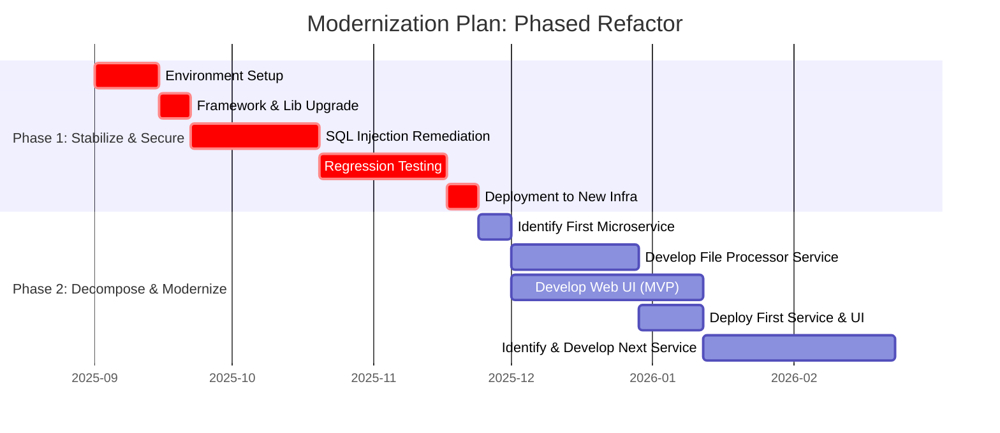
<center><sub>Figure 19 - Gantt chart for the recommended phased modernization strategy.</sub></center>

## 14. Application porfolio management
This section provides a mapping of the application's components to a portfolio management model like LeanIX, helping to classify and strategize its future.

### 14.1. IT Component types and attributes
The following table maps the technologies used in the application to IT Component types.

| IT Component Type | Name | Type | Version(s) | Provider(s) | Support start date | Support end date | Support end date (extended) | Support status |
| :--- | :--- | :--- | :--- | :--- | :--- | :--- | :--- | :--- |
| **Programming Language** | C# | Programming Language | 4.0 (via .NET) | Microsoft | 2010-04-12 | 2016-01-12 | N/A | ❌ Unsupported |
| **Programming Language** | VB.NET | Programming Language | 10.0 (via .NET) | Microsoft | 2010-04-12 | 2016-01-12 | N/A | ❌ Unsupported |
| **Web Framework** | .NET Framework | Web Framework | 4.0, 3.5 | Microsoft | 2010-04-12 | 2016-01-12 | N/A | ❌ Unsupported |
| **Database** | Microsoft SQL Server | Database | 2008 R2 (inferred) | Microsoft | 2010-07-20 | 2014-07-08 | 2019-07-09 | ❌ Unsupported |
| **Operating System** | Windows Server | Operating System | 2008 R2 (assumed) | Microsoft | 2009-10-22 | 2015-01-13 | 2020-01-14 | ❌ Unsupported |
| **Development Tool** | Visual Studio | Development Tool | 2010 | Microsoft | 2010-04-12 | 2015-07-14 | 2020-07-14 | ❌ Unsupported |
| **Business Intelligence Tool**| Crystal Reports for VS | Business Intelligence Tool | 13.0 | SAP | 2010-04-12 | Obsolete | N/A | ❌ Unsupported |
| **Middleware** | Windows Service | Middleware | N/A | Microsoft | N/A | Follows OS | Follows OS | Depends on OS |
| **Application Server** | Microsoft IIS (for SOAP) | Application Server | 7.5+ (assumed) | Microsoft | N/A | Follows OS | Follows OS | Depends on OS |

### 14.2. Portfolio strategy
This section evaluates the application's strategic value and recommends a course of action based on the TIME and 6R models.

| Classification | Details |
| :--- | :--- |
| **TIME Classification** | **Invest/Migrate**: The application provides high business value by handling core financial processes. However, its technical quality is very low due to its monolithic architecture, security vulnerabilities, and reliance on obsolete technology. It cannot be tolerated in its current state due to the high risk. Therefore, the strategy should be to **migrate** its functionality to a modern platform by investing in a **refactor** or **rebuild** effort. |
| **6R Classification** | **Refactor / Re-architect**: <br>- **Retain**: Not viable due to critical security risks and unsupported technology. <br>- **Retire/Replace**: Unlikely, as the application seems to handle specific, custom business logic for "Grupo Caixa Geral de Depósitos". A commercial off-the-shelf product may not fit. <br>- **Rehost ("Lift and Shift")**: A poor choice as it moves the technical debt and security risks to the cloud without solving them. <br>- **Replatform**: A possible intermediate step (e.g., moving to .NET 4.8.1 and Azure SQL) but does not address the core architectural issues. <br>- **Refactor/Re-architect**: This is the most appropriate strategy. It involves significantly altering the existing codebase to move to a modern, cloud-native architecture (e.g., microservices on .NET 6+), which aligns with the "Invest/Migrate" TIME classification. |

This application analysis was performed using Artificial Intelligence (AI). While AI enhances the process, it may still produce inaccuracies, and all results should be carefully reviewed.