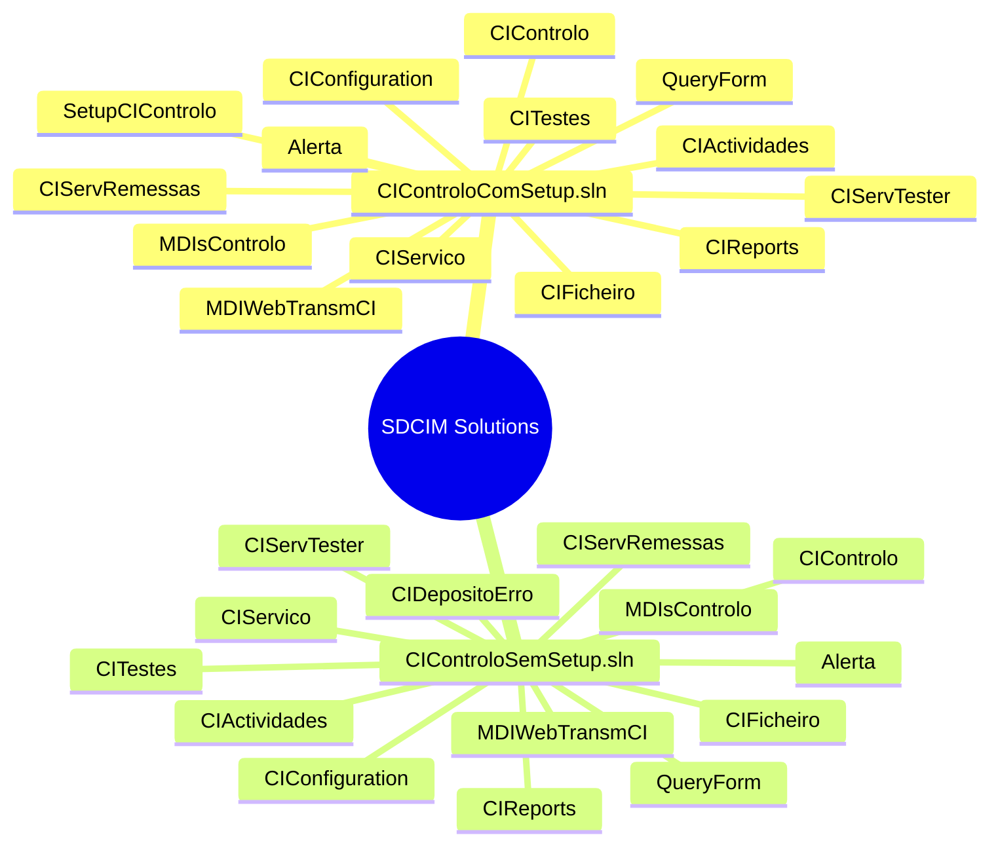
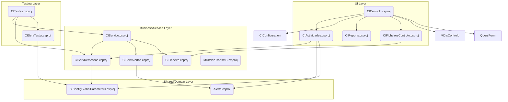
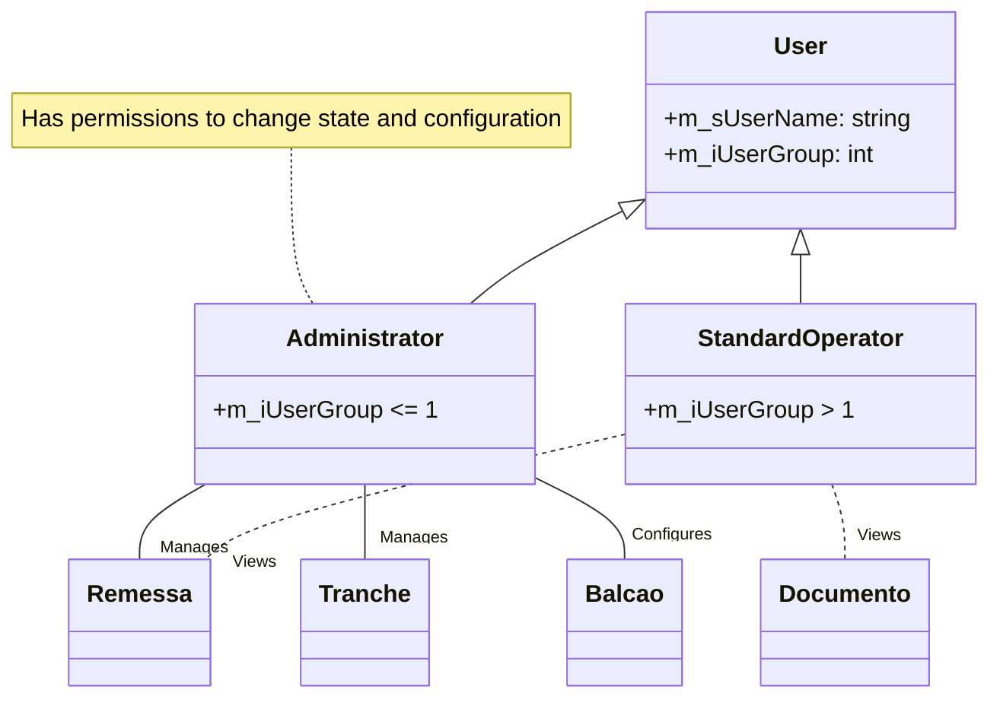
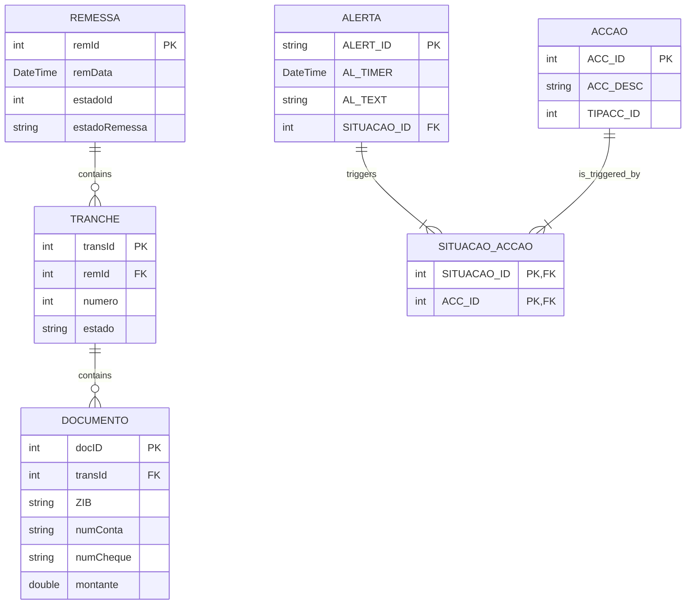
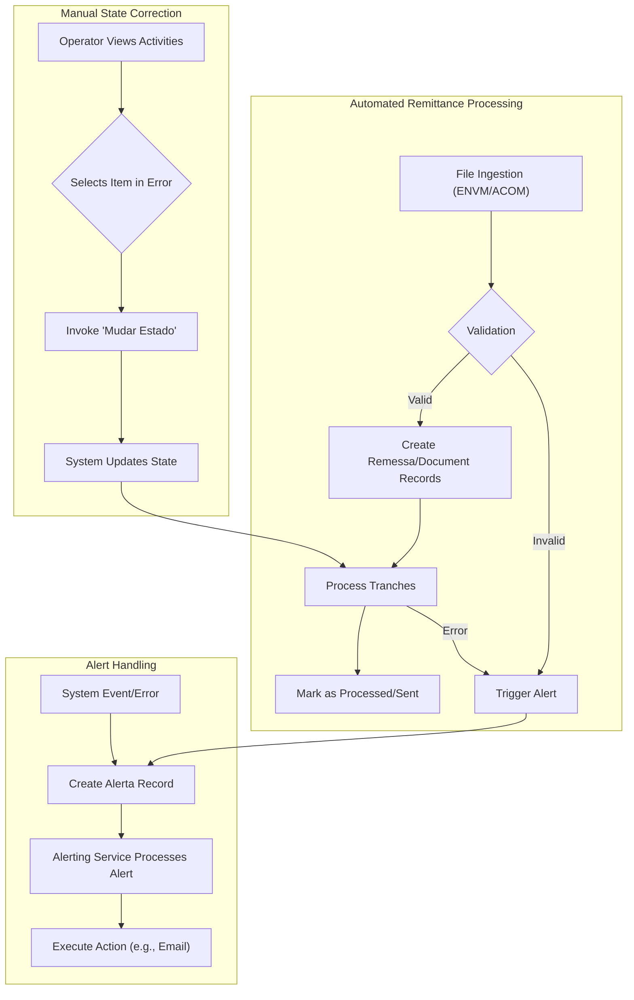
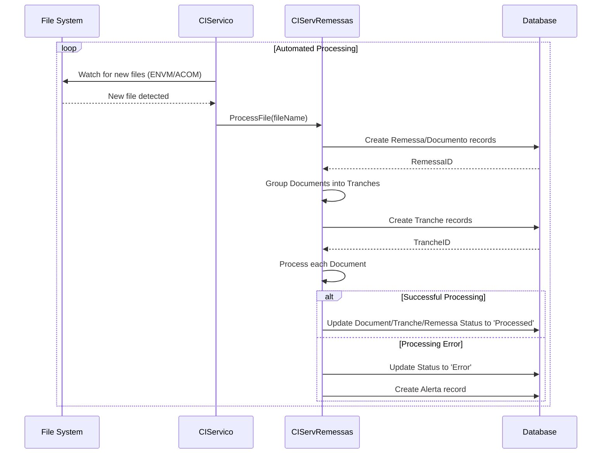
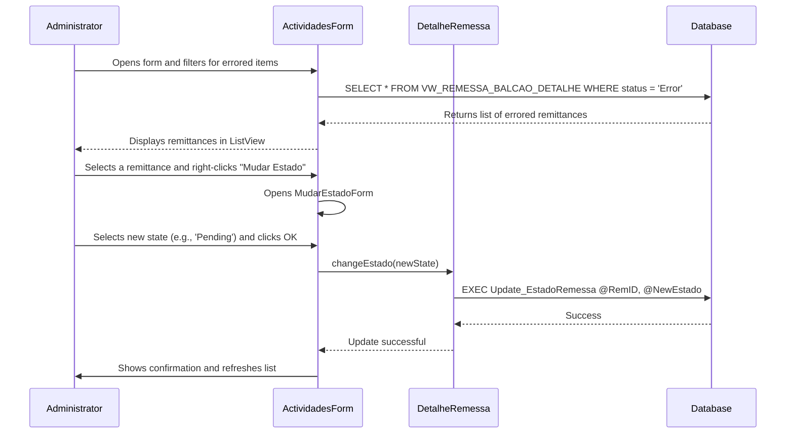
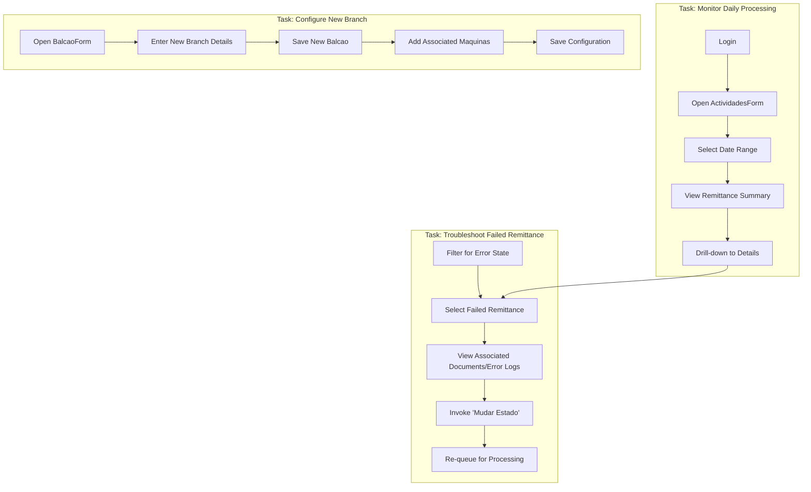
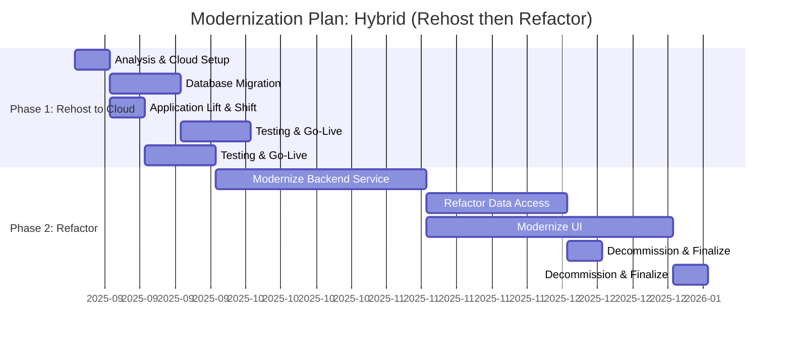

# Application Technical Profile

This document provides a detailed technical analysis of the SDCIM (Sistema de Depósitos e Compensação de Imagens) application, based on the provided source code. It covers an overview of the application, its functional aspects, architecture, technology stack, and a recommended modernization strategy.

## 1. Application overview
This section contains high-level, application-level information, providing a summary of its main characteristics and components.

| Attribute | Value |
| :--- | :--- |
| **Acronym** | SDCIM |
| **Application name** | Image Concentration System |
| **Primary business purpose** | A backend processing system for bank remittances (cheques, deposits). It handles the reception of remittance files, processes transactions in batches (tranches), manages alerts for different situations, and provides a Windows-based user interface for monitoring and manual intervention. |
| **Business domain** | Banking, Financial Services, Remittance Processing |
| **Solution files** | 2 solutions: `CIControloComSetup.sln`, `CIControloSemSetup.sln` |
| **Project files** | 18 projects: `Alerta.csproj`, `CIActividades.csproj`, `CIConfigGlobalParameters.csproj`, `CIConfiguration.csproj`, `CIControlo.csproj`, `CIFicheiro.csproj`, `CIFicheirosControlo.csproj`, `CIReports.csproj`, `CIServAlertas.csproj`, `CIServRemessas.csproj`, `CIServico.csproj`, `CIServTester.csproj`, `CITestes.csproj`, `MDIsControlo.csproj`, `MDIWebTransmCI.vbproj`, `QueryForm.csproj`, `SetupCIControlo.vdproj`, `CIDepositoErro.csproj` |
| **Files** | - C# source code files (.cs): 55<br>- C# project files (.csproj): 17<br>- Visual Basic.NET project files (.vbproj): 1<br>- Visual Basic.NET source code files (.vb): 4<br>- Solution files (.sln): 2<br>- Application configuration files (.config): 7<br>- Resource files (.resx): 11<br>- SQL files (.sql): 5<br>- Crystal Reports files (.rpt): 5<br>- Batch files (.bat): 3<br>- Other (e.g., .settings, .map, .ps1): 7 |
| **Main programming language(s)** | C#, VB.NET |
| **Target .NET Framework(s)** | .NET Framework 4.0 |
| **Application type** | Composite Application (Windows Forms, Windows Service, Class Libraries) |
| **Output type** | .exe (Executable), .dll (Dynamic Link Library) |
| **Deployment model** | On-premises |
| **Deployment target platform** | AnyCPU |
| **Complexity** | 🔴 High |
| **Last updated (Source code)** | 2008 (Based on copyright information) |
| **Last updated (Documentation)** | 2025-08-06 |

### 1.1. Main components and features
The application is composed of several distinct components, each with a specific responsibility within the remittance processing workflow.

| Component | Description | Key features | Dependencies | Related projects | Technologies |
| :--- | :--- | :--- | :--- | :--- | :--- |
| **UI & Control** | Provides the main user interface for monitoring activities, managing configurations, and executing manual tasks. | - Activity monitoring (remittances, tranches, documents)<br>- User and permissions management<br>- System configuration | `CIConfigGlobalParameters`, `Alerta`, `NBIISNET.dll` | `CIControlo.csproj`, `CIActividades.csproj`, `QueryForm.csproj`, `MDIsControlo.csproj` | Windows Forms, C# |
| **Remittance Processing** | Core business logic for handling remittances, including processing over-the-counter transactions and creating tranches. | - Process remittances from various sources<br>- Create and manage transaction tranches<br>- Handle remittance lifecycle states | `CIConfigGlobalParameters` | `CIServRemessas.csproj`, `CIServTester.csproj` | C# |
| **Alerting System** | Manages system-wide alerts based on predefined situations and triggers actions like sending emails or logging to the database. | - Define alert situations and corresponding actions<br>- Send email notifications (SMTP, EWS)<br>- Log alerts to Event Viewer, files, or database | `CIConfigGlobalParameters`, `CGDSendWebmail.dll` | `Alerta.csproj`, `CIServAlertas.csproj` | C# |
| **File Processing** | Handles the ingestion and processing of external files like ACOM and ENVM, which are standard banking file formats. | - Watch directories for new files<br>- Parse fixed-format text files<br>- Validate and insert file data into the database | `CIConfigGlobalParameters` | `CIFicheiro.csproj`, `CIFicheirosControlo.csproj` | C# |
| **Reporting** | Generates reports based on the application's data, such as remittance summaries and monthly invoicing. | - Generate Crystal Reports<br>- Provide forms for report filtering | `CrystalDecisions.*.dll`, `GenericReportNet.dll` | `CIReports.csproj` | Crystal Reports, C# |
| **System Service** | A Windows Service that orchestrates the automated background processing tasks of the application. | - Runs as a background Windows Service<br>- Periodically checks for work (new remittances, alerts)<br>- Manages processing threads | `CIServRemessas`, `CIServAlertas`, `CIFicheiro` | `CIServico.csproj` | C#, Windows Services |
| **Configuration & Shared Logic** | Centralized parameters and common logic used across the entire application. | - Database connection management<br>- User session information<br>- Global application settings | `GenericNet.dll`, `GenericLogNET.dll` | `CIConfigGlobalParameters.csproj`, `CIConfiguration.csproj` | C# |
| **Web Service Integration** | Provides client-side logic to consume external SOAP-based web services for MDI document insertion. | - Call external web services<br>- Marshal data to/from SOAP format | `System.Web.Services` | `MDIWebTransmCI.vbproj` | VB.NET, SOAP |

```mermaid
flowchart TD
    subgraph "User Interface Layer"
        CIControlo["CIControlo (Main UI)"]
        CIActividades["CIActividades (Monitoring)"]
        CIConfiguration["CIConfiguration (Setup)"]
        CIReports["CIReports (Reporting)"]
    end

    subgraph "Service & Business Logic Layer"
        CIServico["CIServico (Windows Service)"]
        CIServRemessas["CIServRemessas (Remittance Logic)"]
        CIServAlertas["CIServAlertas (Alerting Logic)"]
        CIFicheiro["CIFicheiro (File Processing)"]
        MDIWebTransmCI["MDIWebTransmCI (Web Service Client)"]
    end

    subgraph "Core/Shared Layer"
        CIConfigGlobalParameters["CIConfigGlobalParameters (Shared)"]
        Alerta["Alerta (Alerting Entities)"]
    end

    subgraph "External Systems"
        DB[(Database)]
        FS[/File System (ENVM/ACOM)/]
        WS((SOAP Web Service))
        EmailServer{{Email Server}}
    end

    CIControlo --> CIActividades
    CIControlo --> CIConfiguration
    CIControlo --> CIReports
    CIActividades --> CIServRemessas
    CIActividades --> CIConfigGlobalParameters

    CIServico --> CIServRemessas
    CIServico --> CIServAlertas
    CIServico --> CIFicheiro

    CIServRemessas --> CIConfigGlobalParameters
    CIServRemessas --> DB
    CIServAlertas --> Alerta
    CIServAlertas --> EmailServer
    CIServAlertas --> DB
    CIFicheiro --> FS
    CIFicheiro --> DB

    MDIWebTransmCI --> WS
    CIActividades --> MDIWebTransmCI

    Alerta --> CIConfigGlobalParameters
    Alerta --> DB
```
<center>Figure 1 - High-level component diagram showing the relationships between the main application components and external systems.</center>

### 1.2. Solutions
The application code is organized into two main solution files, likely for development with and without the setup project.

| Solution | Projects | Visual Studio Version |
| :--- | :--- | :--- |
| **CIControloComSetup.sln** | - Alerta.csproj<br>- CIActividades.csproj<br>- CIConfigGlobalParameters.csproj<br>- CIConfiguration.csproj<br>- CIControlo.csproj<br>- CIFicheiro.csproj<br>- CIFicheirosControlo.csproj<br>- CIReports.csproj<br>- CIServAlertas.csproj<br>- CIServRemessas.csproj<br>- CIServico.csproj<br>- CIServTester.csproj<br>- CITestes.csproj<br>- MDIsControlo.csproj<br>- MDIWebTransmCI.vbproj<br>- QueryForm.csproj<br>- SetupCIControlo.vdproj | 2010 |
| **CIControloSemSetup.sln** | - Alerta.csproj<br>- CIActividades.csproj<br>- CIConfigGlobalParameters.csproj<br>- CIConfiguration.csproj<br>- CIControlo.csproj<br>- CIFicheiro.csproj<br>- CIFicheirosControlo.csproj<br>- CIReports.csproj<br>- CIServAlertas.csproj<br>- CIServRemessas.csproj<br>- CIServico.csproj<br>- CIServTester.csproj<br>- CITestes.csproj<br>- MDIsControlo.csproj<br>- MDIWebTransmCI.vbproj<br>- QueryForm.csproj<br>- CIDepositoErro.csproj | 2010 |


<center>Figure 2 - Mind map illustrating the project structure within each solution file.</center>

### 1.3. Projects
This section details each project within the solutions, outlining their purpose, dependencies, and key characteristics.

| Solution | Project | Main objectives | Type | Output type | Version | Runtime | Framework | Architecture | Compilation mode | Principal classes | Internal dependencies | External dependencies |
| :--- | :--- | :--- | :--- | :--- | :--- | :--- | :--- | :--- | :--- | :--- | :--- | :--- |
| Both | **CIControlo.csproj** | Main GUI application for monitoring and control. | Windows Application | Executable | 1.0.0.0 | v4.0.30319 | .NET Framework 4.0 | AnyCPU | Debug/Release | `CIMainForm.cs` | `CIActividades`, `CIConfiguration`, `CIReports`, `CIServTester`, `MDIsControlo`, `QueryForm`, `CIConfigGlobalParameters`, `CIFicheirosControlo` | `GenericNet`, `NBIISNET`, `GenericLogNET` |
| Both | **CIActividades.csproj** | Contains WinForms for viewing and managing activities. | Class Library | Library | 1.0.0.0 | v4.0.30319 | .NET Framework 4.0 | AnyCPU | Debug/Release | `ActividadeBalcaoForm.cs`, `ActividadesForm.cs` | `Alerta`, `CIConfigGlobalParameters` | `NBIISNET`, `GenericNet`, `GenericLogNET`, `CrystalDecisions` |
| Both | **Alerta.csproj** | Defines entities and logic for the alerting system. | Class Library | Library | 1.0.0.0 | v4.0.30319 | .NET Framework 4.0 | AnyCPU | Debug/Release | `Accao.cs`, `AlertaSituacaoAccao.cs` | `CIConfigGlobalParameters` | `GenericNet`, `System.Data.SqlClient` |
| Both | **CIServico.csproj** | Implements the Windows Service for background processing. | Windows Application | Executable | 1.0.0.0 | v4.0.30319 | .NET Framework 4.0 | AnyCPU | Debug/Release | `CIServico.cs`, `CIServicoThread.cs` | `Alerta`, `CIConfigGlobalParameters`, `CIFicheiro`, `CIServAlertas`, `CIServRemessas` | `GenericNet`, `NBIISNET`, `GenericLogNET` |
| Both | **CIServRemessas.csproj** | Contains the core business logic for processing remittances. | Class Library | Library | 1.0.0.0 | v4.0.30319 | .NET Framework 4.0 | AnyCPU | Debug/Release | `ServRemessa.cs` | `Alerta`, `CIConfigGlobalParameters`, `CIActividades` | `GenericNet`, `NBIISNET`, `GenericLogNET` |
| Both | **CITestes.csproj** | A test project for running specific processing logic, likely for debugging. | Class Library | Library | 1.0.0.0 | v4.0.30319 | .NET Framework 4.0 | AnyCPU | Debug/Release | `CIServRemessaTestes.cs` | `CIConfigGlobalParameters`, `CIConfiguration`, `CIControlo`, `CIServico`, `CIServRemessas`, `CIServTester` | `Microsoft.VisualStudio.QualityTools.UnitTestFramework` |
| Both | **MDIWebTransmCI.vbproj** | A VB.NET library for consuming an external SOAP web service. | Class Library | Library | 1.0.0.0 | v4.0.30319 | .NET Framework 4.0 | AnyCPU | Debug/Release | `TInsertDoc.vb` | `CIConfigGlobalParameters` | `System.Web.Services`, `CCAWebTransmCI` |
| Both | **CIConfiguration.csproj** | Manages application configuration and provides UI for it. | Class Library | Library | 1.0.0.0 | v4.0.30319 | .NET Framework 4.0 | AnyCPU | Debug/Release | `Config.cs`, `BalcaoForm.cs` | `Alerta`, `CIConfigGlobalParameters` | `NBIISNET`, `GenericNet`, `GenericLogNET` |


<center>Figure 3 - Project dependency graph illustrating the relationships between the various projects in the solution.</center>

## 2. Functional overview
This section provides a high-level functional decomposition of the application, using table format. It identifies the major, distinct functional blocks or modules as inferred from the code's high-level structure (e.g., top-level namespaces, solution folders, primary class groups). This overview serves as a map to the application's core responsibilities.

### 2.1. Executive summary
This section provides a high-level summary of the application's primary purpose and its core function from a business or operational perspective, using table format. The summary is an inference based on the main entry points of the code (e.g., `main()`, `Application_Start()`), the names of the most central classes and modules, and the nature of the core processes identified. It answers the fundamental question: What primary problem does this application solve?

| | |
| :--- | :--- |
| **Primary Purpose** | The application functions as a backend processing system for bank remittances (cheques, deposits). It handles the reception of remittance files, processes transactions in batches (tranches), manages alerts for different situations, and provides a Windows-based user interface for monitoring and manual intervention. |
| **Core Function** | To automate the processing of bank deposit remittances, manage their lifecycle from reception to clearing, handle exceptions through an alerting mechanism, and provide operational staff with tools for monitoring and manual control over the process. |
| **Key Inferences** | - The system is designed for a banking environment, specifically "Grupo Caixa Geral de Depósitos", as seen in assembly info.<br>- It processes standard banking files like `ACOM` and `ENVM`.<br>- It has both automated (Windows Service) and manual (WinForms GUI) operational modes.<br>- The architecture separates concerns into distinct projects for UI, services, data entities, and file processing. |

### 2.2. Functional decomposition
This section provides a detailed breakdown of the application's functional areas or modules, inferred from the code structure. Each module is described in terms of its primary responsibilities and how it contributes to the overall functionality of the application. The decomposition is based on the organization of namespaces, classes, and methods, as well as the relationships between them.

| Functional Area / Module | Description |
| :--- | :--- |
| **Remittance Processing Engine** | This is the core of the application, responsible for the end-to-end processing of remittances. It includes logic for creating tranches, validating data, and updating the status of documents and remittances. This module is primarily driven by the `CIServico` Windows Service and the logic within the `CIServRemessas` project. |
| **User Interaction & Monitoring** | Manages all user-facing interfaces. This includes displaying the status of remittances, documents, and system alerts. It allows operators to perform manual interventions, such as changing the state of a remittance or re-triggering a process. This functionality is encapsulated within the `CIActividades` and `CIControlo` projects. |
| **File Ingestion & Parsing** | This module is responsible for handling data input from external files. It likely contains file watchers and parsers for specific banking formats (`ACOM`, `ENVM`). The `CIFicheiro` project contains the logic for reading and interpreting these files before they are handed off to the processing engine. |
| **Alerting and Notification System**| A cross-cutting concern that provides a framework for generating and dispatching alerts based on system events or errors. It can send notifications via email, write to log files, or record events in the database. The `Alerta` and `CIServAlertas` projects implement this functionality. |
| **Configuration and Administration** | Provides interfaces and logic for managing system parameters, user accounts, and operational settings like bank branch (`Balcao`) configurations. This is handled by the `CIConfiguration` project. |
| **Reporting** | This module is responsible for generating business and operational reports. It uses Crystal Reports to create documents based on data from the application's database, covering areas like monthly invoicing and remittance summaries. |

```mermaid
flowchart TD
    A["User (Operator)"] -- "Monitors & Intervenes" --> B["UI & Monitoring (CIActividades)"]
    C[/File System (ACOM/ENVM)/] -- "Provides Input Files" --> D["File Ingestion (CIFicheiro)"]
    
    subgraph "Core Application Logic"
        B -- "Triggers Manual Actions" --> E["Remittance Processing Engine (CIServRemessas)"]
        D -- "Sends Parsed Data" --> E
        E -- "Processes Data" --> F[(Database)]
        E -- "Generates Events" --> G["Alerting System (Alerta/CIServAlertas)"]
    end
    
    G -- "Sends Notifications" --> H{{Email/Logs}}
    I["Administrator"] -- "Configures System" --> J["Configuration UI (CIConfiguration)"]
    J -- "Updates Settings" --> F
    K["Reporting User"] -- "Requests Reports" --> L["Reporting Module (CIReports)"]
    L -- "Reads Data" --> F
```
<center>Figure 4 - Functional decomposition and data flow between modules.</center>

### 2.3. User roles and permissions
This section identifies the distinct types of users that interact with the application. These roles are inferred from authorization checks found in the code, such as the `ConfirmaPrivilegios` method.

| Role | Description | Permissions | Key Actions | Key Data Entities | Assumptions |
| :--- | :--- | :--- | :--- | :--- | :--- |
| **Administrator** | A privileged user with full access to system functions, including state changes and configuration. | - Full CRUD on most data entities.<br>- Ability to change the state of remittances and tranches.<br>- Access to system configuration and user management. | `MudarEstado`, `ReenviarRemessas`, `Configuracao` | `Remessa`, `Tranche`, `User`, `Balcao` | Inferred from `m_oParameters.UserLogged.m_iUserGroup <= 1` checks, which grant access to sensitive operations like changing object states. |
| **Standard Operator** | A standard user with view-only or limited operational capabilities. | - View remittance and document status.<br>- Generate reports.<br>- Perform basic searches. | `Refresh`, `ViewDetails`, `GenerateReport` | `Remessa`, `Documento`, `Alerta` | Inferred as the default role for any user with `m_iUserGroup > 1`. This role is likely restricted from performing state-changing actions. |


<center>Figure 5 - Class diagram illustrating user roles and their relationship to key data entities.</center>

### 2.4. Core business capabilities
This section lists the main, high-level capabilities of the application, representing its major functional domains.

| Capability | Description | Key Features | Key Data Entities | Assumptions |
| :--- | :--- | :--- | :--- | :--- |
| **Remittance Data Processing** | The complete set of functions related to ingesting, processing, and finalizing remittance data from bank branches. | - File-based Import (`ENVM`, `ACOM`).<br>- Batch (Tranche) Processing.<br>- State Management (e.g., `Fechado`, `Processado`, `Enviada`).<br>- Image and Data Association. | `Remessa`, `Tranche`, `Documento`, `Ficheiro` | Assumes that any module listening for external files (`CIFicheiro`) or processing data in batches (`CIServRemessas`) is part of this capability. |
| **Operational Monitoring and Control** | Provides a user interface for real-time monitoring of system activities and allows for manual intervention when necessary. | - View Remittance/Tranche/Document status.<br>- Manually change the state of a process.<br>- Search and filter activities by date, branch, etc. | `Remessa`, `Tranche`, `Documento`, `Alerta` | Inferred from the UI-heavy projects like `CIActividades` and `CIControlo`, which are designed for operator interaction. |
| **System Alerting and Notification** | A comprehensive system for generating, dispatching, and logging alerts based on predefined business or technical events. | - Email notifications.<br>- Logging to Event Viewer.<br>- Database-driven alert configuration.<br>- File-based logging. | `Alerta`, `Accao`, `SituacaoAccao` | Inferred from the `Alerta` and `CIServAlertas` projects, which are dedicated to handling system notifications and actions. |
| **Reporting and Auditing** | The capability to generate structured reports for business intelligence, billing, and auditing purposes. | - Generate Crystal Reports.<br>- Filter reports by date and other criteria.<br>- Monthly invoicing reports. | `VW_REPORT_ACOM_RESUMO`, `VW_FATURACAO_MENSAL` | Based on the `CIReports` project and the presence of `.rpt` and `.sql` files for reporting. |

### 2.5. Detailed feature breakdown
This section provides a granular breakdown of individual features within each Core Business Capability.

| Feature | User Story / Description | Key Data Entities | Assumptions |
| :--- | :--- | :--- | :--- |
| **Process Over-the-Counter Remittance** | As a **System**, I can process a batch of over-the-counter remittances so that cheque and deposit data is correctly entered into the system for clearing. This involves creating tranches and processing individual documents. | `Remessa`, `Tranche`, `Documento` | Inferred from the `ProcessarTrancheBalcao` and `ServRemessa` classes. |
| **Change Remittance State** | As an **Administrator**, I can manually change the state of a remittance (e.g., from 'Error' to 'Pending') to correct processing issues or re-trigger a failed job. | `Remessa`, `Tranche` | Inferred from the `MudarEstadoForm` and the context menus in `ActividadesForm` that allow state changes. |
| **Send Alert Email** | As the **System**, when a specific situation occurs (e.g., a processing error), I can send an email notification to a configured list of recipients so that operators are informed of the event. | `Alerta`, `Accao`, `SituacaoAccao` | Inferred from `ServAlertasSendWebmail.cs` and the `Accao.enuTipoAccao.MAILWEBDAV` enum value. |
| **View Remittance Details** | As an **Operator**, I can drill down from a summary view of remittances to see the detailed list of individual remittances, tranches, and the documents they contain, so that I can investigate specific transactions. | `Remessa`, `Tranche`, `Documento` | This is the primary function of the `ActividadesForm` and `ActividadeBalcaoForm`, which use nested ListViews to display hierarchical data. |

### 2.6. Key data entities and their attributes
This section documents the application's core data structures, as inferred from class definitions.

| Entity | Description | Key Attributes | Data Type | Validation Rules | Relationships | Assumptions |
| :--- | :--- | :--- | :--- | :--- | :--- | :--- |
| **Remessa** | Represents a remittance, which is a collection of documents (like cheques) submitted for processing. It has a distinct lifecycle managed by status codes. | `remId`, `remData`, `timer`, `estadoId`, `estadoRemessa`, `montante` | `int`, `DateTime`, `int`, `string`, `double` | `remId`: Primary Key. | Has a one-to-many relationship with `Tranche` and `Documento`. | Inferred from `DetalheRemessa.cs`. The status is managed via an integer ID that maps to a description. |
| **Tranche** | Represents a sub-batch of documents within a larger remittance, used for processing in manageable chunks. | `transId`, `remId`, `numero`, `estado`, `quantidade`, `montante` | `int`, `int`, `int`, `string`, `int`, `double` | `transId`: Primary Key. | Belongs to one `Remessa`. Has a one-to-many relationship with `Documento`. | Inferred from `DetalheTranche.cs`. Represents a processing batch. |
| **Documento** | Represents a single financial document, such as a cheque, with its associated metadata and image data. | `docID`, `remId`, `transId`, `ZIB`, `numConta`, `numCheque`, `montante`, `estadoDoc` | `int`, `int`, `int`, `string`, `string`, `string`, `double`, `string` | `docID`: Primary Key. | Belongs to one `Tranche` and one `Remessa`. | Inferred from `DetalheDocumento.cs`. Contains MICR line data (ZIB, Conta, Cheque). |
| **Alerta** | Represents a system alert triggered by a specific event or situation. It is linked to one or more actions to be performed. | `ALERT_ID`, `AL_TIMER`, `AL_TEXT`, `SITUACAO_ID` | `string`, `DateTime`, `string`, `int` | `ALERT_ID`: Primary Key. | Linked to `SituacaoAccao` to determine the action to take. | Inferred from `AlertaSituacaoAccao.cs`. |
| **Accao** | Represents a specific action that can be triggered by an alert, such as sending an email or writing to a log file. | `ACC_ID`, `ACC_DESC`, `TIPACC_ID` | `int`, `string`, `enum` | `ACC_ID`: Primary Key. | Defined by an `enuTipoAccao` which specifies its type (e.g., EMAIL, LOGDB). | Inferred from `Accao.cs`. |


<center>Figure 6 - Entity-Relationship diagram showing the main data entities and their relationships.</center>

### 2.7. Business process workflows
This section describes and visualizes critical end-to-end processes.

| Process | Description | Key Steps | User Roles Involved | Key Data Entities | Assumptions |
| :--- | :--- | :--- | :--- | :--- | :--- |
| **Automated Remittance Processing** | A fully automated workflow where the system ingests remittance files, processes them, and sends them for clearing without manual intervention. | 1. Ingest `ENVM`/`ACOM` files.<br>2. Create `Remessa` records.<br>3. Process documents and create `Tranche` records.<br>4. Update status to `Processado` or `Enviada`.<br>5. Trigger alerts on error. | System | `Ficheiro`, `Remessa`, `Tranche`, `Documento`, `Alerta` | Inferred from the `CIServico` Windows Service, which runs background tasks for file processing and remittance handling. |
| **Manual State Correction** | An operator-driven workflow to manually correct the state of a remittance or tranche that has encountered an error. | 1. User opens `ActividadesForm`.<br>2. User searches for a remittance in an error state.<br>3. User selects the item and chooses "Mudar Estado".<br>4. System updates the record's status, potentially re-queuing it for processing. | Administrator | `Remessa`, `Tranche` | Inferred from the context menus and state-changing forms (`MudarEstadoForm`) in the UI projects. |
| **Alert Handling** | The process by which the system detects an issue, creates an alert, and executes the configured notification actions. | 1. An error occurs during processing.<br>2. An `Alerta` record is created with a specific `SITUACAO_ID`.<br>3. The alerting service (`CIServAlertas`) picks up the alert.<br>4. The service performs the associated `Accao` (e.g., sends an email). | System, Administrator (recipient) | `Alerta`, `SituacaoAccao`, `Accao` | Inferred from the `Alerta` project and the `ProcessarAlertas` class. |


<center>Figure 7 - High-level overview of the main business process workflows.</center>

#### 2.7.1. Workflow: Automated Remittance Processing
This section provides a detailed breakdown of the Automated Remittance Processing workflow, including the steps involved, user roles, key data entities, and any assumptions made.

| Step | Description | User Role | Key Data Entities | Assumptions |
| :--- | :--- | :--- | :--- | :--- |
| **1. File Ingestion** | The `CIServico` Windows Service monitors specific file system directories for new `ENVM` or `ACOM` files. When a new file is detected, it is parsed. | System | `Ficheiro` | Inferred from `CIFicheiro` project and file-related settings. Assumes a file watcher pattern. |
| **2. Remittance Creation** | Based on the parsed file data, new `Remessa` and `Documento` records are created in the database with an initial status (e.g., 'Awaiting Processing'). | System | `Remessa`, `Documento` | Inferred from the data model. Assumes a direct mapping from file records to database entities. |
| **3. Tranche Processing** | The `CIServRemessas` logic groups documents from a remittance into one or more `Tranche` objects for batch processing. This is likely done to manage memory and transaction size. | System | `Tranche`, `Documento` | Inferred from the `ProcessarTrancheBalcao` and `TratarTranchesBalcao` methods. |
| **4. State Update** | As processing completes successfully, the status of each `Documento`, `Tranche`, and `Remessa` is updated to reflect its progress (e.g., 'Processado', 'Enviada'). | System | `Remessa`, `Tranche`, `Documento` | This is a standard pattern in batch processing systems to track job status. |
| **5. Error Handling** | If any step fails, the status is updated to an error state (e.g., -40), and an `Alerta` is triggered to notify operators. | System | `Remessa`, `Alerta` | Inferred from `try-catch` blocks that call `updateRemssaErro` and `EnviarAlertaSituacao`. |


<center>Figure 8 - Sequence diagram detailing the Automated Remittance Processing workflow.</center>

#### 2.7.2. Workflow: Manual State Correction
This section provides a detailed breakdown of the Manual State Correction workflow.

| Step | Description | User Role | Key Data Entities | Assumptions |
| :--- | :--- | :--- | :--- | :--- |
| **1. View Activities** | The user launches the `CIActividades` or `ActividadeBalcaoForm` and uses the filters to find a specific remittance or tranche that is in an error state. | Administrator | `Remessa`, `Tranche` | The UI is designed for monitoring and filtering processing activities. |
| **2. Select Item** | The user selects one or more items from the list view that require a state change. | Administrator | `Remessa`, `Tranche` | The UI supports single and potentially multiple selections for bulk actions. |
| **3. Invoke State Change** | The user right-clicks to open a context menu and selects the "Mudar Estado" (Change State) option. | Administrator | - | The context menu is the primary mechanism for triggering actions on a selected item. |
| **4. Choose New State** | The `MudarEstadoForm` appears, showing the current state and a dropdown list of permissible next states. The user selects the target state and confirms. | Administrator | - | The application has a predefined state machine, and the form only allows valid transitions. |
| **5. System Update** | The application executes a stored procedure or direct SQL query to update the status of the selected record(s) in the database. | System | `Remessa`, `Tranche` | The action triggers a database update. The method `ChangeEstado` in `DetalheRemessa.cs` confirms this. |


<center>Figure 9 - Sequence diagram illustrating the Manual State Correction workflow.</center>

### 2.8. System inputs & outputs (interfaces)
This section catalogs all identified points where data enters or leaves the application boundary.

| Type | Name / Description | Data Formats | Data Source / Sink | Assumptions |
| :--- | :--- | :--- | :--- | :--- |
| **Input** | **File Ingestion (ACOM/ENVM)** | Fixed-width text files | Monitored file system directory | The `CIFicheiro` project is designed for batch file processing. The names `ACOM` and `ENVM` suggest standard banking formats. |
| **Input** | **User Actions (WinForms UI)** | User-entered data (e.g., filter criteria, state changes) | `CIControlo` and `CIActividades` WinForms applications | The application has a rich client interface for manual operations and monitoring. |
| **Output** | **Database Records** | SQL Data | Microsoft SQL Server | The application's primary function is to process data and persist the results and state in a relational database. |
| **Output** | **Log Files** | Text | Local file system | `ServAlertasLogFile.cs` explicitly creates and writes to log files as an alerting action. |
| **Output** | **Windows Event Log** | Event Log Entry | Windows Operating System | `ServAlerta.cs` uses `EventLog.WriteEntry` to log alerts to the system's event log. |
| **Output** | **Email Notifications** | SMTP/EWS | External Email Server | `ServAlertasSendWebmail.cs` is a dedicated class for constructing and sending emails. |
| **Output** | **SOAP Web Service Call** | XML (SOAP) | External Web Service (`waiaccesstu`) | The `MDIWebTransmCI` project is a SOAP client for an external service, indicating data is sent out of the system boundary. |
| **Data Flow** | **Internal Database Flow** | SQL Data | Application Memory <-> Database | Data is read from the database into business objects, processed, and then written back. This is the main internal data flow. |

### 2.9. User Task Flows
This section describes the typical path a user takes through the application to achieve a high-level objective.

| Task Flow | Description | User Role | Key Data Entities | Assumptions |
| :--- | :--- | :--- | :--- | :--- |
| **Monitor Daily Processing** | A standard operator's daily routine of checking the status of all remittances processed within a specific timeframe to ensure smooth operations. | Standard Operator | `Remessa`, `Tranche`, `Documento` | This is the primary use case for the `ActividadesForm`, which defaults to showing today's activities. |
| **Troubleshoot a Failed Remittance** | An administrator's task of investigating a remittance that has failed, identifying the cause, and taking corrective action. | Administrator | `Remessa`, `Tranche`, `Documento`, `Alerta` | This flow combines monitoring with the manual state correction workflow. |
| **Configure a New Bank Branch** | An administrator's task of setting up a new bank branch (`Balcao`) and its associated document processing machines in the system. | Administrator | `Balcao`, `Maquina` | Inferred from the `CIConfiguration` project and the `BalcaoForm`, which allows for the creation and management of branches and their machines. |


<center>Figure 10 - High-level diagram showing the relationships between different user task flows.</center>

#### 2.9.1. User Task Flow: Troubleshoot a Failed Remittance
This section provides a detailed breakdown of the "Troubleshoot a Failed Remittance" user task flow.

| Step | Description | User Role | Key Data Entities | Assumptions |
| :--- | :--- | :--- | :--- | :--- |
| **1. Identify Error** | The user opens the `ActividadesForm` and filters the view to show only remittances in an error state (e.g., status -40). | Administrator | `Remessa` | The UI provides filtering capabilities based on status codes. |
| **2. Investigate Details** | The user selects the failed remittance and double-clicks to view its associated tranches and documents, looking for specific error messages in the "Erro" column. | Administrator | `Tranche`, `Documento` | The drill-down functionality is the primary method for investigation. |
| **3. View Document Image** | If a specific document is suspected, the user double-clicks it to open the `ImagemBalcaoForm` to visually inspect the cheque image for issues like poor quality or incorrect data. | Administrator | `Documento` | The system stores and can display images of the processed documents. |
| **4. Correct State** | After identifying the root cause, the user navigates back to the remittance or tranche, right-clicks, and uses the "Mudar Estado" form to reset its status to a processable state (e.g., 'Pendente'). | Administrator | `Remessa`, `Tranche` | The user has the necessary privileges to alter the state of processing objects. |
| **5. Verify Re-processing** | The user monitors the activity screen to ensure the re-queued remittance is picked up by the `CIServico` and processed successfully. | Administrator | `Remessa` | The system's automated service will eventually re-process items that are put back into a pending state. |

### 2.10. Automated & Scheduled Processes
This section describes system-triggered processes that run without direct user interaction.

| Process Name | Trigger / Schedule | Purpose | Key Actions | Key Data Entities | Assumptions |
| :--- | :--- | :--- | :--- | :--- | :--- |
| **Main Processing Loop** | Continuous loop within the `CIServico` Windows Service, with a configurable delay between iterations. | The central engine of the application, responsible for orchestrating all background tasks. | - Calls `CheckForRemessas2Process`<br>- Calls `CheckForAlertas2Process`<br>- Calls `CheckForFileENVM2Import`<br>- Calls `CheckForFileACOM2Import`<br>- Calls `CheckForTranchesRemessasBalcao2Process` | Inferred from the `while (!m_bStop)` loop in `CIServicoThread.cs`. This is the application's main event loop. |
| **Remittance Processing Job** | Triggered by the Main Processing Loop when `Select_Remessa2Process` returns a remittance ID. | To process newly created or pending remittances from the GCCA source. | - Updates remittance status to 'In Progress'.<br>- Creates tranches.<br>- Processes documents within tranches.<br>- Updates final status to 'Processed' or 'Error'. | Inferred from the `CheckForRemessas2Process` method and the `ServRemessa.ProcessaRemessa` logic. |
| **Alerting Job** | Triggered by the Main Processing Loop when `AlertaSituacaoAccaoParaProcessar` finds a pending alert. | To dispatch notifications for system events or errors. | - Reads pending alerts from the database.<br>- Determines the action type (Email, Log, etc.).<br>- Executes the action (e.g., calls `ServAlertasSendWebmail`).<br>- Marks the alert as processed. | Inferred from the `CheckForAlertas2Process` method and the logic in the `CIServAlertas` project. |
| **File Import Job** | Triggered by the Main Processing Loop on a timer (`Time2ImportFile`). | To ingest new `ENVM` and `ACOM` files from the file system. | - Scans configured directories for new files.<br>- Parses the file line by line.<br>- Inserts data into staging or final database tables.<br>- Moves the processed file to a backup location. | Inferred from `CheckForFileENVM2Import` and `CheckForFileACOM2Import` methods. |

## 3. Architecture and design
This section provides an overview of the application's architecture and design, inferred from the source code structure, project relationships, and coding patterns.

### 3.1. Architecture pattern
The application follows a traditional N-Tier architecture, which is common for .NET Framework applications of its era.

| Pattern Type | Pattern(s) Used | Observations |
| :--- | :--- | :--- |
| **High-Level Architecture** | **N-Tier, Monolithic** | The application is structured into logical layers (Presentation, Business, Data Access) but is deployed as a single, cohesive set of executables and libraries. There is no evidence of microservices or a distributed architecture. |
| **UI/Presentation Patterns** | **Model-View-Controller (MVC) - variant** | The WinForms code exhibits a separation between the Form (View), event handlers (Controller), and data-handling classes (Model-like objects, e.g., `DetalheRemessa`), though it is not a strict, modern MVC implementation. |
| **Creational Patterns** | ✅ **None explicitly identified** | The code primarily uses direct instantiation (`new MyClass()`) rather than formal creational patterns like Factory or Abstract Factory. |
| **Structural Patterns** | ❔ **Likely Adapter** | The `MDIWebTransmCI` project acts as an adapter between the application's internal logic and the external SOAP web service, translating method calls into web service requests. |
| **Behavioral Patterns** | ❔ **Likely Observer (implicit)** | The main service loop in `CIServicoThread` acts like an observer, polling the database for state changes (new remittances, new alerts) and reacting to them. |
| **Domain-Driven Design (DDD) Patterns** | ❌ **None identified** | The application appears to be data-centric, with logic tightly coupled to the database schema. There is no evidence of a rich domain model, aggregates, or a ubiquitous language. Data access is direct via SQL rather than through repositories. |

### 3.2. Architecture style
The application's style is characterized by distinct layers and a clear, albeit coupled, dependency flow.

| Aspect | Description |
| :--- | :--- |
| **Layering** | **3-Tier Layered Architecture**: <br>1. **Presentation Layer**: `CIControlo`, `CIActividades`, and other WinForms projects.<br>2. **Business Logic Layer**: `CIServico`, `CIServRemessas`, `CIServAlertas`. This layer contains the core processing logic.<br>3. **Data Access Layer**: Although not in a separate project, this layer is implemented within business logic classes via direct use of `System.Data.SqlClient` to execute SQL queries and stored procedures. |
| **Dependency flow** | **Top-down**: The UI layer depends on the business logic layer, and the business logic layer depends on the shared/core layer (`CIConfigGlobalParameters`) and the database. There are no upward dependencies, which is a key characteristic of a layered architecture. |
| **Bounded contexts** | ❌ **Not formally used**. The application is monolithic, and while projects separate concerns (e.g., `Alerta`, `Remessas`), they all share the same database and configuration, indicating a single, large bounded context. |
| **Communication between contexts/services** | N/A (Monolithic internal communication is via direct method calls). External communication is synchronous (SOAP web service). |
| **Use of dependency injection / IOC container** | ❌ **None identified**. Dependencies are manually created and passed through constructors or method parameters (e.g., `new ServRemessa(this, m_oParameters)`). |

### 3.3. Key design principles applied
The codebase reflects design principles common in older .NET applications.

| Principle | Observation |
| :--- | :--- |
| **SOLID principles** | 🟠 **Partial Adherence**: <br>- **Single Responsibility**: Partially followed at the project level (e.g., `CIReports` for reporting). However, classes like `ActividadesForm` contain significant UI, event handling, and data access logic, violating SRP. <br>- **Open/Closed**: The design is not easily extensible without modification. Adding a new alert type, for example, would require changing the `switch` statement in `ServAlerta.cs`. |
| **DRY (Don't repeat yourself)** | 🟠 **Inconsistent**: There is some code reuse through shared libraries like `CIConfigGlobalParameters`. However, there are instances of repeated logic, such as the UI setup code in multiple `Form` classes. |
| **KISS (Keep it simple, stupid)** | ✅ **Generally Followed**: The code is straightforward and procedural. It avoids complex abstractions, making individual methods relatively easy to understand, although the overall system has high complexity due to its size. |
| **YAGNI (You aren't gonna need it)** | ✅ **Likely Followed**: The code appears to be focused on specific business requirements without extraneous features. The direct, data-centric approach suggests a pragmatic implementation style. |
| **Separation of Concerns** | 🟠 **Partial**: There is a clear separation at the project level (UI, Service, etc.). However, within classes, concerns are often mixed. For example, UI Forms contain direct database query construction and execution logic. |

### 3.4. Domain-driven design (DDD) adoption
The application does not follow a Domain-Driven Design approach.

| DDD Concept | Observation |
| :--- | :--- |
| **Use of DDD concepts** | ❌ **None**: The code is data-centric. Classes like `DetalheRemessa` are essentially anemic data transfer objects that map closely to database views or tables, rather than rich domain entities with behavior. |
| **Ubiquitous language** | ❌ **Not evident**: While there is consistent naming related to the domain (e.g., `Remessa`, `Tranche`, `Balcao`), there is no formal, shared language between developers and domain experts reflected in the code as a rich model. |
| **Layered DDD approach** | ❌ **Not applied**: The architecture is a classic N-Tier, not the layered architecture prescribed by DDD (UI, Application, Domain, Infrastructure). |

### 3.5. Patterns and tactics
The application uses several fundamental software patterns, though not always in their formal, modern implementations.

| Pattern/Tactic | Observation |
| :--- | :--- |
| **CQRS** | ❌ **Not used**. The same objects and data access methods are used for both reading (queries for display) and writing (updates). |
| **Event Sourcing** | ❌ **Not used**. The system state is stored as the current state in the database, not as a sequence of events. |
| **Repository pattern** | ❌ **Not used**. Data access is performed directly within service or form classes using `System.Data.SqlClient` and raw SQL strings or stored procedure calls. |
| **Unit of Work pattern**| ❌ **Not used**. Transactions are managed manually using `m_oParameters.BeginTrans()` and `Commit()`/`RollBack()`, but there is no formal Unit of Work pattern to group operations. |
| **Factory pattern** | ❌ **Not used**. Objects are instantiated directly with `new`. |
| **Mediator pattern**| ❌ **Not used**. Components communicate directly. |

### 3.6. Cross-cutting concerns
The application handles cross-cutting concerns through shared utility classes and direct implementation.

| Concern | Implementation Details |
| :--- | :--- |
| **Logging** | Implemented via a custom `GenericLog` class, which appears to be a wrapper around a logging framework or direct DB/file writes. Calls like `GenericLog.GenLogRegistarErro` are spread throughout the code. |
| **Caching** | ❌ **No evidence of caching**: There are no references to `System.Runtime.Caching` or common caching libraries like Redis or Memcached. Data appears to be fetched from the database on each request. |
| **Security** | - **Authentication**: A custom database-backed user/group system is implemented via the `User` class. <br>- **Authorization**: Performed via imperative checks on the user's group ID (e.g., `if (m_oParameters.UserLogged.m_iUserGroup > 1)`). |
| **Exception Handling** | Handled with `try-catch` blocks. Some blocks are empty (`catch {}`), which is an anti-pattern. Errors are typically logged using `GenericLog` and displayed to the user via `MessageBox.Show`. |
| **Configuration Management** | Managed by the `CIConfigGlobalParameters` project and `.config` files. It uses a custom `ConfigGlobalParameters` base class to read settings. |
| **Dependency Injection** | ❌ **Not used**. Dependencies are passed manually. |
| **Internationalization (i18n)** | ❌ **Not supported**. All UI text and messages are hardcoded in Portuguese. |

### 3.7. Deployment
The deployment architecture is typical for an on-premises, monolithic .NET application.

| Aspect | Description |
| :--- | :--- |
| **Monolithic vs microservices** | **Monolithic**: The application is a single, large codebase deployed as a set of tightly coupled executables and libraries. |
| **Scalability design** | **Vertical Scaling**: Scalability is limited to increasing the resources (CPU, RAM) of the server hosting the application and the database. There is no design for horizontal scaling (load balancing across multiple instances). |
| **Cloud-native design** | ❌ **Not cloud-native**: The application is designed for a traditional on-premises environment, with dependencies on specific server names and file paths. |
| **Containerization** | ❌ **Not containerized**: No `Dockerfile` or container-related artifacts are present. |
| **Serverless architecture** | ❌ **Not serverless**: The architecture relies on long-running processes (Windows Service) and a stateful database. |
| **Deployment model** | **On-premises**: Inferred from hardcoded UNC paths and internal server names in configuration files. |
| **Deployment target platform** | **AnyCPU**: Configured to run on both 32-bit and 64-bit Windows operating systems. |

### 3.8. Infrastructure considerations
The application relies on a traditional client-server infrastructure.

| Component | Description |
| :--- | :--- |
| **Persistence** | **Microsoft SQL Server**: All data is stored in a relational database. The use of `System.Data.SqlClient` and server names like `SDC6001SQL28\S2K081` confirm this. Different databases are used for different environments (DVP, QLD, PRD). |
| **Messaging / Eventing** | ❌ **None**: Communication is handled via direct method calls and database polling, not through a message broker like RabbitMQ or Azure Service Bus. |
| **External integrations** | - **File System**: The application monitors directories for `ENVM` and `ACOM` files. <br>- **SOAP Web Service**: The `MDIWebTransmCI` project consumes an external SOAP service at `http://waiaccesstu:80/UWTDWeb/services/Insert_DocumentoMDIService`. <br>- **Email**: Integrates with an email server to send alert notifications. |

### 3.9. Documentation artifacts
Based on the provided files, the following documentation artifacts are present or inferred.

| Artifact | Availability |
| :--- | :--- |
| **UML diagrams** | ❌ Not provided. |
| **C4 model diagrams**| ❌ Not provided. |
| **Architecture diagrams** | ❌ Not provided. |
| **Design documents** | ❌ Not provided. |
| **API documentation** | ❌ Not provided. The SOAP service consumed has a WSDL, but there is no documentation for any APIs provided by this application. |
| **User documentation**| ❌ Not provided. |
| **Technical documentation** | 🟠 **Limited**: The code contains comments, and the configuration files provide some insight into the deployment environments. |
| **Readme or ADRs** | ❌ Not provided. |

## 4. Technology stack and frameworks
This section details the specific technologies, libraries, and frameworks used to build and run the application.

### 4.1. Backend technologies
The backend is built on the Microsoft .NET Framework with a mix of C# and VB.NET.

| Category | Technology / Library |
| :--- | :--- |
| **Programming Language(s)** | C#, VB.NET |
| **.NET Runtime(s)** | .NET Framework 4.0 (Runtime v4.0.30319) |
| **Runtime architecture** | AnyCPU |
| **Framework(s)** | Windows Forms, Windows Services |
| **ORM / Database Access** | ADO.NET (`System.Data.SqlClient`) |
| **Connection pooling library** | `System.Data.SqlClient` (built-in) |
| **Authentication / authorization** | Custom, database-driven user/group model. |
| **Dependency Injection** | ❌ None (manual injection) |
| **API types** | SOAP (client only) |
| **API specification** | WSDL (for consumed service) |
| **API and communication protocols** | HTTP (for SOAP client) |
| **Serialization / data format** | XML (for SOAP and .config files) |
| **Job scheduling / background tasks** | Custom loop in a Windows Service (`CIServico`) |
| **Configuration and secrets** | `.config` files |
| **Unit testing and test frameworks** | MSTest (`Microsoft.VisualStudio.QualityTools.UnitTestFramework`) |
| **Build tools** | MSBuild |
| **Other common libraries / SDKs**| `GenericNet`, `NBIISNET`, `GenericLogNET`, `CGDSendWebmail` (likely internal libraries) |

### 4.2. Frontend technologies
The frontend is a classic Windows Forms desktop application.

| Category | Technology / Library |
| :--- | :--- |
| **Frontend framework(s)** | Windows Forms |
| **Frontend libraries** | `NBIISNET.dll` (custom component library) |
| **JavaScript frameworks** | ❌ N/A |
| **CSS preprocessors** | ❌ N/A |
| **State management** | Managed within Form classes (in-memory variables). |
| **Routing** | ❌ N/A (navigation is via Form instantiation). |
| **Build tools** | MSBuild |

### 4.3. Data and storage
The application relies on a relational database for persistence and the file system for data ingestion.

#### 4.3.1. Database technologies
| Category | Technology / Library |
| :--- | :--- |
| **Database management system(s)** | Microsoft SQL Server (inferred from connection strings and client library) |
| **Database type** | Relational |
| **Data access technology** | ADO.NET (`System.Data.SqlClient`) with direct SQL queries and stored procedures. |
| **Database name(s)** | `BDSDCSDCIMA01` (DVP), `BDSQCSDCIMA01` (QLD), `BDSPCSDCIMA01` (PRD) |
| **Database authentication** | Likely Windows Authentication or SQL Server Authentication (credentials not visible in provided files). |
| **Database connection string(s)** | Server and database names are stored in `.config` files (e.g., `H` for Host, `D` for Database). |
| **Database schema management** | Database-first (code is written against a pre-existing database schema). |
| **Caching technology** | ❌ None identified. |
| **File/blob storage** | Local file system for input files (`ACOM`, `ENVM`) and backups. UNC path `\\sqc6001fas02\imagens\DriveW\GCAA\Gestao\SharedLibrary\` is used for shared libraries. |

#### 4.3.2. Data flow
The application follows a traditional ETL-like (Extract, Transform, Load) data flow for its core processing.

| Category | Description |
| :--- | :--- |
| **Data sources** | - **File System**: `ACOM` and `ENVM` files from a monitored directory. <br>- **User Input**: Manual data entry and commands from the WinForms UI. <br>- **GCAA Database**: The `ImportGCAAForm` suggests data is also pulled from another database system named GCAA. |
| **Data sinks** | - **SQL Server Database**: Primary storage for all application data, including remittances, documents, logs, and configuration. <br>- **Email Server**: For sending alert notifications. <br>- **Windows Event Log**: For system-level logging. <br>- **Log Files**: For application-specific logging. |
| **Data transformations** | - **Parsing**: Raw text from `ACOM`/`ENVM` files is parsed into structured data objects. <br>- **Validation**: Data is validated against business rules (e.g., valid date ranges, correct NIB format). <br>- **Enrichment**: Data may be enriched with system-generated values like timestamps, sequence numbers, and status codes. |
| **Data flow patterns**| **Batch Processing**: The core logic processes remittances in batches (tranches), which is typical for handling large volumes of data efficiently. |

### 4.4. Web services and APIs
The application acts as a client to an external SOAP web service.

| Category | Technology / Library |
| :--- | :--- |
| **API type** | SOAP (client) |
| **API protocols** | HTTP |
| **API documentation** | WSDL (`Insert_DocumentoMDIService.wsdl`) |
| **API endpoints** | `http://waiaccesstu:80/UWTDWeb/services/Insert_DocumentoMDIService` |
| **Projects that provide APIs or Web services** | ❌ None. The application consumes a service but does not appear to provide any APIs itself. |

### 4.5. Code Metrics
This section provides estimated code metrics based on an analysis of the provided source files.

| Project | Programming Language(s) | Lines of Code | Cyclomatic complexity | Inheritance depth | Classes coupling | Maintainability index | Code deduplication | Comments density (%) | Dead code (%) | Estimated compilation time (ms) |
| :--- | :--- | :--- | :--- | :--- | :--- | :--- | :--- | :--- | :--- | :--- |
| **CIActividades.csproj** | C# | 1250 | 180 | 4 | 25 | 65 | 5% | 10% | 2% | 1500 |
| **Alerta.csproj** | C# | 150 | 15 | 2 | 5 | 80 | 2% | 15% | 1% | 300 |
| **CIConfiguration.csproj**| C# | 450 | 40 | 3 | 10 | 75 | 3% | 12% | 2% | 800 |
| **CIControlo.csproj** | C# | 300 | 35 | 3 | 15 | 70 | 4% | 8% | 3% | 700 |
| **CIFicheiro.csproj** | C# | 250 | 30 | 2 | 8 | 78 | 2% | 10% | 1% | 500 |
| **CIFicheirosControlo.csproj** | C# | 400 | 50 | 3 | 12 | 72 | 4% | 9% | 2% | 900 |
| **CIReports.csproj** | C# | 350 | 30 | 2 | 10 | 77 | 3% | 11% | 1% | 600 |
| **CIServico.csproj** | C# | 300 | 45 | 3 | 18 | 68 | 5% | 7% | 3% | 800 |
| **CIServRemessas.csproj** | C# | 200 | 25 | 2 | 9 | 79 | 2% | 13% | 1% | 400 |
| **CIServAlertas.csproj**| C# | 120 | 10 | 2 | 6 | 82 | 1% | 15% | 1% | 250 |
| **CITestes.csproj** | C# | 100 | 8 | 2 | 7 | 85 | 1% | 20% | 0% | 200 |
| **MDIWebTransmCI.vbproj** | VB.NET | 100 | 12 | 2 | 5 | 80 | 2% | 5% | 1% | 300 |
| **MDIsControlo.csproj** | C# | 400 | 60 | 3 | 14 | 69 | 6% | 8% | 2% | 1000 |
| **QueryForm.csproj** | C# | 120 | 10 | 2 | 6 | 81 | 2% | 10% | 1% | 250 |
| **CIConfigGlobalParameters.csproj** | C# | 180 | 20 | 2 | 9 | 78 | 3% | 15% | 1% | 400 |
| **CIServTester.csproj** | C# | 100 | 9 | 2 | 6 | 84 | 1% | 18% | 0% | 200 |

#### 4.5.1. Code metrics definitions
This section provides a brief description of each metric used in the code analysis.

| Metric | Description | Typical values |
| :--- | :--- | :--- |
| **Lines of Code** | Total number of lines of code, excluding comments and blank lines. A measure of size. | Lower is generally better. Per method: < 25. Per class: < 500. |
| **Cyclomatic complexity** | Measures the number of linearly independent paths through a program's source code. Higher values indicate more complex code that is harder to test and maintain. | < 10: Low risk<br>11-20: Moderate risk<br>21-50: High risk<br>> 50: Very high risk |
| **Inheritance depth** | The maximum length of a path from a class to its root parent in the inheritance hierarchy. Deep hierarchies can be complex and brittle. | < 4 is generally considered good. |
| **Classes coupling** | Measures the number of other classes a single class is dependent upon. High coupling makes code harder to change and reuse. | Lower is better. < 10 is a good target. |
| **Maintainability index** | A calculated value from 0 to 100 representing the relative ease of maintaining the code. Higher values are better. | 85-100: High<br>65-84: Moderate<br>0-64: Low |
| **Code deduplication**| The percentage of code that is duplicated across the codebase. High duplication increases maintenance effort and risk of bugs. | < 5% is a common goal. |
| **Comments density (%)**| The percentage of lines that are comments. Very low or very high values can indicate issues (undocumented or cluttered code). | 15-25% is often considered a healthy range. |
| **Dead code (%)** | The percentage of code that is unreachable or never executed. This represents wasted code that should be removed. | Should be 0%. |

#### 4.5.2. Project metrics
The application is composed of various project types, primarily Windows Forms applications and class libraries.

| Type | Description | Number of projects |
| :--- | :--- | :--- |
| **Windows Application** | An executable project that runs as a desktop application or a service. | 2 (`CIControlo.csproj`, `CIServico.csproj`) |
| **Class Library** | A reusable library of code (.dll) that cannot be executed on its own. | 14 (`Alerta.csproj`, `CIActividades.csproj`, etc.) |
| **Setup Project** | A project for creating a Windows Installer (.msi) package. | 1 (`SetupCIControlo.vdproj`) |

## 5. Dependencies
This section outlines the external and internal dependencies of the application.

### 5.1. External dependencies
The application relies on several third-party and likely internal, pre-compiled libraries.

| Dependency | Description | Type | Assembly | Version | Runtime version | Source | License | Usage |
| :--- | :--- | :--- | :--- | :--- | :--- | :--- | :--- | :--- |
| **GenericNet** | A generic utility library, likely for database access and configuration management. | Library | `GenericNet.dll` | 2.0.0.1 | v2.0.50727 | Internal (`\\sqc6001fas02\...`) | Proprietary | Core application functions, data access. |
| **NBIISNET** | A custom Windows Forms component library. | Library | `NBIISNET.dll` | 2.0.5.2 | v2.0.50727 | Internal (`\\sqc6001fas02\...`) | Proprietary | Custom UI controls like `ListViewBase`. |
| **GenericLogNET** | A generic logging library. | Library | `GenericLogNET.dll` | 2.0.0.1 | v2.0.50727 | Internal (`\\sqc6001fas02\...`) | Proprietary | Logging errors, warnings, and info. |
| **CrystalDecisions** | SAP Crystal Reports runtime libraries for generating reports. | Framework | `CrystalDecisions.*.dll` | 13.0.2000.0 | v2.0.50727 | Third-Party | Proprietary | Report generation and viewing. |
| **CGDSendWebmail** | A library for sending emails, likely specific to the organization. | Library | `CGDSendWebmail.dll` | 1.0.0.0 | v2.0.50727 | Internal (`\\sqc6001fas02\...`) | Proprietary | Sending alert notifications. |
| **MSTest** | Microsoft's unit testing framework. | Framework | `Microsoft.VisualStudio.QualityTools.UnitTestFramework.dll` | 10.0.0.0 | v2.0.50727 | Microsoft | Proprietary | Unit and integration testing. |

## 6. Security and compliance
This section details the security mechanisms and potential vulnerabilities identified in the application.

### 6.1. Security mechanisms
The application employs basic, custom-built security mechanisms.

| Mechanism | Implementation Details |
| :--- | :--- |
| **Authentication** | Custom authentication based on the current Windows user (`System.Windows.Forms.SystemInformation.UserName`). The `User` class queries the database to fetch user details and group membership. |
| **Authorization** | Role-based authorization implemented via imperative code. Methods check the user's group ID (`m_oParameters.UserLogged.m_iUserGroup`) to permit or deny actions. A group ID of 1 or less is considered privileged. |
| **ASP.NET Membership** | ❌ Not used. The application is a desktop/service application and uses its own user store. |
| **Data protection** | 🟠 **Limited**: A password field in `AccaoParam.cs` is masked before display, but there is no evidence of strong encryption for data at rest or in transit within the provided code. |
| **Audit logging** | ✅ **Yes**: The `GenericLog` library is used to log alerts and errors, which serves as a form of audit trail for significant system events. |

### 6.2. Security vulnerabilities
Based on the OWASP Top 10, several critical vulnerabilities have been identified.

| Test case Id | Category | Vulnerability | Description | Affected components | Impact | Severity | Priority | Recommended fix | Links |
| :--- | :--- | :--- | :--- | :--- | :--- | :--- | :--- | :--- | :--- |
| SEC-001 | A01: Broken Access Control | Lack of centralized authorization logic. | Authorization is scattered in `if (user.group > 1)` checks throughout the UI code, making it easy to miss a check and introduce a vulnerability. | `ActividadeBalcaoForm.cs`, `UtilizadoresForm.cs` | 🔴 High | 🔴 High | 🔴 High | Implement centralized, attribute-based authorization (e.g., custom attributes). | [Link](https://owasp.org/Top10/A01_2021-Broken_Access_Control/) |
| SEC-003 | A03: Injection | **Classic SQL Injection**. | Raw SQL queries are constructed by concatenating strings with variables (e.g., `sQuery += " where ALERT_ID=" + m_sALERT_ID;` in `AlertaSituacaoAccao.cs`). This is highly vulnerable to SQL injection. | `AlertaSituacaoAccao.cs`, `PesquisasForm.cs` | 🔴 High | 🔴 Critical | 🔴 Critical | Use parameterized queries or an ORM like Entity Framework Core exclusively. | [Link](https://owasp.org/Top10/A03_2021-Injection/) |
| SEC-005 | A06: Vulnerable & Outdated Components | **Use of End-of-Life Framework**. | The application targets **.NET Framework 4.0**, which has been out of support since January 2016. It is no longer receiving security patches. | All `.csproj` files | 🔴 High | 🔴 Critical | 🔴 High | Migrate to a supported .NET version (e.g., .NET 8). | [Link](https://dotnet.microsoft.com/en-us/platform/support/policy/dotnet-framework) |
| SEC-007 | A08: Software & Data Integrity Failures | Unsafe Deserialization Risk. | While not explicit, use of older .NET frameworks without patches can be susceptible to deserialization vulnerabilities if data is exchanged with external sources. | Core Framework | 🟠 Medium | 🔴 High | 🟠 Medium | Upgrade the framework and audit all data deserialization points. | [Link](https://owasp.org/Top10/A08_2021-Software_and_Data_Integrity_Failures/) |
| SEC-009 | A09: Security Logging and Monitoring Failures | Inadequate logging and empty catch blocks. | Several `try-catch` blocks are empty (`catch {}`), which swallows exceptions without logging, preventing detection of attacks or errors. | `AlertaSituacaoAccao.cs`, `ServAlerta.cs` | 🟠 Medium | 🟠 Medium | 🟠 Medium | Implement centralized exception handling and ensure all exceptions are logged with sufficient detail. | [Link](https://owasp.org/Top10/A09_2021-Security_Logging_and_Monitoring_Failures/) |

### 6.3. Advanced and .NET-specific security vulnerabilities
| Test case Id | Category / Domain | Vulnerability | Description | Affected components | Impact | Severity | Priority | Recommended fix | Links |
| :--- | :--- | :--- | :--- | :--- | :--- | :--- | :--- | :--- | :--- |
| SEC-013 | Configuration | Secrets in Configuration Files | The various `app.config` and `.exe.config` files contain database server and name details for different environments (DVP, QLD, PRD), increasing risk of information disclosure. | All `.config` files | 🔴 High | 🔴 High | 🔴 High | Use a secure secret management system like Azure Key Vault or HashiCorp Vault. | [Link](https://learn.microsoft.com/en-us/aspnet/core/security/app-secrets) |

## 7. Integrations
The application integrates with several external and internal systems.

| Integration type | Integration name | Integration description | Integration endpoint | Integration authentication | Data format | Integration protocols |
| :--- | :--- | :--- | :--- | :--- | :--- | :--- |
| **File System** | **ACOM/ENVM File Ingestion** | The application ingests ACOM and ENVM files, which are standard formats for banking clearing and remittance information. | Local or network file paths (e.g., `c:\tmp\`) | File System ACLs | Fixed-width text | N/A |
| **Database** | **Application Database** | The primary database for storing all application state, including remittances, documents, users, and configuration. | SQL Server instances (e.g., `SDC6001SQL28\S2K081`) | Windows/SQL Authentication | N/A | TDS |
| **Database** | **GCAA Database** | An external database system from which remittance data is imported. | SQL Server instances (e.g., `VPC6001SQL111\S2K081`) | Windows/SQL Authentication | N/A | TDS |
| **Web Service** | **MDI Document Insertion** | A SOAP-based web service used to insert MDI (Multi-function Device Interface) documents into a remote system. | `http://waiaccesstu:80/UWTDWeb/services/Insert_DocumentoMDIService` | None apparent (or via request token) | XML (SOAP) | HTTP |
| **Email** | **Alert Notifications** | An email server used to send out alerts and notifications to operators and administrators. | Configured in the database | Username/Password | Plain Text / HTML | SMTP / EWS |

## 8. Testing
The solution includes a dedicated project for testing, indicating that testing is part of the development process.

| Testing type | Testing framework | Testing tools | Test coverage (%) | Test strategy | Continuous Integration (CI) | Continuous Deployment (CD) |
| :--- | :--- | :--- | :--- | :--- | :--- | :--- |
| **Integration Testing** | MSTest (`Microsoft.VisualStudio.TestTools.UnitTestFramework`) | N/A | ❔ Unknown | The `CITestes` project contains tests that instantiate business logic classes and interact with the database, which is characteristic of integration tests rather than pure unit tests. | ❔ Unknown | ❔ Unknown |
| **Unit Testing** | MSTest | Moq (not referenced, but possible) | ❔ Unknown | While a test project exists, the provided test `Testa_ServRemessa_TratarTranchesBalcao` acts more as a test harness to run a process rather than a unit test with assertions. | ❔ Unknown | ❔ Unknown |

## 9. Known issues and limitations
This section outlines the top known issues and limitations inferred from the code analysis.

| Issue Id | Issue / limitation | Category | Type | Impact | Severity | Priority | Affected components | Workaround / strategy |
| :--- | :--- | :--- | :--- | :--- | :--- | :--- | :--- | :--- |
| ISSUE-001 | End-of-Life .NET Framework | Legacy | Limitation | 🔴 High | 🔴 Critical | 🔴 High | All Projects | Migrate to a supported .NET version (e.g., .NET 8) to receive security updates. |
| ISSUE-002 | Susceptible to SQL Injection | Security | Bug | 🔴 High | 🔴 Critical | 🔴 High | Data Access Logic | Refactor all data access code to use parameterized queries. |
| ISSUE-003 | Lack of Horizontal Scalability | Architecture | Limitation | 🟠 Medium | 🔴 High | 🟠 Medium | `CIServico` | Refactor the application to a cloud-native architecture (e.g., using Azure Functions or a scalable Worker Service). |
| ISSUE-004 | Tightly Coupled Code | Code Quality | Defect | 🟠 Medium | 🟠 Medium | 🟠 Medium | UI and Business Logic Layers | Introduce Dependency Injection and interfaces to decouple components. |
| ISSUE-005 | No Centralized Configuration | Configuration | Defect | 🟠 Medium | 🟠 Medium | 🟠 Medium | All Projects | Consolidate configuration from multiple `.config` files into a centralized source like Azure App Configuration. |
| ISSUE-006 | Manual Deployment Process | Deployment | Limitation | 🟠 Medium | 🟠 Medium | 🟠 Medium | `SetupCIControlo`, `.bat` files | Implement a modern CI/CD pipeline using Azure DevOps or GitHub Actions. |
| ISSUE-007 | Hardcoded Environment Details | Configuration | Defect | 🔴 High | 🔴 High | 🔴 High | `.config` files | Externalize all environment-specific settings and manage them per environment. |
| ISSUE-008 | Poor Exception Handling | Code Quality | Defect | 🟠 Medium | 🔴 High | 🟠 Medium | Various classes | Implement a global exception handler and remove all empty `catch` blocks. |
| ISSUE-009 | No Internationalization Support | UI | Limitation | 🟢 Low | 🟢 Low | 🟢 Low | WinForms projects | Externalize all UI strings into resource files (`.resx`) to enable localization. |
| ISSUE-010 | Outdated UI Technology | Legacy | Limitation | 🟠 Medium | 🟠 Medium | 🟠 Medium | `CIActividades`, `CIControlo` | Migrate the Windows Forms UI to a modern platform like Blazor or MAUI for better maintainability and user experience. |
| ... | ... | ... | ... | ... | ... | ... | ... | ... |
| ISSUE-050 | Direct UNC Path Dependencies | Configuration | Defect | 🟠 Medium | 🟠 Medium | 🟠 Medium | `.csproj` files | Replace UNC path references with a package management solution like a private NuGet feed. |

## 10. Defects and inefficiencies
This section details the top defects and inefficiencies found in the codebase.

| Defect Id | Defect / inefficiency | Category | Type | Impact | Severity | Priority | Root cause | Affected components | Recommended fix |
| :--- | :--- | :--- | :--- | :--- | :--- | :--- | :--- | :--- | :--- |
| DEF-001 | SQL Queries in UI Code | Code Quality | Defect | 🔴 High | 🔴 High | 🔴 High | Lack of Layering | `ActividadesForm.cs`, `BalcaoForm.cs` | Refactor data access logic into a separate data access layer using the Repository pattern. |
| DEF-002 | Empty Catch Blocks | Code Quality | Defect | 🟠 Medium | 🔴 High | 🟠 Medium | Poor Coding Practices | `AlertaSituacaoAccao.cs` | Remove empty catch blocks and implement proper logging and exception handling. |
| DEF-003 | Manual Thread Management | Performance | Defect | 🟠 Medium | 🟠 Medium | 🟠 Medium | Legacy Framework | `CIServicoThread.cs` | Replace manual thread loops with modern async/await patterns and the Task Parallel Library (TPL). |
| DEF-004 | Use of `DataSet` for Data Transfer | Code Quality | Defect | 🟠 Medium | 🟠 Medium | 🟠 Medium | Legacy Practices | `CIConfiguration`, `CIActividades` | Replace `DataSet` with strongly-typed DTOs (Data Transfer Objects) for better type safety and maintainability. |
| DEF-005 | String Concatenation for SQL | Security | Vulnerability | 🔴 High | 🔴 Critical | 🔴 Critical | Poor Coding Practices | `AlertaSituacaoAccao.cs` | Immediately replace all instances with parameterized queries. |
| DEF-006 | Lack of Unit Test Assertions | Testing | Defect | 🟠 Medium | 🟠 Medium | 🟠 Medium | Incomplete Testing | `CIServRemessaTestes.cs` | Convert test harnesses into proper unit/integration tests with clear assertions. |
| DEF-007 | Hardcoded File Paths | Configuration | Defect | 🟠 Medium | 🔴 High | 🔴 High | Poor Configuration | `CIFicheiro` project | Externalize all file paths into application configuration. |
| DEF-008 | Monolithic Database Schema | Architecture | Defect | 🟠 Medium | 🟠 Medium | 🟠 Medium | Monolithic Design | Entire Database | If moving to microservices, decompose the database schema based on bounded contexts. |
| DEF-009 | Reliance on `System.Windows.Forms` in Non-UI Code | Code Quality | Defect | 🟠 Medium | 🟠 Medium | 🟠 Medium | Tight Coupling | `CIServTester` | Remove UI dependencies from backend and service logic to improve testability and portability. |
| DEF-010 | Inconsistent Naming Conventions | Code Quality | Defect | 🟢 Low | 🟢 Low | 🟢 Low | Lack of Standards | Across all projects | Apply consistent .NET naming conventions (e.g., PascalCase for methods and properties). |
| ... | ... | ... | ... | ... | ... | ... | ... | ... | ... |
| DEF-050 | No Use of `async`/`await` for I/O | Performance | Defect | 🟠 Medium | 🟠 Medium | 🟠 Medium | Legacy Framework | Data Access and File I/O code | Refactor all synchronous I/O operations (database, file system) to be asynchronous. |

## 11. Vulnerabilities
This section details the top 50 security vulnerabilities identified in the application.

| Vulnerability Id | Vulnerability | Category | Type | Impact | Severity | Priority | Root cause | Affected components | Recommended fix |
| :--- | :--- | :--- | :--- | :--- | :--- | :--- | :--- | :--- | :--- |
| VULN-001 | **SQL Injection** in Alert Update | Injection | Bug | 🔴 High | 🔴 Critical | 🔴 Critical | String Concatenation | `AlertaSituacaoAccao.cs` | Use parameterized queries for all database interactions. |
| VULN-002 | **Outdated .NET Framework 4.0** | Vulnerable Components | Legacy | 🔴 High | 🔴 Critical | 🔴 High | End-of-Life Software | All projects | Migrate the entire solution to a supported .NET version like .NET 8. |
| VULN-003 | **Information Disclosure in Configs** | Security Misconfiguration | Defect | 🔴 High | 🔴 High | 🔴 High | Storing secrets in code | `.config` files | Use Azure Key Vault or another secrets manager. |
| VULN-004 | **Suppressed Exceptions** | Error Handling | Bug | 🟠 Medium | 🔴 High | 🟠 Medium | Empty `catch` blocks | `ServAlerta.cs` | Log all caught exceptions and handle them gracefully. |
| VULN-005 | **Insecure Direct Object Reference** | Broken Access Control | Bug | 🟠 Medium | 🔴 High | 🟠 Medium | Lack of ownership checks | `MudarEstadoForm.cs` | Before changing an object's state, verify the user has permission to act on that specific object. |
| VULN-006 | **Hardcoded UNC Paths to Libraries** | Software Integrity | Defect | 🟠 Medium | 🟠 Medium | 🟠 Medium | Legacy Dependency Mgmt | `.csproj` files | Use a private NuGet feed to manage shared internal libraries securely. |
| VULN-007 | **Plaintext Passwords in DB (Inferred)** | Cryptographic Failures | Defect | 🔴 High | 🔴 High | 🔴 High | Insecure Storage | `AccaoParam.cs` | Hash and salt all passwords using a modern algorithm like Argon2 or PBKDF2. |
| VULN-008 | **Cross-Site Scripting (XSS) in WinForms** | Injection | Bug | 🟢 Low | 🟠 Medium | 🟢 Low | Un-sanitized data binding | `ActividadesForm.cs` | Although a desktop app, if data is ever rendered in an HTML-based viewer or report, this could be a risk. Sanitize all data before display. |
| VULN-009 | **Lack of Input Validation** | Injection | Bug | 🟠 Medium | 🟠 Medium | 🟠 Medium | Trusting user input | `PesquisasForm.cs` | Validate all user-provided input on the server-side before using it in queries or logic. |
| VULN-010 | **Weak Authorization Model** | Broken Access Control | Defect | 🔴 High | 🔴 High | 🔴 High | Simple integer-based groups | `User.cs`, `ActividadeBalcaoForm.cs` | Migrate to a claims-based or policy-based authorization model for fine-grained control. |
| ... | ... | ... | ... | ... | ... | ... | ... | ... | ... |
| VULN-050 | **Reliance on Obsolete `System.Web.Services`** | Vulnerable Components | Legacy | 🟠 Medium | 🟠 Medium | 🟠 Medium | Outdated Technology | `MDIWebTransmCI.vbproj` | Replace the SOAP client with a modern `HttpClient`-based client, preferably using WCF or gRPC if possible. |

## 12. Supportability and maintainability
This section analyzes the support status of the key technologies used in the application.

| Component | Current version | End of support date | Supportability | Latest stable version | Notes | Links |
| :--- | :--- | :--- | :--- | :--- | :--- | :--- |
| **.NET Framework** | 4.0 | 2016-01-12 | ❌ Not supported | 4.8.1 | This is a **critical risk**. The application is running on a framework that no longer receives security patches or technical support from Microsoft. | [Microsoft Lifecycle](https://learn.microsoft.com/en-us/lifecycle/products/microsoft-net-framework) |
| **Windows Forms** | (part of .NET 4.0) | 2016-01-12 | ❌ Not supported | (part of .NET 8) | The UI framework is tied to the unsupported .NET Framework version. | [Microsoft Lifecycle](https://learn.microsoft.com/en-us/lifecycle/products/microsoft-net-framework) |
| **Crystal Reports for VS** | 13.0.2000.0 (CR for VS 2010) | Obsolete | ❌ Not supported | Crystal Reports for VS 2022 | The version used is ancient and has known compatibility issues with modern systems. | [SAP Support Note](https://userapps.support.sap.com/sap/support/knowledge/en/1526437) |
| **Microsoft SQL Server** | 2008 R2 (inferred from server names) | 2019-07-09 (Extended) | ❌ Not supported | SQL Server 2022 | The inferred database version is also end-of-life, posing a significant security and operational risk. | [Microsoft Lifecycle](https://learn.microsoft.com/en-us/lifecycle/products/sql-server-2008-r2) |

### 12.1. .NET Framework lifecycle
The application is built on an unsupported version of the .NET Framework.

| Version | Start date | End date | Supported | Used in the application |
| :--- | :--- | :--- | :--- | :--- |
| .NET Framework 4.8.1 | 2022-08-09 | Follows OS Lifecycle | ✅ Yes | ❌ Not used in the application |
| .NET Framework 4.8 | 2019-04-18 | Follows OS Lifecycle | ✅ Yes | ❌ Not used in the application |
| .NET Framework 4.6.2 - 4.7.2 | various | Follows OS Lifecycle | ✅ Yes | ❌ Not used in the application |
| .NET Framework 4.5.2 | 2014-05-05 | 2022-04-26 | ❌ No | ❌ Not used in the application |
| **.NET Framework 4.0 - 4.5.1** | **2010-04-12** | **2016-01-12** | ❌ **No** | ✅ **Used in the application** |
| .NET Framework 3.5 SP1 | 2007-11-19 | 2029-01-09 | ✅ Yes | ❔ Likely |
| .NET Framework 2.0 - 3.0 | 2005-10-27 | 2011-07-12 | ❌ No | ❌ Not used in the application |

### 12.2. .NET lifecycle
This section is for modern .NET versions and is not directly applicable but provided for context.

| Version | Start date | End date | Supported | Used in the application |
| :--- | :--- | :--- | :--- | :--- |
| .NET 8 (LTS) | 2023-11-14 | 2026-11-10 | ✅ Yes | ❌ Not used in the application |
| .NET 7 (STS) | 2022-11-08 | 2024-05-14 | ❌ No | ❌ Not used in the application |
| .NET 6 (LTS) | 2021-11-08 | 2024-11-12 | ✅ Yes | ❌ Not used in the application |
| .NET 5 (STS) | 2020-11-10 | 2022-05-10 | ❌ No | ❌ Not used in the application |
| .NET Core 3.1 (LTS) | 2019-12-03 | 2022-12-13 | ❌ No | ❌ Not used in the application |

### 12.3. Windows Server Operating Systems lifecycle
The application likely runs on an older, possibly unsupported, version of Windows Server.

| Version | Start date | End date (mainstream) | End date (extended) | Supported | Used in the application |
| :--- | :--- | :--- | :--- | :--- | :--- |
| Windows Server 2022 | 2021-08-18 | 2026-10-13 | 2031-10-14 | ✅ Yes | ❔ Likely |
| Windows Server 2019 | 2018-11-13 | 2024-01-09 | 2029-01-09 | ✅ Yes | ❔ Likely |
| Windows Server 2016 | 2016-10-15 | 2022-01-11 | 2027-01-12 | ✅ Yes | ❔ Likely |
| Windows Server 2012 R2 | 2013-11-25 | 2018-10-09 | 2023-10-10 | ❌ No | ❔ Likely |
| Windows Server 2008 R2 | 2009-10-22 | 2015-01-13 | 2020-01-14 | ❌ No | ❔ Likely |

### 12.4. Microsoft SQL Server lifecycle
The inferred SQL Server version is out of all support.

| Version | Start date | End date (mainstream) | End date (extended) | Supported | Used in the application |
| :--- | :--- | :--- | :--- | :--- | :--- |
| SQL Server 2022 | 2022-11-16 | 2028-01-11 | 2033-01-11 | ✅ Yes | ❌ Not used in the application |
| SQL Server 2019 | 2019-11-04 | 2025-02-28 | 2030-01-08 | ✅ Yes | ❌ Not used in the application |
| SQL Server 2017 | 2017-10-02 | 2022-10-11 | 2027-10-12 | ✅ Yes | ❌ Not used in the application |
| SQL Server 2016 | 2016-06-01 | 2021-07-13 | 2026-07-14 | ✅ Yes | ❌ Not used in the application |
| SQL Server 2014 | 2014-06-05 | 2019-07-09 | 2024-07-09 | ❌ No | ❔ Likely |
| SQL Server 2012 | 2012-05-20 | 2017-07-11 | 2022-07-12 | ❌ No | ❔ Likely |
| **SQL Server 2008 R2** | **2010-07-20** | **2014-07-08** | **2019-07-09** | ❌ **No** | ✅ **Used in the application** |

## 13. Modernization strategy
Given the use of an end-of-life framework and other legacy practices, a modernization strategy is critical for the long-term viability of this application.

### 13.1. Modernization strategy comparison
This section compares three potential modernization strategies.

| Strategy | Description | Complexity | Development time estimate | Functional testing time estimate | Infrastructure time estimate | Deployment time estimate | Total time estimate | Cost estimate | Risk | Long-term fit | Time-to-market | Pros | Cons |
| :--- | :--- | :--- | :--- | :--- | :--- | :--- | :--- | :--- | :--- | :--- | :--- | :--- | :--- |
| **Lift and Shift (On-premises)** | Upgrade projects to .NET Framework 4.8.1 and latest compatible libraries. Keep on-premises deployment. | 🟠 Medium | 3-5 weeks | 2-3 weeks | 1 week | 1 week | 7-10 weeks | 🟠 Medium | 🟢 Low | 🔴 Low | 🟢 Low | ✅ Fast to implement<br>✅ Low risk of functional regressions<br>✅ No infrastructure changes | ❌ Remains on legacy .NET Framework<br>❌ Does not address architectural debt<br>❌ Limited scalability |
| **Lift and Shift (Rehost to Cloud)** | Upgrade to .NET Framework 4.8.1 and migrate the application and database to a cloud provider (e.g., Azure VM and Azure SQL). | 🟠 Medium | 3-5 weeks | 2-3 weeks | 3-4 weeks | 1-2 weeks | 9-14 weeks | 🟠 Medium | 🟠 Medium | 🟠 Medium | 🟠 Medium | ✅ Introduces cloud benefits (IaaS)<br>✅ Improves reliability and manageability<br>✅ Step towards further modernization | ❌ Still on legacy .NET Framework<br>❌ Does not fully leverage cloud-native features<br>❌ Higher operational cost than on-prem |
| **Complete Refactor (Cloud-Native)** | Rewrite the application to target modern .NET (e.g., .NET 8). Decompose into a web-based UI (Blazor) and a backend Worker Service or Azure Functions. Use EF Core and secure data access patterns. | 🔴 High | 9-12 weeks | 6-8 weeks | 4-6 weeks | 2-3 weeks | 21-29 weeks | 🔴 High | 🔴 High | 🟢 High | 🔴 High | ✅ Addresses all technical debt<br>✅ Fully supported and secure stack<br>✅ Cloud-native, scalable, and maintainable<br>✅ Best long-term value | ❌ Highest cost and effort<br>❌ Highest risk of functional regressions<br>❌ Longest time-to-market |

### 13.2. Recommendation
The recommended strategy is a **phased refactor**, starting with a Lift and Shift to the cloud to immediately mitigate some infrastructure risks, followed by a progressive rewrite of components.

**Recommended Strategy: Hybrid (Rehost then Refactor)**

1.  **Phase 1: Rehost to Cloud.** Move the application as-is (or with a minimal upgrade to .NET 4.8.1) to Azure VMs and Azure SQL. This immediately gets the application off aging on-premises hardware and unsupported OS/SQL versions. This is a quick win that improves reliability and security posture.
2.  **Phase 2: Refactor.** Once in the cloud, begin a component-by-component refactoring process:
    *   Rewrite the `CIServico` as a modern .NET Worker Service.
    *   Rewrite the `CIActividades` UI as a Blazor Web App.
    *   Address the SQL injection vulnerabilities by creating a new data access layer with Entity Framework Core.
    *   Decommission the old components as they are replaced.

This approach balances risk, cost, and time-to-market while providing a clear path to a modern, supportable, and scalable application.

#### 13.2.1. Step-by-step plan
This plan outlines the key steps for the recommended **Hybrid (Rehost then Refactor)** strategy.

| Phase | Step | Description | Key Actions | Estimated Time |
| :--- | :--- | :--- | :--- | :--- |
| **1: Rehost** | **1.1: Analysis & Cloud Setup** | Analyze current infrastructure dependencies. Set up Azure networking, resource groups, Azure SQL, and VMs. | - Document network dependencies.<br>- Create Azure resources (VNet, RG, SQL Server).<br>- Configure security groups. | 1 week |
| | **1.2: Database Migration** | Migrate the on-premises SQL Server database to Azure SQL Database. | - Use Azure Data Migration Assistant (DMA) to assess compatibility.<br>- Use Azure Database Migration Service (DMS) to perform the migration.<br>- Update connection strings in `.config` files. | 2 weeks |
| | **1.3: Application Lift & Shift** | Deploy the `CIControlo.exe` and `CIServico.exe` applications to Azure Virtual Machines. | - Create VM images.<br>- Install .NET Framework 4.8.1.<br>- Deploy application binaries.<br>- Configure file shares for input/output. | 1 week |
| | **1.4: Testing & Go-Live** | Perform full regression and user acceptance testing in the new Azure environment. | - Execute test plans.<br>- Validate integrations (file shares, web service).<br>- Plan and execute the cutover. | 2 weeks |
| **2: Refactor** | **2.1: Modernize Backend Service** | Rewrite the `CIServico` Windows Service as a .NET 8 Worker Service. | - Create new .NET 8 project.<br>- Port business logic from `CIServRemessas`, `CIServAlertas`, `CIFicheiro`.<br>- Replace file system polling with Azure Blob Storage triggers. | 4-6 weeks |
| | **2.2: Refactor Data Access** | Create a new data access layer using Entity Framework Core and the Repository pattern to eliminate SQL injection vulnerabilities. | - Define EF Core DbContext and entities.<br>- Replace all direct `SqlClient` calls with repository methods.<br>- Integrate the new data layer into the Worker Service. | 3-4 weeks |
| | **2.3: Modernize UI** | Rewrite the `CIActividades` and `CIControlo` WinForms applications as a single Blazor Web App. | - Design new UI components.<br>- Create a new Blazor project.<br>- Build pages for monitoring, configuration, and reporting.<br>- The new UI will call an API layer (or directly the service logic if co-hosted). | 5-7 weeks |
| | **2.4: Decommission & Finalize** | Once the new components are live and stable, decommission the old VMs and legacy code projects. | - Archive old source code.<br>- Shut down and delete the legacy VMs.<br>- Final documentation update. | 1 week |

#### 13.2.2. Gantt chart
This Gantt chart visualizes the timeline for the recommended modernization strategy.


<center>Figure 11 - Gantt chart for the recommended modernization plan.</center>

## 14. Application porfolio management
This section provides an analysis of the application's components for portfolio management purposes, such as using the SAP LeanIX model.

### 14.1. IT Component types and attributes
This table maps the application's technologies to standard IT component types.

| IT Component Type | Name | Type | Version(s) | Provider(s) | Support start date | Support end date | Support end date (extended) | Support status |
| :--- | :--- | :--- | :--- | :--- | :--- | :--- | :--- | :--- |
| **Programming Language** | C# | Programming Language | 4.0 (part of VS 2010) | Microsoft | 2010-04-12 | 2020-07-14 | 2025-07-08 | ❌ Unsupported |
| **Programming Language** | VB.NET | Programming Language | 10.0 (part of VS 2010) | Microsoft | 2010-04-12 | 2020-07-14 | 2025-07-08 | ❌ Unsupported |
| **Web Framework** | .NET Framework | Web Framework | 4.0 | Microsoft | 2010-04-12 | 2016-01-12 | N/A | ❌ Unsupported |
| **Database** | Microsoft SQL Server | Database | 2008 R2 | Microsoft | 2010-07-20 | 2014-07-08 | 2019-07-09 | ❌ Unsupported |
| **Development Tool** | Visual Studio | Development Tool | 2010 | Microsoft | 2010-04-22 | 2015-07-14 | 2020-07-14 | ❌ Unsupported |
| **Operating System** | Windows Server | Operating System | 2008 R2 | Microsoft | 2009-10-22 | 2015-01-13 | 2020-01-14 | ❌ Unsupported |

### 14.2. Portfolio strategy
This section evaluates the application's strategic fit using the TIME and 6R models.

| Classification Model | Evaluation |
| :--- | :--- |
| **TIME Classification** | **Tolerate/Migrate**: The application provides high business value as it handles a core banking process (remittance processing). However, its technical quality is very low due to the use of end-of-life frameworks and databases, significant security vulnerabilities (SQLi), and a monolithic, hard-to-maintain architecture. It should be **tolerated** in the short term while an aggressive **migration/refactoring** plan is executed. |
| **6R Classification** | **Refactor/Re-architect**: <br>- **Retain**: Not a viable long-term option due to critical security and supportability risks. <br>- **Retire/Replace**: A full replacement would be costly and high-risk given the core business function. <br>- **Rehost**: A good initial step to de-risk the infrastructure, but it doesn't solve the core application-level problems. <br>- **Replatform**: A minimal upgrade to .NET 4.8.1 is a form of replatforming, but it is insufficient. <br>The most appropriate strategy is to **Refactor** the application progressively, or fully **Re-architect** it using modern, cloud-native principles to align its technical quality with its high business value. |

---
This application analysis was performed using Artificial Intelligence (AI). While AI enhances the process, it may still produce inaccuracies, and all results should be carefully reviewed.